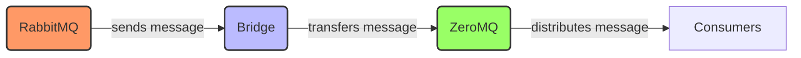

# Message_Queues_and_Communication

## Author info

- Author: Hsi-Chun Wang
- GitHub account: stevenwang415
- UMD email: stevenw@umd.edu
- Personal email: stevenw@umd.edu

## Description

This is a Python based project that publish the message from rabbitMQ and receive it using ZeroMQ. 
Messaging patterns provided by ZeroMQ such as publish-subscribe, request-reply, and pipeline are 
build to enhance the system's flexibility and efficiency. 

## Technologies

### RabbitMQ

- RabbitMQ is an open-source message broker software that acts as an intermediary for messaging
  between distributed systems, applications, and services. with the build on the Advanced Message
  Queuing Protocol (AMQP), it ensures reliable communication through features like message queuing.
- It provides stable messaging capabilities, which ensures that the messages will not lost even some
  unexpected issue happend.
- It also has flexibility that can held mutiple patterns like request, reply and broadcasting.
- Besides, RabbitMQ can handle thousands of concurrent connections and be clustered inoder to enhance
  the availability.
- The design of the useer interface is also friendly and easy to operate the message queue.
- It can also intergrate with other software and services with its extensibility.

- The advantages of RabbitMQ is that its robustness and support for a versatile of messaging protocols
  make this tool a preferred choice compared to other message brokers. Its ability to ensure that the
  message did be deliveried allows customer to apply this feature certainly.

- RabbitMQ is commonly used in enterprise applications for asynchronous processing. It can divide
  application modules and allow independent scaling and enhancing fault tolerance which is mentioned
  in the question. It's also used in micorservices to handle communications between services
  efficiently.

- The information above can be found on the RabbitMQ website. https://www.rabbitmq.com/

### ZeroMQ

- ZeroMQ looks like an embeddable networking library but it actually acts like a concurrency framework.
  It provides sockets that carry atomic messages across various transports like in-process and
  inter-process.
- It also provides the connection sockets with patterns like fan-out, pub-sub, task distribution, and
  request-reply. It's faster and more flexible than standard messaging middleware like AMQP and MQTT.
- It provides a high-level API for socket management with a wide range of communication patterns. Unlike
  other message brokers using a central broker, it implements a brokerless architecture which can reduce
  the difficulties.
- The speed and lightweight are also popular features of the ZeroMQ. It is created with a minimalistic
  design, which can provide lower latency to maintain the efficiency.
- The language versatility also makes zeroMQ a better choice for consumers. Including Python, Java,
  C/C++, this tool make it suitable for diverse application scenarios.

- The advantages of ZeroMQ is that it is useful in scenarios requiring high-speed, low-latency
  communication. Its decentralized approach makes developers easier to build distributed and scalable
  applications.

- ZeroMQ is often used in high-performance computing applicatons, such asfinincial rading systems which
  require quick message delivery. It can also emply in distributed computing projects to connect large
  numbers of nodes efficiently.
- The information above can be found on the ZeroMQ website. https://zeromq.org/

### Docker: Make application deployment easier

- Docker is a tool that simplifies creating, deploying, and running applications by using containers.
- These containers can help developers bundle an application such as libraries and other dependencies and
  ship it all out as one package.
- This can ensures that the applicaton will run on any other machine even if the setting is quite
  different from the original machine used for writing and testing the code.
- Docker also has a consistent environment which guarantee that the application behaves the same way
  everywhere, from development to testing to production.
- It also helps to manage the application dependencies, which can simplifies steps not only in deployment
  but in development enviroment.

- The Dockerfile in this project uses an official Python runtime base. It first set the Python enviroment,
  then I add some scripts which will execuate my codes from the container. This setting creates a Docker
  image storing critical information about this project.
- With the help of Docker, I can achieve both flexibility and efficiency and focusing on the coding logics
  without worrying about the environment setiing.

## Docker implementation

- The following instruction is how I initiate and build the Docker.

- Project Setup
  - Begin with organizing my project files within a directory structure. The
    main files include:
    - messaging_patterns folder:
      - `send.py`: code for sending out messages with RabbitMQ.
      - `receive.py`: code for receiving messages with RabbitMQ.
      - `zeromq_receiver.py`: code for receiving messages with ZeroMQ.
      - `push_pull_ventilator.py`: code for client sending task code.
      - `push_pull_worker.py`: code for server receiving task code.
      - `req_rep_client.py`: code for client sending request message.
      - `req_rep_server.py`: code for server receiving request message.
    
    - rabbitmq_to_zeromq folder:
      - `rabbit_to_zero_bridge.py`: code for connecting rabbitMQ and ZeroMQ, the most important code in
        my project.
        
    - utility_scripts folder:
      - `emit_log_direct.py`: code for direct emitting login user.
      - `emit_log.py`: code for emitting login user.
      - `receive_logs_direct.py`: code for direct receiving login user.
      - `receive_logs.py`: code for emitting login user.
    
    - testing folder:
      - `new_task.py`: example code.
      - `testpub.py`: code for testing publisher.
      - `testsub.py`: code for testing subscriber.
      - `worker.py`: code for testing receiving message.
    
    - `Dockerfile`: Includes instructions for building a Docker image for the project.
    - `Docker-compose.yaml`: Defines services, networks, and volumes for Docker containers.

- Dockerfile Configuration:
- Start by setting up the Dockerfile with the following steps:
    - Utilize an official Python runtime as the base image `python:3.9-slim`
    - Set the working directory in the container to `/app`.
    - Copy the project files into the container.
    - Set requirements.txt file

- Docker-compose.yaml Configuration:
  - Configure the docker-compose.yaml file to define the services required for
    the project:
    - Define three service: zeromq_receiver, send, rabbitmq_to_zeromq and rabbitmq
    - Configure the zeromq_receiver service:
      - Connect to zeroMQ.
      - Depends on RabbitMQ.
    - Configure the send service:
      - Connect to RabbitMQ.
      - Depends on zeromq_receiver.
    - Configure the rabbitmq_to_zeromq service:
      - connect ZeroMQ with RabbitMQ.
      - Depends on send and rabbitmq
    - Configure the rabbitmq service:
      - Use the custom Docker image built from the Dockerfile.
      - Map `port 5672` on the host to `port 5672` in the container.
      - Map `port 15672` on the host to `port 15672` in the container.
    
- Building the Docker Image:
- Execute `docker build -t final-zeromq_receiver.` to build the Docker image using
  the Dockerfile.
- Execute `docker build -t final-send.` to build the Docker image using
  the Dockerfile.
- Execute `docker build -t final-zrabbitmq_to_zeromq.` to build the Docker image using
  the Dockerfile.

- Running the Docker Containers:
  - Start the Docker containers with `docker-compose up`.
  - Docker Compose will create and launch containers.

- Stopping the Docker Containers:
  - To stop containers, press `Ctrl + C` in the terminal running
    `docker-compose up`.
  - Use `docker-compose down` to stop and remove containers.

## Python scripts overview

- Since the main Python code file are send.py, zeromq_receiver.py and rabbit_to_zero_bridge.py for my
  final project, I will focus the explanation on these three files.

- `send.py`:
  - This script likely functions as a message producer for RabbitMQ. It is responsible for creating
    and sending messages to a RabbitMQ exchange or queue. Typically, it would include code to establish
    a connection with the RabbitMQ server, define the necessary properties for messages, and then send
    messages, possibly reading from an external source or generating them on the fly.
  
- `zeromq_receiver.py`:
  - This script acts as a consumer for ZeroMQ. It probably sets up a ZeroMQ socket in a listening state
    to receive messages. This involves initializing a ZeroMQ context, configuring the socket type,
    binding or connecting to a specific endpoint, and then continuously receiving and possibly
    processing the incoming messages.
    
- `rabbit_to_zero_bridge.py`:
  - This is the most important script in my project. It serves as a bridge between RabbitMQ and ZeroMQ,
    taking on the role of both a consumer and a producer. It likely reads messages from a RabbitMQ
    queue, processes or simply forwards them, and then sends these messages out via a ZeroMQ socket.
    This involves handling both RabbitMQ and ZeroMQ APIs—receiving messages from RabbitMQ, possibly
    transforming them, and then republishing them to a ZeroMQ endpoint.

## Project Diagram

I use online editor to generate this mermaid diagram, which visualize the workflow from RabbitMQ to bridge
and finally to ZeroMQ.

## Conclusion

- My project demonstrates the integration of RabbitMQ and ZeroMQ to create a robust message handling
  system that enhances the reliability and efficiency of data communication between distributed services.
  By implementing a bridge script, the system seamlessly transfers messages from RabbitMQ to ZeroMQ,
  leveraging the strengths of both technologies RabbitMQ's reliable message queuing and ZeroMQ's
  high-performance, broker-less communication. The use of Docker containers further augments the
  deployment flexibility, enabling consistent application behavior across various environments

