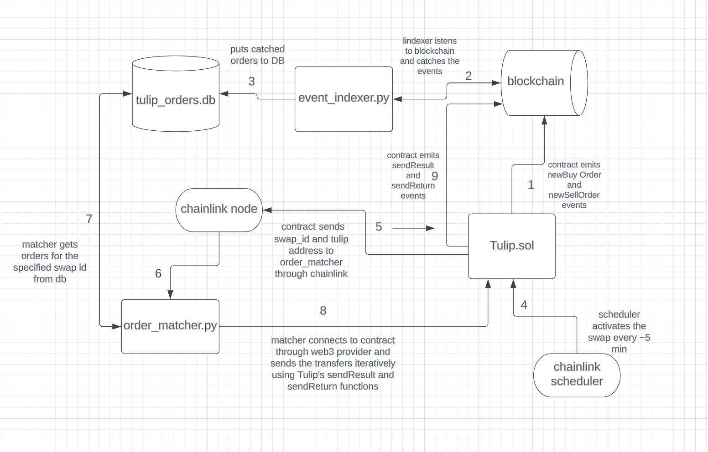

# Tulip 0.1 & 0.2 (DaoCross.sol)

Tulip project is used to facilitate a token swap exchange. It enables the creation of buy and sell orders, matches these orders based on a clearing price, and facilitates the subsequent token transfers. The difference between 0.1 and 0.2 versions lies in `priceMode` setting. v0.1 uses Chainlink price feed to get the price, v0.2 TwapVwap adapter.

## Key Components

### Structs:

- **OrderMinHeap.Order**: Used to store information for each order, including the order ID, sender's address, base token's address, quote token's address, quantity, limit price, order type (buy or sell), deposit address, and timestamp.

- **Transfer**: Holds the details necessary for a token transfer, such as token address, amount, sender's wallet address, receiver's deposit address, and a boolean indicating if it is a return transfer.

### Core Functions:

- **buyOrder**: Enables users to create buy orders for a base token in exchange for ETH.

- **sellOrder**: Allows users to create sell orders to sell their base tokens for ETH.

- **onSwapTime**: Called when it's time to execute the swap. It retrieves the current token price, processes the orders, and executes the necessary transfers to fulfill the matched orders. All orders are then cleared.

- **processOrders**: Handles the entire order processing pipeline. It filters the orders based on their limit price in relation to the clearing price, matches orders based on their quantities, and returns any unmatched orders.

- **filterOrders**: Filters orders based on their limit price and the clearing price, inserting valid orders into the appropriate heap (buyHeap or sellHeap). Unmatched orders are returned to the user.

- **matchOrders**: Matches orders in the buyHeap and sellHeap based on their quantities and creates the necessary transfers.

- **returnLeftovers**: Handles any remaining unmatched orders, returning the unmatched quantities to the users.

- **getPrice**: Fetches the current token price from a Chainlink price feed or a TwapVwap adapter, depending on the `priceMode` setting. 

- **eraseOrders**: Clears all the orders from the previous round, preparing the contract for the next round of orders.

## Usage

To use this smart contract, users need to first approve the contract to spend their tokens before creating a sell order. Users create buy or sell orders by providing the necessary parameters, such as the base token, quantity, limit price, and deposit address. The contract will then store these orders until the swap is executed.

When it's time for the swap to occur, the owner calls the `onSwapTime` function. This function gets the current token price and processes all orders based on this clearing price. It matches orders from the buyHeap and sellHeap, executes the transfers to fulfill these orders, and returns any unmatched quantities to the users. Afterward, all orders are cleared.

# Tulip 0.3 (Tulip.sol)

