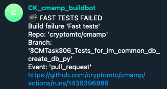

# Buildmeister process

<!-- toc -->

- [General](#general)
- [Notification system](#notification-system)
- [Buildmeister instructions](#buildmeister-instructions)
    + [`update_amp_submodule` fails](#update_amp_submodule-fails)
- [Post-mortem analysis (TBD)](#post-mortem-analysis-tbd)

<!-- tocstop -->

# General

- Buildmeister rotates every 2 weeks
  - To see who is the Buildmeister now refer to [<span class="underline">Buildmeister gsheet</span>](https://docs.google.com/spreadsheets/d/1Ab6a3BVeLX1l1B3_A6rNY9pHRsofeoCw2ip2dkQ6SdA/edit#gid=0)
  - Each rotation should be confirmed by a 'handshake' between the outgoing
    Buildmeister and the new one in the related Telegram chat
- Buildmeister is responsible for:
  - Pushing team members to fix broken tests
  - Conducting post-mortem analysis
    - Why did the break happen?
    - What can we avoid the problem, especially through process and automation
- Testing workflows are available via github actions:
  - Testing workflows that need to be checked:
    - cmamp:
      - [<span class="underline">Fast tests</span>](https://github.com/cryptokaizen/cmamp/actions/workflows/fast_tests.yml)
      - [<span class="underline">Slow tests</span>](https://github.com/cryptokaizen/cmamp/actions/workflows/slow_tests.yml)
    - dev_tools:
      - [<span class="underline">Fast tests</span>](https://github.com/alphamatic/dev_tools/actions/workflows/fast_tests.yml)
      - [<span class="underline">Slow tests</span>](https://github.com/alphamatic/dev_tools/actions/workflows/slow_tests.yml)
  - Refer to .github dir in the repo for update schedule of GH actions
  - Additional information about the [<span class="underline">tests</span>](https://github.com/sorrentum/sorrentum/blob/master/docs/Unit_tests.md) and [<span class="underline">gdoc</span>](https://docs.google.com/document/d/1M8I2qt5CuCw7537_1yayeZhIfh_VoeHT26h5jgSEm3Q/edit)

# Notification system

- `@CK_cmamp_buildbot` notifies the team about breaks via Telegram channel `CK build notifications`
- A notification contains:
  - Failing tests type: fast/slow/super-slow
  - Repo
  - Branch
  - Event
  - Link to a failing run

Example:
- 

# Buildmeister instructions

- You receive a break notification from `@CK_cmamp_buildbot`
- Have a look at the message
  - Do it right away, this is always your highest priority task
- Notify the team

- Post on the `CK build notifications` Telegram channel what tests broke, e.g.,  
`FAILED knowledge_graph/vendors/test/test_utils.py::TestClean::test_clean`
  - If unsure about the cause of failure (chance that failure is temporary):
    - Do a quick run locally for failed test
    - If test is specific and can not be run locally, rerun the regressions
  - Ask if somebody knows what is the problem
    - If you know who is in charge of that test (you can use `git blame`) ask
        directly
  - If the offender says that it's fixing the bug right away, let him / her do it
  - Otherwise file a bug to track the issue

- File an Issue in GH / ZH to report the failing tests and the errors
  - Example:  
    [<span class="underline">https://app.zenhub.com/workspaces/cm-615371012ed326001e044788/issues/alphamatic/dev_tools/318</span>](https://github.com/cryptokaizen/cmamp/issues/4386)
  - Issue title template `Build fail - {repo} {test type} ({run number})`
    - Example: `Build fail - Cmamp fast_tests (1442077107)`
  - Paste the URL of the failing run
    - Example: [<span class="underline">https://github.com/alphamatic/dev_tools/actions/runs/1497955663</span>](https://github.com/alphamatic/dev_tools/actions/runs/1497955663)
  - Provide as much information as possible to give an understanding of the
    problem
  - List all the tests with FAILED status in a github run, e.g.,  
    ```
    FAILED knowledge_graph/vendors/test/test_p1_utils.py::TestClean::test_clean
    FAILED knowledge_graph/vendors/nbsc/test/test_nbsc_utils.py::TestExposeNBSCMetadata::test_expose_nbsc_metadata
    ```
  - Stack trace or part of it (if it's too large)  
    ```
    Traceback (most recent call last): File
    "/.../automl/hypotheses/test/test*rh_generator.py", line 104, in test1
    kg_metadata, * = p1ut.load_release(version="0.5.2") File
    "/.../knowledge_graph/vendors/utils.py", line 53, in load_release % version,
    File "/.../amp/helpers/dbg.py", line 335, in dassert_dir_exists \_dfatal(txt,
    msg, \*args) File "/.../amp/helpers/dbg.py", line 97, in \_dfatal
    dfatal(dfatal_txt) File "/.../amp/helpers/dbg.py", line 48, in dfatal raise
    assertion_type(ret) AssertionError:
    ##############################################################################
    * Failed assertion * dir='/fsx/research/data/kg/releases/timeseries_db/v0.5.2'
    doesn't exist or it's not a dir The requested version 0.5.2 has no directory
    associated with it.
    ```
  - Add the issue to the
    [<span class="underline">BUILD - Breaks</span>](https://app.zenhub.com/workspaces/cm-615371012ed326001e044788/issues/cryptokaizen/cmamp/167) Epic so that we can track it
  - If the failures are not connected to each other, file separate issues for each
    of the potential root cause
  - Keep issues grouped according to the codebase organization

- Post the issue reference on Telegram channel CK build notifications
  - You can quickly discuss there who will take care of the broken tests, assign
    that person
  - You can use `git blame` to see who wrote the test
  - Otherwise, assign it to the person who can reroute

- Our policy is "fix it or revert"
  - The build needs to go back to green within 1 hr
    - Either the person responsible for the break fixes the bug within 1 hour
    - Or you need to push the responsible person to disable the test
    - Do not make the decision about disabling the test yourself!
    - First, check with the responsible person, and if he / she is ok with
      disabling, do it
    - NB! Disabling the test is not the first choice, it's a measure of last
      resort!

- Regularly check issues that belong to the Epic [<span class="underline">BUILD - Breaks</span>](https://app.zenhub.com/workspaces/cm-615371012ed326001e044788/issues/cryptokaizen/cmamp/167).
  - You have to update the break issues if the problem was solved or partially
    solved.
  - Pay special attention to the failures which resulted in disabling tests

- When your time of the Buildmeister duties is over, confirm the rotation with
  the next responsible person in the related Telegram chat.

### `update_amp_submodule` fails

- When this happens, the first thing to do is attempt to update the `amp`
  pointer manually

- Instructions:
    ```
    > cd src/dev_tools1 
    > git checkout master 
    > git pull --recurse-submodules 
    > cd amp 
    > git checkout master 
    > git pull origin master 
    > cd .. 
    > git add "amp" 
    > git commit -m "Update amp pointer"
    ```
There is also an invoke target `git_roll_amp_forward` that does an equivalent
operation

# Post-mortem analysis (TBD)

- We want to understand on why builds are broken so that we can improve the
  system to make it more robust
  - In order to do that, we need to understand the failure modes of the system
  - For this reason we keep a log of all the issues and what was the root cause

- After each break fill the
  [Buildmeister spreadsheet sheet "Post-mortem breaks analysis"](https://docs.google.com/spreadsheets/d/1AajgLnRQka9-W8mKOkobg8QOzaEVOnIMlDi8wWVATeA/edit#gid=1363431255)

- `Date` column:
  - Enter the date when the break took place
  - Keep the bug ordered in reverse chronological order (i.e., most recent dates
    first)

- `Repo` column:
  - Specify the repo where break occurred
    - `amp`
    - ...

- `Test type` column:
  - Specify the type of the failing tests
    - Fast
    - Slow
    - Super-slow

- `Link` column:
  - Provide a link to a failing run

- `Reason` column:
  - Specify the reason of the break
    - Merged a branch with broken tests
    - Master was not merged in a branch
    - Merged broken slow tests without knowing that
    - Underlying data changed

- `Issue` column:
  - Provide the link to the ZH issue with the break description

- `Solution` column:
  - Provide the solution description of the problem
    - Problem that led to the break was solved
    - Failing tests were disabled, i.e. problem was not solved
