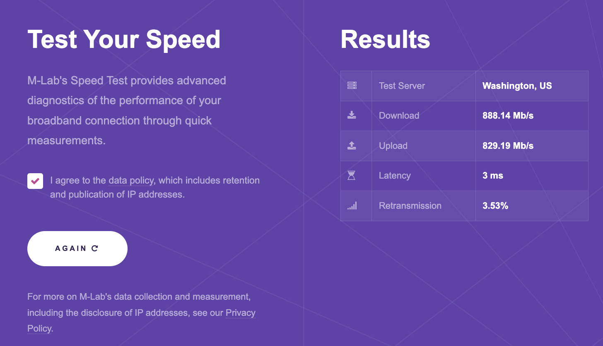
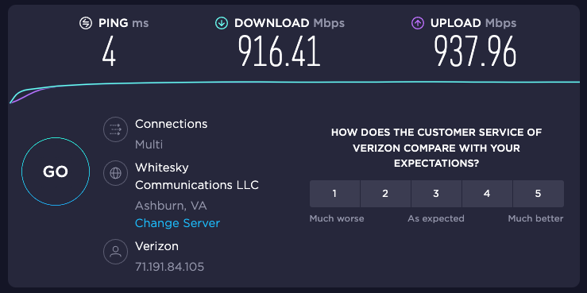
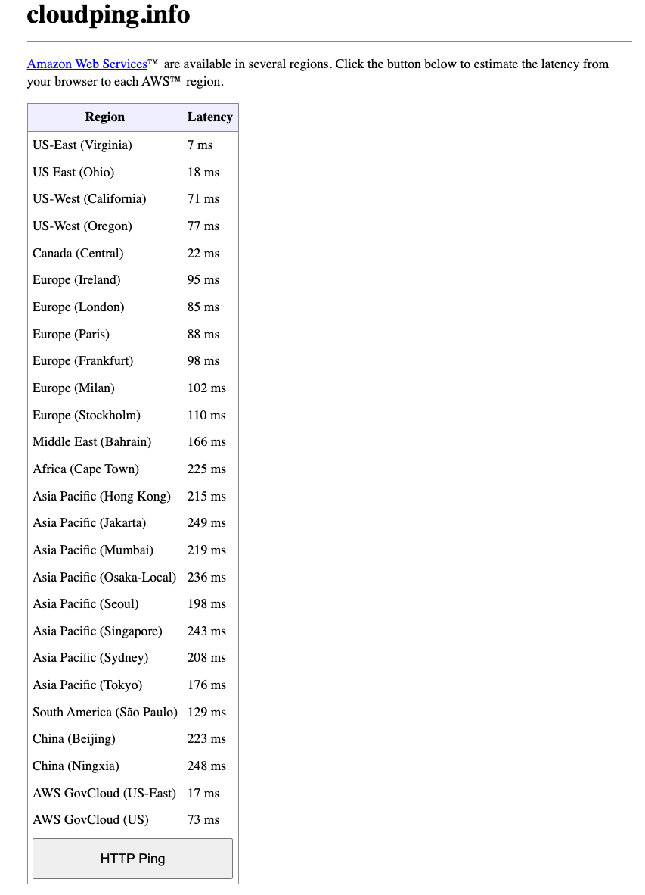
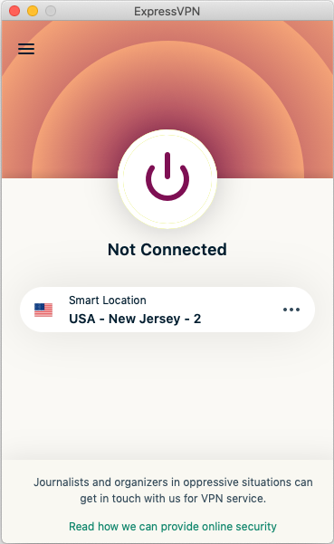
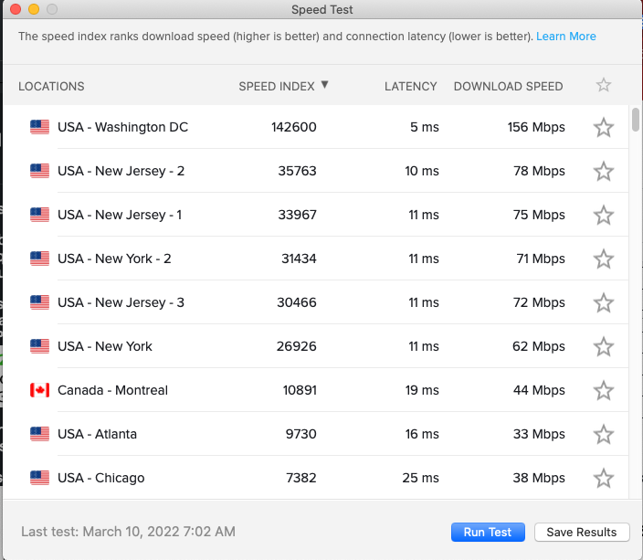

# How to diagnose server network issues

<!-- toc -->

- [Procedure for handling issues](#procedure-for-handling-issues)
- [Servers](#servers)
  * [Etiquette to switch between servers](#etiquette-to-switch-between-servers)
  * [Switching between DEV servers](#switching-between-dev-servers)
    + [VNC](#vnc)
    + [SSH](#ssh)
    + [VS Code / PyCharm (gateway)](#vs-code--pycharm-gateway)
  * [Switching between VPNs](#switching-between-vpns)
- [Connecting to Zabbix](#connecting-to-zabbix)
  * [Find out which process is taking too much memory / CPU](#find-out-which-process-is-taking-too-much-memory--cpu)
    + [Command line interface - Server's processes](#command-line-interface---servers-processes)
    + [Command line interface - Docker](#command-line-interface---docker)
    + [Zabbix - Docker / Server's processes](#zabbix---docker--servers-processes)
      - [[ADMIN] For killing processes try using CLI if possible.](#admin-for-killing-processes-try-using-cli-if-possible)
      - [[ADMIN] If CLI is not available try to use the Zabbix web](#admin-if-cli-is-not-available-try-to-use-the-zabbix-web)
      - [If nothing works, that means servers are so slow the only](#if-nothing-works-that-means-servers-are-so-slow-the-only)
- [Diagnose the problem](#diagnose-the-problem)
  * [Check Internet speed to your provider](#check-internet-speed-to-your-provider)   
    - [From Speed Measurement Lab](#from-httpsspeedmeasurementlabnet)
    - [From Speedtest.net](#from-httpswwwspeedtestnet)
    + [From CLI](#from-cli)
  * [Check connection speed to AWS](#check-connection-speed-to-aws)
  * [Ping our VPN server](#ping-our-vpn-server)
    + [Very fast ping](#very-fast-ping)
    + [Slow ping](#slow-ping)
    + [No ping](#no-ping)
  * [Solutions to slow Internet](#solutions-to-slow-internet)
    + [Using a VPN connection](#using-a-vpn-connection)
    + [Run the speed test](#run-the-speed-test)
    + [Using a remote editor](#using-a-remote-editor)
- [Keepass](#keepass)

<!-- tocstop -->

# Procedure for handling issues

- Make sure you are not the only one experiencing the issue
  - We don't want to distract the team for something that it's specific of your
    setup
  - [ ] Do you have a connection working?
    - ping google.com, amazon.com
    - Do a speed test and compare it to your usual speed
    - Can you ping the EU VPN?
    - Can you ping the US VPN?
  - [ ] Is the problem your VNC?
  - [ ] Can you ssh on DEV1 server, or DEV2?
  - [ ] Check on Zabbix to see what's the "official view"
- If you are sure that it's not just you
  - [ ] Broadcast the problem to TG @all, asking who else is seeing the problem?

# Servers

- VPN IPs
  - EU (eu-north): 13.51.59.43
  - USA (us-east-1): 34.200.203.37
  - Everybody has a VPN profile for both servers
- The current allocation of people on the server is:
  - Dev1
    - 172.30.2.136
    - Dan, Greg, GP, Juraj, Max, Nikola
  - Dev2
    - 172.30.2.128
    - Danya, Grisha, Sonya, Toma

## Etiquette to switch between servers

- Procedure:
  - [ ] Try to make sure that it's not just your issue, before raising an alarm
  - [ ] Broadcast the issue to Telegram @all, asking if everyone sees the same
        problem
  - [ ] If the problem is general ping IT on the channel
  - [ ] File a bug about the emergency so we can collect info there
  - [ ] See if we can kill some process on the unhealthy server to re-establish
        basic functionality
  - [ ] Check what's the status of the other server
  - [ ] Tell people that you are switching server

## Switching between DEV servers

- This is basically just changing the IP address. All data in `/home` should be
shared between DEV servers.

### VNC

- Probably you already have one server added to your client, so right click and
duplicate them, then edit the properties of connection and change the IP
address.

### SSH

- Change the placeholder (CM_IP) value in .bashrc
  ```bash
  > sudo nano .bashrc
  ```
- Change the IP address or append new line CM_IP2
  ```bash
  export CM_IP=172.30.2.136

  export CM_IP2=172.30.2.128
  ```
- Or you can directly change the ip address in command  
  ```bash
  ssh -i ~/.ssh/crypto.pub $CM_USER@172.30.2.128
  ```
### VS Code / PyCharm (gateway)

- You can add a new connection and change the IP address following the documentation in [Using remote PyCharm / VisualStudio](https://docs.google.com/document/d/1a3fsA613PShd1Lcz_YjOHWg0XXCMAaKOo5UIHaiQ-rk/edit)

## Switching between VPNs

- You can ping / traceroute between the two VPNs to see which one is closer /
  faster. The one with less ms is better. Use that one as a VPN connection. This
  can change based on your network ISP setup. Generally if you have less ms to EU
  based compared to US based you should stick with EU and check again if there are
  connection issues.

- How to ping / traceroute is mentioned in **Ping our VPN server** section of this
  document.

- When there is a problem like being unable to connect or the wrong
  username/password with your prefered VPN server, try to use another one. Same
  if, for example, when there is a connection problem connecting to DEV servers

- Client setup of VPN servers is documented here: [Set up - VPN and dev server access](https://docs.google.com/document/d/1C4Ghrb9p3HjwkWuRCzCDtVV36mk-WR9OzneS6nTPE6Q/edit#heading=h.p9xdh0f4u3qm)

# Connecting to Zabbix

- Documentation:
  [Zabbix - Frontend sections](https://docs.google.com/document/d/1XUuuCrqujzM5K7h7bu92fq32e4ZDyJnK0-IsaLuseRU/edit?usp=sharing)

- You need to be on the VPN to have access.

- URL: http://172.30.3.65/zabbix

- Credentials (View only user): Crypto / 67d767a4b9

## Find out which process is taking too much memory / CPU

### Command line interface - Server's processes

- By default `htop` command displays the processes sorted by CPU usage. Press F6
 (or >), which will display the column names, select any one, and press Enter.
  ```bash
  > htop
  ```
### Command line interface - Docker

- List all active docker containers with usage.
  ```bash
  > docker stats
  ```
- Summary of Docker disk usage.
  ```bash
  > docker system df
  ```
### Zabbix - Docker / Server's processes

1.  Connect to VPN.
2.  Log in to zabbix with Admin or Crypto account.
3.  Go to _Monitoring → Hosts_ section, click on host and you should see there
    options under Scripts section like Display all processes, List all services,
    List docker containers, etc.

- Note: For Storage troubleshooting there is script for removing 4 days old,
  unused Docker containers.  
- We can add more like these in the future.

#### [ADMIN] For killing processes try using CLI if possible.
```bash
> sudo kill &lt;&lt;PID of process from htop or pidof command>>
```
For example: 
```bash
> sudo kill -9 process_id_1 process_id_2 process_id_3
```

Or: 
```bash
> killall program_name
```

#### [ADMIN] If CLI is not available try to use the Zabbix web interface.

1.  Connect to VPN
2.  Login to Zabbix as Administrator
3.  Go to Administration → Scripts section and click on the Create script button
    in the top right-hand corner or simply clone the existing one.  
    Name = Name the script  
    Scope = Manual host action  
    Type = Script  
    Execute on = Zabbix agent  
    Commands = Type here your command (> sudo kill -9 process_id_1 process_id_2
    process_id_3)    
4.  Go to Monitoring → Hosts section, click on host and you should see there
    options under Scripts section your created script, execute it and do not
    forget to cleanup that script.
- Note: sudo commands will work only on DEV1 & DEV2.

#### If nothing works, that means servers are so slow the only option is restart them from AWS EC2.

# Diagnose the problem

- You should report all the information below from your client in an issue like
  https://github.com/cryptokaizen/cmamp/issues/1370

## Check Internet speed to your provider

- This is about measuring your speed to connect to the closest Internet node.

- The most trustworthy websites are:

### From https://speed.measurementlab.net



### From https://www.speedtest.net/



### From CLI
```bash
sudo apt install speedtest-cli
```

or
```bash
sudo pip3 install speedtest-cli
```

```bash
> speedtest-cli
Retrieving speedtest.net configuration...
Testing from Verizon Fios (71.191.84.105)...
Retrieving speedtest.net server list...
Selecting best server based on ping...
Hosted by PhoenixNAP Global IT Services (Ashburn, VA) [25.20 km]:
7.913 ms
Testing download
speed................................................................................
Download: 660.01 Mbit/s
Testing upload
speed......................................................................................................
Upload: 532.47 Mbit/s
```

## Check connection speed to AWS

- This is to measure how far you are from the AWS data centers.
- https://www.cloudping.info/



## Ping our VPN server

- IP addresses for tests:
    - EU (eu-north-1) - 13.51.59.43
    - USA (us-east-1) - 34.200.203.37

### Very fast ping

```bash
> ping -c 10 34.200.203.37
…
10 packets transmitted, 10 packets received, 0.0% packet loss
round-trip min/avg/max/stddev = 4.289/5.258/6.107/0.551 ms
```

### Slow ping

```bash
> ping -c 10 13.51.59.43
10 packets transmitted, 10 packets received, 0.0% packet loss
round-trip min/avg/max/stddev = 107.014/107.982/108.762/0.583 ms
```

### No ping

```bash
(base) Air-Pomazkin:~ pomazking$ ping 13.51.59.43
PING 13.51.59.43 (13.51.59.43): 56 data bytes
Request timeout for icmp_seq 0
Request timeout for icmp_seq 1
…
^C
--- 13.51.59.43 ping statistics ---
13 packets transmitted, 0 packets received, 100.0% packet loss
```

- You can also do:

  ```bash
  > tracert 13.51.59.43 (Windows)
  ```
  ```bash
  > traceroute 13.51.59.43 (Linux)
  ```

## Solutions to slow Internet

- In order of preference:
  - ExpressVPN to tunnel your traffic
  - Using remote PyCharm / VisualStudio
  - Change VNC stream quality to lower frames per second to lower resolution
  - Create a CK VPN at a different AWS location
    - It depends on which AWS data center is closest

### Using a VPN connection

- Check what is the closest location available to you: https://www.expressvpn.com/vpn-server

- Install the VPN from here https://www.expressvpn.com/vpn-software
- The activation code is EHLJXHK6G3KD6I9D4NNZ88J

### Run the speed test

- https://www.expressvpn.com/what-is-vpn/vpn-speed-test





### Using a remote editor

- [Using remote PyCharm / VisualStudio](https://docs.google.com/document/d/1a3fsA613PShd1Lcz_YjOHWg0XXCMAaKOo5UIHaiQ-rk/edit)
- Note: VSCode is more friendly with slow internet than Pycharm.

# Keepass

- [crypto-kaizen-infra.kdbx](https://drive.google.com/file/d/15i1NzVDly_Q0SudPIg0ndYVEZIrFsUTY/view?usp=sharing)
- Software to use: https://keepass.info/
- To get credentials ask GP
