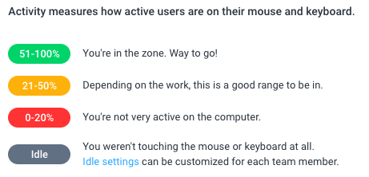
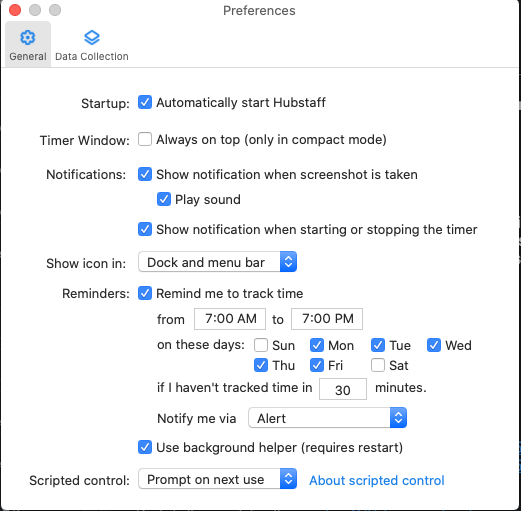

# Hubstaff

<!-- toc -->

- [General](#general)
- [Time Tracking](#time-tracking)
  * [Privacy](#privacy)
    + [Tracking time automatically](#tracking-time-automatically)
    + [Tracking time manually](#tracking-time-manually)
    + [Overriding time tracking](#overriding-time-tracking)

<!-- tocstop -->

# General

[Hubstaff](https://hubstaff.com/) is a tool for
remote working that automates:

- time tracking

- invoice creation

- payment

The goal is to replace our
[hour log spreadsheet](https://docs.google.com/spreadsheets/d/1oNd6ORhc94oUzg5nhNC7fQelN_PmfAv110F7lUiZsxo/edit#gid=0)
with Hubstaff and get paid automatically for the worked hours.

# Time Tracking

## Privacy

We have decided to turn off the feature of taking screenshots of the laptop as
proof-as-work, URL, and app tracking.

Although this seems to be standard practice for remote teams (e.g., it's default
for UpWork), we don't believe in surveilling people, rather we prefer to assume
that people do the right thing (until proven wrong, of course).

We left enabled "the keyboard and mouse activity" since this is used to
automatically track the worked time. The tool does not store what you type, only
if you type as a proxy for "working".

We let people decide if they want to monitor the usage of programs or not. Some
people like it (I do since it gives an insight on which program I spend my time)

You can change your mind over time.

### Tracking time automatically

You can use the desktop [App](https://app.hubstaff.com/download)

- I prefer this since it's completely automated

Both options update the time information to Hubstaff automatically.

See [https://hubstaff.com/how-tracking-works](https://hubstaff.com/how-tracking-works)

### Tracking time manually

You can track time using the
[Google Chrome extension](https://chrome.google.com/webstore/detail/hubstaff-time-tracker/mipeohjjimeknlkekbemdjbjniogbgel):

- [Chrome Time Tracking - Hubstaff Time Tracker](https://www.youtube.com/watch?v=1dXfD3EJb2M)

- Start the timer when you start the work

- Stop the timer when the work is paused

### Overriding time tracking

In case you forgot to turn on the timer or you are tracking time manually, go to

and fill the timesheet for the past day

- See the
  [official guide](https://support.hubstaff.com/how-to-add-delete-and-edit-manual-time-entries/#:~:text=First%2C%20navigate%20to%20the%20Timesheets,of%20the%20manual%20time%20entry.)
  for a lot of details
