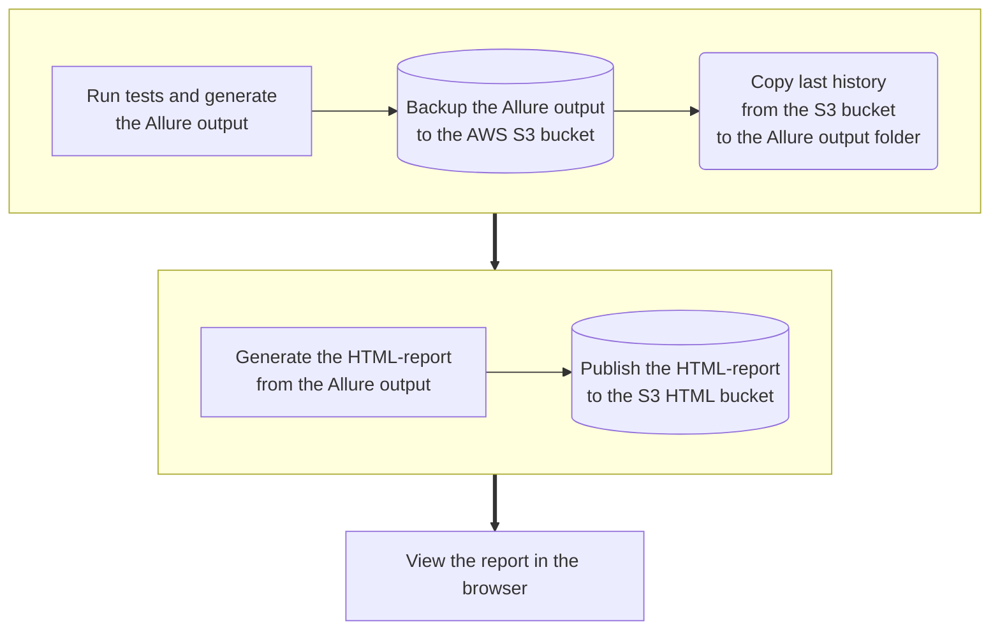

# Pytest Allure

## Pytest Allure Explanantion

<!-- toc -->

- [Overview](#overview)
- [Core features](#core-features)
  * [Rich and Interactive Reports:](#rich-and-interactive-reports)
  * [Annotations and Labels:](#annotations-and-labels)
  * [Test History and Trends](#test-history-and-trends)
- [Key Components](#key-components)
  * [Pytest plugin for the Allure output generation](#pytest-plugin-for-the-allure-output-generation)
  * [Allure reporting tool](#allure-reporting-tool)
- [How it works](#how-it-works)
- [Historical Trends](#historical-trends)

<!-- tocstop -->

## Overview

- Allure Report boosts collaboration and project quality by providing clear,
  detailed test reports that aid issue resolution for different team members
- The goal is to set up all our tests to generate and publish this report
- Here is the demo [report](https://allure-framework.github.io/allure-demo/8/)
  from allure
- The simplified flow for the Allure report is:

## Core features

### Rich and Interactive Reports:

- Allure generates visually appealing and interactive HTML reports, making it
  easy to analyze test results
- Reports include detailed information about test cases, steps, attachments, and
  more

### Annotations and Labels:

- Allure uses annotations and labels to provide additional information about
  test methods, making it easier to understand and categorize test results
- Annotations are used to mark and describe test methods, and labels help in
  categorizing and filtering tests

### Test History and Trends

- Allure maintains a history of test runs, allowing you to track changes in test
  results over time
- Trends and statistics help identify patterns, improvements, or regressions in
  the application's behavior

## Key Components

### Pytest plugin for the Allure output generation

In order to generate the Allure output, we need to install the `allure-pytest`
plugin. For the time and efforts saving reasons, we will install it on-the-fly
in the container where we will run the tests. This feature is introduced as the
`allure_dir` parameter to the `run_<type>_tests` tasks. If specified the
`allure-pytest` plugin will be installed and the results will be stored in the
specified directory.

### Allure reporting tool

The CLI utility for generating Allure reports creates an HTML report from the
Allure output. We'll install this utility using GitHub Actions workflow to
generate the HTML report.

## How it works

- Allure Report is composed of a framework(pytest) adapter and the allure
  command-line utility
- Run the tests with pytest options `--alluredir=allure-results` to store the
  results
- The generated files include:
  - [Test result files](https://allurereport.org/docs/how-it-works-test-result-file/)
    to describe execution of tests
  - [Container files](https://allurereport.org/docs/how-it-works-container-file/)
    to describe test fixtures
- If required, add additional files to the `allure-results` to display
  additional info in the report
- Additional files includes:
  - [Environment file](https://allurereport.org/docs/how-it-works-environment-file/)
    to store some global data for all the tests in the report
  - [History files](https://allurereport.org/docs/how-it-works-history-files/)
    to enable trend graphs and other history-related features
  - [Categories file](https://allurereport.org/docs/how-it-works-categories-file/)
    to group test results into custom categories
- Use `allure generate` to generate the test report into the specified
  directory. For e.g.: `allure generate allure-report`

## Historical Trends

A test report generated by Allure can not only display data about the latest
test launch, but also help you compare it with the data from previous reports.
To do so, Allure can keep a history or previous reports.

In a tests report with the history included, you can:

- See what statuses did a test have previously (see Details panel → History tab)
- Find tests that changed status since last report (see Sorting and filtering →
  Filter tests by marks)
- See how specific values change over time (see Graphs)
