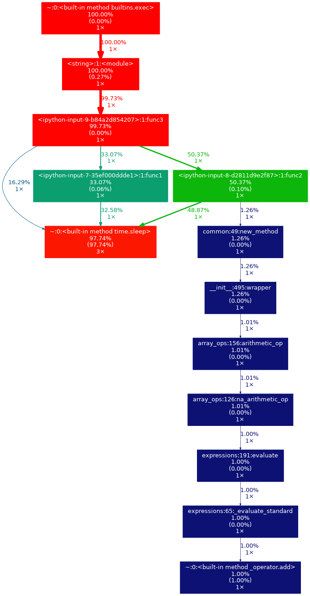
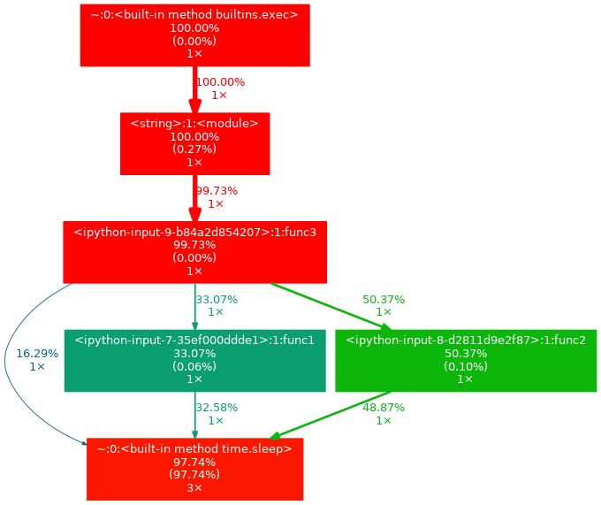

# Profiling

<!-- toc -->

- [Profiling end-to-end a command line](#profiling-end-to-end-a-command-line)
- [Profiling Python code from command line](#profiling-python-code-from-command-line)
  * [cProfile](#cprofile)
    + [Install in a Docker container](#install-in-a-docker-container)
    + [How to use with workflow](#how-to-use-with-workflow)
    + [How to use manually](#how-to-use-manually)
    + [process_prof.py](#process_profpy)
  * [line_profiler](#line_profiler)
    + [How to use](#how-to-use)
  * [pytest-profiling](#pytest-profiling)
    + [How to use](#how-to-use-1)
- [Profiling in a Jupyter notebook](#profiling-in-a-jupyter-notebook)
  * [Time profilers](#time-profilers)
  * [By function](#by-function)
- [Memory profilers](#memory-profilers)

<!-- tocstop -->

# Profiling end-to-end a command line

- You can use the time-tested Linux `time` command to profile both time and
  memory

  ```bash
  > /usr/bin/time -v COMMAND 2>&1 | tee time.log

  Command being timed: "...COMMAND..."
  User time (seconds): 187.70
  System time (seconds): 16.27
  Percent of CPU this job got: 96%
  Elapsed (wall clock) time (h:mm:ss or m:ss): 3:31.38
  Average shared text size (kbytes): 0
  Average unshared data size (kbytes): 0
  Average stack size (kbytes): 0
  Average total size (kbytes): 0
  Maximum resident set size (kbytes): 13083892
  Average resident set size (kbytes): 0
  Major (requiring I/O) page faults: 0
  Minor (reclaiming a frame) page faults: 9911066
  Voluntary context switches: 235772
  Involuntary context switches: 724
  Swaps: 0
  File system inputs: 424
  File system outputs: 274320
  Socket messages sent: 0
  Socket messages received: 0
  Signals delivered: 0
  Page size (bytes): 4096
  Exit status: 0
  ```

- Information about the spent time are:

  ```
  User time (seconds): 187.70
  System time (seconds): 16.27
  Percent of CPU this job got: 96%
  Elapsed (wall clock) time (h:mm:ss or m:ss): 3:31.38
  ```

- The relevant part is the following line representing the amount of resident
  memory (which is ~13GB) ` Maximum resident set size (kbytes): 13083892 `

# Profiling Python code from command line

## cProfile

### Install in a Docker container

- From `devops/docker_build/install_cprofile.sh`
  ```bash
  > sudo apt-get install -y python3-dev
  > sudo apt install -y libgraphviz-dev
  > sudo apt-get install -y graphviz
  > pip install gprof2dot
  ```

### How to use with workflow

- There is a script that runs the flow `amp/dev_scripts/run_profiling.sh`

### How to use manually

- You need to run the code first with profiling enabled to collect the profiling
  data in a binary file (often called `prof.bin`).
  ```bash
  # Profile a Python script.
  > python -m cProfile -o prof.bin ${CMD}
  ```
- To profile a unit test you can run:
  ```bash
  # Profile a unit test.
  > python -m cProfile -o profile edgar/forms8/test/test_edgar_utils.py
  > python -m cProfile -o profile -m pytest edgar/forms8/test/test_edgar_utils.py::TestExtractTablesFromForms::test_table_extraction_example_2
  ```

- Plotting the results

  ```bash
  > gprof2dot -f pstats profile | dot -Tpng -o output.png
  > gprof2dot -n 10 -f pstats profile | dot -Tpng -o output.png
  > gprof2dot -n 10 -f pstats profile -l
  "*extract_tables_from_forms*" | dot -Tpng -o output.png
  ```
How to read a graph: https://nesi.github.io/perf-training/python-scatter/profiling-cprofile

- gprof2dot has lots of interesting options to tweak the output, e.g.,
  ```bash
  > gprof2dot -h
  ...
  -n PERCENTAGE, --node-thres=PERCENTAGE
  eliminate nodes below this threshold [default: 0.5]
  -e PERCENTAGE, --edge-thres=PERCENTAGE
  eliminate edges below this threshold [default: 0.1]
  --node-label=MEASURE measurements to on show the node (can be specified
  multiple times): self-time, self-time-percentage,
  total-time or total-time-percentage [default: total-
  time-percentage, self-time-percentage]
  -z ROOT, --root=ROOT prune call graph to show only descendants of
  specified
  root function
  -l LEAF, --leaf=LEAF prune call graph to show only ancestors of
  specified
  leaf function
  --depth=DEPTH prune call graph to show only descendants or ancestors
  until specified depth
  --skew=THEME_SKEW skew the colorization curve. Values &lt; 1.0 give
  more
  variety to lower percentages. Values > 1.0 give less
  variety to lower percentages
  -p FILTER_PATHS, --path=FILTER_PATHS
  Filter all modules not in a specified path
  ...
  ```

### process_prof.py

- You can use the script `dev_scripts/process_prof.py` to automate some tasks:

  - top-level statistics

  - plotting the call-graph

  - custom statics

## line_profiler

- cProfile allows to break down the execution time into function calls, while
  kernprof allows to profile a function line by line.

- GitHub: [<span
  class="underline">https://github.com/pyutils/line_profiler</span>](https://github.com/pyutils/line_profiler)

- Install with:
  ```bash
  > pip install line_profiler
  ```

### How to use

- Instrument the code to profile:

  ```python
  import line_profiler
  profiler = line_profiler.LineProfiler()

  # Print the results at the end of the run.
  import atexit

  def exit_handler():
  	profiler.print_stats()

  atexit.register(exit_handler)

  @profiler
  def function():

  ...
  ```

- Through command line:
  ```bash
  > kernprof -o prof.lprof -l $cmd
  ...
  Wrote profile results to run_process_forecasts.py.lprof
  ```

## pytest-profiling

- Webpage: [<span
  class="underline">https://pypi.org/project/pytest-profiling</span>](https://pypi.org/project/pytest-profiling)

- Install it with
  ```bash
  > pip install pytest-profiling
  ```

### How to use

   ```bash
    > pytest --profile ./amp/core/dataflow_model/test/test_pnl_simulator.py::TestPnlSimulator2::test_perf1 -s
   ```

# Profiling in a Jupyter notebook

- You can find all of the examples below in action in the
  `amp/core/notebooks/time_memory_profiling_example.ipynb` [<span
  class="underline">link</span>](https://github.com/kaizen-ai/kaizenflow/blob/master/core/notebooks/time_memory_profiling_example.ipynb).

## Time profilers

- In a notebook, execute cell with `%time` cell-magic:
  ```python
  %%time
  func()
  ```

## By function

- We prefer cProfile for profiling and gprof2dot for visualization.

- The documentation does not state this, but `%prun` magic uses cProfile under
  the hood, so we can use it in the notebook instead
  ```python
  # We can suppress output to the notebook by specifying "-q".
  %%prun -D tmp.pstats func() !gprof2dot -f pstats tmp.pstats | dot -Tpng -o output.png
  dspl.Image(filename="output.png")
  ```

- This will output something like this:
  

- If you open the output image in the new tab, you can zoom in and look at the
  graph in detail.

- gprof2dot supports thresholds that make output more readable:

  ```python
  !gprof2dot -n 5 -e 5 -f pstats tmp.pstats | dot -Tpng -o output.png
  dspl.Image(filename="output.png")
  ```

- This will filter the output into something like this:
  

# Memory profilers

- We prefer using [<span
  class="underline">memory-profiler</span>](https://github.com/pythonprofilers/memory_profiler).

- Peak memory

  ```bash
  %%memit
  func()
  ```

- Memory by line
  ```bash
  %mprun -f func func()
  ```
