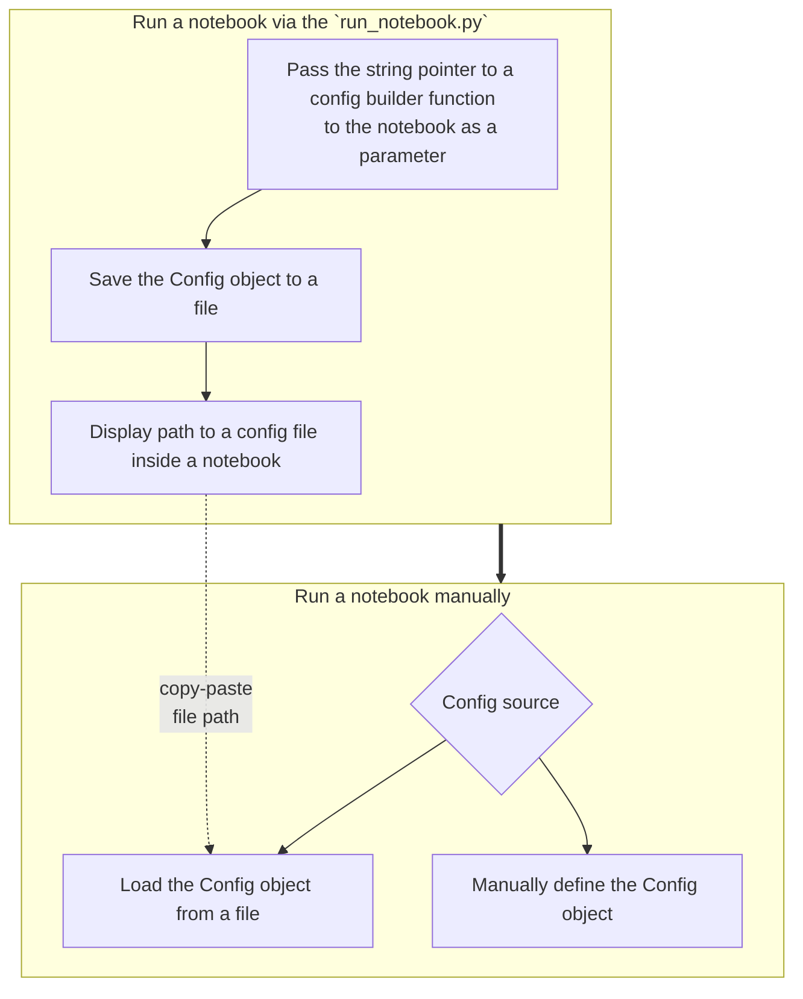

<!-- toc -->

- [General](#general)
- [Running a notebook using a Python script](#running-a-notebook-using-a-python-script)
- [Run a notebook manually](#run-a-notebook-manually)
- [Example of the run flow](#example-of-the-run-flow)

<!-- tocstop -->

## General

Every notebook should have a config that controls its parameters.

A notebook can be run in two ways:

1. Automatically: via a Python script
2. Manually: via Jupyter from a web-browser

## Running a notebook using a Python script

Use [`run_notebook.py`](/dev_scripts/notebooks/run_notebook.py) to run the
notebook via script.

Here is an example of the run command inside the dev container, `cmamp`
repository:

```bash
/app/dev_scripts/notebooks/run_notebook.py \
    --notebook /app/oms/notebooks/Master_broker_portfolio_reconciliation.ipynb \
    --config_builder 'amp.oms.execution_analysis_configs.get_broker_portfolio_reconciliation_configs_Cmtask5690("/shared_data/ecs/test/system_reconciliation/C11a/prod/20240320_134000.20240320_143500/system_log_dir.manual/process_forecasts")' \
    --dst_dir . \
    --tee --no_suppress_output --num_threads 'serial' \
    --publish_notebook -v DEBUG
```

- The script propagates a pointer to a config builder function via environment
  variables `__CONFIG_BUILDER__`, `__CONFIG_IDX__`, `__CONFIG_DST_DIR__`
- Given the environment variables above, a notebooks builds a config from a
  config builder function

The script also saves a config to a Pickle file. Path to a config file is stored
in the `__NOTEBOOK_CONFIG_PATH__` environment variable which is displayed in a
notebook so that a user knows where a config file is stored.

## Run a notebook manually

1. Load `Config` from a file

- Use case: when re-running a notebook that was already run using the Python
  script
- How to get a path to a config file: in a published notebook, search for the
  `__NOTEBOOK_CONFIG_PATH__` environment variable and copy its value
- Where to use a path: pass the value as `config_file_name` in
  `get_notebook_config()`

2. Specify a config builder function manually

- Use case: there is no config file saved
- This way one needs to specify all of the parameters of a config builder
  function manually

## Example of the run flow


