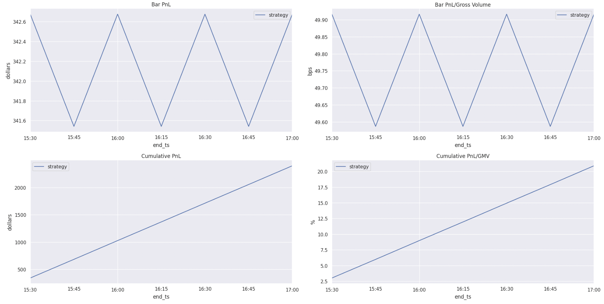

<!--ts-->
   * [How to build a System](#how-to-build-a-system)
      * [System builders](#system-builders)
   * [How to run research backtesting](#how-to-run-research-backtesting)
      * [Using the simulation API](#using-the-simulation-api)
      * [Using the wrapping Python scripts](#using-the-wrapping-python-scripts)
      * [Output format](#output-format)
   * [How to process the results of backtesting](#how-to-process-the-results-of-backtesting)
      * [Notebook config](#notebook-config)
      * [Notebook config example](#notebook-config-example)
      * [Parquet reader](#parquet-reader)
      * [Plot research portfolio stats](#plot-research-portfolio-stats)
      * [Compute aggregated research portfolio stats](#compute-aggregated-research-portfolio-stats)
   * [How to run replayed time simulation](#how-to-run-replayed-time-simulation)
      * [Inputs](#inputs)
      * [Run the Python script](#run-the-python-script)
      * [Outputs](#outputs)
   * [Running experiments](#running-experiments)
      * [Running an experiment](#running-an-experiment)
      * [Copy to cache dir](#copy-to-cache-dir)
      * [Saving results on S3](#saving-results-on-s3)


<!--te-->

# How to build a System

- In general the process of building a `System` is the following:
  - Instantiate a System
    - `system = XYZ_ForecastSystem()`
  - Get the template config
    - `system_config = system.get_system_config_template()`
  - Apply all the changes to the `SystemConfig` to customize it properly
    - `system.config[...] = ...`
  - Once the system config is complete, build the system
    - `dag_runner = system.dag_runner`

## System builders

- Typically, we use `System` builders for backtest run:
  - E.g., `Cx_Time_ForecastSystem()` at
    [/dataflow_amp/system/Cx/Cx_forecast_system.py](/dataflow_amp/system/Cx/Cx_forecast_system.py)
- System building classes take `dag_builder_ctor_as_str` param as input which as
  a pointer to a `DagBuilder` constructor that creates DAG for the System
  - E.g.,
    [/dataflow_amp/pipelines/mock1/mock1_pipeline.py](/dataflow_amp/pipelines/mock1/mock1_pipeline.py)

# How to run research backtesting

- A user can run a backtest either calling:
  - The simulation API (recommended); or
  - Using a generic wrapper script `run_config_list.py` as described below

## Using the simulation API

- The simulation API is `run_backtest()` in
  [/dataflow/backtest/backtest_api.py](/dataflow/backtest/backtest_api.py)
- To run the function the user needs to create a Python script that calls
  `run_backtest()`
  - The script should not have any interface, all the parameters are specified
    in Python
  - An example of this approach is:
    [/dataflow_amp/system/Cx/run_C3a_historical_simulation.py](/dataflow_amp/system/Cx/run_C3a_historical_simulation.py)
  - You can pass parameters from command lines if you want, but this is a
    slippery slope since then you might start trying to generalize a simulation
    script beyond what's actually possible and warranted
- You can run from the root of any repo as long as all the code you need is
  visible.
  - In case you are using an outermost IP repo (e.g., `orange`) and your code
    has dependencies from that repo, then you need to run from the root of that
    repo
  - Otherwise, it is ok to just run from the platform repo `amp`, as long as the
    executable path is correct

## Using the wrapping Python scripts

- The core script is
  [/dataflow/backtest/run_config_list.py](/dataflow/backtest/run_config_list.py)
  which runs a `System` given a list of `Config`s

- `run_config_list.py` script needs:
  - An experiment builder which wraps a `DagRunner`
  - A config builder to build a set of configs that are run one-by-one
  - A destination dir to save the results of the backtest

- Example:

  ```bash
  docker> ./dataflow/backtest/run_config_list.py \
      --experiment_builder "dataflow.backtest.master_backtest.run_in_sample_tiled_backtest" \
      --config_builder 'dataflow_amp.system.mock1.mock1_tile_config_builders.build_Mock1_tile_config_list("mock1_v1-top2.5T.2000-01-01_2000-01-02")' \
      --dst_dir "build_Mock1_tile_config_list.mock1.mock1_v1-top2.5T.2000-01-01_2000-01-02.run1" \
      --num_threads 'serial'
  ```
  - This command will:
    - Run an in-sample backtest
    - Use a config builder specified by the function:
      `dataflow_amp.system.mock1.mock1_tile_config_builders.build_Mock1_tile_config_list()`
    - Use a backtest configuration described by the string:
      `mock1_v1-top2.5T.2000-01-01_2000-01-02`
    - Save the results under the directory
      `./build_Mock1_tile_config_list.mock1.mock1_v1-top2.5T.2000-01-01_2000-01-02.run1`
    - Process each tile serially (i.e. without parallelization)

- Since the command line for `run_config_list.py` can be quite complicated, we
  often create a shell script to build the Python command line for the core
  script
  - E.g., in
    [/dataflow_amp/system/Cx/run_Cx_historical_simulation.sh](/dataflow_amp/system/Cx/run_Cx_historical_simulation.sh)
    ```bash
    docker> ./dataflow/backtest/run_config_list.py \
        --experiment_builder $EXPERIMENT_BUILDER \
        --config_builder $CONFIG_BUILDER \
        --dst_dir $DST_DIR
    ```

## Output format

- The results of a backtest are tiled by asset, year, and months and saved to
  the specified `dst_dir/tiled_results`. In other words each Parquet tile
  contains result for a given asset/year/month
- E.g., the output directory has a format like
  ```bash
  build_Mock1_tile_config_list.mock1.mock1_v1-top2.5T.2000-01-01_2000-01-02.run1/
      tiled_results/
        asset_id=1030828978/
          year=2000/
            month=1/
              data.parquet
  ```

# How to process the results of backtesting

- The main notebook to process a research backtest is:
  [/dataflow/model/notebooks/Master_research_backtest_analyzer.ipynb](/dataflow/model/notebooks/Master_research_backtest_analyzer.ipynb)
- This notebook:
  - Is controlled by a `Config`
  - Loads the tiled backtest results from the directory generated by the
    backtesting script
  - Computes a research portfolio given the predictions
  - Plots portfolio statistics (e.g., cumulative pnl)
  - Computes aggregated portfolio statistics

## Notebook config

- A notebook config contains information about an input directory with the
  
  backtest results, time interval, and research portfolio configuration
- To configure the notebook one needs to adjust the notebook config values in
  the `Build the config` section:
  - `dir_name`: change the value to a directory with backtest results using the
    following format `{backtest_results_dir}/tiled_results`
    - Make sure there is a `.../tiled_results` subdir
  - `start_date`: set a date to start your analysis from
  - `end_date`: set a date to end your analysis at
  - Set other config parameters according to experiment data

## Notebook config example

- Example:
  ```markdown
  dir_name: /app/build_tile_configs.C3a.ccxt_v7_4-all.5T.2019-10-01_2023-10-23.ins.run0/tiled_results
  start_date: 2019-10-01
  end_date: 2023-10-23
  asset_id_col: asset_id
  pnl_resampling_frequency: 15T
  annotate_forecasts_kwargs:
    style: longitudinal
    quantization: 30
    liquidate_at_end_of_day: False
    initialize_beginning_of_day_trades_to_zero: False
    burn_in_bars: 3
    compute_extended_stats: True
    target_dollar_risk_per_name: 100.0
    modulate_using_prediction_magnitude: True
  column_names:
    price_col: vwap
    volatility_col: vwap.ret_0.vol
    prediction_col: prediction
  bin_annotated_portfolio_df_kwargs:
    proportion_of_data_per_bin: 0.2
    normalize_prediction_col_values: False
  ```

## Parquet reader

- A Parquet reader loads the backtest results, e.g.,

  ```markdown
                                   close     close.ret_0        feature1
  asset_id                    1467591036      1467591036      1467591036
  end_ts
  2000-01-01 14:35:00+00:00        101.0             NaN             1.0
  2000-01-01 14:40:00+00:00        100.0        -0.00995            -1.0
  2000-01-01 14:45:00+00:00        101.0         0.00995             1.0
  ```

## Plot research portfolio stats

- Given the predictions and the config the notebook computes research portfolio
  and plots the basic portfolio stats, e.g.,
  

## Compute aggregated research portfolio stats

- For a given backtest run the notebook computes aggregated portfolio statistics
  such as pnl, sharpe ratio:
  ```markdown
  ratios      sharpe_ratio                     105628.57
              sharpe_ratio_standard_error       30492.44
              sr.tval                            1492.70
              sr.pval                               0.00
              kratio                           145746.74
  dollar      gmv_mean                          11455.47
              gmv_stdev                            40.64
              annualized_mean_return         11994454.47
              annualized_volatility               113.55
              max_drawdown                          0.00
              pnl_mean                            342.19
              pnl_std                               0.61
              turnover_mean                     68747.42
              turnover_stdev                      121.91
              market_bias_mean                    431.72
              market_bias_stdev                  4084.07
  percentage  annualized_mean_return           104705.02
              annualized_volatility                 0.99
              max_drawdown                          0.00
              pnl_mean                              2.99
              pnl_std                               0.01
              turnover_mean                       600.13
              turnover_stdev                        1.06
              market_bias_mean                      3.77
              market_bias_stdev                    35.65
  dtype: float64
  ```

# How to run replayed time simulation

- A replayed time simulation runs for a given time period in the same way a
  production run would do
- It saves the result files as Parquet files to a given directory

## Inputs

- `dag_builder_ctor_as_str` is a pointer to a `DagBuilder` constructor, e.g.,
  `dataflow_orange.pipelines.C1.C1b_pipeline.C1b_DagBuilder`
- `system` is a system to run simulation for, e.g., `Cx_ProdSystem`
- `start_timestamp_as_str` is a string representation of timestamp at which to
  start the system reconciliation run, e.g., `20230828_130500`
- `end_timestamp_as_str` is a string representation of timestamp at which to end
  the system reconciliation run `20230829_131000`
- `market_data_file_path` is a path to a market data for a time period
  simulation is run. Market data file can be generated using
  [this script](https://github.com/cryptokaizen/cmamp/blob/master/dataflow_amp/system/Cx/Cx_dump_market_data.py)

## Run the Python script

Run replayed time simulation using Python
[/dataflow_amp/system/Cx/scripts/Cx_template.run_prod_system_simulation.py)(/dataflow_amp/system/Cx/scripts/Cx_template.run_prod_system_simulation.py)

- Change parameters described in [Inputs](#inputs) section before running it
- Run the script from a docker container.

## Outputs

- The result directory contains the following folders and files:

  ```bash
  > ls -1 system_log_dir
  dag
  process_forecasts
  system_config.input.txt
  system_config.input.values_as_strings.pkl
  system_config.output.txt
  system_config.output.values_as_strings.pkl
  ```

- "dag" folder contains data and profiling of the dag run

  ```bash
  > ls -1 system_log_dir_20231115_15minutes.20231115_160511/dag/node_io/
  node_io.data
  node_io.prof
  ```

  ```bash
  > ls -1 system_log_dir_20231115_15minutes.20231115_160511/process_forecasts/
  bid_ask
  ccxt_child_order_responses
  child_order_fills
  exchange_markets
  leverage_info
  oms_child_orders
  oms_parent_orders
  positions
  ```

# Running experiments

## Running an experiment

- Typically we create a script like `dataflow_lemonade/RH1E/run.sh` to build a
  command line for `run_experiment.py`, e.g.,

  ```bash
  #!/bin/bash -xe
  #OPTS="$OPTS --clean_dst_dir"
  OPTS="$OPTS --num_threads serial"
  #OPTS="$OPTS --skip_on_error"
  #OPTS="$OPTS --dry_run"
  OPTS="$OPTS $*"
  tag="RH1E"

  # Format is "<universe>.<trading_period>"
  #bm_config="top100.15T"
  bm_config="top100.5T"
  echo $params
  config_builder="dataflow_lemonade.RH1E.RH1E_configs.build_model_configs(\"${bm_config}\")"
  #dst_dir="experiment2"
  dst_dir="experiment.${tag}.${bm_config}"
  ./amp/core/dataflow_model/run_experiment.py \
    --experiment_builder "amp.core.dataflow_model.master_experiment.run_experiment" \
    --config_builder $config_builder \
    --dst_dir $dst_dir \
    $OPTS
  ```

This scripts assembles a command line like:

```bash
> ./amp/core/dataflow_model/run_experiment.py \
    --experiment_builder amp.core.dataflow_model.master_experiment.run_experiment \
    --config_builder 'dataflow_lemonade.RH1E.RH1E_configs.build_model_configs("v1.5T")'
    --dst_dir experiment.RH1E.v1.5T \
    --num_threads serial
```

`run_experiment.py` script needs:

- An experiment builder which wraps a `DagRunner`
- A config builder to build a set of configs that are run one-by-one
- A destination dir to save

`run_experiments.py` has several options to parallelize workload and run in
incremental mode: see the help

```bash
> ./amp/core/dataflow_model/run_experiment.py -h
```

E.g., to see the workload to execute without running it:

```bash
> ./amp/core/dataflow_model/run_experiment.py --dry_run
```

`run_experiment.py` script executes experiments through command lines like:

```bash
> /app/amp/core/dataflow_model/run_experiment_stub.py \
    --experiment_builder 'amp.core.dataflow_model.master_experiment.run_experiment' \
    --config_builder 'dataflow_lemonade.RH1E.RH1E_configs.build_model_configs("v1.5T")' \
    --config_idx 1 --dst_dir experiment.RH1E.v1.5T \
    -v INFO
```

The output of each experiment is saved inside a dir `result_\\d+` inside the dst
dir.

## Copy to cache dir

```bash
> cp -a build_tile_configs.E8d.eg_v2_0-all.60T.2009_2019.run1/tiled_results \
    /local/home/share/cache/tiled_simulations/build_tile_configs.E8d.eg_v2_0-all.60T.2009_2019.run1/
```

## Saving results on S3

You need to have `aws_s3_bucket` in each AWS profile, so that the tools know
what is the bucket to use to save the data:

```bash
> more ~/.aws/credentials

[am]
aws_access_key_id=***
aws_secret_access_key=***
aws_s3_bucket=alphamatic-data
> printenv | grep AM_

AM_AWS_PROFILE=am
```

After [<span
class="underline">https://github.com/alphamatic/amp/issues/1608</span>](https://github.com/alphamatic/amp/issues/1608),
users should not have `AM_S3_BUCKET` as env var any more, since all the AWS
information is in the credentials file, and `AM_AWS_PROFILE` selects it. Only
GitHub CI should use `AM_S3_BUCKET` since it doesn't have a file with the
credentials.

At the end of `run_experiment.py` the output should looks like:

```bash
Saved log info in 'experiment.RH1E.v1.5T/log.20210803-165314.txt'
dst_dir='experiment.RH1E.v1.5T'
log_file='experiment.RH1E.v1.5T/log.20210803-165314.txt'
Archiving results to S3
# Archiving 'experiment.RH1E.v1.5T' to
's3://alphamatic-data/experiments' with aws_profile='am'
The size of 'experiment.RH1E.v1.5T' is 1.2 GB
Compressing ...
Compressing done (31.710 s)
The size of 'experiment.RH1E.v1.20210803-165330.5T.tgz' is 256.2 MB
Testing archive
> (tar tvf experiment.RH1E.v1.20210803-165330.5T.tgz) 2>&1
Copying 'experiment.RH1E.v1.20210803-165330.5T.tgz' to
's3://alphamatic-data/experiments/experiment.RH1E.v1.20210803-165330.5T.tgz'
Data archived on S3 to
's3://alphamatic-data/experiments/experiment.RH1E.v1.20210803-165330.5T.tgz'
```

As expected, the file is on S3:

```bash
> aws s3 ls --profile am s3://alphamatic-data/experiments/experiment.RH1E.v1.20210803-165330.5T.tgz
2021-08-03 16:54:12 260757083 experiment.RH1E.v1.20210803-165330.5T.tgz
```

The notebook `amp/core/dataflow_model/notebooks/Master_model_analyzer.ipynb`
supports automatically s3 packages

If you use in the eval config:

```bash
exp_dir = "s3://alphamatic-data/experiments/experiment.RH1E.v1.20210803-165330.5T.tgz"
```

The data is read from S3 automatically:
```
# Load artifacts 'result_bundle.pkl' from
's3://alphamatic-data/experiments/experiment.RH1E.v1.20210803-165330.5T.tgz'
# Retrieving archive from
's3://alphamatic-data/experiments/experiment.RH1E.v1.20210803-165330.5T.tgz'
to '.' with aws_profile='am'
Saved to './experiment.RH1E.v1.20210803-165330.5T.tgz'
Decompressing ...
Decompressing done (60.181 s)
Retrieved artifacts to './experiment.RH1E.v1.5T/'
Found 4 experiment subdirs in './experiment.RH1E.v1.5T/'
Loading artifacts: 0%
0/4 [00:00&lt;?, ?it/s]
...
```
