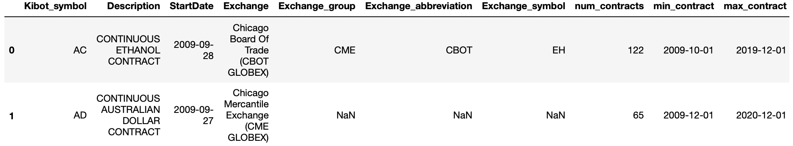
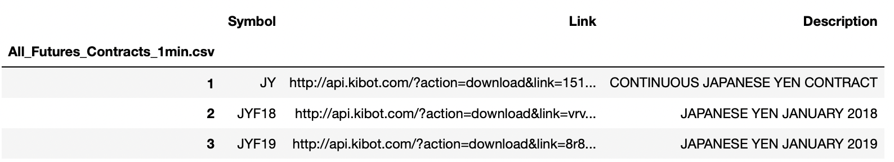
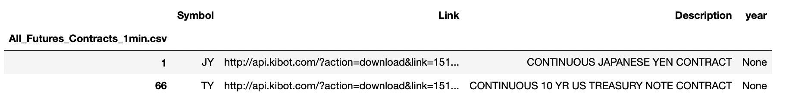
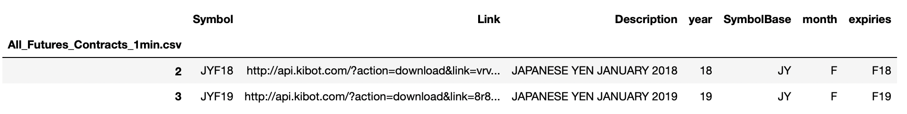
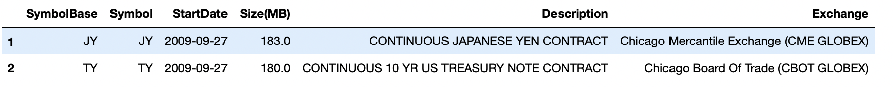
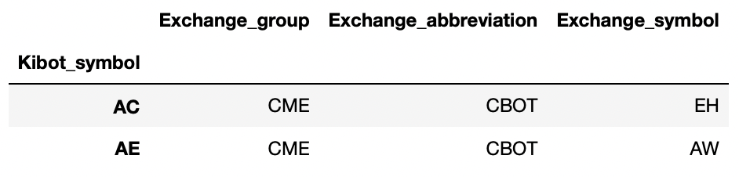

<!--ts-->
         * [Explore Kibot metadata code in im](#explore-kibot-metadata-code-in-im)
   * [Major insights:](#major-insights)
   * [Minutely metadata extraction process:](#minutely-metadata-extraction-process)
         * [Explore Kibot data in S3](#explore-kibot-data-in-s3)

<!--te-->

### Explore Kibot metadata code in `im`

[#1339](https://github.com/cryptokaizen/cmamp/issues/1339)

# Major insights:

1.  `KibotMetadata` main method is `get_metadata()` and it has 2 types of
    returns:

- Metadata for minutely or daily futures contracts with source data from
  `All_Futures_Contracts_daily.csv.gz` file on S3

- Metadata for tick-bid-ask futures contracts with source data from
  `Futures_tickbidask.txt.gz` file on S3

This means that we have Kibot metadata only for futures contracts, nothing for
equities. This raises a question - should we even add metadata extraction to
`IM` clients since we have it only for such a small part of clients data?

1.  If we decide to extract metadata for minutely futures data then what data
    should we retain?

    To build metadata the current code uses 3 different files:

    1.  `All_Futures_Contracts_daily.csv.gz` contains symbols, links and
        descriptions of continuous futures contracts and expiry contracts that
        they include.

        To clarify: continuous futures contracts are artificial instruments
        constructed by chaining together individual short-term futures contracts
        in order to create a single long-term history ([link](https://data.nasdaq.com/databases/SCF/documentation)).

        IOW, continuous contracts are the combination of expiry contracts, e.g.
        `JY` is a combination of `JYF18`, `JYG18` … `JYH22` where expiry
        contracts symbols are the combination of the actual continuous contract
        symbol (`JY`), specifically mapped expiry month (`F` that correspond to
        January according to the mapping), and the last 2 digits of year of
        expiry (`18`).

        The file contains data for all the types.

    2.  `FuturesContinuous_intraday.txt.gz` contains continuous contracts
        symbols, their description, start date of the contract chain, data size,
        and full name of the exchange where this contract is traded

    3.  `Kibot_to_exchange.csv` contains group, symbol and abbreviation of
        exchanges where specified continuous contracts are traded

Using these 3 files the metadata is computed and contains the following columns:

1.  `Kibot_symbol`: symbol that correspond to a continuous contract on Kibot

2.  `Description`: continuous contract description

3.  `StartDate': start date of the continuous contract

4.  `Exchange`: full name of the exchange where contract is traded

5.  `Exchange_group`: high-level exchange group

6.  `Exchange_abbreviation`: exchange abbreviation

7.  `Exchange_symbol`: contract designation in given exchange

8.  `Num_contracts`: number of expiry contracts in a continuous one

9.  `min_contract': date of the earliest expiry contract

10. `max_contract': date of the latest expiry contract

11. `num_expiries': number of months at which contracts for a given symbol
    expire

12. `expiries': list of all the months at which contracts for a given symbol
    expire

This is a snippet of it:

1.  The code and computations are very complicated and scattered around
    different functions and classes - this definitely can be optimized

# Minutely metadata extraction process:

Metadata extraction is actually done by `compute_kibot_metadata()` private
method so here is a description of how it works to give some clarity:

- Initial file `All_Futures_Contracts_daily.csv.gz` is read by
  `*read_1min_contract_metadata()*`, contains `Symbol`, `Link`, and
  `Description` columns:
  

This initial dataframe is split and transformed by
`extract_month_year_expiry()` on 2 dataframes based on 2 types of `Symbol`
column values which correspond to the types of contracts:

- Continuous contracts symbols, e.g. `JY`:
  Rows
  of this dataframe contain major information about continuous contracts: Kibot
  symbols and their description, so only these columns are retained for the
  final output as `Kibot_symbol` and `Description` columns. `Symbol` is
  used then as an index column for concatenation.

- Expiry contracts symbols, e.g.
  `JYF18`:
  Rows of this dataframe contain information about all the expiry contracts that
  belong to the corresponding continuous ones from the previous dataframe. Parts
  of these symbols that correspond to expiry month and year are separated from
  continuous contract symbol and then used to calculate `num_contracts`,
  `min_contract`, `max_contract`, `num_expiries`, `expiries` columns in the
  final dataframe via `calculate_expiry_counts()`. `SymbolBase` is used
  then as an index column for concatenation.

- `StartDate` and `Exchange` columns that correspond to continuous contracts
  symbols are being read from `FuturesContinuous_intraday.txt.gz`:
  
  `SymbolBase` is used then as an index column for concatenation.

- `Exchange_group`, `Exchange_abbreviation`, `Exchange_symbol` columns that
  correspond to continuous contract symbols are being read from
  "kibot_to_exchange.csv":
  
  `Kibot_symbol` is used then as an index column for concatenation.

### Explore Kibot data in S3

[#1219](https://github.com/cryptokaizen/cmamp/issues/1219)

- The `Kibot` universe that is extracted using general methods (e.g.,
  `read_continuous_contract_metadata()`) is not consistent with the actual
  downloaded data and most likely is being parsed from the website at some
  period of time
  - In order to observe the actual universe that is available in the database
    one needs to run `get_symbols_for_dataset()`

- The necessary param `exchange` from `read_data()` is not important at all: any
  inserted value leads to the same results

- Data is available both in `csv` and `pq` formats:
  - The OHLCV data inside raw files is identical by values and time range.
  - PQ data is already transformed to the desired format (unlike CSV data):
    - The heading is in place
    - Datetime is converted to index and presented in a complete data-time
      format
