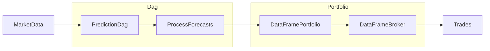

<!-- toc -->

- [Overview](#overview)
- [High-level architecture and code organization](#high-level-architecture-and-code-organization)
- [System Configuration](#system-configuration)
- [System components](#system-components)
  * [MarketData](#marketdata)
  * [DagBuilder](#dagbuilder)
  * [DAG](#dag)
  * [DagRunner](#dagrunner)
  * [Portfolio](#portfolio)
- [System run](#system-run)
- [TODO(gp): @all Describe the output](#todogp-all-describe-the-output)

<!-- tocstop -->

# Overview

The goal is to run a `System` with `Portfolio` in the replayed time mode for a
few bars.

The `System` is
[/dataflow_amp/system/mock2/mock2_forecast_system.py](/dataflow_amp/system/mock2/mock2_forecast_system.py)

The system is composed by the following components



# High-level architecture and code organization

- `dataflow_amp/pipelines/mock2/mock2_pipeline.py`
  - Builder that creates the prediction model
  - `Mock2_DagBuilder`

- `dataflow_amp/system/mock2/mock2_forecast_system.py`
  - Build the full-system
  - `Mock2_NonTime_ForecastSystem`
  - `Mock2_Time_ForecastSystem_with_DataFramePortfolio`

- `dataflow_amp/system/mock2/mock2_forecast_system_example.py`
  - Builder for the System used in backtesting and unit testing
  - `get_Mock2_NonTime_ForecastSystem_example1()`
  - `get_Mock2_NonTime_ForecastSystem_example2()`

- `dataflow_amp/system/mock2/mock2_tile_config_builders.py`
  - Build tile configs for simulation
  - `build_Mock2_tile_config_list()`
  - `build_Mock2_tile_config_list_for_unit_test()`

- `dataflow_amp/system/mock2/test/test_mock2_forecast_system.py`
  - Unit tests for `Mock2_NonTime_ForecastSystem`
  - `Test_Mock2_System_CheckConfig`
  - `Test_Mock2_NonTime_ForecastSystem_FitPredict`
  - ...

- `dataflow_amp/system/mock2/test/test_mock2_tiledbacktest.py`
  - Run an end-to-end backtest for a Mock2 pipeline and analysis flow
  - `Test_Mock2_NonTime_ForecastSystem_TiledBacktest`

- `dataflow_amp/system/mock2/scripts/run_end_to_end_Mock2_system.py`
  - Run an end-to-end streaming simulation

# System Configuration

`System` parameters are controlled via `SystemConfig`, which is built
`dataflow_amp/system/mock2/scripts/run_end_to_end_Mock2_system.py`.

The snippet of code below configures the input data, e.g., bar duration, history
amount, number of assets

```python
# Bar duration in seconds, e.g., 60 * 60 is 1 hour bar.
system.config["bar_duration_in_seconds"] = 60 * 60
system.config["market_data_config", "number_of_assets"] = 10
# History amount, e.g., 10 days worth of data.
system.config["market_data_config", "history_lookback"] = pd.Timedelta(
    days=10
)
```

The snippet of code below configures the maximum portfolio notional:

```python
system.config[
    "process_forecasts_node_dict",
    "process_forecasts_dict",
    "optimizer_config",
    "params",
    "kwargs",
] = cconfig.Config.from_dict({"target_gmv": 1e7})
```

The snippet of code below configures for how long to run the `System`:

```python
system.config["dag_runner_config", "rt_timeout_in_secs_or_time"] = (
    system.config["bar_duration_in_seconds"] * 2
)
```

The script saves the results to `/app/system_log_dir` together with the
configuration file `/app/system_log_dir/system_config.output.txt`.

For the demo purposes only a few most important parameters are exposed while
there are more parameters to control. The full `SystemConfig` looks like:

```python
dag_config (marked_as_used=False, writer=None, val_type=core.config.config_.Config):
  filter_weekends (marked_as_used=False, writer=None, val_type=core.config.config_.Config):
    in_col_groups (marked_as_used=False, writer=None, val_type=list): [('close',), ('high',), ('low',), ('open',), ('volume',)]
    out_col_group (marked_as_used=False, writer=None, val_type=tuple): ()
    join_output_with_input (marked_as_used=False, writer=None, val_type=bool): False
  filter_ath (marked_as_used=False, writer=None, val_type=core.config.config_.Config):
    in_col_groups (marked_as_used=False, writer=None, val_type=list): [('close',), ('high',), ('low',), ('open',), ('volume',)]
    out_col_group (marked_as_used=False, writer=None, val_type=tuple): ()
    transformer_kwargs (marked_as_used=False, writer=None, val_type=core.config.config_.Config):
      start_time (marked_as_used=False, writer=None, val_type=datetime.time): 09:30:00
      end_time (marked_as_used=False, writer=None, val_type=datetime.time): 16:00:00
    join_output_with_input (marked_as_used=False, writer=None, val_type=bool): False
  resample (marked_as_used=False, writer=None, val_type=core.config.config_.Config):
    in_col_groups (marked_as_used=False, writer=None, val_type=list): [('open',), ('high',), ('low',), ('close',), ('volume',)]
    out_col_group (marked_as_used=False, writer=None, val_type=tuple): ()
    transformer_kwargs (marked_as_used=False, writer=None, val_type=core.config.config_.Config):
      rule (marked_as_used=False, writer=None, val_type=str): 60T
      resampling_groups (marked_as_used=False, writer=None, val_type=list): [({'close': 'close'}, 'last', {}), ({'high': 'high'}, 'max', {}), ({'low': 'low'}, 'min', {}), ({'open': 'open'}, 'first', {}), ({'volume': 'volume'}, 'sum', {'min_count': 1}), ({'close': 'twap'}, 'mean', {})]
      vwap_groups (marked_as_used=False, writer=None, val_type=list): [('close', 'volume', 'vwap')]
    reindex_like_input (marked_as_used=False, writer=None, val_type=bool): False
    join_output_with_input (marked_as_used=False, writer=None, val_type=bool): False
  compute_ret_0 (marked_as_used=False, writer=None, val_type=core.config.config_.Config):
    in_col_groups (marked_as_used=False, writer=None, val_type=list): [('close',), ('vwap',), ('twap',)]
    out_col_group (marked_as_used=False, writer=None, val_type=tuple): ()
    transformer_kwargs (marked_as_used=False, writer=None, val_type=core.config.config_.Config):
      mode (marked_as_used=False, writer=None, val_type=str): pct_change
    col_mapping (marked_as_used=False, writer=None, val_type=core.config.config_.Config):
      close (marked_as_used=False, writer=None, val_type=str): close.ret_0
      vwap (marked_as_used=False, writer=None, val_type=str): vwap.ret_0
      twap (marked_as_used=False, writer=None, val_type=str): twap.ret_0
  compute_vol (marked_as_used=False, writer=None, val_type=core.config.config_.Config):
    in_col_groups (marked_as_used=False, writer=None, val_type=list): [('vwap.ret_0',)]
    out_col_group (marked_as_used=False, writer=None, val_type=tuple): ()
    transformer_kwargs (marked_as_used=False, writer=None, val_type=core.config.config_.Config):
      tau (marked_as_used=False, writer=None, val_type=int): 32
    col_mapping (marked_as_used=False, writer=None, val_type=core.config.config_.Config):
      vwap.ret_0 (marked_as_used=False, writer=None, val_type=str): vwap.ret_0.vol
  adjust_rets (marked_as_used=False, writer=None, val_type=core.config.config_.Config):
    in_col_groups (marked_as_used=False, writer=None, val_type=list): [('vwap.ret_0',), ('vwap.ret_0.vol',)]
    out_col_group (marked_as_used=False, writer=None, val_type=tuple): ()
    transformer_kwargs (marked_as_used=False, writer=None, val_type=core.config.config_.Config):
      term1_col (marked_as_used=False, writer=None, val_type=str): vwap.ret_0
      term2_col (marked_as_used=False, writer=None, val_type=str): vwap.ret_0.vol
      out_col (marked_as_used=False, writer=None, val_type=str): vwap.ret_0.vol_adj
      term2_delay (marked_as_used=False, writer=None, val_type=int): 2
      operation (marked_as_used=False, writer=None, val_type=str): div
    drop_nans (marked_as_used=False, writer=None, val_type=bool): True
  clip (marked_as_used=False, writer=None, val_type=core.config.config_.Config):
    in_col_groups (marked_as_used=False, writer=None, val_type=list): [('vwap.ret_0.vol_adj',)]
    out_col_group (marked_as_used=False, writer=None, val_type=tuple): ()
    col_mapping (marked_as_used=False, writer=None, val_type=core.config.config_.Config):
        vwap.ret_0.vol_adj (marked_as_used=False, writer=None, val_type=str): vwap.ret_0.vol_adj.c
dag_builder_object (marked_as_used=True, writer=/app/amp/dataflow/system/system_builder_utils.py::491::apply_dag_property, val_type=dataflow_amp.pipelines.mock2.mock2_pipeline.Mock2_DagBuilder): nid_prefix=
dag_builder_class (marked_as_used=False, writer=None, val_type=str): Mock2_DagBuilder
system_class (marked_as_used=False, writer=None, val_type=str): Mock2_Time_ForecastSystem_with_DataFramePortfolio
system_log_dir (marked_as_used=False, writer=None, val_type=str): ./system_log_dir
market_data_config (marked_as_used=False, writer=None, val_type=core.config.config_.Config):
  system_log_dir (marked_as_used=False, writer=None, val_type=str): /app/system_log_dir
  bar_duration_in_seconds (marked_as_used=False, writer=None, val_type=int): 3600
  number_of_assets (marked_as_used=False, writer=None, val_type=int): 10
  history_lookback (marked_as_used=False, writer=None, val_type=pandas._libs.tslibs.timedeltas.Timedelta): 10 days 00:00:00
  replayed_delay_in_mins_or_timestamp (marked_as_used=False, writer=None, val_type=pandas._libs.tslibs.timestamps.Timestamp): 2023-08-15 10:30:00-04:00
  asset_ids (marked_as_used=True, writer=/app/amp/dataflow/system/system_builder_utils.py::707::get_DataFramePortfolio_from_System, val_type=list): [0, 1, 2, 3, 4, 5, 6, 7, 8, 9]
  data (marked_as_used=True, writer=/app/amp/dataflow/system/system_builder_utils.py::329::get_ReplayedMarketData_from_df, val_type=pandas.core.frame.DataFrame):
    index=[0, 7209]
    columns=start_datetime,end_datetime,timestamp_db,open,high,low,close,volume,asset_id
    shape=(7210, 9)
                 start_datetime              end_datetime              timestamp_db     open     high      low    close  volume  asset_id
    0 2023-08-01 09:00:00-04:00 2023-08-01 10:00:00-04:00 2023-08-01 10:00:10-04:00   999.89   999.89   999.89   999.89    13.0         0
    1 2023-08-01 09:00:00-04:00 2023-08-01 10:00:00-04:00 2023-08-01 10:00:10-04:00  1000.00  1000.00  1000.00  1000.00    14.0         1
    2 2023-08-01 09:00:00-04:00 2023-08-01 10:00:00-04:00 2023-08-01 10:00:10-04:00  1000.00  1000.00  1000.00  1000.00    12.0         2
    ...
    7207 2023-08-31 09:00:00-04:00 2023-08-31 10:00:00-04:00 2023-08-31 10:00:10-04:00  1002.39  1003.28  1002.39  1003.28   477.0         7
    7208 2023-08-31 09:00:00-04:00 2023-08-31 10:00:00-04:00 2023-08-31 10:00:10-04:00   986.35   986.35   985.84   986.15   466.0         8
    7209 2023-08-31 09:00:00-04:00 2023-08-31 10:00:00-04:00 2023-08-31 10:00:10-04:00   997.93   998.48   997.69   997.84   493.0         9
  delay_in_secs (marked_as_used=False, writer=None, val_type=int): 10
portfolio_config (marked_as_used=False, writer=None, val_type=core.config.config_.Config):
  mark_to_market_col (marked_as_used=True, writer=/app/amp/dataflow/system/system_builder_utils.py::713::get_DataFramePortfolio_from_System, val_type=str): close
  pricing_method (marked_as_used=True, writer=/app/amp/dataflow/system/system_builder_utils.py::716::get_DataFramePortfolio_from_System, val_type=str): twap.60T
  column_remap (marked_as_used=False, writer=None, val_type=core.config.config_.Config):
    bid (marked_as_used=True, writer=/app/amp/dataflow/system/system_builder_utils.py::704::get_DataFramePortfolio_from_System, val_type=str): bid
    ask (marked_as_used=True, writer=/app/amp/dataflow/system/system_builder_utils.py::704::get_DataFramePortfolio_from_System, val_type=str): ask
    midpoint (marked_as_used=True, writer=/app/amp/dataflow/system/system_builder_utils.py::704::get_DataFramePortfolio_from_System, val_type=str): midpoint
    price (marked_as_used=True, writer=/app/amp/dataflow/system/system_builder_utils.py::704::get_DataFramePortfolio_from_System, val_type=str): close
process_forecasts_node_dict (marked_as_used=False, writer=None, val_type=core.config.config_.Config):
  prediction_col (marked_as_used=False, writer=None, val_type=str): vwap.ret_0.vol_adj.c
  volatility_col (marked_as_used=False, writer=None, val_type=str): vwap.ret_0.vol
  spread_col (marked_as_used=False, writer=None, val_type=NoneType): None
  portfolio (marked_as_used=False, writer=None, val_type=oms.portfolio.dataframe_portfolio.DataFramePortfolio):
    <oms.portfolio.dataframe_portfolio.DataFramePortfolio at 0x7fbc7502f340>
      # holdings_shares=
      Empty DataFrame
      Columns: []
      Index: []
      # holdings_notional=
      Empty DataFrame
      Columns: []
      Index: []
      # executed_trades_shares=
      Empty DataFrame
      Columns: []
      Index: []
      # executed_trades_notional=
      Empty DataFrame
      Columns: []
      Index: []
      # pnl=
      Empty DataFrame
      Columns: []
      Index: []
      # statistics=
      Empty DataFrame
      Columns: [pnl]
      Index: []
  process_forecasts_dict (marked_as_used=False, writer=None, val_type=core.config.config_.Config):
    execution_mode (marked_as_used=False, writer=None, val_type=str): real_time
    log_dir (marked_as_used=False, writer=None, val_type=str): ./system_log_dir/process_forecasts
    order_config (marked_as_used=False, writer=None, val_type=core.config.config_.Config):
      order_type (marked_as_used=False, writer=None, val_type=str): price@twap
      passivity_factor (marked_as_used=False, writer=None, val_type=NoneType): None
      order_duration_in_mins (marked_as_used=False, writer=None, val_type=int): 60
    optimizer_config (marked_as_used=False, writer=None, val_type=core.config.config_.Config):
      backend (marked_as_used=False, writer=None, val_type=str): pomo
      params (marked_as_used=False, writer=None, val_type=core.config.config_.Config):
        style (marked_as_used=False, writer=None, val_type=str): cross_sectional
        kwargs (marked_as_used=False, writer=None, val_type=core.config.config_.Config):
          bulk_frac_to_remove (marked_as_used=False, writer=None, val_type=float): 0.0
          bulk_fill_method (marked_as_used=False, writer=None, val_type=str): zero
          target_gmv (marked_as_used=False, writer=None, val_type=float): 10000000.0
    ath_start_time (marked_as_used=False, writer=None, val_type=datetime.time): 09:30:00
    trading_start_time (marked_as_used=False, writer=None, val_type=datetime.time): 09:30:00
    ath_end_time (marked_as_used=False, writer=None, val_type=datetime.time): 16:00:00
    trading_end_time (marked_as_used=False, writer=None, val_type=datetime.time): 15:00:00
    liquidate_at_trading_end_time (marked_as_used=False, writer=None, val_type=bool): False
dag_runner_config (marked_as_used=False, writer=None, val_type=core.config.config_.Config):
  bar_duration_in_secs (marked_as_used=True, writer=/app/amp/dataflow/system/system_builder_utils.py::1108::get_RealTimeDagRunner_from_System, val_type=int): 3600
  rt_timeout_in_secs_or_time (marked_as_used=True, writer=/app/amp/dataflow/system/system_builder_utils.py::1111::get_RealTimeDagRunner_from_System, val_type=int): 7200
event_loop_object (marked_as_used=True, writer=/app/amp/dataflow/system/system_builder_utils.py::711::get_DataFramePortfolio_from_System, val_type=helpers.hasyncio._EventLoop): <_EventLoop running=False closed=False debug=False>
```

# System components

## MarketData

The source of data is `ReplayedMarketData`, an object that can replay a
synthetic or previously capture dataframe. The data is represented by random
OHLCV bars for `N` assets, `K` days of history and `D` bar duration in seconds,
where `N`, `K`, `D` are configurable parameters that we control using
`SystemConfig`.

Data snippet:

```markdown
                                     start_datetime              timestamp_db     open     high      low    close  volume  asset_id
end_datetime
2023-08-08 15:00:00-04:00 2023-08-08 14:00:00-04:00 2023-08-08 15:00:10-04:00   985.34   986.36   984.87   986.25   935.0         0
2023-08-08 15:00:00-04:00 2023-08-08 14:00:00-04:00 2023-08-08 15:00:10-04:00  1005.38  1006.65  1005.07  1006.34   948.0         1
2023-08-08 15:00:00-04:00 2023-08-08 14:00:00-04:00 2023-08-08 15:00:10-04:00  1002.44  1002.49  1001.60  1001.88  1013.0         2
```

We also control via `SystemConfig`:

- When to start replaying the data, e.g., the dataframe starts at
  `2023-08-01 10:00:00` but we start computing at `2023-08-15 10:30:00` so that
  there is enough history to warm up the system
- Delay in seconds, i.e. the `System` simulates delay and waits for data to
  become available for `X` seconds

## DagBuilder

A `DagBuilder` configures `Nodes` and connects them into a `Dag` in order to
generate forecasts. The `DagBuilder` used in this example is the toy model
`Mock2_DagBuilder` in
[/dataflow_amp/pipelines/mock2/mock2_pipeline.py](/dataflow_amp/pipelines/mock2/mock2_pipeline.py)

`Mock2_DagBuilder` is a pipeline that:

- Filters out weekends
- Removes rows outside active trading hours
- Resamples the data to the desired frequency
- Computes returns
- Computes volatility
- Adjusts returns using volatility
- Clips returns

## DAG

`Dag` is represented by:

- `RealTimeDataSource` node that contains `ReplayedMarketData` and introduces
  real-time data behavior, e.g., the System waits for `X` seconds for the data
- `Nodes` that are described by the `Mock2_DagBuilder`
- `ProcessForecastsNode` that controls the `Portfolio` configuration

One can configure portfolio construction (e.g, maximum portfolio notional, i.e.
`target_gmv`) via `SystemConfig`.

## DagRunner

`DagRunner` is represented by `RealTimeDagRunner` which is an executor that
controls how to run the `System` in streaming mode (both real-time and
simulated).

One can configure any parameter (e.g., for how long to run the `System`, e.g.,
for 2 bars) via `SystemConfig`.

## Portfolio

`Portfolio` is implemented by `DataFramePortfolio` with a `DataFrameBroker`
which:

- Keeps track of holdings using a `DataFrame` (instead of a database)
- Has no advanced mechanism to control trade execution, i.e. all orders always
  are fully filled

# System run

To run the `System` and save logs execute the following cmd:
```
docker> ./dataflow_amp/system/mock2/scripts/run_end_to_end_Mock2_system.py 2>&1 | tee tmp.log_system.txt
```

The System starts at `2023-08-15 11:00:00-04:00` and computes the DAG for 2
bars.

```markdown
# Real-time loop: num_it=1: rt_time_out_in_secs=7200 wall_clock_time='2023-08-15 11:00:00-04:00' real_wall_clock_time='2024-01-05 08:39:32.981505-05:00'
```

It waits for the data to become available for 10 seconds (configurable):

```markdown
### waiting on last bar: num_iter=10/120: current_bar_timestamp=2023-08-15 11:00:00-04:00 wall_clock_time=2023-08-15 11:00:10-04:00 last_db_end_time=2023-08-15 11:00:00-04:00

08:39:33 rss=0.292GB vms=1.261GB mem_pct=1% Task-3 hprint.py log_frame:604

# Waiting on last bar: done
```

And once the data is ready the `System` computes the `Dag`:

```markdown
################################################################################
Executing method 'predict' for node topological_id=0 nid='read_data' ...
################################################################################
...
################################################################################
Executing method 'predict' for node topological_id=8 nid='process_forecasts' ...
################################################################################
```

When executing the `ProcessForecastsNode` the System:

- Computes target positions
- Generates orders
- Submits orders (in this case all orders are fully filled)

```markdown
# last target positions=
          holdings_shares    price  holdings_notional      wall_clock_timestamp  prediction  volatility  spread  target_holdings_notional  target_trades_notional  target_trades_shares  target_holdings_shares
asset_id
0                       0   983.66                  0 2023-08-15 11:00:11-04:00      0.9674    0.000967       0              586609.98842            586609.98842             596.35442               596.35442
1                       0  1010.59                  0 2023-08-15 11:00:11-04:00    0.772048    0.001099       0             454185.047454           454185.047454             449.42563               449.42563
2                       0  1005.54                  0 2023-08-15 11:00:11-04:00   -0.607692    0.000675       0            -1202955.27038          -1202955.27038          -1196.327615            -1196.327615
...
7                       0  1014.55                  0 2023-08-15 11:00:11-04:00   -0.632565    0.000568       0            -1699546.60519          -1699546.60519           -1675.17284             -1675.17284
8                       0   996.88                  0 2023-08-15 11:00:11-04:00   -1.287815    0.000904       0            -670108.728394          -670108.728394           -672.206011             -672.206011
9                       0   993.89                  0 2023-08-15 11:00:11-04:00    -0.02503     0.00066       0            1259035.977478          1259035.977478           1266.775979             1266.775979
...
# last orders=
Order: order_id=0 creation_timestamp=2023-08-15 11:00:11-04:00 asset_id=0 type_=price@twap start_timestamp=2023-08-15 11:00:11-04:00 end_timestamp=2023-08-15 12:00:00-04:00 curr_num_shares=0.0 diff_num_shares=596.354419637 tz=America/New_York extra_params={}
Order: order_id=1 creation_timestamp=2023-08-15 11:00:11-04:00 asset_id=1 type_=price@twap start_timestamp=2023-08-15 11:00:11-04:00 end_timestamp=2023-08-15 12:00:00-04:00 curr_num_shares=0.0 diff_num_shares=449.425630032 tz=America/New_York extra_params={}
Order: order_id=2 creation_timestamp=2023-08-15 11:00:11-04:00 asset_id=2 type_=price@twap start_timestamp=2023-08-15 11:00:11-04:00 end_timestamp=2023-08-15 12:00:00-04:00 curr_num_shares=0.0 diff_num_shares=-1196.327615391 tz=America/New_York extra_params={}
Order: order_id=3 creation_timestamp=2023-08-15 11:00:11-04:00 asset_id=3 type_=price@twap start_timestamp=2023-08-15 11:00:11-04:00 end_timestamp=2023-08-15 12:00:00-04:00 curr_num_shares=0.0 diff_num_shares=-686.685193608 tz=America/New_York extra_params={}
Order: order_id=4 creation_timestamp=2023-08-15 11:00:11-04:00 asset_id=4 type_=price@twap start_timestamp=2023-08-15 11:00:11-04:00 end_timestamp=2023-08-15 12:00:00-04:00 curr_num_shares=0.0 diff_num_shares=386.275392292 tz=America/New_York extra_params={}
Order: order_id=5 creation_timestamp=2023-08-15 11:00:11-04:00 asset_id=5 type_=price@twap start_timestamp=2023-08-15 11:00:11-04:00 end_timestamp=2023-08-15 12:00:00-04:00 curr_num_shares=0.0 diff_num_shares=1960.903428683 tz=America/New_York extra_params={}
Order: order_id=6 creation_timestamp=2023-08-15 11:00:11-04:00 asset_id=6 type_=price@twap start_timestamp=2023-08-15 11:00:11-04:00 end_timestamp=2023-08-15 12:00:00-04:00 curr_num_shares=0.0 diff_num_shares=-1086.072750644 tz=America/New_York extra_params={}
Order: order_id=7 creation_timestamp=2023-08-15 11:00:11-04:00 asset_id=7 type_=price@twap start_timestamp=2023-08-15 11:00:11-04:00 end_timestamp=2023-08-15 12:00:00-04:00 curr_num_shares=0.0 diff_num_shares=-1675.172840363 tz=America/New_York extra_params={}
Order: order_id=8 creation_timestamp=2023-08-15 11:00:11-04:00 asset_id=8 type_=price@twap start_timestamp=2023-08-15 11:00:11-04:00 end_timestamp=2023-08-15 12:00:00-04:00 curr_num_shares=0.0 diff_num_shares=-672.206011149 tz=America/New_York extra_params={}
Order: order_id=9 creation_timestamp=2023-08-15 11:00:11-04:00 asset_id=9 type_=price@twap start_timestamp=2023-08-15 11:00:11-04:00 end_timestamp=2023-08-15 12:00:00-04:00 curr_num_shares=0.0 diff_num_shares=1266.775978708 tz=America/New_York extra_params={}
```

Then the `System` goes to sleep waiting for the next bar to start:
```markdown
08:39:37 rss=0.296GB vms=1.325GB mem_pct=1%% Task-3 process_forecasts_.py process_forecasts:353 Event: exiting process_forecasts() for loop.
08:39:37 rss=0.296GB vms=1.325GB mem_pct=1% Task-3 real_time_dag_runner.py _run_dag:264 Waiting on node 'process_forecasts': done
08:39:37 rss=0.296GB vms=1.325GB mem_pct=1% Task-1 real_time.py execute_with_real_time_loop:422 await done (wall_clock_time=2023-08-15 12:00:00-04:00)
```

Since the clock is simulated, instead of waiting 1 hour, the `System` moves the
clock forward within a few seconds and starts to compute the 2nd bar:

```markdown
# Real-time loop: num_it=2: rt_time_out_in_secs=7200 wall_clock_time='2023-08-15 12:00:00-04:00' real_wall_clock_time='2024-01-05 08:39:37.416849-05:00'
```

Then the `System` repeats the `Dag` computation and order submission but for the
next bar and exits once the termination condition becomes True (run for 2 bars
in this case):

```markdown
08:39:42 rss=0.297GB vms=1.326GB mem_pct=1% Task-1 hwall_clock_time.py set_current_bar_timestamp:105 timestamp=2023-08-15 13:00:00-04:00
08:39:42 rss=0.297GB vms=1.326GB mem_pct=1%% Task-1 real_time.py execute_with_real_time_loop:433 rt_timeout_in_secs_or_time=7200, bar_duration_in_secs=3600, num_it=2, num_iterations=2, is_done=True
08:39:42 rss=0.297GB vms=1.326GB mem_pct=1% - ^[[36mINFO ^[[0m Task-1 real_time.py execute_with_real_time_loop:443 Exiting loop: num_it=2, num_iterations=2
```

The output is in the dir:

```bash
> tree.sh -p system_log_dir
system_log_dir/
|-- process_forecasts/
|   |-- orders/
|   |   |-- 20230815_110000.20230815_110011.csv
|   |   `-- 20230815_120000.20230815_120011.csv
|   |-- portfolio/
|   |   |-- executed_trades_notional/
|   |   |   |-- 20230815_110000.20230815_110011.csv
|   |   |   `-- 20230815_120000.20230815_120011.csv
|   |   |-- executed_trades_shares/
|   |   |   |-- 20230815_110000.20230815_110011.csv
|   |   |   `-- 20230815_120000.20230815_120011.csv
|   |   |-- holdings_notional/
|   |   |   |-- 20230815_110000.20230815_110011.csv
|   |   |   `-- 20230815_120000.20230815_120011.csv
|   |   |-- holdings_shares/
|   |   |   |-- 20230815_110000.20230815_110011.csv
|   |   |   `-- 20230815_120000.20230815_120011.csv
|   |   `-- statistics/
|   |       |-- 20230815_110000.20230815_110011.csv
|   |       `-- 20230815_120000.20230815_120011.csv
|   `-- target_positions/
|       |-- 20230815_110000.20230815_110011.csv
|       `-- 20230815_120000.20230815_120011.csv
|-- system_config.input.txt
|-- system_config.input.values_as_strings.pkl
|-- system_config.output.txt
`-- system_config.output.values_as_strings.pkl

10 directories, 18 files
```

# TODO(gp): @all Describe the output
