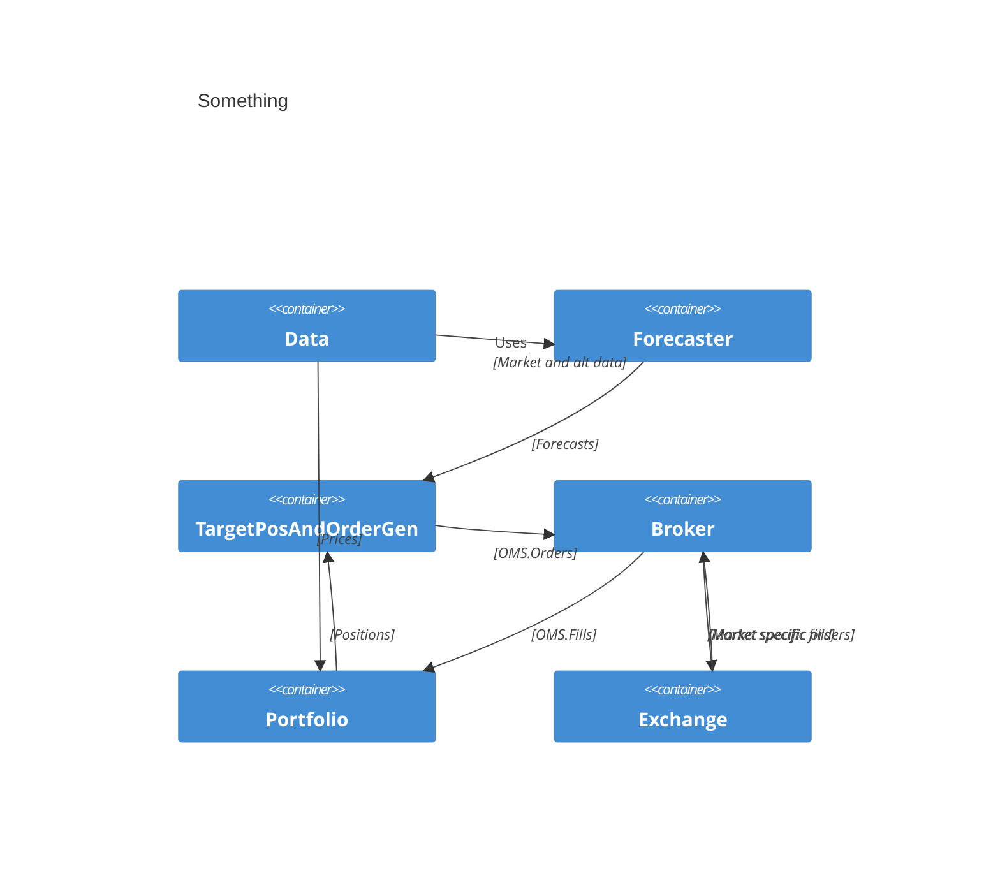
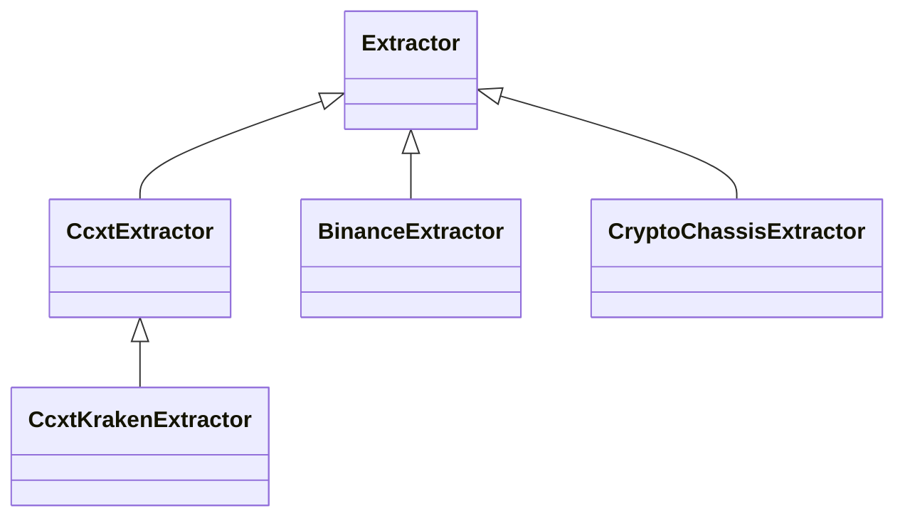
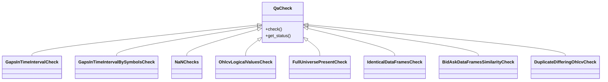
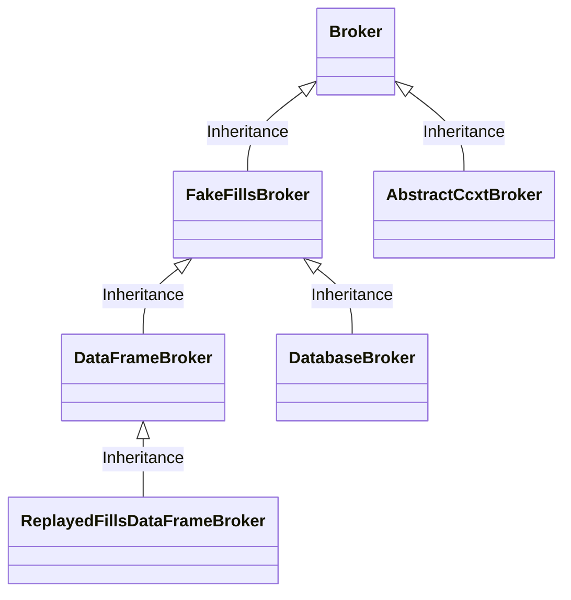

<!-- toc -->

- [Conventions](#conventions)
- [`DataPull`](#datapull)
  * [Extract](#extract)
    + [`Extractor`](#extractor)
  * [QA](#qa)
    + [`QaCheck`](#qacheck)
    + [`DataSetValidator`](#datasetvalidator)
  * [Transform](#transform)
  * [DB](#db)
    + [`DbConnectionManager`](#dbconnectionmanager)
    + [`TestImDbHelper`](#testimdbhelper)
  * [Universe](#universe)
    + [`FullSymbol`](#fullsymbol)
  * [Client](#client)
    + [`ImClient`](#imclient)
    + [`DataFrameImClient`](#dataframeimclient)
    + [`HistoricalPqByTileClient`](#historicalpqbytileclient)
    + [`HistoricalPqByCurrencyPairTileClient`](#historicalpqbycurrencypairtileclient)
    + [`HistoricalPqByDateClient`](#historicalpqbydateclient)
    + [`RealTimeImClient`](#realtimeimclient)
    + [`SqlRealTimeImClient`](#sqlrealtimeimclient)
    + [`ImClientTestCase`](#imclienttestcase)
    + [`RawDataReader`read data from a table of an SQL DB](#rawdatareaderread-data-from-a-table-of-an-sql-db)
- [`market_data`](#market_data)
    + [`MarketData`](#marketdata)
    + [`ImClientMarketData`](#imclientmarketdata)
    + [`MarketData_*_TestCase`](#marketdata__testcase)
    + [`RealTimeMarketData`](#realtimemarketdata)
    + [`RealTimeMarketData2`](#realtimemarketdata2)
    + [`ReplayedMarketData`](#replayedmarketdata)
    + [`HorizontalStitchedMarketData`](#horizontalstitchedmarketdata)
    + [`IgStitchedMarketData`](#igstitchedmarketdata)
- [`dataflow`](#dataflow)
- [`dataflow/core`](#dataflowcore)
    + [`Node`](#node)
    + [`DAG`](#dag)
    + [`DagBuilder`](#dagbuilder)
    + [`DagRunner`](#dagrunner)
    + [`FitPredictDagRunner`](#fitpredictdagrunner)
    + [`RollingFitPredictDagRunner`](#rollingfitpredictdagrunner)
    + [`ResultBundle`](#resultbundle)
- [dataflow/core/nodes](#dataflowcorenodes)
    + [`FitPredictNode`](#fitpredictnode)
    + [`DataSource`](#datasource)
    + [`Transformer`](#transformer)
    + [`YConnector`](#yconnector)
    + [`GroupedColDfToDfColProcessor`](#groupedcoldftodfcolprocessor)
    + [`CrossSectionalDfToDfColProcessor`](#crosssectionaldftodfcolprocessor)
    + [`SeriesToDfColProcessor`](#seriestodfcolprocessor)
    + [`SeriesToSeriesColProcessor`](#seriestoseriescolprocessor)
    + [`DfStacker`](#dfstacker)
- [dataflow/system](#dataflowsystem)
    + [`RealTimeDagRunner`](#realtimedagrunner)
    + [`ProcessForecastsNode`](#processforecastsnode)
    + [`HistoricalDataSource`](#historicaldatasource)
    + [`RealTimeDataSource`](#realtimedatasource)
    + [`System`](#system)
    + [`ForecastSystem`](#forecastsystem)
    + [`Df_ForecastSystem`](#df_forecastsystem)
    + [`NonTime_ForecastSystem`](#nontime_forecastsystem)
    + [`Time_ForecastSystem`](#time_forecastsystem)
    + [`ForecastSystem_with_DataFramePortfolio`](#forecastsystem_with_dataframeportfolio)
    + [`Time_ForecastSystem_with_DataFramePortfolio`](#time_forecastsystem_with_dataframeportfolio)
    + [`Time_ForecastSystem_with_DatabasePortfolio_and_OrderProcessor`](#time_forecastsystem_with_databaseportfolio_and_orderprocessor)
    + [`Time_ForecastSystem_with_DatabasePortfolio`](#time_forecastsystem_with_databaseportfolio)
- [dataflow/backtest](#dataflowbacktest)
    + [Forecaster](#forecaster)
    + [`MarketOms`](#marketoms)
    + [`OrderProcessor`](#orderprocessor)
    + [`OmsDb`](#omsdb)
    + [`ImplementedBroker`](#implementedbroker)
    + [`DatabaseBroker`](#databasebroker)
    + [`OmsDb`](#omsdb-1)
- [oms/fill](#omsfill)
    + [`Fill`](#fill)
- [oms/order](#omsorder)
    + [`Order`](#order)
- [oms/broker](#omsbroker)
    + [`Broker`](#broker)
    + [`FakeFillsBroker`](#fakefillsbroker)
    + [`DataFrameBroker`](#dataframebroker)
    + [`DatabaseBroker`](#databasebroker-1)
    + [`ReplayedDataReader`](#replayeddatareader)
    + [`ReplayedFillsDataFrameBroker`](#replayedfillsdataframebroker)
- [oms/broker/ccxt](#omsbrokerccxt)
    + [`AbstractCcxtBroker`](#abstractccxtbroker)
- [oms/limit_computer](#omslimit_computer)
- [oms/child_order_quantity_computer](#omschild_order_quantity_computer)
- [oms/portfolio](#omsportfolio)
    + [`Portfolio`](#portfolio)
    + [`DataFramePortfolio`](#dataframeportfolio)
    + [`DatabasePortfolio`](#databaseportfolio)
    + [ImplementedPortfolio](#implementedportfolio)
- [oms/order_processing](#omsorder_processing)
    + [`OrderProcessor`](#orderprocessor-1)
    + [`process_forecasts`](#process_forecasts)
    + [`TargetPositionAndOrderGenerator`](#targetpositionandordergenerator)
  * [Locates](#locates)
  * [Restrictions](#restrictions)
- [oms/optimizer](#omsoptimizer)
- [oms/db](#omsdb)
- [oms/ccxt](#omsccxt)

<!-- tocstop -->

{width="6.5in" height="1.875in"}

<!--

[[https://lucid.app/lucidchart/9ee80100-be76-42d6-ad80-531dcfee277e/edit?page=0_0&invitationId=inv_5777ae4b-d8f4-41c6-8901-cdfb93d98ca8#]{.underline}](https://lucid.app/lucidchart/9ee80100-be76-42d6-ad80-531dcfee277e/edit?page=0_0&invitationId=inv_5777ae4b-d8f4-41c6-8901-cdfb93d98ca8#)
{width="6.5in" height="4.319444444444445in"}
-->


```
Portfolio
- Broker

process_forecasts()
  - Input:
    - prediction_df
    - Portfolio
  - Instantiates:
    - TargetPositionAndOrderGenerator
      - Portfolio
      - Optimizer

HistoricalDataSource
```

# Conventions

- A dir is a C4 container (level 2)
- A subdir is a C4 component (level 3)
- A class is a C4/UML class (level 4)
- We use the same level of header for each of these C4 levels

# `DataPull`

## Extract

### `Extractor`

- File: im_v2/common/data/extract/extractor.py
- Responsibilities: abstract class for downloading raw data from vendors
- Interactions:
- Main methods:



## QA

### `QaCheck`

- File: sorrentum_sandbox/common/validate.py
- Responsibilities: QA check on one or more datasets



### `DataSetValidator`

- File: sorrentum_sandbox/common/validate.py
- Responsibilities: Apply a set of QA checks to validate one or more datasets

  ```mermaid
  classDiagram
    class DataSetValidator{
      +List[QaCheck] qa_checks
      +run_all_checks()
    }
    DataSetValidator <|-- SingleDatasetValidator
    DataSetValidator <|-- DataFrameDatasetValidator
  ```

## Transform

## DB

### `DbConnectionManager`

### `TestImDbHelper`

## Universe

### `FullSymbol`

- Responsibilities: implement full symbol (e.g., `binance:BTC_USDT`)

## Client

### `ImClient`

- Responsibilities: adapts the data from a vendor to the MarketData format
  (i.e., a wide format with knowledge time)
- Main methods:

  ```mermaid
  classDiagram
    ImClient <|-- ImClientReadingOneSymbol
    ImClient <|-- ImClientReadingMultipleSymbols
    ImClientReadingMultipleSymbols <|-- DataFrameImClient

    ImClientReadingMultipleSymbols <|-- HistoricalPqByTileClient

    HistoricalPqByTileClient <|-- HistoricalPqByCurrencyPairTileClient

    ImClientReadingMultipleSymbols <|-- HistoricalPqByTileClient

    ImClient <|-- RealTimeImClient
    RealTimeImClient <|-- SqlRealTimeImClient
  ```

### `DataFrameImClient`

- Responsibilities: read data from a passed dataframe
  - This is used for synthetic data

### `HistoricalPqByTileClient`

- Responsibilities: read historical data stored as Parquet by-tile

### `HistoricalPqByCurrencyPairTileClient`

- Responsibilities: read historical data stored as Parquet by asset

### `HistoricalPqByDateClient`

- Responsibilities: read historical data stored as Parquet by tile

### `RealTimeImClient`

- Responsibilities: type representing a real-time client

### `SqlRealTimeImClient`

- Responsibilities: read data from a table of an SQL DB

### `ImClientTestCase`

- Responsibilities: help test for classes derived from `ImClient`

### `RawDataReader`read data from a table of an SQL DB

- Responsibilities: read data based on a dataset signature

# `market_data`

### `MarketData`

- Responsibilities:
- Interactions:
- Main methods:

### `ImClientMarketData`

### `MarketData_*_TestCase`

### `RealTimeMarketData`

### `RealTimeMarketData2`

### `ReplayedMarketData`

### `HorizontalStitchedMarketData`

### `IgStitchedMarketData`

# `dataflow`

# `dataflow/core`

### `Node`

- Responsibilities:
  - Store and retrieve its output values on a per-method (e.g., "fit" and
    "predict") basis
  - Each node has an identifier and names for inputs/outputs

- Interactions:
  - `DAG`: a DAG of `Nodes`
  - Derived `Nodes` implementing specific features

- Main methods:

### `DAG`

- Responsibilities:
  - Build a DAG of `Nodes` by adding and connecting `Node`s
  - Query a DAG
  - Manage node execution storing outputs within executed nodes

- Interactions:
  - `DagBuilder`: a class to build `DAG`s
  - `Node`: nodes of the `DAG`

- Main methods:

### `DagBuilder`

- Responsibilities:
  - Abstract class for creating DAGs
- Interactions:
- Main methods:
  - `get_config_template()`: return a `Config` with the parameters that can be
    customized when building the `DAG`
  - `get_dag()`: builds the `DAG`

### `DagRunner`

- Responsibilities:
  - Run a `DAG` by calling a `Method` on all the nodes
- Interactions:
- Main methods:

### `FitPredictDagRunner`

- Responsibilities:
  - Run a `DAG` with `fit`, `predict` methods
- Interactions:
- Main methods:
  - `set_fit_intervals()`, `set_predict_intervals()` to set the intervals to run
    on
  - `fit()`, `predict()` to run the corresponding methods

### `RollingFitPredictDagRunner`

- Responsibilities:
  - Run a `DAG` by periodic fitting on previous history and evaluating on new
    data
- Interactions:
- Main methods:

### `ResultBundle`

- Responsibilities:
  - Store `DAG` execution results.
- Interactions:
- Main methods:

# dataflow/core/nodes

### `FitPredictNode`

- Abstract node implementing `fit()` / `predict()` function
- Store and load state

### `DataSource`

- DataSource <|-- FitPredictNode
- Abstract
- Generate train/test data from the passed data frame

### `Transformer`

- FitPredictNode <|-- DataSource
- Abstract
- Single-input single-output node calling a stateless transformation

### `YConnector`

- FitPredictNode <|-- YConnector
- Create an output df from two input dataframes

### `GroupedColDfToDfColProcessor`

### `CrossSectionalDfToDfColProcessor`

- Wrappers for cross-sectional transformations

### `SeriesToDfColProcessor`

- Series-to-dataframe wrapper

### `SeriesToSeriesColProcessor`

- Series-to-series wrapper

### `DfStacker`

- Stack and unstack dataframes with identical columns

###

# dataflow/system

### `RealTimeDagRunner`

- Run a DAG in real-time

### `ProcessForecastsNode`

### `HistoricalDataSource`

- Adapt a `MarketData` object to a DAG
- Store and load the state of the node.

### `RealTimeDataSource`

### `System`

- Responsibilities: abstract class that builds a `System`
- Interactions: there are several derived classes that allow to build various
  types of Systems
  ```mermaid
  classDiagram
    System <|-- ForecastSystem
    System <|-- Df_ForecastSystem
    ForecastSystem <|-- NonTime_ForecastSystem
    _Time_ForecastSystem_Mixin
    System <|-- Time_ForecastSystem
    _Time_ForecastSystem_Mixin <|-- Time_ForecastSystem
    ForecastSystem_with_DataFramePortfolio <|-- _ForecastSystem_with_Portfolio
    _Time_ForecastSystem_Mixin, ForecastSystem_with_DataFramePortfolio <|-- Time_ForecastSystem_with_DataFramePortfolio
  ```
- Main methods:

### `ForecastSystem`

### `Df_ForecastSystem`

### `NonTime_ForecastSystem`

### `Time_ForecastSystem`

### `ForecastSystem_with_DataFramePortfolio`

### `Time_ForecastSystem_with_DataFramePortfolio`

### `Time_ForecastSystem_with_DatabasePortfolio_and_OrderProcessor`

### `Time_ForecastSystem_with_DatabasePortfolio`

# dataflow/backtest

### Forecaster

- It is a DAG system that forecasts the value of the target economic quantities
  (e.g.,

for each asset in the target

- Responsibilities:
- Interactions:
- Main methods:

### `MarketOms`

MarketOms is the interface that allows to place orders and receive back fills to
the specific target market. This is provided as-is and it's not under control of
the user or of the protocol

- E.g., a specific exchange API interface

### `OrderProcessor`

- TODO(gp): Maybe MockedMarketOms since that's the actual function?

### `OmsDb`

Simulation

### `ImplementedBroker`

- `submit_orders()`
- Save files in the proper location
- Wait for orders to be accepted
- `get_fills`
- No-op since the portfolio is updated automatically

Mocked system

- Our implementation of the implemented system where we replace DB with a mock
- The mocked DB should be as similar as possible to the implemented DB

### `DatabaseBroker`

- `submit_orders()`
- Same behavior of `ImplementedBroker` but using `OmsDb`

### `OmsDb`

- `submitted_orders` table (mocks S3)
- Contain the submitted orders
- `accepted_orders` table
- `current_position` table

# oms/fill

### `Fill`

- Responsibilities:
  - Represent an order fill
- Interactions:
  - `Order`
- Main methods:

# oms/order

### `Order`

- Responsibilities:
  - Represent an order to be executed over a period of time

# oms/broker



### `Broker`

- Description
  - A `Broker` is an object to place orders to the market and to receive fills,
    adapting `Order` and `Fill` objects to the corresponding exchange-specific
    objects
  - In other words `Broker` adapts the internal representation of `Order` and
    `Fill`s to the ones that are specific to the target exchange

- Responsibilities:
  - Submit orders to MarketOms
  - Wait to ensure that orders were properly accepted by MarketOms
  - Execute complex orders (e.g., TWAP, VWAP, pegged orders) interacting with
    the target market
  - Receive fill information from the target market

- Interactions:
  - `MarketData` to receive prices and other information necessary to execute
    orders
  - `MarketOms` to place orders and receive fills
    - TODO(gp): Check this
  - `LimitPriceComputer` to compute the limit price for limit orders

- Main methods:
  - `submit_orders()`: submit orders to the trading exchange
  - `get_fills()`

### `FakeFillsBroker`

- Responsibilities:
- Interactions:
- Main methods:

### `DataFrameBroker`

- Responsibilities:
- Interactions:
- Main methods:

### `DatabaseBroker`

- Responsibilities:
- Interactions:
- Main methods:

### `ReplayedDataReader`

- Responsibilities:
  - Replay data from an actual `RawDataReader`
- Interactions:
- Main methods:

### `ReplayedFillsDataFrameBroker`

- Responsibilities:
  - Replay the fills from a Broker
- Interactions:
  - Derived from `DataFrameBroker`
- Main methods:

# oms/broker/ccxt

### `AbstractCcxtBroker`

# oms/limit_computer

# oms/child_order_quantity_computer

# oms/portfolio

### `Portfolio`

- A Portfolio stores information about asset and cash holdings of a System over
  time.

- Responsibilities:
  - Hold the holdings in terms of shares of each asset id and cash available

- Interactions:
  - MarketData to receive current prices to estimate the value of the holdings
  - Accumulate statistics and

- Main methods:
  - Mark_to_market(): estimate the value of the current holdings using the
    current market prices

- `get_holdings()`
- Abstract because IS, Mocked, Simulated have a different implementations
- `mark_to_market()`

- Not abstract
- -> `get_holdings()`, `PriceInterface`
- `update_state()`
- Abstract
- Use abstract but make it NotImplemented (we will get some static checks and
  some other dynamic checks)
- We are trying not to mix static typing and duck typing
- CASH_ID, `_compute_statistics()` goes in `Portolio`

### `DataFramePortfolio`

- An implementation of a Portfolio backed by a DataFrame. This is used to
  simulate a system on an order-by-order basis. This should be equivalent to
  using a DatabasePortfolio but without the complexity of querying a DB.

- This is what we call `Portfolio`
- In RT we can run `DataFramePortfolio` and `ImplementedPortfolio` in parallel
  to collect real and simulated behavior
- `get_holdings()`
- Store the holdings in a df
- `update_state()`
- Update the holdings with fills -> `SimulatedBroker.get_fills()`
- To make the simulated system closer to the implemented

### `DatabasePortfolio`

an implementation of a Portfolio backed by an SQL Database to simulate systems
where the Portfolio state is held in a database. This allows to simulate a
system on an order-by-order basis.

- `get_holdings()`
- Same behavior of `ImplementedPortfolio` but using `OmsDb`

### ImplementedPortfolio

- `get_holdings()`
- Check self-consistency and assumptions
- Check that no order is in flight otherwise we should assert or log an error
- Query the DB and gets you the answer
- `update_state()`
- No-op since the portfolio is updated automatically

# oms/order_processing

### `OrderProcessor`

- Monitor `OmsDb.submitted_orders`
- Update `OmsDb.accepted_orders`
- Update `OmsDb.current_position` using `Fill` and updating the `Portfolio`

- TODO(gp): Unclear where it is used?

### `process_forecasts`

- Responsibilities:
  - Process all the forecasts from `prediction_df` using
    `TargetPositionAndOrderGenerator` to generate orders
- Interactions:
  - Stores `TargetPositionAndOrderGenerator`

- This is used as an interface to simulate the effect of given forecasts under
  different optimization conditions, spread, and restrictions, without running
  the Forecaster

### `TargetPositionAndOrderGenerator`

- Responsibilities:
  - Retrieve the current holdings from `Portfolio`
  - Perform optimization using forecasts and current holdings to compute the
    target positions
  - Generate the orders needed to achieve the target positions
  - Submit orders to the `Broker`
- Interactions:
  - Forecaster to receive the forecasts of returns for each asset
  - Portfolio to recover the current holdings
- Main methods:
  - Compute_target_positions_and_generate_orders(): compute the target positions
    and generate the orders needed to reach
  - `compute_target_holdings_shares()`: call the Optimizer to compute the target
    holdings in shares

- Aka `place_trades()`
- Act on the forecasts by:
- Get the state of portfolio (by getting fills from previous clock)
- Updating the portfolio holdings
- Computing the optimal positions
- Submitting the corresponding orders
- `optimize_positions()`
- Aka `optimize_and_update()`
- Calls the Optimizer
- `compute_target_positions()`
- Aka `compute_trades()`
- `submit_orders()`
- Call `Broker`
- `get_fills()`
- Call `Broker`
- For IS it is different
- `update_portfolio()`
- Call `Portfolio`
- For IS it is different
- It should not use any concrete implementation but only `Abstract\*`

## Locates

## Restrictions

# oms/optimizer

# oms/db

# oms/ccxt
