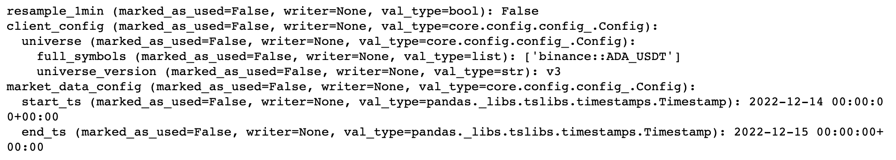
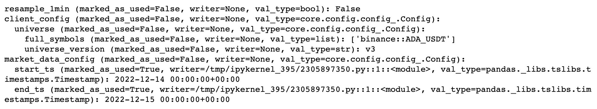
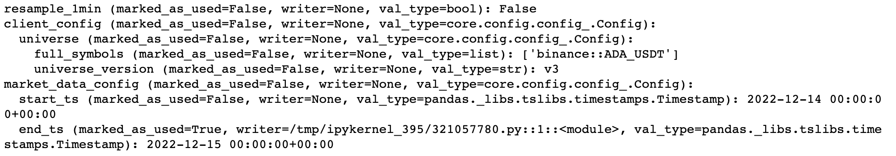

## Config

**Config**. A `Config` is a dictionary-like object that represents parameters
used to build and configure other objects (e.g., a DAG or a complete System).

Each config is a hierarchical structure which consists of **Subconfigs** and
**Leaves**.

**Subconfig** is a nested object which represents a Config inside another
config. A Subconfig of a Subconfig is a Subconfig of a Config, i.e. the relation
is transitive.

**Leaf** is any object inside a Config that is used to build another object that
is not in itself a Config.

Note that a dictionary or other mapping objects are not permitted inside a
Config: each dictionary-like object should be converted to a Config and become a
Subconfig.

### Config representation and properties

A Config can be represented as a dictionary or a string.

Example of a dictionary representation:

```python
config1={
    "resample_1min": False,
    "client_config": {
        "universe": {
            "full_symbols": ["binance::ADA_USDT"],
            "universe_version": "v3",
        },
    },
    "market_data_config": {"start_ts": start_ts, "end_ts": end_ts},
}
```

In the example above:

- "resample_1min" is a leaf of the `config1`
- "client_config" is a subconfig of `config1`
- "universe" is a subconfig of "client_config"
- "market_data" config is a subconfig of "config1"
- "start_ts" and "end_ts" are leaves of "market_data_config" and `config1`

Example of a string representation:

{width="6.854779090113736in"
height="1.2303444881889765in"}

- The same values are annotated with `marked_as_used`, `writer` and `val_type`
  - `marked_as_used` determines whether the object was used to construct another
    object
  - `writer` provides a stacktrace of the piece of code which marked the object
    as used
  - `val_type` is a type of the object

### Assigning and getting Config items

- Config object has its own implementations of `__setitem__` and `__getitem__`
- A new value can be set freely like in a python Dict object
- Overwriting the value is prohibited if the value has already been used

Since Config is used to guarantee that the construction of any objects is
reproducible, there are 2 methods to `get` the value.

- `get_and_mark_as_used` is utilized when a leaf of the config is used to
  construct another object

  - When the value is used inside a constructor

  - When the value is used as a parameter in a function

Note that when selecting a subconfig the subconfig itself is not marked as used,
but its leaves are. For this reason, the user should avoid marking subconfigs as
used and instead select leaves separately.

Example of marking the subconfig as used:

```python
_ = config.get_and_mark_as_used("market_data_config")
```

{width="6.5in" height="1.1944444444444444in"}

Example of marking the leaf as used:

```python
_ = config.get_and_mark_as_used(("market_data_config", "end_ts"))
```

{width="6.5in" height="1.1388888888888888in"}

- `__getitem__` is used to select items for uses which do not affect the
  construction of other objects:

  - Logging, debugging and printing


