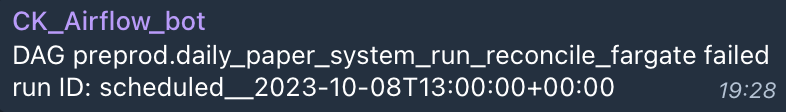
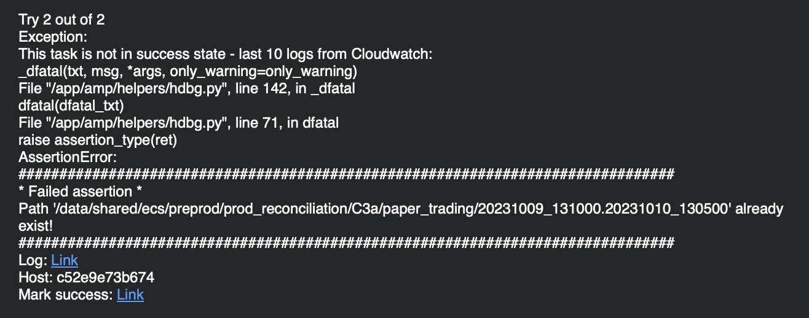

# Monitor System How to Guide

<!-- toc -->

- [AirFlow UI](#airflow-ui)
- [DAGs](#dags)
  * [General information](#general-information)
  * [Paper trading system DAG](#paper-trading-system-dag)
    + [Overview](#overview)
    + [How to identify a reason for a failure](#how-to-identify-a-reason-for-a-failure)
  * [Master PnL observer DAG](#master-pnl-observer-dag)
    + [Overview](#overview-1)
    + [How to identify a reason for a failure](#how-to-identify-a-reason-for-a-failure-1)
  * [Updating code executed by an Airflow DAG](#updating-code-executed-by-an-airflow-dag)
    + [Manual update](#manual-update)
    + [Automatic update](#automatic-update)

<!-- tocstop -->

# AirFlow UI

To access the UI, visit [AirFlow UI](http://172.30.2.114:8090/login/).
Credentials are stored in our 1Password account.

# DAGs

## General information

- Choose the DAG by clicking on its name, e.g.,
  `preprod.daily_paper_system_run_reconcile_fargate`:
  
- Then choose a run to get the run details. Red boxes represent the failed runs
  while green boxes represent the successful ones

  

- To download the raw container logs:

  - Left-click on the task square
  - Click on the `Logs` tab
  - Choose the correct attempt number (if there were multiple ones)
  - Click `Download` to obtain the log file

- Note: There is a shortcoming in Airflow - it may take several attempts to
  download log files of significant sizes, i.e. several hundreds of MB
  approximately

  

- To access a run command:

  - Left-click on the task square
  - Choose the `Details` tab
  - Click on `Rendered Template` as shown below:

    

- A notification is sent to Telegram chat and/or e-mail if a DAG fails

  - Telegram notification contains the name of the failing DAG, the time when it
    failed, and the development stage (e.g., "preprod"), e.g.,

    

  - E-mail notification contains log tail and link to a failed run (which does
    not work) Notification sender: `infra@crypto-kaizen.com`

    

  - E-mail notifications for failed trading DAGs are received by everyone in
    `trading_notifications@crypto-kaizen.com` mailing group

- To see all the failed runs for a given DAG:
  - Click on the red circle where it is shown how many runs are failed. See the
    very first point in this list
  - Clicking on a DAG's name

## Paper trading system DAG

### Overview

TODO(Grisha): in another doc we should explain the terms.

This DAG that triggers 2 workflows:

- Live paper trading system
- System reconciliation

DAG details:

- Name: `preprod.daily_paper_system_run_reconcile_fargate`
- File:
  [/im_v2/airflow/dags/preprod.daily_paper_system_run_reconcile_fargate.py](/im_v2/airflow/dags/preprod.daily_paper_system_run_reconcile_fargate.py)
- Link:
  http://172.30.2.114:8090/dags/preprod.daily_paper_system_run_reconcile_fargate/grid
  - Login credentials are stored in the company 1Password vault

### How to identify a reason for a failure

Ways to identify errors:

- The first run for a model is the system run, the second one for the
  reconciliation one
- To access logs and run the command, click on a run and see the already
  familiar interface mentioned above

  

- Download and check the AirFlow log that contains the error and its trace
- To access a log file using its path, extract the path from the rendered run
  command and open a file from the dev server directly
- If logs cannot be accessed, run the command to reproduce the error and get
  logs
- Here is a command for the run, log file path:
  
- Check notebook reconciliation logs in case AirFlow logs can't be accessed and
  the notebook is failed. There are two notebooks: fast and slow, therefore
  check logs for both of them. They are located at
  `.../reconciliation_notebook/fast/` and `.../reconciliation_notebook/slow/`.
  To reproduce an error, the notebook can also be re-run with the parameters of
  the failed run. Parameters could be extracted from a run command

## Master PnL observer DAG

### Overview

This DAG runs the `Master_PnL_real_time_observer` notebook.

DAG details:

- Name: `preprod.master_pnl_observer`
- File: `im_v2/airflow/dags/preprod.master_pnl_observer.py`
- Link: http://172.30.2.114:8090/tree?dag_id=preprod.master_pnl_observer
- Notebook:
  [Master_PnL_real_time_observer](/oms/notebooks/Master_PnL_real_time_observer.ipynb)

### How to identify a reason for a failure

Ways to identify errors:

- Download and check the AirFlow log that contains the error and its trace
- Check notebook reconciliation logs in case AirFlow logs can't be accessed and
  the notebook is failed. It is located at
  `.../pnl_realtime_observer_notebook/{run_time_as_str}`, e.g.,
  `.../pnl_realtime_observer_notebook/20230930_132501`, note that timestamps is
  in UTC. To reproduce an error, the notebook can also be re-run with the
  parameters of the failed run. Parameters could be extracted from a run command

## Updating code executed by an Airflow DAG

- When the DAG for paper trading is started, a docker container for each task is
  deployed. It has a snapshot of a particular state of the repo (from some time
  in the past). To run newer code an update to a so-called ECS task definition
  needs to be made. This update can be performed automatically or manually.

### Manual update

1. Checkout desired branches for orange and amp (if you are about to update a
   DAG in `preprod` stage, the general convention is to update from
   `master/master`, unless specifically decided upon otherwise by the team)
2. Run
   `> i docker_create_candidate_image --task-definition=”cmamp-system-preprod” --user-tag <your username>`

- User tag is not mandatory but it's a good practice to track who performed
  manual changes Upon successful completion the final log message should read:

```
12:42:31 - INFO  haws.py update_task_definition:174                     The image URL of `cmamp-system-reprod` task definition is updated to `623860924167.dkr.ecr.eu-north-1.amazonaws.com/cmamp:prod-juraj-1aeba1f1-62cd7f04e-wa0
```

### Automatic update

- TODO(Juraj): Add this section once #CmTask6430 is done.
