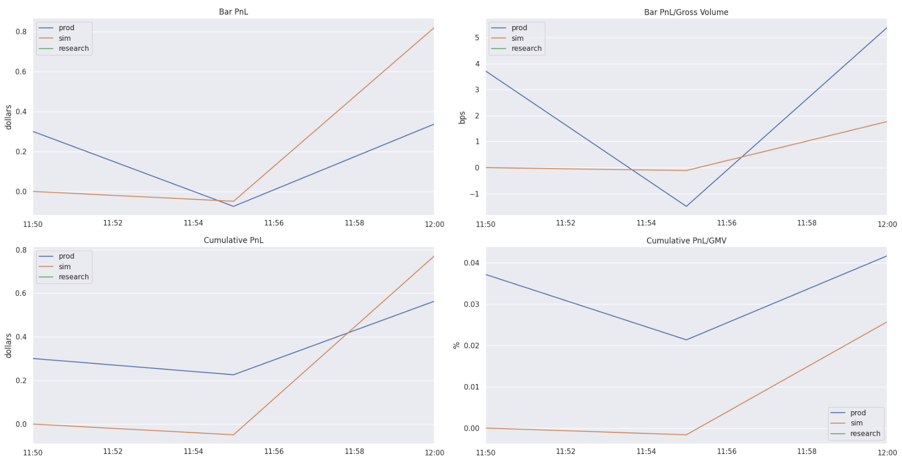

# System Reconciliation Explanation

<!-- toc -->

- [System reconciliation](#system-reconciliation)
- [Workflows](#workflows)
  * [Create directories](#create-directories)
  * [Copy production system results](#copy-production-system-results)
  * [Run production replayed time system simulation](#run-production-replayed-time-system-simulation)
  * [Run the Master notebook](#run-the-master-notebook)
    + [Fast](#fast)
    + [Slow](#slow)
- [AirFlow scheduling](#airflow-scheduling)
  * [DAGs](#dags)

<!-- tocstop -->

# System reconciliation

The high-level goal is to confirm that replayed time simulation reflects the
real-time system behavior correctly and makes the same predictions as if a model
was run in real-time mode at the specified time interval.

Reconciliation flow is run-able from the `orange` repo only.

The reconciliation process:

1. Run production system (done by a separate AirFlow task)
2. Create reconciliation target directories
3. Copy production data to a system reconciliation folder
4. Dump market data for replayed time simulation
5. Run replayed time simulation
6. Run the reconciliation notebook and publish it

Use [reconcile_run_all()](/oms/lib_tasks_reconcile.py#L970) to run the workflow
end-to-end.

# Workflows

## Create directories

Use [reconcile_create_dirs()](/oms/lib_tasks_reconcile.py#L150) to create dirs
before system reconciliation flow is started.

Parameters are used to build a path:

- `dst_root_dir` is a root dir to store system reconcilation results in
- `dag_builder_name` is a name of a DAG builder which was used to run the system
  reconciliation flow, e.g., `C3a`
- `run_mode` is a system run mode which was used to run the system
  reconciliation flow, e.g., `paper_trading`
- `start_timestamp_as_str` is a string representation of timestamp at which to
  start the system reconciliation run, e.g., `20230828_130500`
- `end_timestamp_as_str` is a string representation of timestamp at which to end
  the system reconciliation run

Directories layout is:
```
    {dst_root_dir}/
        {dag_builder_name}/
            {run_mode}/
                {start_timestamp_as_str}.{end_timestamp_as_str}/
                    prod/
                    simulation/
                    reconciliation_notebook/
                    ...
```

E.g.:
```
prod_reconciliation/
    C3a/
        paper_trading/
            20230828_130500.20230829_131000/
                prod/
                    simulation/
                reconciliation_notebook/
```

## Copy production system results

Use [reconcile_copy_prod_data()](/oms/lib_tasks_reconcile.py#L383) to copy the
output of the prod run to the result dir of the running flow, i.e. `.../prod`.

## Run production replayed time system simulation

Use [reconcile_run_sim()](/oms/lib_tasks_reconcile.py#L319) to run the
simulation between a given interval, i.e. the same as prod system was run at.

The interval type is `[start_timestamp, end_timestamp]`, e.g., if
`end_timestamp is 13:30` then the bar 13:30 is also computed.

The simulation results are saved in `.../simulation` directory.

## Run the Master notebook

Use [reconcile_run_notebook()](/oms/lib_tasks_reconcile.py#L540) to run the
system reconciliation notebook, publish it locally and copy the results to the
`.../reconciliation_notebook`. The invoke run notebook in 2 modes: fast and
slow. Publish a notebook for the latest 24-hour run to S3 if specified.

Parameters description specific to the invoke:

1. `notebook_run_mode` is a version of the notebook to run, "fast" or "slow"
2. `mark_as_last_24_hour_run` is a mark of the reconciliation run as latest so
   that the latest reconciliation notebook becomes available via a static link,
   e.g., `https://***/system_reconciliation/C3a.last_24hours.html`

### Fast

The
[Master_system_reconciliation_fast](/oms/notebooks/Master_system_reconciliation_fast.ipynb)
notebook contains checks that compare the prod system output vs that of the prod
simulation run ensuring basic sanity. Also computes DAG execution time and
memory consumption. Results are saved in `.../reconciliation_notebook/fast`.

Sections of the notebook:

1. DAG output self-consistency check

   Check that the DAG output dataframes for the last timestamp and the last node
   are equal at intersecting time intervals. A dataframe at `t` should be equal
   to a dataframe at `t-1` except for the row that corresponds to the timestamp
   `t`.

   Exclude history lookback period from comparison since each model has its own
   peculiarities and it is hard to make the check general. E.g., a model needs
   2\*\*7 rows to compute volatility, i.e. compare DAG output within
   `[dag_start_timestamp, dag_end_timestamp]` instead of
   `[dag_start_timestamp - history_lookback_period, dag_end_timestamp]`.

2. DAG (production vs simulation) comparison

   Compare DAG output differences for different experiments. Iterate over DAG
   outputs for different experiments and check that the maximum difference
   between the corresponding dataframes is below the threshold.

   Run for the last node and the last timestamp only as a sanity check.

3. DAG execution time

   Get execution time for all DAG nodes and bars in seconds.

   E.g.:
   ```
                             all_nodes  read_data   resample  ...  predict  process_forecasts
   bar_timestamp
   2023-02-21 02:55:00-05:00    31.279     11.483      2.030         2.862              2.766
   2023-02-21 03:00:00-05:00    31.296     11.573      2.046         2.880              2.770
   2023-02-21 03:05:00-05:00    32.315     12.397      2.023         2.903              2.808
   ```

   The time is an approximation of how long it takes to process a bar.
   Technically the time is a distance in seconds between wall clock time when an
   order is executed and a bar timestamp. The assumption is that order execution
   is the very last stage. The execution time should not exceed 1 minute.

4. DAG memory consumption

   Get results dataframe size for all nodes and timestamps in a folder where DAG
   outputs are stored.

   A result table contains dataframe size per node, per bar timestamp, e.g.,
   ```
                               read_data        resample
                               n_cols    n_rows    n_cols    n_rows
   bar_timestamp
   2023-04-13 10:35:00-04:00    250        5760    275        5760
   2023-04-13 10:40:00-04:00    250        5760    275        5760
   ```

5. Compute research portfolio and plot portfolio statistics

   Compute target positions, PnL, and portfolio statistics, e.g.:
   ```
                                pnl  gross_volume  net_volume        gmv     nmv
   2022-01-03 09:30:00-05:00  125.44         49863      -31.10  1000000.0     NaN
   2022-01-03 09:40:00-05:00  174.18        100215       24.68  1000000.0   12.47
   2022-01-03 09:50:00-05:00  -21.52        100041      -90.39  1000000.0  -55.06
   2022-01-03 10:00:00-05:00  -16.82         50202       99.19  1000000.0  167.08
   ```

   Plot those statistics of a portfolio bar metrics dataframe, e,g.:

   

   Compute standard `Portfolio` statistics in ratios, dollars and percentage for
   production, simulation and research experiments.

6. Portfolio comparison

   Compute pairwise max absolute portfolio statistics differences.

   E.g.:
   ```
                                       prod_research_diff     prod_sim_diff    research_sim_diff
   executed_trades_notional.pct_change          265.472144        265.472649            0.746004
   executed_trades_shares.pct_change            265.517241        265.517241            0.740741
   holdings_notional.pct_change                 275.000778        341.666667            20.830492
   holdings_shares.pct_change                   275.000000        341.666667            20.840336
   pnl.pct_change                               4187.740545       385.365854            522.196325
   ```

7. Target positions comparison

   Compare production target positions vs research ones by price, volatility,
   prediction, current and target holdings.

8. Compute execution quality

   Compute notional slippage and underfill costs. This is more accurate than
   slippage computed from `Portfolio` alone, because `target_position_df`
   provides baseline prices even when `holdings_shares` is zero (in which case
   we cannot compute the baseline price from `Portfolio`).

### Slow

The
[Master_system_reconciliation_slow](/oms/notebooks/Master_system_reconciliation_slow.ipynb)
notebook contains full versions of DAG output checks that compare the prod
system output vs that of the prod simulation run. Results are saved in
`.../reconciliation_notebook/slow`.

Sections of the notebook:

1. DAG output self-consistency check

   The same check as in the fast version but for all timestamps.

2. DAG (production vs simulation) comparison

   The same comparison but for all nodes and timestamps.

# AirFlow scheduling

Every available model has a scheduled DAG that runs the system reconciliation
flow end-to-end.

## DAGs

[Paper trading system DAG: `/docs/monitoring/ck.monitor_system.how_to_guide.md`](/docs/monitoring/ck.monitor_system.how_to_guide.md)
