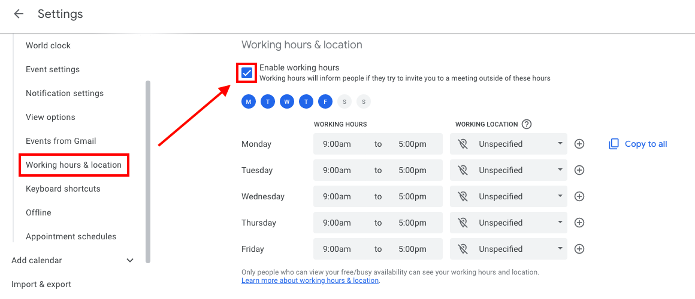

# Onboarding Checklist

<!-- toc -->

- [Onboarding process for a new team member](#onboarding-process-for-a-new-team-member)
  * [Meta](#meta)
    + [Make on-boarding automatic](#make-on-boarding-automatic)
    + [Be patient](#be-patient)
    + [Ask for confirmation](#ask-for-confirmation)
    + [Make on-boarding similar to our work routine](#make-on-boarding-similar-to-our-work-routine)
    + [Improve on-boarding process](#improve-on-boarding-process)
  * [People involved in the on-boarding](#people-involved-in-the-on-boarding)
  * [Before the start date](#before-the-start-date)
  * [The first day!](#the-first-day)
    + [Team member info](#team-member-info)
    + [NDA](#nda)
    + [Hubstaff](#hubstaff)
    + [IT setup](#it-setup)
- [Quick checklists to verify that everything works](#quick-checklists-to-verify-that-everything-works)
  * [The second day](#the-second-day)

<!-- tocstop -->

## Onboarding process for a new team member

### Meta

#### Make on-boarding automatic

- We want to make the onboarding process as automatic as possible

#### Be patient

- Let's use all the communication tools we have (screen sharing, Google Meet,
  phone, Telegram, email) to keep the process smooth and personal
- There are many (hidden) dependencies in the process, so something will
  inevitably go wrong
  - Let's all be patient with each other

#### Ask for confirmation

- Use checklists any time to make sure things get done
- Ask for confirmation of all the actions, e.g.,
  - "Does this and that work?"
  - "Did you receive the email?"
  - "Can you log in?"
- Make the new team member follow the instructions so that they can get familiar
  with the systems

#### Make on-boarding similar to our work routine

- Provide tools for interacting with the team
  - During the process the new teammate will ask questions and he / she should
    use the appropriate tools for each type of communication
    - Telegram: only for interactive communications
    - GitHub issues: for coding related things
    - Asana tasks: for business/high-level tasks
    - Email: everything else

- We want to nudge a new hire to operate through the tools we use during our
  daily work
  - That is why we asking him to create a first issue about his / her experience
    with the process
  - He / she should put his / her notes in the GH issue while proceeding during
    the onboarding process

#### Improve on-boarding process

- Review, improve, clarify process
  - We want to point the new team member to a document rather than explaining
    over and over the same things
  - Always keep this document updated, ask candidates to follow it carefully,
    and update it with a PR
  - We want to use each new team-member experience to improve our workflow
  - We want new team-members to improve the existing documentation using our
    standard GitHub process

- Have the new team member:
  - Open the first GitHub bug on the first day
  - Open the first PR by the second day

### People involved in the on-boarding

- Each task is performed by one of the persons involved in the on-boarding
  - Team leader (e.g., GP, Paul, Grisha, Samarth)
  - Team member (i.e., the person on-boarded)
  - IT (e.g., Shayan)
  - HR (e.g., Rose)

### Before the start date

- [ ] **Team leader**: talk to the teams about the new team member joining

- [ ] **Team leader**: Send some information to the new team member as a preview
  - E.g., some PDFs from amp/documentation/general

- [ ] **Team leader**: establish contact by Telegram or email with the new hire
      with a few words about the next steps

- [ ] **Team leader**: do a proper intro with an email to the team:
  - "Hi team, please join me in welcoming XYZ to the team"
  - Whom is going to report to
  - What is going to work on initially
  - LinkedIn link

### The first day!

#### Team member info

- [ ] **Team member**: send needed information to your team leader
  - Full name:
  - Aka:
  - Personal email:
  - Github user:
  - Telegram handle:
  - Laptop OS: Windows, Linux, or Mac
  - Physical location and timezone
  - User's SSH public key

- [ ] **Team leader**: update the
      [Team member info gdoc](https://docs.google.com/document/d/1gmcmLzaopYWEycx1AbBMupG9hJhcxPCxN85l23_fZGk)

#### NDA

- [ ] **HR**: send the team member an NDA to sign
      [NDAs Development Team](https://drive.google.com/drive/u/0/folders/1lcHmu14jz_bXscZPIatbbMTwfwA6e3eV)

- [ ] **Team member**: send back signed copy of the NDA
- [ ] **HR**: store in
      [signed directory](https://drive.google.com/drive/u/0/folders/17T2IdKOMAmyfU3hkmMo3Eo6qiejBFy3r)

#### Hubstaff

- [ ] **HR**: Update Hubstaff
  - Add user [here](https://app.hubstaff.com/organizations/398809/invites)
  - We respect our own privacy by not using any of the screenshot or typing
    things BS
  - We use it only to track the time automatically and as HR

- [ ] **Team member**:
  - Confirm access to Hubstaff
  - Read
    [Tools - Hubstaff](/docs/onboarding/all.track_time_with_hubstaff.how_to_guide.md)

#### IT setup

- [ ] **Team leader**: File an issue with this checklist
  - The title is "Onboarding {{Name}}"
  - Copy paste the following checklist

- [ ] **IT**: create account info bundle following
      [New team member addition - admin side tutorial](https://docs.google.com/document/d/1bNzdGvkmayV3IUwlmd-PHK40LNPTdrfdPBgF7-EYnxo/edit#heading=h.44tqkhn6slld)
  - TODO(Shayan): convert this into Markdown

- [ ] **IT**: send the following information to team member
  - Linux user: name + first letter of last name
  - Send the account info bundle

- [ ] **IT**: create company email `@kaizen-tech.io`
  - Exchange username and password

- [ ] **IT**: Add team member to mailing lists
  - `all@kaizen-tech.io` mailing lists
    - [https://groups.google.com/my-groups](https://groups.google.com/my-groups)
    - [https://admin.google.com/ac/groups/01qoc8b13iwic0z/info](https://admin.google.com/ac/groups/01qoc8b13iwic0z/info)

- [ ] **Team member**: Confirm receipt of emails to `@all`

- [ ] **Team member**: Confirm weekly all-hands meeting (usually on Monday
      morning)
  - This happens automatically through `all@kaizen-tech.io`
  - [https://calendar.google.com/calendar/u/0/r](https://calendar.google.com/calendar/u/0/r)

- [ ] **Team member**: Confirm access to the Google Drive documentation
  - This should be automatically granted as being in `all@kaizen-tech.io`
  - [Crypto-tech](https://drive.google.com/drive/u/1/folders/1zawE6IEBDpWLTbpK-03z75f5pu_T9Jba)
  - [Process](https://drive.google.com/drive/u/1/folders/1sJDqCjM1Q_nq8diyZDiWO8mVBQW5Wg_X)

- [ ] **Team member**: Join relevant Telegram groups by the links below
  - [KT - All](https://t.me/+CWjOUPSSmmsxMjhh)
  - [KT - Random happy channel](https://t.me/+1dR3-u9wwRg1Njlh)
  - [KT - Build notifications](https://t.me/+kMY3XdeJDeU5YzAy)
  - Channel specifics

- [ ] **Team member**: set up laptop to connect to the server following:
  - [VPN and dev server access setup](/docs/onboarding/ck.setup_vpn_and_dev_server_access.how_to_guide.md)

- [ ] **Team member**: configure your server environment following:
  - [Development - Set-up](https://github.com/cryptokaizen/cmamp/blob/master/docs/onboarding/ck.development_setup.how_to_guide.md)

- [ ] **Team member**: We have implemented a self-registration process for our
      Airflow on Kubernetes deployment. Please register and create your personal
      accounts as we will no longer be using the shared Airflow Admin user. Make
      sure to use the same username that you have on the dev servers.
  - [Airflow - Registration](http://internal-a97b7f81b909649218c285140e74f68a-1285736094.eu-north-1.elb.amazonaws.com:8080/register/form)
  - TODO(Shayan): Update this

- [ ] **IT**: Add team member to all GitHub repos:
  - [ ] [Kaizen-ai](https://github.com/kaizen-ai/kaizenflow)
  - [ ] [dev_tools](https://github.com/kaizen-ai/dev_tools)
  - [ ] [cmamp](https://github.com/cryptokaizen/cmamp/settings/access)
  - (On per-need basis) [ ]
    [orange](https://github.com/cryptokaizen/orange/settings/access)
  - (On per-need basis) [ ]
    [UMD_data605](https://github.com/gpsaggese/umd_data605/settings/access)

- [ ] **Team member**: Confirm access to GitHub repos

- [ ] **IT**: Add team member to ZenHub
  - After GH access is confirmed
  - [Invite](https://app.zenhub.com/workspaces/cm-615371012ed326001e044788/board?invite=true)

- [ ] **Team member**: Confirm access to ZenHub
      [here](https://app.zenhub.com/workspaces/cm-615371012ed326001e044788/board?invite=true)

- [ ] **IT**: Server set-up
  - We use the personal laptop as a thin client only to connect to the servers,
    where the work is typically carried out. We don't check out code on our
    laptop

- [ ] **IT**: Create the Linux user on all the servers
  - Create a keypair and share it with the new team member

- [ ] **Team member**: Check whether he / she can log in on one of the servers
  - TODO(Shayan): How?

- [ ] **IT**: Create AWS UI credentials
  - Only if necessary, for developer just starting, this is usually not needed
    ([CK login](https://console.aws.amazon.com/console/home?nc2=h_ct&src=header-signin&region=us-east-1))

- [ ] **Team member**: check access to AWS on the server
  - `> aws s3 --profile ck ls s3://cryptokaizen-unit-test/`
  - `> aws s3 --profile ck ls s3://cryptokaizen-data/`

- [ ] **Team member**: Customize Gmail, Telegram, and GitHub accounts
  - Please use the same photo in all accounts with a recognizable Gravatar
  - We use the picture to select Issues and conversations
  - Please use a picture where you look somehow professional (e.g., not a
    picture of you on the beach taking Tequila shots): the best picture is just
    one of your face, so we can virtually get to know each other

- [ ] **Team member**: Make sure you have access to the
      [vacation/OOTO calendar](https://calendar.google.com/calendar/u/0?cid=Y19kYWRlOGU0NTUwMzhiMDllMmUzNDk1OWM2YzFkYWNhYTVmMTAzYjdjZmNiODQ1MDkzOWZhMTBkZDY2NWI3ZjJhQGdyb3VwLmNhbGVuZGFyLmdvb2dsZS5jb20).
  - The link should be accessible and you should see the calendar in the list of
    calendars at calendar.google.com (when accessing via your corporate email)

- [ ] **Team member**: Add your usual working hours by going to
      calendar.google.com (using your corporate email), heading to the settings
      section by clicking the gear icon on top right
  - 

- [ ] **Team member**: Confirm you can access the anonymous form to ask anything
      [https://forms.gle/KMQgobqbyxhoTR9n6](https://forms.gle/KMQgobqbyxhoTR9n6)

- [ ] **Team member**: File first Issue on GitHub
  - It should be called "Document review while onboarding $TEAM_MEMBER"
  - Track what is not clear in the onboarding process / documentation and what
    should / could be improved

## Quick checklists to verify that everything works

- **Team member**
  - [ ] VPN to dev server
  - [ ] ssh into the dev server
  - [ ] Check access to AWS on the server (refer to instructions above)
  - [ ] Clone the code from Git
  - [ ] Connect to server with VisualStudio Code or PyCharm
    - There is an extension for VSCode, which allows to develop remotely
      [Remote - SSH](https://marketplace.visualstudio.com/items?itemName=ms-vscode-remote.remote-ssh)
    - Follow this instruction on how to set it up in your
      [Visual Studio Code](/docs/work_tools/all.visual_studio_code.how_to_guide.md)
  - [ ] Run the unit tests and make sure they all pass
  - [ ] Run a docker container
    ```
    > i docker_bash
    ```
  - [ ] Run a jupyter notebook
    - Follow this
      [instruction](/docs/work_tools/all.visual_studio_code.how_to_guide.md#how-to-access-the-jupyter-server-running-on-the-remote-server-through-your-local-machine)
      on how to access the Jupyter server running on the remote server through
      your local machine
    ```
    > i docker_jupyter
    ```

### The second day

- [ ] **Team member**: carefully study all the documents in:
      [docs/onboarding](https://github.com/cryptokaizen/cmamp/tree/master/docs/onboarding)
  - Read it carefully one by one
  - Ask questions
  - Memorize / internalize all the information
  - Take notes
  - Mark the reading as done
  - Use your first Issue to document all the improvements to the documentation

- [ ] **Team member**: Do PRs following the process to improve documentation
  - Do not be shy

- [ ] **Team member**: exercise all the important parts of the systems
  - [ ] Create a GitHub issue
  - [ ] Get familiar with
        [ZenHub](https://app.zenhub.com/workspaces/cm-615371012ed326001e044788/board)
        [doc](https://github.com/cryptokaizen/cmamp/blob/master/docs/work_organization/all.use_github_and_zenhub.how_to_guide.md)
  - Check out the code on server
  - Run all regressions on server
  - Create a branch
  - Run the linter.py on server
  - Do a PR
