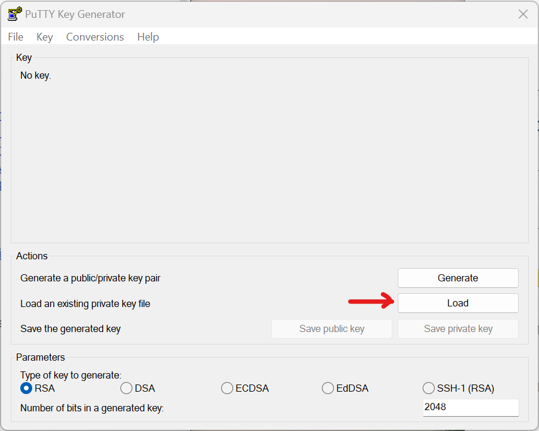
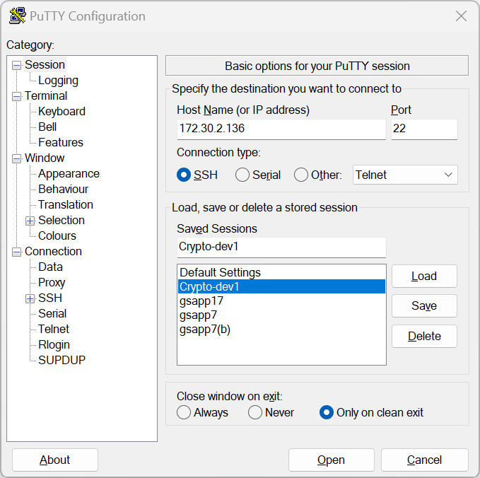
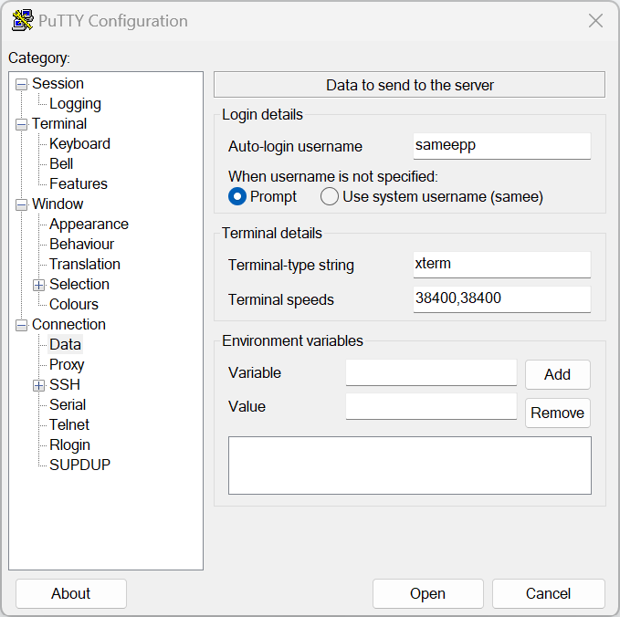
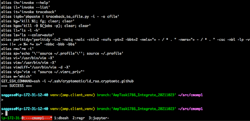
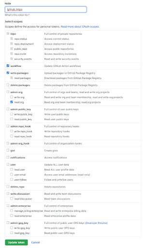

# Development - Set-up

<!-- toc -->

- [Configure bash for your laptop](#configure-bash-for-your-laptop)
  * [Linux and MacOS](#linux-and-macos)
  * [Windows](#windows)
- [Configure .ssh for your laptop](#configure-ssh-for-your-laptop)
- [Configure .ssh for the server](#configure-ssh-for-the-server)
- [Configure bash for the server (advanced)](#configure-bash-for-the-server-advanced)
  * [Configure bash](#configure-bash)
    + [Linux and MacOS](#linux-and-macos-1)
    + [Windows](#windows-1)
  * [Configure tmux (optional)](#configure-tmux-optional)
  * [Spruce up your environment](#spruce-up-your-environment)
  * [Set up AWS](#set-up-aws)
  * [Set up Telegram token](#set-up-telegram-token)
  * [Clone the GitHub repo](#clone-the-github-repo)
  * [Create a tmux session](#create-a-tmux-session)
  * [Configure `gh`](#configure-gh)
    + [Fix permissions](#fix-permissions)
  * [Begin working](#begin-working)

<!-- tocstop -->

# Configure bash for your laptop

- Make Sure you are connected to the VPN before proceeding

## Linux and MacOS

- Locally on your laptop tweak your `.bashrc` to add your server credentials:
  ```
  > vi .bashrc

  # Append at the end.
  export CM_SSH_KEY=~/.ssh/cryptomatic.pem
  # E.g., export CM_SSH_KEY=~/.ssh/ck/saggese-cryptomatic.pem

  # XYZ for your remote Linux username, e.g., saggese, danya, maxs
  export CM_USER=saggese
  export CM_IP=172.30.2.136
  ```

- For MacOS you might want to tweak `.bash_profile`. After tweaking your bashrc,
  you need to restart the shell session with `exit; bash` or do `source ~/.bash`

## Windows

- Download and install `putty.exe`, `pscp.exe`, and `puttygen.exe` from the
  [PuTTY Download Page](https://www.chiark.greenend.org.uk/~sgtatham/putty/latest.html)

- Open `PuTTYgen` and click on the load button

  

- Locate the private SSH key that you have downloaded

- Click the Save private key button to create the ppk file

  

- Open `PuTTY`, under Session, enter your Hostname i.e. our server IP:
  172.30.2.136

  

- Under Connection, click Data and Enter your username as the Auto-login
  username

  

- Under SSH, choose 2 from the Preferred SSH Protocol Version

  

- Under SSH -> Auth -> Credentials, you will need to specify where your private
  key can be found

- Remember, this is the ppk file you generated using `PuTTygen` earlier

- Click the Browse to locate the file on your computer

  

- Under Sessions, type a name (such as "my site") in the Saved Sessions box and
  then click Save. Hit Open to Run the session

# Configure .ssh for your laptop

- To connect to the server use your previously generated private key, i.e. not
  the public key that IT sends you back.
- Move public-private key pair to `~/.ssh` and set `pem` as private key
  extension, see
  [more about `pem` extension](https://fileinfo.com/extension/pem). E.g.,
  `~/.ssh/cryptomatic.pem` (private key) that you will use to connect.
- Set the permissions for your private key
  ```
  laptop> chmod 600 ~/.ssh/cryptomatic.pem
  ```
- Now you can connect to server through the VPN (see
  [VPN and dev server access setup](https://docs.google.com/document/d/1C4Ghrb9p3HjwkWuRCzCDtVV36mk-WR9OzneS6nTPE6Q/edit#))
  ```
  laptop> ssh -i $CM_SSH_KEY $CM_USER@$CM_IP

  E.g.,
  laptop> ssh -i ~/.ssh/cryptomatic.pem $CM_USER@$CM_IP
  ```

- You can also pass user and IP manually, but adding those exports above saves
  time in the long run.

# Configure .ssh for the server

- `ssh` into the server with
  ```
  laptop> ssh -i $CM_SSH_KEY $CM_USER@$CM_IP
  ```
- Your home directory should be under `/data`
  ```
  server> echo $HOME
  /data/saggese
  ```
- The directory on the server should look like:
  ```
  server> ls -l ~/.ssh/
  total 16
  -rw------- 1 saggese saggese  382 Nov 19 18:15 authorized_keys
  -rw------- 1 saggese saggese  381 Nov 25 17:41 cryptomatic.pem.pub
  -rw-r--r-- 1 saggese saggese  666 Nov 25 17:43 known_hosts
  ```
- (Optional step) If that's not the case, talk to IT to copy the public ssh key
  to the server from your laptop.

# Configure bash for the server (advanced)

## Configure bash

### Linux and MacOS

- Now you want to configure the server `~/.bash` and the environment to your
  preference.
- E.g., you might want to copy `.vimrc`, pimp `.bashrc`
  ```
  ## Copy your Github keys to the dev server
  laptop> export CM_SSH_KEY=~/.ssh/cryptomatic/saggese-cryptomatic.pem
  laptop> export CM_USER=saggese
  laptop> export CM_IP=172.30.2.136

  laptop> scp -i $CM_SSH_KEY ~/.ssh/id_rsa $CM_USER@$CM_IP:/data/$CM_USER/.ssh/id_rsa.gpsaggese.github

  laptop> scp -i ~/.ssh/cryptomatic/saggese-cryptomatic.pem ~/.ssh/id_rsa.pub saggese@172.30.2.136:/data/saggese/.ssh/id_rsa.gpsaggese.github.pub

  laptop> scp -i ~/.ssh/cryptomatic/saggese-cryptomatic.pem ~/.ssh/cryptomatic/id_rsa.cryptomtc.github saggese@172.30.2.136:/data/saggese/.ssh/id_rsa.cryptomtc.github

  laptop> scp -i ~/.ssh/cryptomatic/saggese-cryptomatic.pem ~/.ssh/cryptomatic/id_rsa.cryptomtc.github.pub saggese@172.30.2.136:/data/saggese/.ssh/id_rsa.cryptomtc.github.pub
  ```

- Tweak permissions on the server
  ```
  server> ls -l ~/.ssh
  total 32
  -rw------- 1 saggese saggese  382 Nov 19 18:15 authorized_keys
  -r-------- 1 saggese saggese 1679 Nov 25 17:40 cryptomatic.pem
  -r-------- 1 saggese saggese  381 Nov 25 17:41 cryptomatic.pem.pub
  -r-------- 1 saggese saggese 3243 Nov 30 17:54 id_rsa.cryptomtc.github
  -r-------- 1 saggese saggese  732 Nov 30 17:54 id_rsa.cryptomtc.github.pub
  -r-------- 1 saggese saggese 1675 Nov 30 17:48 id_rsa.gpsaggese.github
  -r-------- 1 saggese saggese  389 Nov 30 17:50 id_rsa.gpsaggese.github.pub
  -rw-r--r-- 1 saggese saggese  888 Nov 30 17:43 known_hosts
  ```

### Windows

- Use the above steps from Configure bash of Linux and MacOS. Just use scp in
  the following way:
```
laptop> scp -i $CM_SSH_KEY ~/.ssh/id_rsa $CM_USER@$CM_IP:/data/$CM_USER/.ssh/id_rsa.gpsaggese.github

laptop> pscp -scp -i $PPK_KEY_GENERATED_USING_PUTTYGEN ~/.ssh/id_rsa $CM_USER@$CM_IP:/data/$CM_USER/.ssh/id_rsa.gpsaggese.github
```

## Configure tmux (optional)

- Create this file under `~/.tmux.conf` on the server. The prefix is `CTRL-g`.
  Copy-paste the code below into the `.tmux.conf` and save the changes.
  ```
  # Use C-x.
  #set -g prefix C-x
  set -g prefix C-g
  unbind-key C-b
  bind-key C-g send-prefix

  # Set status bar.
  set -g status-bg black
  set -g status-fg white
  set -g status-left '#[fg=green]#H'

  # Use vi shortcuts.
  set-window-option -g mode-keys vi

  # set -g status-right "#[fg=blue]#S #I:#P #[fg=yellow]:: %d %b %Y #[fg=green]:: %l:%M %p :: #(date -u | awk '{print $4}')::"

  # 100k lines
  set-option -g history-limit 100000

  # Highlight active window.
  # set-window-option -g window-status-current-bg red
  set -g window-status-current-style bg=red

  # Try to speed up the processing of shortcuts.
  set-option -g repeat-time 0
  set -sg escape-time 0

  # To get notification when a command is done.
  # TODO: This seems to give problems with my mac and being removed.
  # set -g visual-content on
  # setw -g monitor-content CMD_DONE

  # For Mac only.
  # Workaround to 'LSOpenURLsWithRole() failed with error -10810'.
  # set -g default-command "reattach-to-user-namespace -l /bin/bash"
  # set-option -g default-command "which reattach-to-user-namespace > /dev/null && #reattach-to-user-namespace -l $SHELL || $SHELL"
  ```

## Spruce up your environment

- If you have multiple Git users, you can decide which one to use
  ```
  # Test github connection
  > ssh -i ~/.ssh/id_rsa.gpsaggese.github -T git@github.com
  > GIT_SSH_COMMAND="ssh -i ~/.ssh/id_rsa.gpsaggese.github" git clone git@github.com:gpsaggese/dotted_files.git

  > GIT_SSH_COMMAND="ssh -i ~/.ssh/id_rsa.gpsaggese.github" git clone --recurse git@github.com:alphamatic/amp.git amp1
  ```

## Set up AWS

- We use AWS profile CALLED: `ck`.
  - It is used to access S3 bucket data
  - API Credentials are included in the `zip` archive sent via e-mail during
    on-boarding process
  - Ask the admin if you have not obtained the credentials
- Create dir with proper permissions:
  ```
  > mkdir ~/.aws; chmod 700 ~/.aws
  ```
- Put the following into `~/.aws/config`:
  ```
  [profile ck]
  region = eu-north-1
  ```

- Put the following into `~/.aws/credentials`:
  ```
  [ck]
  aws_access_key_id=***
  aws_secret_access_key=***
  aws_s3_bucket=cryptokaizen-data
  ```

- Note that AWS uses `[profile XYZ]` vs `[XYZ]` in the two types of files
  (config and credentials), (yes, this is insane).
- Change permissions to ready-only and only for your user since it contains
  credentials:
  ```
  > chmod 400 ~/.aws/*
  ```
- You should get to permissions that look like:
  ```
  saggese@ip-172-30-2-136:~$ ls -ld ~/.aws
  drwx------ 2 saggese saggese 4096 Dec  3 17:09 /data/saggese/.aws

  saggese@ip-172-30-2-136:~$ ls -l ~/.aws
  total 8
  -r-------- 1 saggese saggese  32 Dec  3 17:08 config
  -r-------- 1 saggese saggese 403 Dec  3 17:09 credentials
  ```

- Test the access to the S3 bucket
  - For the ck:
    ```
    aws s3 ls s3://cryptokaizen-data --profile ck
    >

                               PRE daily_staged/
                               PRE db_archive/
                               PRE historical/
                               PRE reorg/
                               PRE unit_test/
    ```

- Test accessing AWS ECR to pull containers:
  ```
  > eval $(aws ecr get-login --profile am --no-include-email --region us-east-1)
  WARNING! Using --password via the CLI is insecure. Use --password-stdin.
  WARNING! Your password will be stored unencrypted in /data/saggese/.docker/config.json.
  Configure a credential helper to remove this warning. See
  https://docs.docker.com/engine/reference/commandline/login/#credentials-store

  Login Succeeded
  ```

## Set up Telegram token

- To run certain tests, you should define inside `.bashrc` an
  `AM_TELEGRAM_TOKEN` variable, which is the same for all team members. Add this
  line at the end:
  ```
  export AM_TELEGRAM_TOKEN="885497142:...Pn1v5do"
  ```
- Reconnect to the server to apply changes

## Clone the GitHub repo

- For Github you can use your key otherwise you can generate an ssh key for
  github
- Note:
  - You can use any SSH key, even a “personal” one that one uses for his/her
    projects
  - In practice, the logic is “user authenticates with GH, we tell GH to grant
    access to a private repo, GH is happy"
- Typically you can save the GitHub authentication in `~/.ssh/id_rsa` and
  `~/.ssh/id_rsa.pub`
- Note: make sure permissions are read-only, otherwise change permissions, e.g.,
  `chmod 400 ~/.ssh/id_ed25519`
- In order to use our automation scripts, the path to local copy of the repos
  needs look like this `${HOME}/src/{REPO_NAME}{IDX}`, e.g.,
  `/data/saggese/src/cmamp1`.
- Clone the repo with:
  ```
  > mkdir ~/src
  > cd ~/src
  > git clone git@github.com:cryptokaizen/cmamp.git ~/src/cmamp1
  ```
- You can have multiple cloned repos like `cmamp2`, `cmamp3` and so on to work
  on unrelated changes at the same time
- Build the thin environment we use to call invoke and Docker:
  ```
  > cd ~/src/cmamp1
  > source dev_scripts/client_setup/build.sh
  …
  # docker=Docker version 20.10.10, build b485636
  # Configure your client with:
  > source dev_scripts/setenv_amp.sh
  ```
- This script to build the environment is run rarely when the dependencies are
  changed.
- This environment is shared by multiple repos (e.g., all the `cmamp` and
  `dev_tools`), so once you build the environment you can use it for all the
  repos and for multiple git clients
- The same setup applies to any set-up including `amp` (e.g., `orange`,
  `dev_tools`), one needs to recursively clone into the `amp` folder (see
  `git --clone ...`) then follow the same procedure by sourcing the script from
  top of the supermodule: `source amp/dev_scripts/client_setup/build.sh`

## Create a tmux session

- Create a link from the script in the repo creating a tmux session to your
  home:
  ```
  > ln -sf $(pwd)/dev_scripts/go_amp.sh ~/go_amp.sh

  > ls -l ~/go_amp.sh
  lrwxrwxrwx 1 saggese saggese 46 Dec  3 18:26 /data/saggese/go_amp.sh ->     /data/saggese/src/cmamp1/dev_scripts/go_amp.sh
  ```

- To create the standard tmux view on a cloned environment run
  `~/go_amp.sh cmamp 1`.

  

- You need to create the tmux environment once per Git client and then you can
  re-connect with:
  ```
  # Check the available environments.
  > tmux ls
  cmamp1: 4 windows (created Fri Dec  3 18:27:09 2021) (attached)

  # Attach an environment.
  > tmux attach -t cmamp1
  ```

- You can re-run `~/go_amp.sh` when your tmux gets corrupted and you want to
  restart Of course this doesn't impact the underlying Git repo

## Configure `gh`

- We enjoy using GitHub CLI
  - Create a Personal Access Token (classic) on GitHub following the official
    guide
  - Put the following permissions:

    

- Create personal access token (aka PAT) as done above and save it to
  `~/github_pat.txt`
- You can login with a single command
  ```
  > cat ~/github_pat.txt | gh auth login --hostname github.com --with-token
  ```
- Sometimes you need to create the file to make `gh` happy
  ```
  > touch ~/.config/gh/config.yml
  ```
- Check the current authentication status of `gh`:
  ```
  > gh auth status
  github.com
    ✓ Logged in to github.com as gpsaggese (/Users/saggese/.config/gh/hosts.yml)
    ✓ Git operations for github.com configured to use ssh protocol.
    ✓ Token: *******************
  ```

### Fix permissions

- Sometimes for whatever reason a file is created by `root` which prevents
  executing certain commands being a non-root user w/o sudo privileges
- To change permissions we need sudo privileges that we do not have outside a
  Docker container but we have inside a Docker container
  ```
  (amp.client_venv) dan@ip-172-31-12-40:~/src/cmamp1$ gh auth login
  ? What account do you want to log into? GitHub.com
  ? What is your preferred protocol for Git operations? SSH
  ? Upload your SSH public key to your GitHub account? Skip
  ? How would you like to authenticate GitHub CLI? Paste an authentication token
  Tip: you can generate a Personal Access Token here https://github.com/settings/tokens
  The minimum required scopes are 'repo', 'read:org'.
  ? Paste your authentication token: ****************************************
  - gh config set -h github.com git_protocol ssh
  ✓ Configured git protocol
  open /data/dan/.config/gh/config.yml: permission denied
  (amp.client_venv) dan@ip-172-31-12-40:~/src/cmamp1$ cat ~/github_pat.txt | gh auth login --hostname github.com --with-token
  open /data/dan/.config/gh/config.yml: permission denied
  ```
  1.  Get inside the docker container using `i docker_bash`
  2.  Change dir using `cd ~/.config`
  3.  Run `sudo chown -R username:username gh` where username is your username
      inside the container, e.g. user_1022:user_1022
  4.  Run `ls -l gh | grep root` if nothing, it’s a good sign
  5.  Close container printing `exit` or ctrl+D
  6.  Log in again using `gh auth login` and follow the instructions above
  7.  Check your auth status using `gh auth status`

## Begin working

- Conceptually the steps are:
  - Clone a Git repo in ~/src/...
    - You can have as many Git clients as you want (`cmamp1`, `cmamp2`, …,
      `dev_tools1`, …)
  - Build "thin" environment:
    - Needs to be done only once for all your clients
      ```
      > ~/src/cmamp1/dev_scripts/client_setup/build.sh
      ```
  - Start a tmux session
    - You should have one session per Git client, e.g., for the Git client
      `~/src/cmamp1`
      ```
      > ~/go_amp.sh cmamp 1
      ```
  - Activate environment:
    - This is done by `~/go_amp.sh` automatically in all the tmux panes
    - You change `dev_scripts/setenv_amp.sh` you might need to run
      ```
      > source dev_scripts/setenv_amp.sh
      ```
  - Pull cmamp docker images:
    - This image is shared all your Git clients (actually all users on the
      server use the same image)
      ```
      > i docker_pull
      Digest: sha256:308d52a0354845d1a2aa2014282efa66864329e7e22bf15dad518c219b5d5a3d
      Status: Downloaded newer image for 665840871993.dkr.ecr.us-east-1.amazonaws.com/cmamp:dev
      665840871993.dkr.ecr.us-east-1.amazonaws.com/cmamp:dev
      ```
  - Check docker_bash:
    ```
    > i docker_bash
    INFO: > cmd='/data/saggese/src/venv/dev_tools.client_venv/bin/invoke docker_bash'
    ## docker_bash:
    IMAGE=665840871993.dkr.ecr.us-east-1.amazonaws.com/dev_tools:dev \
            docker-compose \
            --file /data/saggese/src/dev_tools1/devops/compose/docker-compose.yml \
            --env-file devops/env/default.env \
            run \
            --rm \
            --user $(id -u):$(id -g) \
            app \
            bash
        user_1005@9e4373e01213:/app$
    ```
    - Exit the container with `exit` and get back to the server prompt
  - Run regressions:
    ```
    > i run_fast_tests
    ```
    - If you can run all the regressions without errors, then you are totally
      set up to start developing
