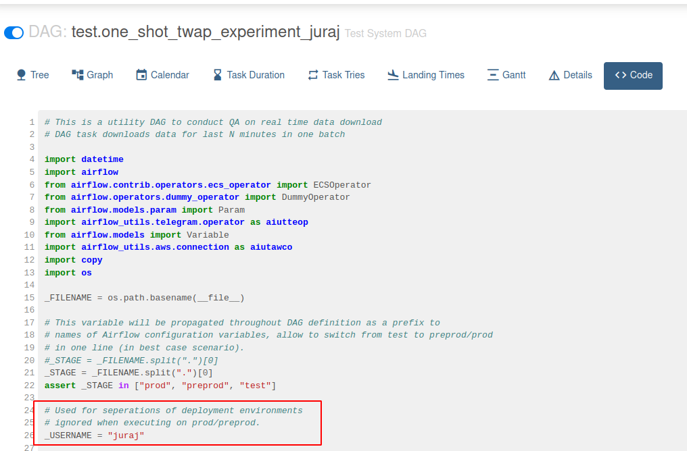
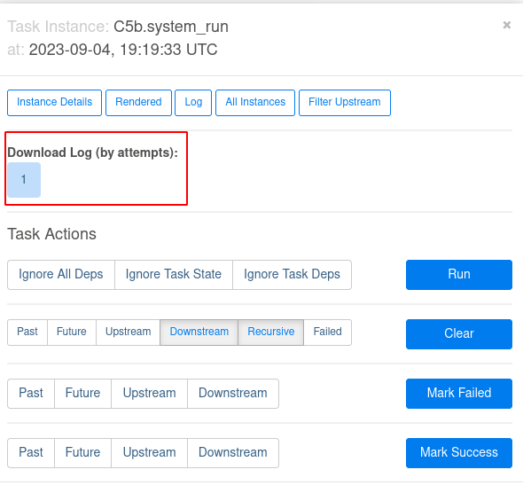
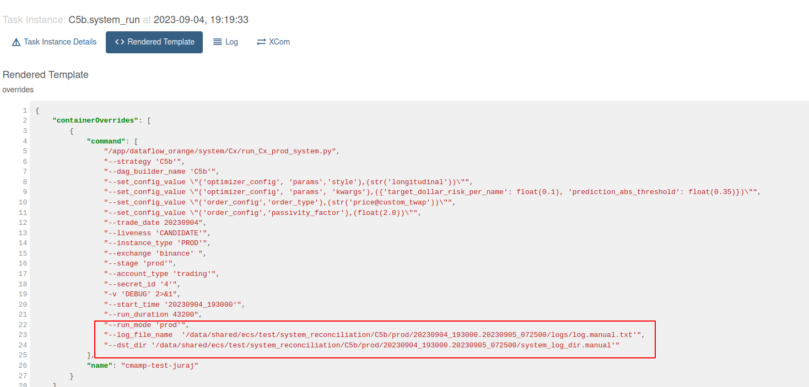

<!--ts-->

- [General flow](#general-flow)
- [General Tips](#general-tips)
- [Broker only experiment](#broker-only-experiment)
- [Full system experiment](#full-system-experiment)
- [Run all experiment notebooks command example](#run-all-experiment-notebooks-command-example)
- [Logging the results](#logging-the-results)

<!--te-->

# General flow

1.  http://172.30.2.44:8090 - visit preprod airflow

    - Requires active VPN connection

2.  Visit corresponding DAG: left click on the "play" button and choose run
    with config

    

    Not all parameters are exposed via config at the moment, some need to
    changed in the DAG definition at `/data/shared/airflow_preprod`

3.  The DAG definition + name points you to the ECS task definition used for the
    execution of its task

    

    E.g. in the above example test.one_shot_twap_experiment_juraj uses ECS task
    definition `cmamp-test-juraj`

    To run code from a specific branch, use:

            > i docker_create_candidate_image --task-definition
            "cmamp-test-juraj" --user-tag "&lt;&lt;your name>>"

    - More on releasing candidate image, see
      [Design - Software Components](https://docs.google.com/document/d/1C-22QF_gOe1k4HgyD6E6iOO_F_FxKKECd4MXaJEuTxo/edit#heading=h.w09szgua0lmq).

    The DAG task for running notebooks after an experiment is still in beta
    (less than 100% run success rate)

4.  After successfully running an experiment log the results see
    [Logging the results](#logging-the-results)

# General Tips

- For Airflow DAG tasks which run for multiple hours don’t try to open the log
  file in the browser - the UI won’t handle it well, rather use the download
  button:

  - For a corresponding DAG run, click on the task square you want to check the
    log for
    - 
    - A pop-up opens, there is usually an automatic retry for DAGs implemented
      so there can be multiple log attempts:
      - 
  - A gotcha is that for really long runs, Airflow has trouble serving the
    entire log file - 12 hour runs now amount to ~900MB log file, in case you
    need such log file contact Juraj

- The log file for full system runs is generated through multiple steps, to
  easily access for logging purposes visit, the rendered template section:
  - 
  - 

# Broker only experiment

- Use DAG [class="underline">test.one_shot_twap_experiment_juraj](http://172.30.2.44:8090/tree?dag_id=test.one_shot_twap_experiment_juraj)
  (or copy the definition to new one with your name)

- Example command:

  ```

  oms/broker/ccxt/scripts/run_ccxt_broker.py \

  --log_dir tmp_log_dir \

  --max_parent_order_notional 60 \

  --randomize_orders \

  --parent_order_duration_in_min 5 \

  --num_bars 3 \

  --num_parent_orders_per_bar 5 \

  --secret_id 4 \

  --clean_up_before_run \

  --clean_up_after_run \

  --close_positions_using_twap \

  --passivity_factor 0.55 \

  --child_order_execution_freq 1T \

  --include_btc_usdt True \

  --volatility_multiple 0.75 0.7 0.6 0.8 1.0 \

  -v DEBUG
  ```

- More on running the one-shot experiment in
  `docs/trade_execution/ck.run_broker_only_experiment.how_to_guide.md`

# Full system experiment

- Use DAG [test.daily_live_system_run_reconcile_fargate2_juraj](http://172.30.2.44:8090/tree?dag_id=test.daily_live_system_run_reconcile_fargate2_juraj)
  (or copy the definition to new one with your name)

- Example command:
  ```
  > /app/dataflow_orange/system/Cx/run_Cx_prod_system.py --strategy 'C5b'
  --dag_builder_name 'C5b' --set_config_value
  "('params','style'),(str('longitudinal'))" --set_config_value
  "('params','kwargs'),({'target_dollar_risk_per_name': float(0.1)})"
  --trade_date 20230822 --liveness 'CANDIDATE' --instance_type 'PROD'
  --exchange 'binance' --stage 'preprod' --account_type 'trading' --secret_id
  '4' -v 'DEBUG' 2>&1 --start_time '20230822_142000' --run_duration 7200
  --run_mode 'prod' --log_file_name
  '/data/shared/ecs/test/system_reconciliation/C5b/prod/20230822_142000.20230822_161500/logs/log.manual.txt'
  --dst_dir
  '/data/shared/ecs/test/system_reconciliation/C5b/prod/20230822_142000.20230822_161500/system_log_dir.manual
  ```
- For amp submodule we are currently constrained to using branch
  `CmTask4841_run_c5b_in_production` because of missing functionality to
  override config for all parameters
  - `passivity_factor` can be altered by only updating the DAG definition
  - `prediction_abs_threshold, and `target_dollar_risk_per_name`need to be altered both in the code and in the DAG, specifically in files: `lib_task_reconcile.py` and `reconciliation.py`
    - Search for comment `# Experiment 1` in the repo

# Run all experiment notebooks command example

```
> invoke run_notebooks --system-log-dir
'/data/shared/ecs/test/system_reconciliation/C5b/prod/20230904_193000.20230905_072500/system_log_dir.manual/process_forecasts'
--base-dst-dir 's3://cryptokaizen-html/notebooks'
--prod-reconciliation-dir '/data/shared/ecs/test/prod_reconciliation/'
--signature-recon 'C5b.20230904_193000.20230905_072500.prod.manual
```

(For broker only runs omit the `prod-reconciliation-dir` and `signature-recon`
argo)

# Logging the results

- After the run is finished (no matter if it is successful or not), update the
  [Algo Full System Execution Log](https://docs.google.com/document/d/1zG-yABlCcj1au9BQl2PE8axVWEicF-g_q4QzBiFHYlU/edit#heading=h.qbx719xgn538)
- Download the DAG logs by going to DAG -> Graph -> {model_name}.system_run ->
  Log:
  
- Be advised that in cases of longer runs (>8 hours) the logs can get very
  heavy.

- In the **short description**, describe the parameters you used to run the
  command.
- In **Start/end time (UTC)** use the log timestamp of the first message like:

```python
# wall_clock_time=2023-10-05 07:40:00.078250-04:00: done waiting
```

this represents the actual start of the trade execution.

- In **Pre-run/post-run balance (USDT)**, provide data for the balance from the
  logs. The pre-run and post-run balance in USDT can be found in the Log output
  of `{model_name}.flatten_account1` and `{model_name}.flatten_account2` in the
  Graph view of the DAG.

Example of the output:

```python
{'BNB': 0.0,
 'BTC': 0.0,
 'BUSD': 0.0,
 'ETH': 0.0,
 'TUSD': 0.0,
 'USDC': 0.0,
 'USDP': 0.0,
 'USDT': 6090.5617341,
 'XRP': 0.0}
```

- If the **notebooks** are published successfuly via
  `{model_name}.run_notebooks`, use the web addresses provided in the logs to
  update the corresponding subheaders in the Execution Log.
- If the notebooks were not published successfully:

  - Run the following notebooks manually, after updating the `system_log_dir`
    value to the log directory used by the DAG:
    - `oms/notebooks/Master_broker_debugging.ipynb`
    - `oms/notebooks/Master_execution_analysis.ipynb`
    - `oms/notebooks/Master_bid_ask_execution_analysis.ipynb`
  - Publish the notebooks manually with the following command (from inside
    docker):
    `> dev_scripts/notebooks/publish_notebook.py --action publish --file {notebook_file_name}`

- In the **Notes** section, provide either caveats for the experiment (e.g. a
  new price computation method was used) and / or any problems with the quality
  of the execution, e.g. unexpected notebook output, notebook errors, crashes
  during execution, etc.
