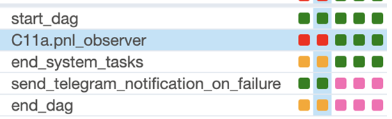
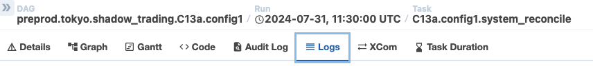
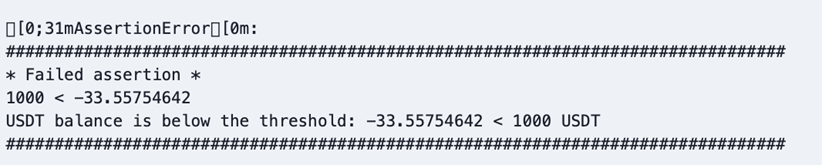

<!-- toc -->

- [Scheduled trading monitoring](#scheduled-trading-monitoring)
  * [C11a.config1](#c11aconfig1)
  * [C11a.config3](#c11aconfig3)
  * [Alerts' conditions](#alerts-conditions)
  * [TG notifications](#tg-notifications)
    + [Scheduled run notifications](#scheduled-run-notifications)
    + [Monitoring notebook notifications](#monitoring-notebook-notifications)
  * [Logs](#logs)

<!-- tocstop -->

# Scheduled trading monitoring

- The data is updated every 5 minutes
- Scheduled trading monitoring DAGs are stored in
  `im_v2/airflow/dags/trading/scheduled_trading/monitoring`

## C11a.config1

- DAG URL:
  http://internal-a97b7f81b909649218c285140e74f68a-1285736094.eu-north-1.elb.amazonaws.com:8080/dags/preprod.tokyo.scheduled_trading_system_observer.C11a.config1/grid
- Notebook URL:
  http://172.30.2.44/system_reconciliation/C11a.config1.prod.last_5minutes.html

## C11a.config3

- DAG URL:
  http://internal-a97b7f81b909649218c285140e74f68a-1285736094.eu-north-1.elb.amazonaws.com:8080/dags/preprod.tokyo.scheduled_trading_system_observer.C11a.config3/grid
- Notebook URL:
  http://172.30.2.44/system_reconciliation/C11a.config3.prod.last_5minutes.html

## Alerts' conditions

Assertion is raised when:

- The current USDT balance is below the threshold.

  Currently the threshold is -1000$

- Current notional cumulative PnL is below the threshold.

  Currently the threshold is -100$

- Current notional cumulative PnL as fraction of GMV is below the threshold.

  Currently the threshold is -0.1 (i.e. loss is > 10% of avg. GMV)

When an assertion is triggered the notebook fails, which means that we stop
monitoring the run.

\#TODO(Grisha): keep publishing the notebook even if it fails.

## TG notifications

### Scheduled run notifications

- Channel: "Kaizen Preprod Trading notification"
- DAG id: preprod.tokyo.scheduled_trading.C11a.config1

E.g.:
```
DAG 'preprod.tokyo.scheduled_trading.C11a.config1' failed
Run_mode: scheduled
DAG start timestamp: 2024-04-19 12:40:00.363734+00:00

Link:
http://internal-a97b7f81b909649218c285140e74f68a-1285736094.eu-north-1.elb.amazonaws.com:8080/dags/preprod.tokyo.scheduled_trading.C11a.config1/grid
```

### Monitoring notebook notifications

- Channel: "Kaizen Preprod Trading notification"
  - \#TODO(Grisha): should we create a separate channel for scheduled trading?
- DAG id: preprod.tokyo.scheduled_trading_system_observer.C11a.config1

E.g.:
```
DAG 'preprod.tokyo.scheduled_trading_system_observer.C11a.config1' failed
Run_mode: scheduled
DAG start timestamp: 2024-04-19 12:40:00.363734+00:00

Link:
http://internal-a97b7f81b909649218c285140e74f68a-1285736094.eu-north-1.elb.amazonaws.com:8080/dags/preprod.tokyo.scheduled_trading_system_observer.C11a.config1/grid
```

N.B. Currently the exact error is not propagated to the TG channel. We only know
that the notebook failed but to understand why we need to open AirFlow logs.

\#TODO(Grisha): propagate the assertion to the TG channel somehow.

## Logs

- Access logs by clicking the link from the notification
- Then choose the failed run

  

- Then click on the “Logs” tab

  

- To identify the problem, scroll a bit up and there’s an error message, e.g.,

  
