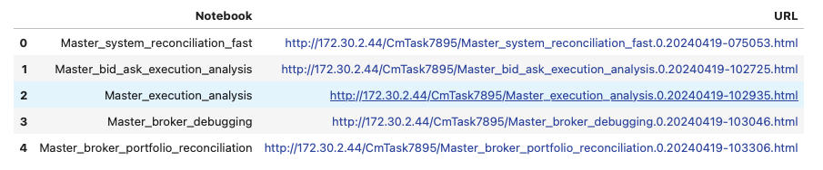
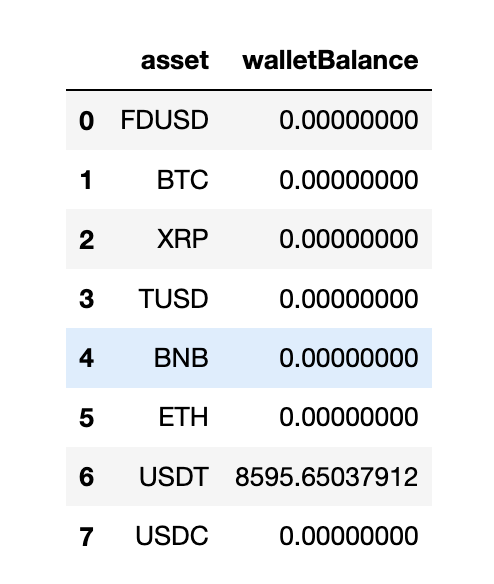

<!-- toc -->

- [Publishing Experiment Reports](#publishing-experiment-reports)
  * [Description](#description)
  * [Detailed Explanation](#detailed-explanation)

<!-- tocstop -->

# Publishing Experiment Reports

## Description

- The architecture automates running, publishing, and accessing analysis
  notebooks from the output table, ensuring structured data management for
  ongoing and future experiments.

## Detailed Explanation

- When executing a trading experiment, to analyze the results of our trading
  experiments we run several notebooks, i.e.
  - [`Master_system_reconciliation_fast`](/oms/notebooks/Master_system_reconciliation_fast.ipynb)
  - [`Master_bid_ask_execution_analysis`](/oms/notebooks/Master_bid_ask_execution_analysis.ipynb)
  - [`Master_execution_analysis`](/oms/notebooks/Master_execution_analysis.ipynb)
  - [`Master_broker_debugging`](/oms/notebooks/Master_broker_debugging.ipynb)
  - [`Master_broker_portfolio_reconciliation`](/oms/notebooks/Master_broker_portfolio_reconciliation.ipynb)

- Notebooks are published on S3 as an HTML files and accessed by team members
  for analysis

- To automate the process, we publish a meta notebook which contains links to
  all the published analysis notebooks of the latest experiment run:
  - [Master_trading_system_report](/oms/notebooks/Master_trading_system_report.ipynb)

  

- The links to the S3 files are stored in the CSV file
  `system_log_dir/analysis_notebooks/analysis_notebooks_links.csv`

- Pre-run/post-run scheduled balances (USDT) are stored in
  `flatten_account.before/` and `flatten_account.after/` directories

  

- Two kinds of the meta notebooks i.e.
  [`Master_trading_system_report`](/oms/notebooks/Master_trading_system_report.ipynb)
  are published:
  - Latest version - Stable link which contains notebooks links of the latest
    run. E.g.,
    http://172.30.2.44/v2/trading_ops/trading_reports/prod/C11a.config1/2024/08/Master_trading_system_report.latest.html
  - Timestamp version - It contains notebook links of that particular timestamp
    run. E.g.,
    http://172.30.2.44/v2/trading_ops/trading_reports/prod/C11a.config1/2024/08/Master_trading_system_report.prod.C11a.config1.20240821_210500.20240821_220000.html

- Here is an example of the directory structure for the trade execution
  experiment:
  ```
  /shared_data/CmTask7852_2/system_reconciliation/C11a/prod/20240419_103500.20240419_113000/system_log_dir.manual/analysis_notebooks/
  \
   |-- Master_bid_ask_execution_analysis \
   |-- Master_broker_debugging \
   |-- Master_broker_portfolio_reconciliation \
   |-- Master_execution_analysis \
   |-- analysis_notebooks_links.csv
  ```
