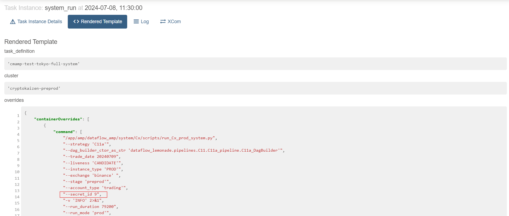

# Trading Run Summary Sheet

<!-- toc -->

- [Document description](#document-description)
- [Field descriptions](#field-descriptions)

<!-- tocstop -->

## Document description

Gsheet:
[2024Q2/Q3 - Scheduled trading](https://docs.google.com/spreadsheets/d/1abvqin3UXJUYmaOD999IBZDoOFGYjUk-4sP7Bd37Ukw/)

This Gsheet provides a daily summary of trading DAG runs. We run scheduled DAGs
and fill the report on the next day after the run start when results are
available.

The data is entered into the Gsheet every day before 8:30 AM ET.

## Field descriptions

- **Date:** the date of the DAG run in YYYY-MM-DD format

  1. Find a date by clicking on the "system_run" task

     

- **Day:** the day of the week for the DAG run

  1. Derived from the Date

- **Account (id):** the identifier number of the account used for the DAG run

  1. Get the `--secret_id` value in the "Rendered Template" tab of the
     "system_run" task

     

- **Model/config:** the specific model and configuration used for the DAG run,
  typically in the format `{{model}}.{{config}}`

- **Scheduled duration (hours):** the planned duration of the DAG run in hours

  1. Get the `--run_duration` value in the "Rendered Template" tab of the
     "system_run" task
  2. Convert the seconds to hours by dividing by 3600

     

- **Actual duration (hours):** the actual time the DAG run lasted, in hours. May
  differ from scheduled duration due to early termination or issues

  1. Get value from "Duration" section in the "Details" tab of the "system_run"
     task

     

- **Pre-run USDT:** the amount of USDT available in the account before the
  trading run started
  - If the trading notebook was published:

    1. Get Master trading system report link in the "Logs" tab of
       "publish_trading_report_notebook" task
    2. Get the value in the "USDT" row in the "Before run" section

       
  - If the trading notebook wasn't published:

    1. Get Total balance dictionary in the "Logs" tab of
       "flatten_account_before" task
    2. Get the value of the "USDT". E.g.:
    ```
    Account flattened. Total balance: {'FDUSD': 0.0, 'BTC': 0.05, 'BNB': 0.0, 'ETH': 0.0, 'USDT': -177.88759239, 'USDC': 0.0}
    ```

- **Post-run USDT:** the amount of USDT remaining in the account after the
  trading run completed
  - If the trading notebook was published:

    1. Get Master trading system report link in the "Logs" tab of
       "publish_trading_report_notebook" task
    2. Get the value in the "USDT" row in the "After run" section

       
  - If the trading notebook wasn't published:

    1. Get Total balance dictionary in the "Logs" tab of "flatten_account_after"
       task
    2. Get the value of the "USDT". E.g.:
    ```
    Account flattened. Total balance: {'FDUSD': 0.0, 'BTC': 0.05, 'BNB': 0.0, 'ETH': 0.0, 'USDT': -170.96487017, 'USDC': 0.0}
    ```

- **Volume (notional):** the total trading volume in notional value for the DAG
  run, typically in USDT

  1. Get the `Master_execution_analysis` notebook link from the Master trading
     system report
  2. Get the combined value of **`traded_volume_dollars`** in the "Fee summary"
     section of `Master_execution_analysis ` notebook

     

- **Trading report:** a link to the detailed trading report notebook for the
  specific DAG run

  1. Find the link in the end of the "Logs" tab of
     "publish_trading_report_notebook" task. E.g.:
     ```
     # To open the notebook from a web-browser open a link:
     http://172.30.2.44/notebooks/Master_Analysis/Master_trading_system_report.0.20240711-070816.html
     ```

- **Notes:** additional comments, observations, or explanations about the DAG
  run, including any issues or failures encountered. If everything went as
  expected during the run, this field is typically left empty

- **PnL (notional):** profit and loss in notional value (USDT) for the DAG run

  1. Calculated as `Post-run (USDT) - Pre-run (USDT)`

- **PnL (bps over traded volume):** profit and loss expressed in basis points
  (1/100th of a percent) over the traded volume

  1. Calculated as `(PnL / Volume) * 10000`

- **Cumulative PnL (notional):** the total accumulated Profit and Loss in
  notional value (USDT) up to and including this DAG run

- **Cumulative PnL (bps over volume traded):** the total accumulated PnL
  expressed in basis points over the total volume traded up to and including
  this DAG run

- **Normalized:** an adjusted Cumulative PnL (notional) value, potentially used
  for comparison or analysis purposes

E.g.

| Date       | Day    | Account (id) | Model/config | Scheduled duration (hours) | Actual duration (hours) | Pre-run USDT | Post-run USDT | Volume (notional) | Trading report                                                                                             | Notes                                                               | PnL (notional) | PnL (bps over traded volume) | Cumulative PnL (notional) | Cumulative PnL (bps over volume traded) | Normalized |
| ---------- | ------ | ------------ | ------------ | -------------------------- | ----------------------- | ------------ | ------------- | ----------------- | ---------------------------------------------------------------------------------------------------------- | ------------------------------------------------------------------- | -------------- | ---------------------------- | ------------------------- | --------------------------------------- | ---------- |
| 2024-07-08 | Monday | 9            | C11a.config3 | 22                         | 22                      | -163.09      | -177.89       | 11441.03          | [Report](http://172.30.2.44/notebooks/Master_Analysis/Master_trading_system_report.0.20240709-070909.html) |                                                                     | -14.80         | -12.94                       | -177.89                   | -3.30                                   | -83.29     |
| 2024-06-10 | Monday | 9            | C11a.config3 | 22                         | 6                       | 28.83        | 50.10         | 4537.60           | [Report](http://172.30.2.44/notebooks/Master_Analysis/Master_trading_system_report.0.20240610-142809.html) | Failed because of https://github.com/cryptokaizen/cmamp/issues/8552 | 21.28          | 46.89                        | 50.10                     | 2.34                                    | 144.70     |
| ...        | ...    | ...          | ...          | ...                        | ...                     | ...          | ...           | ...               | ...                                                                                                        | ...                                                                 | ...            | ...                          | ...                       | ...                                     | ...        |
