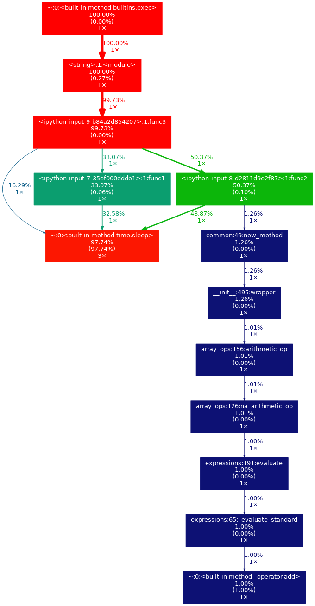
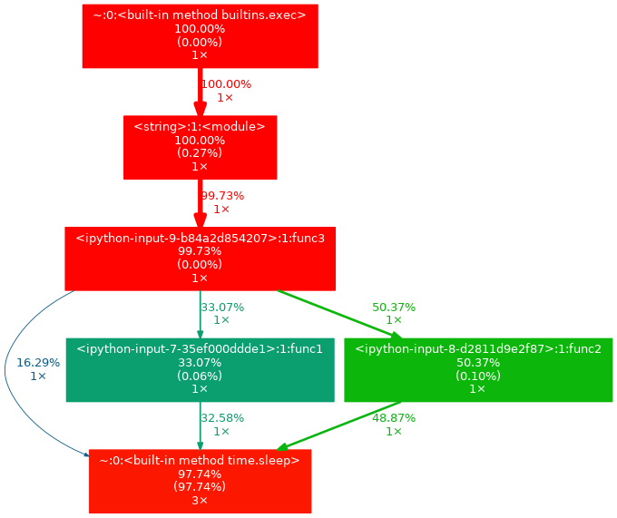

<!--ts-->
   * [Profiling](#profiling)
      * [Selected profilers](#selected-profilers)
         * [Time profilers](#time-profilers)
            * [Overall](#overall)
            * [By function](#by-function)
         * [Memory profilers](#memory-profilers)
            * [Peak memory](#peak-memory)
            * [Memory by line](#memory-by-line)

<!--te-->

# Profiling

## Selected profilers
You can find all of the examples below in action in the
[time_memory_profiling_example.ipynb](https://github.com/alphamatic/amp/blob/master/core/notebooks/time_memory_profiling_example.ipynb)
notebook.

### Time profilers

#### Overall

In a notebook, execute cell with
[%time](https://ipython.readthedocs.io/en/stable/interactive/magics.html#magic-time)
cell-magic:

```python
%%time
func()
```

#### By function

We selected
[cProfile](https://docs.python.org/2/library/profile.html#module-cProfile) for
profiling and [gprof2dot](https://github.com/jrfonseca/gprof2dot) for
visualization.

The documentation does not state this, but
[%prun](https://github.com/ipython/ipython/blob/master/IPython/core/magics/execution.py#L22)
magic now
[uses](https://github.com/ipython/ipython/blob/master/IPython/core/magics/execution.py#L22)
cProfile under the hood, so we can use it in the notebook instead:

```python
# We can suppress output to the notebook by specifying "-q".
%prun -D tmp.pstats func()

!gprof2dot -f pstats tmp.pstats | dot -Tpng -o output.png
dspl.Image(filename="output.png")
```
This will output something like this:



If you open the output image in the new tab, you can zoom in and look at the
graph in detail.

`gprof2dot`
[supports thresholds](https://github.com/jrfonseca/gprof2dot#documentation)
that make output more readable:
```python
!gprof2dot -n 5 -e 5 -f pstats tmp.pstats | dot -Tpng -o output.png
dspl.Image(filename="output.png")
```

This will filter the output into something like this:



### Memory profilers

We are using [memory-profiler](https://github.com/pythonprofilers/memory_profiler).

#### Peak memory

```python
%%memit
func()
```

#### Memory by line

```python
%mprun -f func func()
```
