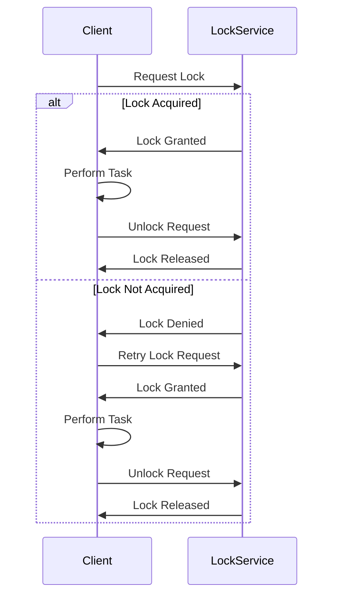

# Spring2024_Distributed_Locking_with_ZooKeeper

## Author info

- Author: Yan Liu
- GitHub account: matchayan
- UMD email: yanliu33@umd.edu
- Personal email: yanliu33@umd.edu
- Link to the video：https://www.youtube.com/watch?v=X6r2qX1FVXw
## 1. Description

This project demonstrates a distributed lock mechanism using ZooKeeper, Docker, and Python. 
It utilizes the Kazoo library to interact with ZooKeeper for managing locks across multiple instances. 
This example is particularly useful in scenarios where distributed applications need to ensure that 
only one instance is executing a particular action at a time.

## Technologies

### ZooKeeper: A Centralized Service for Distributed Systems

 - ZooKeeper operates as a centralized service for maintaining configuration information, naming, providing distributed
   synchronization, and offering group services. This service helps various distributed applications to reduce complexity by centralizing these services.

 - Functioning as a coordinator for distributed environments, ZooKeeper maintains a standard service for naming and
   directory services to various nodes in a cluster. This simplifies the management of large distributed systems.

 - ZooKeeper provides robust synchronization within distributed systems. It helps manage and coordinate the processes of
   different machines in a cluster.

    - ZooKeeper's advantages are primarily reflected in the following areas:

      1. **Centralized Coordination**: It acts as a centralized service for managing configuration data and other shared services, simplifying complex distributed systems management.

      2. **Reliability**: Provides robust mechanisms for maintaining consistency across cluster nodes, enhancing system reliability even in the event of failures.

      3. **Scalability**: It scales well with the size of the distributed system, effectively handling a large number of nodes without degrading performance.

      4. **Fast Configuration Updates**: Enables quick updates and synchronization of configuration across all nodes, ensuring that the entire system is operating on the most current settings.

### Docker: Containerization for Portability
 - Docker is a containerization platform that simplifies the process of
  developing, deploying, and running applications
 - It allows developers to package an application and its dependencies into a
  lightweight, portable container
 - These containers can run consistently across different environments, ensuring
  that the application behaves the same way in development, testing, and
  production
 - Docker provides a standardized way to encapsulate and distribute applications,
  making it easier to manage dependencies, streamline deployment, and enhance
  collaboration among development teams.

 - The Dockerfile specifies the use of an official Python runtime as the base
  image, installs the Redis server, and copies the Python script and mock
  database file into the container. The resulting Docker image encapsulates the
  entire project, making it easily deployable and scalable.

 - By using Docker, the project achieves portability and encapsulation, allowing
  developers to run the application in any environment with minimal setup.

## 2. Docker implementation

The Docker system designed for this project follows a logical sequence to
  ensure a smooth and consistent environment for both development and deployment

Project Setup:
  - Begin with organizing your project files within a directory structure. The
    main files include:
    - `py_Dlock.ipynb`: A Jupyter Notebook that contains code for implementing a distributed locking mechanism using Apache ZooKeeper and the Kazoo library.
    - `dl_sci.py`: A Python script based on the above code, which can be run from the terminal to simulate different terminal instances acquiring the ZooKeeper service.
    - `Dockerfile-python`:  Creates a Docker container that runs a Python script using the Kazoo library to implement a distributed locking mechanism.
    - `Dockerfile-jupyter`: Creates a Docker container that provides a Jupyter Notebook environment to run the 'py_Dlock.ipynb' notebook.
    - `docker-compose.yml`: This file is used to configure and deploy a multi-container Docker application, involving a ZooKeeper cluster and related services for distributed coordination.
    - `kazoo-2.10.0-py2.py3-none-any.whl`: This is a Kazoo library file, used to prevent network errors that may cause 'pip install' to fail.

Dockerfile-python Configuration:
  - Start by setting up the Dockerfile with the following steps:
    - Utilize an official Python runtime as the base image `python:3.8-slim`.
    - Set the working directory in the container to `/app`.
    - Copy the project files (`dl_sci.py` and `kazoo-*.whl`) into the container.
    - Install the Kazoo library from a wheel file using pip.
    - Specify the default command to run the Python script `dl_sci.py`.

Dockerfile-jupyter Configuration:
  - Start by setting up the Dockerfile with the following steps:
    - Utilize the Jupyter base image from the Jupyter Project as the base image.
    - Copy the Jupyter Notebook (`py_Dlock.ipynb`) into the container.
    - Set the working directory to the directory where the notebook is located (`/home/jovyan/work`).

Docker Compose Configuration:
  - Set up the `docker-compose.yaml` file to define the required services for the project:
    - **Zookeeper Services**: Define three instances of Zookeeper (`zookeeper1`, `zookeeper2`, `zookeeper3`) to handle distributed coordination:
    - Use the official `zookeeper` image.
    - Map ports from the host to the containers in a way that each Zookeeper service has a unique host port mapping to the default Zookeeper port (`2181`).
      The configuration of all Zookeeper servers in the cluster.
    - All Zookeeper services are connected to a custom network (`zookeeper-network`).
  - **Jupyter Notebook Application**:
    - Built from a custom Dockerfile for Jupyter.And set the container name as `jupyter-notebook`.
    - Expose port `8888` for web access.
    - Link to the project directory and enable Jupyter Lab.
    - Start after Zookeeper services.
  - **Python Application**:
    - Build the Python service from another custom Dockerfile (`Dockerfile-python`). And name the container as `python-app`.
    - Define dependencies similar to the Jupyter service, relying on the Zookeeper services for coordinated tasks.
  - **Networking**:
    - Define a custom network (`zookeeper-network`) using the bridge driver to ensure all services can communicate internally.

Running the Docker Containers:
  - Start the Docker containers with `docker-compose up`.
  - Docker Compose will create and launch containers for the zookeeper and notebook
    services.

To access and interact with the Jupyter Notebook Server configured in the Docker environment:

Accessing the Jupyter Notebook Interface and Using the Notebook：
  - In the output, you'll see a line like this:

   ```
   Or copy and paste one of these URLs:
       http://127.0.0.1:8888/?token=XXXXXXXXXXXXXXXXXXXXXXXXXXXXXXXXXXXXXXXXXXXX
   ```

   Copy the URL with the token and paste it into your browser to access Jupyter Notebook. Alternatively, you can directly click on the URL.
  - Once inside the Jupyter interface, locate and open the `py_Dlock.ipynb` notebook. This file is prepared for implementing
    a distributed locking mechanism using Apache ZooKeeper, facilitated by the Kazoo library.

Simulate distributed locks
  - Using Zookeeper resources and actually utilize distributed locks, you can achieve this by running multiple instances of a Docker service. 
  - Using `Dockerfile-python` and `docker-compose.yml`, we have simulated the inclusion of the distributed lock script `dl_sci.py` into a Docker container image. 
  - Opening three terminals, in each terminal, you can execute different commands as follows:

  - The commands are:

   ```
   docker compose run --rm --name python-app-instance1 python-app
   docker compose run --rm --name python-app-instance2 python-app
   docker compose run --rm --name python-app-instance3 python-app
   ```

  - These commands will allow you to spin up multiple instances of the Docker service. 
    By doing so, we can simulate multiple clients accessing a single Zookeeper resource and practically utilizing distributed locks.

## 3. Python Script Overview

### Overview

This Python script demonstrates how to implement a distributed locking mechanism using Apache ZooKeeper with the Kazoo client library. The primary use case is to ensure that only one process can access a particular resource or perform a specific task at any time across a distributed system.

### Requirements

- Python 3.6 or newer
- Kazoo library

To install Kazoo, run the following command:
```bash
pip install kazoo
```

### Components

**ZooKeeperLock Class:**

- **Initialization (`__init__`):** Sets up the ZooKeeper client with specified hosts, a lock name, and optional logger and timeout settings. The lock path is created under `/locks/` directory in ZooKeeper.
  
- **`create_lock` Method:** Initializes the ZooKeeper client and creates a lock object at the designated lock path.

- **`acquire` Method:** Attempts to acquire the lock. It blocks the calling process until the lock is available unless a non-blocking operation is specified or a timeout occurs.

- **`release` Method:** Releases the lock if it is currently held by the calling process.

- **`destroy_lock` Method:** Closes the ZooKeeper client connection, ensuring that all resources are cleanly released.

- **Destructor (`__del__`):** Ensures that the lock is destroyed properly when the `ZooKeeperLock` instance is garbage collected.

**Main Function:**

The `main` function serves as an entry point for the script, setting up logging, creating an instance of `ZooKeeperLock`, and demonstrating the lock acquisition and release process. It logs the lock's status and performs a simple task (counting from 1 to 10) while the lock is held.

#### Usage
Once the containers are up and running, the Python application will interact with the ZooKeeper cluster to acquire and release a lock. Here is the flow:
- The Python script attempts to create and acquire a lock.
- It performs some operations while the lock is held (simulated by a sleep interval).
- It releases the lock and exits.

To run the script, ensure that your ZooKeeper servers are running and accessible via the specified hosts (`zookeeper1:2181`, `zookeeper2:2181`, `zookeeper3:2181`). Execute the script using Python:

This will start the locking process, acquire the lock, perform a task while holding the lock, and then release the lock.

#### Error Handling

The script includes basic error handling to catch and log exceptions related to ZooKeeper operations, such as failing to create the lock, acquire it, or release it.

#### Conclusion

This script is a basic demonstration of using ZooKeeper for distributed locking in Python. It can be extended and integrated into larger applications requiring coordinated access control across distributed components.

## 4. Project Diagram



## 5. Conclusion
The "ZooKeeper Distributed Locking" project exemplifies a sophisticated integration of 
distributed locking mechanisms using ZooKeeper, Python scripting, and Docker containerization. 
The initiative focuses on establishing robust, distributed locking within a networked environment 
to manage resource access across multiple nodes effectively. This system highlights the capabilities 
of ZooKeeper in managing synchronization, ensuring consistency, and handling node failures gracefully.

The inclusion of Docker provides a controlled, replicable setting that enhances the project's 
portability and ease of deployment across various platforms. This setup includes multiple ZooKeeper 
nodes and a Python application within the Docker ecosystem, ensuring that the entire locking 
mechanism functions seamlessly in a microservices architecture.

The project's structured approach, including detailed configuration and implementation of the 
locking mechanism through Python's Kazoo library, offers a clear demonstration of handling 
distributed locks. This serves as an invaluable asset for developers looking to implement similar 
capabilities in their applications, especially those dealing with high-concurrency environments.

In achieving its main objectives, the project not only secures resource management across distributed 
systems but also sets the stage for future improvements.
