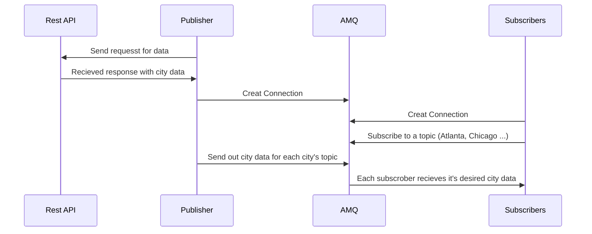

# Simple Pub/Sub Messaging With ActiveMQ

## Author info

- Author: Anna Coffin
- GitHub account: ajcoffin
- UMD email: @umd.edu

### Link to Demo video: 

## Description

This is a Python based project uses ActiveMQ to create a simple messaging system that included publisher and subscribers. The publisher will send out data such as news and weather on four major cities, Atlanta, New York, Baltimore, and Chicago. The subscribers can then choose which city to receive data on and what kind of data they want. This is a simplified version with only four cities but can easily be upscaled to include more cities and more subscribers. Additionally, a publisher can be assigned to certain regions (ie. East coast, west coast ...) to reduce the workload of each publisher.

## Technologies

### ActiveMQ: Robust Messaging System

- ActiveMQ is a robust messaging broker known for its reliability and flexibility.

- Serving as a messaging middleware, ActiveMQ facilitates communication between disparate systems or components in a distributed architecture.

- With features like message persistence and durability, ActiveMQ ensures message durability and high availability, crucial for mission-critical applications.
- ActiveMQ is often utilized in enterprise systems for tasks like asynchronous communication, event-driven architectures, and decoupling of components, enhancing scalability and maintainability.

- The use of ActiveMQ in this project ensures seamless communication between a city data publisher and subscribers seeking data on certain cities, enabling real-time data exchange and efficient message processing.
  
- ActiveMQ acts as the backbone of this project's messaging infrastructure, providing reliable and scalable message delivery services crucial for the system's operation so that every subscriber receives the city information they need.
  
- Its role in ensuring asynchronous communication and decoupling of system components enhances the overall resilience and responsiveness of the application.
  
- The implementation of ActiveMQ queues and topics optimizes the flow of messages within the system, preventing bottlenecks and ensuring timely processing of critical tasks. This will also allow for the project to very easily be scaled up, including very large sets of cities and more information.
  

### Docker: Efficient Application Management

- Docker simplifies application management through containerization.
- Developers package applications and dependencies into portable containers.
- Consistent behavior across environments ensures seamless transitions.
- Docker standardizes encapsulation and distribution, enhancing collaboration.
- Utilizing Docker, the project integrates dependencies and files into a single, deployable image.
- This approach ensures effortless deployment and scalability.
- Docker enables unparalleled portability and encapsulation for smooth execution in any environment.

## Docker implementation

- The Docker system designed for this project follows a logical sequence to
  ensure a smooth and consistent environment for both development and deployment

- Let's delve into the intricacies of the Docker system logic:

- Project Setup:
  - Begin with organizing your project files within a directory structure. The
    main files include:
    - `publisher.ipynb`: Contains the Jupyter Notebook
      code for creating a publisher for AMQ, along with fetching weather and news data vie Rest API's for a set of cities.
    - `subscribers.ipynb`: Contains the Jupyter Notebook
    code for creating subscirbers for AMQ, each with a differnet city interest and differing message request types.
    - `news.py`: Contains the python script that access a rest API to fetch city top news data.
    - `weather.py`: Contains the python script that access a rest API to fetch city weather data.
    - `Dockerfile`: Includes instructions for building a Docker image for the
      project.
    - `Docker-compose.yaml`: Defines services, networks, and volumes for Docker
      containers.
    - `requirements.txt`: A text file with the reuqires python libraries that are needed.
    - `config.ini`: Contains the API keys neded for weather and news (These APIs are free so the config file has been included in the repository).
    - `activemq.xml`: This is the xml file that is used when AMQ is built, I needed to make some changes to this in order for AMQ to work on my mac (NOTE: this can be removd if AMQ is already working successfully on the users machine, this is used in the Docker-compose.yaml, see more info in that section below).

- Dockerfile Configuration:
  - Start by setting up the Dockerfile with the following steps:
    - Utilize an official Python runtime as the base image `python:3.8-slim`
    - Set the working directory in the container to `/app`.
    - Copy the project files into the container.
    - Install necessary dependencies using pip and the services in the txt file.
    - `Expose port 8888` for the Jupyter Notebook server.
    - `Expose port 8161` for the AMQ server.
    - Specify the default command to run the Jupyter Notebook server.

- Docker-compose.yaml Configuration:
  - Configure the docker-compose.yaml file to define the services required for
    the project:
    - Define two services: amq and amq-pub-sub.
    - Configure the amq service:
      - Use the official amq image, rmohr/activemq.
      - Map `port 61613` on the host to `port 61613` in the container.
      - Map `port 8161` on the host to `port 8161` in the container.
      - Set the container name as amq.
      - NOTE: if ActiveMQ builds correctly on your machine, add nothing else
      Otherwise, I have attached a modifed activemq.xml file that should be copied over to the container, this was needed to build amq on my mac. Use the command  ./activemq.xml:/opt/activemq/conf/activemq.xml in volumes
    - Configure the amq-pub-sub service:
      - Use the custom Docker image built from the Dockerfile.
      - Map `port 8888` on the host to `port 8888` in the container.
      - Copy all of the files to the container
      - Make it dependent on the amq service.
      - Allow the subscirbers and publisher notebooks to be access locally on a browser

- Building and Running the Docker Container:
  - Build the docker containers with `docker-compose build`.
  - Start the Docker containers with `docker-compose up`.
  - Docker Compose will create and launch containers for the amq and amq-pub-sub
    services.
  - Access the amq-pub-sub server via the url provided in the output (see video for more info)
  - Access the amq server via `http://localhost:8161/admin` with username and passowrd both admin when prompt to login


- Stopping the Docker Containers:
  - To stop containers, press `Ctrl + C` in the terminal running
    `docker-compose up`.
  - Alternatively, use `docker-compose down` to stop and remove containers.

## 3. Python Script Overview

Both the subscribers and publisher notebooks use stomp, a python library that integrates with ActiveMQ to create connections. The publisher script creates a connecting and then creates a publisher. It will call functions declared in news.py and weather.py that will make a query to Rest API with the specified cities, in this case it is Baltimore, Atlanta, Chicago and New York and receive weather and the top current news in that area. This data will then be sent to AMQ using cities as the topics name, to separate out the data. The Subscribers' notebook will then initialize a connection and create subscribers with differing needs, each one will have a different city they are interested, as well as if they want news or weather data, or all of the data. Additionally, subscribers can declare if they want there subscription durable or not, which will allow them to receive data even if they are currently connected when the publisher sends out city data.


## 4. Example Respons from the Rest APIs

News API
```
{
  'source': {
    'id': None, 
    'name': 'Gizmodo.com'
    }, 
  'author': 'Ed Cara', 
  'title': 'NYU Doctors Perform First-Ever Pig Kidney Transplant Combined With Heart Pump Implant', 
  'description': 'Another milestone in pig-to-human transplantation has been crossed, with doctors at New York University Langone today announcing the world’s first combination pig kidney and heart pump transplant. The recipient is a 54-year-old woman named Lisa Pisano who was…', 
  'url': 'https://gizmodo.com/first-pig-kidney-transplant-heart-pump-nyu-1851431849', 
  'urlToImage': 'https://i.kinja-img.com/image/upload/c_fill,h_675,pg_1,q_80,w_1200/a33cd1995b4b10667cac98e82ae20136.jpg', 'publishedAt': '2024-04-24T14:43:00Z', 
  'content': 'Another milestone in pig-to-human transplantation has been crossed, with doctors at New York University Langone today announcing the worlds first combination pig kidney and heart pump transplant.'
}
```

Weather API
```
{
  'coord': 
    {
      'lon': -74.0059, 
      'lat': 40.7128
    }, 
  'weather': [
    {
      'id': 800, 
      'main': 'Clear', 
      'description': 'clear sky', 'icon': '01d'
    }
    ], 
  'base': 'stations', 
  'main': {
    'temp': 283.02, 
    'feels_like': 280.52, 
    'temp_min': 280.34, 
    'temp_max': 286.46, 
    'pressure': 1027, 
    'humidity': 52
    }, 
  'visibility': 10000, 
  'wind': {
  'speed': 5.14, 
  'deg': 180
  }, 
  'clouds': {
    'all': 0
    }, 
  'dt': 1714085820, 
  'sys': {
    'type': 2, 
    'id': 2008101, 
    'country': 'US', 
    'sunrise': 1714039309, 
    'sunset': 1714088740
    }, 
  'timezone': -14400, 
  'id': 5128581, 
  'name': 'New York', 
  'cod': 200
}
```

## 5. Project Diagram



## 6. Conclusion

The Simple Pub/Sub Messaging With ActiveMQ project establishes an effective communication and messing system between AMQ, Python scripting, and Docker containerization. By using persistent and durable messaging along with filtering, the project shows how powerful AMQ is and how can be used for very important systems that require complex queries and a need for extremely reliable communication, thus can not afford any loss of data. The seamless integration of Docker ensures a
consistent and portable environment, simplifying deployment across various
platforms. With its clear logical structure, illustrated diagrams, and practical
example usage, the project serves as a valuable resource for developers looking
to implement messaging systems in their applications. This messaging system was created because it allows someone to receive arguably the most important data on a city, the weather and the current events that are happening in one response, but also allow someone to configure which one they want. Otherwise, someone would ordinarily need to access two separate avenues to retrieve this data. This can also be scaled very easily, increasing the amount of cities needed, along with hitting different APIs to dial in on more data areas such as local restaurants or sports.