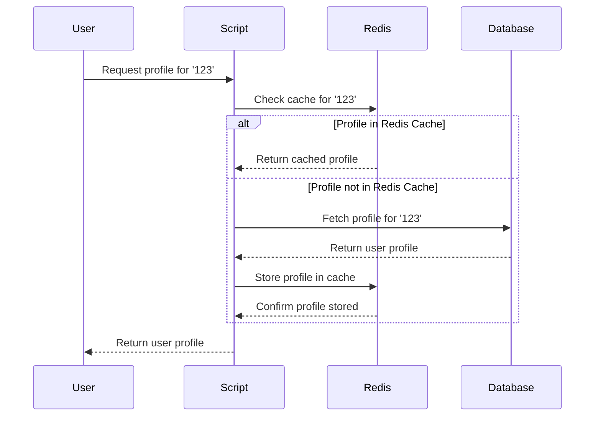

<!-- toc -->

- [Redis cache to fetch user profile](#redis-cache-to-fetch-user-profile)
  * [1. Technologies](#1-technologies)
    + [1.1 Redis: In-Memory Data Structure Store](#11-redis-in-memory-data-structure-store)
    + [1.2. Docker: Containerization for Portability](#12-docker-containerization-for-portability)
  * [2. Docker System Logic for Redis Cache to Fetch User Profiles Project](#2-docker-system-logic-for-redis-cache-to-fetch-user-profiles-project)
  * [3. Running the Redis Cache to Fetch User Profiles System Using Docker](#3-running-the-redis-cache-to-fetch-user-profiles-system-using-docker)
  * [4. Redis Cache to Fetch User Profiles Script Overview](#4-redis-cache-to-fetch-user-profiles-script-overview)
    + [5. Mock Database Schema:](#5-mock-database-schema)
    + [6. Project Diagram](#6-project-diagram)
    + [7. Conclusion](#7-conclusion)

<!-- tocstop -->

# Redis cache to fetch user profile

Author: Shaunak Dhande GitHub account: Shaunak01 Email: sdhande@umd.edu Date:
05/01/2001 Issue: SorrTaskX Complexity: 1

The Redis Cache to Fetch User Profiles project is a Python based project that
exemplifies a straightforward implementation of user profile caching using
Redis. This efficient mechanism aims to enhance the retrieval speed of user
profiles by employing Redis, a high-performance in-memory data structure store.

## 1. Technologies

### 1.1 Redis: In-Memory Data Structure Store

Redis is an advanced key-value store known for its exceptional speed and
versatility. Functioning as an in-memory data structure store, Redis holds data
in RAM, allowing for lightning-fast read and write operations. It supports
various data structures, including strings, hashes, lists, and sets, making it
suitable for a wide range of use cases. Redis is often used as a caching
mechanism to boost the performance of applications by reducing the time it takes
to retrieve frequently accessed data. Additionally, its support for advanced
features like pub/sub messaging and transactions makes it a valuable tool for
building scalable and responsive systems.

Redis serves as the backbone of this project, providing an in-memory data
structure store that excels in key-value pair storage and retrieval. In the
context of the project, Redis is employed as a caching mechanism. The speed of
data retrieval from Redis significantly outpaces traditional databases, making
it an ideal choice for scenarios where rapid access to frequently used data,
such as user profiles, is paramount.

The project establishes a connection to a Redis server running on
localhost:6379. The redis.StrictRedis library in Python facilitates this
connection, enabling seamless communication between the Python script and the
Redis server.

The function that retrieved user profiles showcases the power of Redis caching.
It first checks if the user's profile is already present in the Redis cache. If
found, the profile is retrieved directly from Redis. If not found, the script
fetches the profile from the mock database, stores it in Redis for future use,
and then returns the profile. This elegant use of Redis caching optimizes the
overall performance of the application by reducing the load on the underlying
data source.

### 1.2. Docker: Containerization for Portability

Docker is a containerization platform that simplifies the process of developing,
deploying, and running applications. It allows developers to package an
application and its dependencies into a lightweight, portable container. These
containers can run consistently across different environments, ensuring that the
application behaves the same way in development, testing, and production. Docker
provides a standardized way to encapsulate and distribute applications, making
it easier to manage dependencies, streamline deployment, and enhance
collaboration among development teams.

Docker containerization is employed to encapsulate the entire project, ensuring
a consistent and reproducible environment across different systems. The
Dockerfile specifies the use of an official Python runtime as the base image,
installs the Redis server, and copies the Python script and mock database file
into the container. The resulting Docker image encapsulates the entire project,
making it easily deployable and scalable.

By using Docker, the project achieves portability and encapsulation, allowing
developers to run the application in any environment with minimal setup. The
EXPOSE directive in the Dockerfile exposes the default Redis port, making it
accessible for external applications if needed.

## 2. Docker System Logic for Redis Cache to Fetch User Profiles Project

The Docker system designed for the Redis Cache to Fetch User Profiles project
follows a logical sequence to ensure a smooth and consistent environment for
both development and deployment. Let's delve into the intricacies of the Docker
system logic:

- Base Image Selection:

  The foundation of the Docker system is laid with the selection of an official
  Python runtime as the base image. This choice provides a standardized and
  well-supported environment, ensuring compatibility with the project's Python
  script and dependencies.

- Working Directory Configuration:

  The working directory is set to /app to establish a designated space for the
  project files within the container. This simplifies subsequent file operations
  and ensures a clean project structure.

- Copying Project Files:

  The COPY directive is employed to transfer the contents of the local directory
  (containing the project files) into the /app directory within the Docker
  container. This step includes the Python script, the mock database JSON file
  (user_profiles1.json), and any other necessary files.

- Redis and Python Package Installation:

  The Dockerfile executes commands to install the Redis server and the required
  Python packages. This includes updating the package list, installing the Redis
  server, and using pip to install the redis Python package.

- Exposing Redis Port:

  The EXPOSE directive is used to expose the default Redis port (6379) within
  the Docker container. This step ensures that the Redis server running inside
  the container is accessible to external applications if needed.

- Mock Database File Copying:

  Another COPY directive is employed to transfer the mock database JSON file
  (user_profiles1.json) into the /app directory within the Docker container.
  This ensures that the mock database is readily available for the Python
  script.

- Redis Server Initialization:

  The Dockerfile concludes by specifying the command to run the Redis server.
  This command (CMD ["redis-server"]) initializes the Redis server within the
  Docker container, ensuring that it is ready to accept connections.

- Python Script Execution:

  The final command (CMD ["python", "Redis cache to fetch user profiles.ipynb"])
  specifies the execution of the Python script within the Docker container. This
  ensures that the Redis Cache to Fetch User Profiles script runs seamlessly
  within the configured Docker environment.

## 3. Running the Redis Cache to Fetch User Profiles System Using Docker

To execute the Redis Cache to Fetch User Profiles system, Docker provides a
straightforward and efficient approach. The following steps outline how to run
the container system, ensuring a seamless deployment of the project:

- Prerequisites:

  Before running the Docker container, ensure that Docker is installed on your
  system. You can download and install Docker from the official Docker website.

- Build the Docker Image:

  Navigate to the directory containing the project files, including the
  Dockerfile. Open a terminal and run the following command to build the Docker
  image:
  ```
  docker build -t redis-cache-system
  ```

  This command instructs Docker to build an image named redis-cache-system using
  the instructions provided in the Dockerfile. The -t flag allows you to tag the
  image for easier reference.

- Run the Docker Container:

  Once the image is built, you can run a Docker container based on this image.
  Execute the following command:
  ```
  docker run -p 6379:6379 redis-cache-system
  ```

  The -p flag maps the container's Redis port (6379) to the same port on the
  host system, allowing external access to the Redis server. This step starts
  both the Redis server and the Python script within the Docker container.

- Verify System Operation:

  With the container running, the system is now operational. You can verify its
  functionality by executing the provided example usage of the Python script.
  Open a new terminal window and run:
  ```
  docker exec -it $(docker ps -q) python "Redis cache to fetch user profiles.ipynb"
  ```

  This command accesses the running Docker container ($(docker ps -q)) and
  executes the Python script within it. Ensure that the script fetches and
  displays the user profile as expected.

- Interacting with Redis:

  To interact directly with the Redis server within the Docker container, you
  can use a Redis client. For example, you can use the following command to
  connect to the Redis server running in the Docker container:
  ```
  docker exec -it $(docker ps -q) redis-cli
  ```

  This opens a Redis command-line interface where you can run Redis commands to
  inspect and manipulate data stored in the Redis cache.

Running the Redis Cache to Fetch User Profiles system using Docker involves
building the Docker image, running the Docker container, verifying system
operation through the Python script, and interacting with the Redis server. This
Dockerized system ensures consistency across different environments, facilitates
easy deployment, and optimizes the performance of user profile retrieval through
Redis caching.

## 4. Redis Cache to Fetch User Profiles Script Overview

The Redis Cache to Fetch User Profiles script demonstrates an efficient approach
to user profile caching using Redis. The script is structured to fetch user
profiles from a mock database, implement caching with Redis, and showcase the
seamless integration of Docker for containerization.

The script is primarily divided into three sections:

- Set up Redis Connection: Establishes a connection to a Redis server running on
  localhost:6379.

- Mock Database: Utilizes a static JSON file named user_profiles1.json as the
  mock database, containing user profiles for demonstration purposes.

- Fetch User Profile Function:
  - Implements the fetch_user_profile function to read the mock database file
    and retrieve a user's profile based on their ID.
  - Implements the get_user_profile function to check if the user's profile is
    in the Redis cache, fetches it if present, or retrieves it from the mock
    database, stores it in the cache, and returns the profile.

- Example Usage: Provides an example usage at the end of the script,
  demonstrating how to fetch a user's profile using the caching mechanism.

- Example Output: Let's walk through the script's functionality with an example:
  ```
  user_id_to_fetch = '123'
  user_profile = get_user_profile(user_id_to_fetch)
  print(f"Fetched user profile: {user_profile}")
  ```

- Output Explanation:
  - If the user profile is in the Redis cache:
    ```
    User profile for 123 found in Redis cache.
    Fetched user profile: {'user_id': '123', 'name': 'Shaunak Dhande', 'email': 'shaunakdhande4000@gmail.com', 'age': 22}
    ```
  - If the user profile is not in the Redis cache:
    ```
    User profile for 123 not found in cache. Fetched from the database and stored in Redis.
    Fetched user profile: {'user_id': '123', 'name': 'Shaunak Dhande', 'email': 'shaunakdhande4000@gmail.com', 'age': 22}
    ```

### 5. Mock Database Schema:

The mock database (user_profiles1.json) follows a simple JSON structure where
each user profile is represented as a dictionary. The schema includes the user's
ID, name, email, and age.
```
{
  "123": {
    "user_id": "123",
    "name": "Shaunak Dhande",
    "email": "shaunakdhande4000@gmail.com",
    "age": 22
  },
  "456": {
    "user_id": "456",
    "name": "Alice Johnson",
    "email": "alice.johnson@example.com",
    "age": 30
  },
  // Additional profiles...
}
```

### 6. Project Diagram



### 7. Conclusion

The Redis Cache to Fetch User Profiles project establishes an effective synergy
between Redis caching, Python scripting, and Docker containerization. By
prioritizing efficient user profile retrieval, the project showcases the power
of Redis in optimizing data access, minimizing database load, and enhancing
overall system responsiveness. The seamless integration of Docker ensures a
consistent and portable environment, simplifying deployment across various
platforms. With its clear logical structure, illustrated diagrams, and practical
example usage, the project serves as a valuable resource for developers looking
to implement robust caching mechanisms in their applications. While achieving
its primary goals, the project also opens avenues for future enhancements,
encouraging exploration of advanced Redis features and scalability
considerations.
