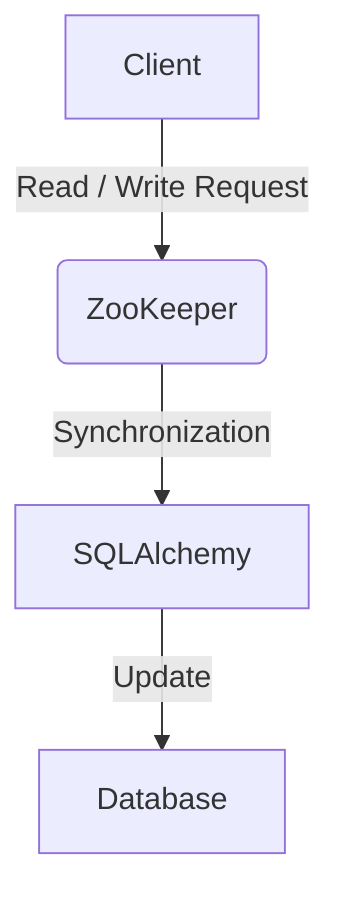

# ORM Integration with ZooKeeper for Configuration Management

## Table of Contents

1. **Introduction**
2. **Technology Overview**
   - SQLAlchemy
   - ZooKeeper
3. **Docker System Architecture**
4. **Operating the System**
5. **Implementation Details**
   - Scripts and Database Schema
   - Example Outputs and Diagrams
6. **Conclusion**

## 1. Introduction

This report discusses the project "ORM Integration with ZooKeeper for Configuration Management," which aims to use SQLAlchemy ORM for database interactions and ZooKeeper for configuration management within a Dockerized environment. This project showcases a novel approach to managing configurations in distributed systems, emphasizing fault tolerance and data consistency.

## 2. Technology Overview

### SQLAlchemy

#### What it Does

SQLAlchemy is an ORM framework for Python that allows developers to work with databases using Python objects instead of writing raw SQL queries. It abstracts common database interactions, making it easier to manage data schemas and perform database operations.

#### Unique Features and Differences

Unlike traditional query constructors such as JDBC or lower-level ORMs, SQLAlchemy provides a comprehensive suite of tools and techniques for dealing with database queries and ORM. It supports a wide variety of database backends and offers both a high-level ORM and a low-level SQL expression language.

#### Pros and Cons

- **Pros**:
  - Reduces boilerplate code for database operations.
  - Increases security through SQL injection prevention.
  - Enhances developer productivity and application maintainability.
- **Cons**:
  - Complexity in setup and configuration.
  - Performance overhead due to abstraction, especially for complex queries.

#### Relation to Coursework

This technology aligns with the database management and application development concepts covered in class, applying theoretical knowledge about data abstraction and system architecture practically.

### ZooKeeper

#### What it Does

Apache ZooKeeper is a centralized service for maintaining configuration information, naming, providing distributed synchronization, and providing group services. It helps distributed applications function as a single coordinated unit.

#### Unique Features and Differences

ZooKeeper's strong consistency model sets it apart from other similar technologies like Apache Cassandra or Redis, which might offer eventual consistency models. ZooKeeper ensures that once a write is successful, all subsequent reads will see that state.

#### Pros and Cons

- **Pros**:
  - Provides a reliable synchronization mechanism.
  - Ensures consistency and reliability for distributed applications.
- **Cons**:
  - Steeper learning curve and operational complexity.
  - Overhead associated with maintaining a highly consistent system.

#### Relation to Coursework

ZooKeeper uses several distributed system principles discussed in class, including consensus algorithms and fault tolerance, providing practical applications for these concepts.

## 3. Docker System Architecture

### Docker Configuration

The Docker environment encapsulates the application components within containers, promoting isolation, portability, and scalability.

#### Dockerfile Explanation

```Dockerfile
# Use an official Python runtime as a parent image
FROM python:3.8-slim

# Set the working directory in the container
WORKDIR /usr/src/app

# Install any needed packages specified in requirements.txt
COPY requirements.txt ./
RUN pip install --no-cache-dir -r requirements.txt

# Copy the current directory contents into the container at /usr/src/app
COPY . .

# Make port 80 available to the world outside this container
EXPOSE 80

# Define environment variable
ENV NAME World

# Run app.py when the container launches
CMD ["python", "app.py"]
```

#### Decision Making

- **Base Image**: Chosen for its minimal setup yet sufficient to run Python applications.
- **Working Directory**: Isolates application files from system files in the container.
- **Dependencies**: Are installed without caching to minimize the container size.
- **Port Exposure**: Container is configured to expose port 80, making it accessible outside.

#### Container Interaction

- **SQLAlchemy Container**: Connects to the MySQL database container.
- **ZooKeeper Container**: Manages configuration data, watched by the application container.
- **Application Container**: Runs the application, interacts with ZooKeeper for configuration.

### How Containers Communicate

Containers communicate over Docker's internal network, using links and environment variables to discover and connect to each other, ensuring data consistency and failover management.

## 4. Operating the System

### Starting the Container System

```bash
docker-compose up -d  # Start all containers in detached mode
```

### Running Commands

To interact with the running application, use Docker's exec command:

```bash
docker exec -it app_container bash  # Access the application container
source activate myenv
python manage.py runserver 0.0.0.0:8000
```

### Output

The output includes

 logs from the application, indicating its connection status with the database and ZooKeeper, and any configuration changes fetched or updated.

## 5. Implementation Details

### Scripts and Database Schema

#### Zookeeper_Config.py

This script initializes the ZooKeeper nodes with default configurations necessary for the application startup.

#### zookeeper_oper.py

Manages runtime updates to configurations stored in ZooKeeper, reflecting changes within the SQLAlchemy-managed database.

### Database Schema

The database schema includes tables such as `Configurations`, which stores key-value pairs of configuration settings. Each row represents a configurable item within the application.

### Example Outputs and Diagrams



This diagram illustrates how requests are processed and synchronized through ZooKeeper before being persisted in the database by SQLAlchemy.

## 6. Conclusion

This project successfully demonstrates the integration of SQLAlchemy and ZooKeeper within a Dockerized environment, addressing the challenges of distributed configuration management. The implementation showcases practical applications of theories discussed in class, emphasizing real-world applicability of distributed systems principles.
