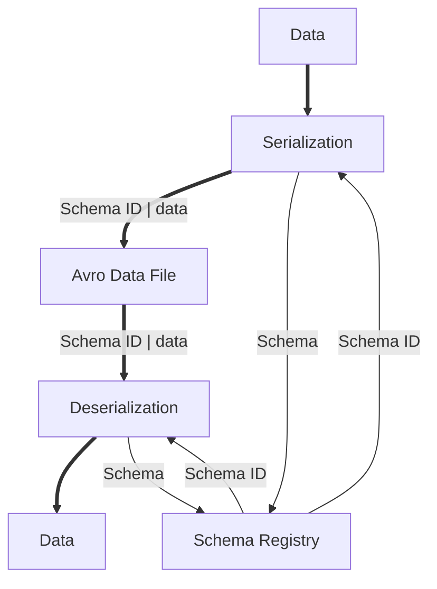

# Data Serialization with Avro

## Author Info

Author: Xinyi Yu  
Github Account: xiny0917  

## Description
Explore advanced data serialization techniques with this project centered around Avro. Begin by defining a schema for a fundamental data structure and employ Avro for seamless serialization and deserialization processes. Dive deeper into Avro's schema evolution and compatibility features to understand its capability in managing schema changes across various data versions. This project offers valuable insights into building resilient and scalable data serialization solutions using Avro.

## 1. Technologies

### Avro: Data Serialization Framework
- Avro is a robust data serialization framework recognized for its flexibility and efficiency.

- Operating as a binary data format, Avro facilitates compact data storage and efficient data interchange.

- It provides a rich set of data types, including primitive types, complex types like records and arrays, and advanced features like schemas and schema evolution, catering to diverse data serialization needs.

- Avro's support for schema evolution enables seamless data evolution over time, ensuring backward and forward compatibility across different versions of data schemas.

- Moreover, its compact binary encoding and language independence make it an excellent choice for inter-process communication and data storage in distributed systems.

- The project leverages Avro's schema evolution features to demonstrate how data schemas can be updated without disrupting existing data, highlighting its importance in building flexible and scalable data serialization solutions.

### Docker: Containerization Platform
- Docker is a leading containerization platform renowned for its portability and scalability.

- Functioning as a lightweight virtualization solution, Docker isolates applications and their dependencies into containers, ensuring consistent environments across different systems.

- It utilizes container images, which encapsulate the application code, runtime, libraries, and dependencies, making it easier to deploy applications seamlessly across various computing environments.

- Docker's containerization approach enhances resource efficiency by sharing the host system's OS kernel while providing isolation for applications, resulting in faster deployment and scaling processes.

- Using Docker, the project demonstrates how to encapsulate an application and its dependencies into a container, streamlining the deployment process and enhancing scalability.

## 2. Project Implementation
- Project Setup
    - Begin with the files within a directory structure. The main files include:
        - `Data_Serialization_with_Avro.ipynb`: Contains the Jupyter Notebook code for performing serialization and deserialization with different Avro schemas.
        - `Dockerfile`: Includes instructions for building a Docker image for the project.
        - `docker-compose.yaml`: Defines services, networks, and volumes for Docker containers.
    - The supportive files include:
        - `books.json`: Dataset used during the project.
        - `Book.avsc`: A schema defines a record named `details`, which represents the structure for storing information about books.
        - `Book_with_rates.avsc`: A schema defines a record named `details`, which obtaines a new field `rates` to `Book.avsc`.
        - `Book_no_images.avsc`: A schema defines a record named `details`, which deletes a field `imageLink` from `Book.avsc`.

- Docker Configuration
    - Start by setting up the Dockerfile: 
        - Utilize `jupyter/base-notebook:latest` as the base image, which provides a Jupyter Notebook environment.
        - Set the working directory inside the container to `/home/jovyan/work`.
        - Install necessary Python packages `pandas` and `avro-python3` using `pip`.
        - Copy all project files from the current directory on the host machine into the `/home/jovyan/work` directory in the container.
        - `Expose port 8888` to allow external access to the Jupyter Notebook server.
        - Specify the default command to run the Jupyter Notebook server and using the token `Avro` for authentication.

- docker-compose.yaml Configuration
    - Configure the docker-compose.yaml file to define the services required:
        - Define the service: Jupyter Notebook
        - Configure the notebook service:
            - Build the custom Docker image using the Dockerfile defined in the current directory.
            - Set the container name as jupyter_notebook.
            - Map `port 8888` on the host to `port 8888` in the container.
            - Mount the current project directory `(./)` from the host machine to `/home/jovyan/work` in the container, facilitating file synchronization between the host and container.
            - Set `JUPYTER_TOKEN` to Avro to authenticate the Jupyter Notebook server with the specified token.

- If you need to clone the repository:
    - Run `git clone https://github.com/kaizen-ai/kaizenflow` to clone the repository.
    - Execute `cd kaizenflow` to ensure you are at the right place.

- Building the Docker Image:
    - Download the folder and execute `cd sorrentum_sandbox/spring2024/Data_Serialization_with_Avro/docker` in the terminal to locate the `docker` folder in the `Data_Serialization_with_Avro` folder.
    - Execute `docker-compose build` to build the Docker image named `docker-jupyter`

- Running the Docker Containers:
    - Start the Docker containers with `docker-compose up`.
    - Docker Compose will create and launch containers for the notebook service.
    - Access the Jupyter Notebook server at `http://localhost:8888` in a web browser.

- Accessing the Jupyter Notebook Server:
    - Navigate to `http://localhost:8888` in a web browser to access the Jupyter Notebook interface.
    - In the `Password or Token` section, enter the specified token, `Avro`, and click `Log in` to access the files.
    - Interact with your notebook file `Data_Serialization_with_Avro.ipynb` to execute code for Avro's serialization and deserialization performance.

- Stopping the Docker Containers:
    - To stop containers, press `Ctrl + C` in the terminal running `docker-compose up`.
    - Alternatively, use `docker-compose down` to stop and remove containers.

## 3. Database Schemas
The [**data**](https://github.com/benoitvallon/100-best-books/blob/master/books.json) (Click link to see reference data.) follows a simple JSON structure where each book is represented as a dictionary. The schema includes author, country, imageLink, etc..
```json
  {
    "author": "Chinua Achebe",
    "country": "Nigeria",
    "imageLink": "images/things-fall-apart.jpg",
    "language": "English",
    "link": "https://en.wikipedia.org/wiki/Things_Fall_Apart\n",
    "pages": 209,
    "title": "Things Fall Apart",
    "year": 1958
  }
```

## 4. Avro Schema
The Avro schema is in JSON format. Outside of the `field` definition, the `type` attribute can have several values depending on the context and the desired data structure being defined in the schema. The `name` attribute serves as a way to label and identify complex types within the schema so that it can be used as reference. On the other hand, the `type` attribute inside the `field` only specifies the data type of that particular field, and the `name` attribute specifies the name of that particular field. In addition, `doc` attribute provides descriptive information about a field.  
This original schema defines a record named `details` with eight fields that correspond to eight variables of the data set. Each with a type that is either a `string`, an `integer`, or `null`.
```json
{
    "type": "record",
    "name": "details",
    "fields": [
        {"name": "author", "type": ["string","null"], "doc": "Writer's name"},
        {"name": "country", "type": ["string","null"], "doc": "Writer's country of origin"},
        {"name": "imageLink", "type": ["string","null"], "doc": "link to book's cover"},
        {"name": "language", "type": ["string","null"], "doc": "The language used in writing"},
        {"name": "link", "type": ["string","null"], "doc": "Wikipidia page of the book"},
        {"name": "pages", "type": ["int","null"], "doc": "Total page number"},
        {"name": "title", "type": ["string","null"], "doc": "Book's name"},
        {"name": "year", "type": ["int","null"], "doc": "Written year"}
    ]
}
```  
A new field, `rates`, is added to the new schema with a default value `0`.
```json
{
    "type": "record",
    "name": "details",
    "fields": [
        {"name": "author", "type": ["string","null"], "doc": "Writer's name"},
        {"name": "country", "type": ["string","null"], "doc": "Writer's country of origin"},
        {"name": "imageLink", "type": ["string","null"], "doc": "link to book's cover"},
        {"name": "language", "type": ["string","null"], "doc": "The language used in writing"},
        {"name": "link", "type": ["string","null"], "doc": "Wikipidia page of the book"},
        {"name": "pages", "type": ["int","null"], "doc": "Total page number"},
        {"name": "title", "type": "string", "doc": "Book's name"},
        {"name": "year", "type": ["int","null"], "doc": "Written year"},
        {"name": "rates", "type": ["double","null"], "default": 0, "doc":"Book's rating"}
    ]
}
```  
Another shcema is deleting `imageLink` field from the original schema.
```json
{
    "type": "record",
    "name": "details",
    "fields": [
        {"name": "author", "type": ["string","null"], "doc": "Writer's name"},
        {"name": "country", "type": ["string","null"], "doc": "Writer's country of origin"},
        {"name": "language", "type": ["string","null"], "doc": "The language used in writing"},
        {"name": "link", "type": ["string","null"], "doc": "Wikipidia page of the book"},
        {"name": "pages", "type": ["int","null"], "doc": "Total page number"},
        {"name": "title", "type": ["string","null"], "doc": "Book's name"},
        {"name": "year", "type": ["int","null"], "doc": "Written year"}
    ]
}
```
## 5. Project Script Overview
The Data Serialization with Avro script demonstrates serialization and deserialization processes, and highlights Avro's robust schema evolution and compatibility features. The script uses a database and defined schemas to perform Avro data management.

The script is divided into four sections:
- **Prepare Data**:  
  Read the JSON file containing book data and converts it to a list of dictionaries, and then selects the first five book records as a sample for further use.

- **Serialization and Deserialization**:  
  To serialize data, we convert data (e.g., Python dictionaries, lists) into Avro binary format using the parsed Avro schema. To deserialize data, we read the serialized Avro data from the file or stream and convert it back into its original data structure using the Avro schema.  
    - Example: 
    ```python
    # Python dictionary item
    {'author': 'Marguerite Yourcenar',
    'country': 'France/Belgium',
    'imageLink': 'images/memoirs-of-hadrian.jpg',
    'language': 'French',
    'link': 'https://en.wikipedia.org/wiki/Memoirs_of_Hadrian\n',
    'pages': 408,
    'title': 'Memoirs of Hadrian',
    'year': 1951}
    ```
    Avro data is shown in text like below with special symbols that Markdown cannot show.
    ```
    {Marguerite Yourcenar/France/Belgium...}
    ```
    ```python
    # Output from Avro file
    {'author': 'Marguerite Yourcenar', 'country': 'France/Belgium', 'imageLink': 'images/memoirs-of-hadrian.jpg', 'language': 'French', 'link': 'https://en.wikipedia.org/wiki/Memoirs_of_Hadrian\n', 'pages': 408, 'title': 'Memoirs of Hadrian', 'year': 1951}
    ```
    Avro uses a compact binary format and define strong data types, resulting in smaller file sizes and efficient data transmission over networks. This reduces storage costs and improves performance. Also, it supports multiple programming languages, making it easier to exchange data between different systems.

- **Schema Evolution**:  
  The modified schema in the script is added a new field named `rates` with default value `0`. The data is successfully serialized and deserialized using the new schema without error, and each book record includes `None` in the new field.
    - Example Output
    ```python
    # Deserialize old schema
    {'author': 'Chinua Achebe', 'country': 'Nigeria', 'imageLink': 'images/things-fall-apart.jpg', 'language': 'English', 'link': 'https://en.wikipedia.org/wiki/Things_Fall_Apart\n', 'pages': 209, 'title': 'Things Fall Apart', 'year': 1958, 'rates': None}
    ```
    ```python
    # Deserialize old schema
    {'author': 'Chinua Achebe', 'country': 'Nigeria', 'imageLink': 'images/things-fall-apart.jpg', 'language': 'English', 'link': 'https://en.wikipedia.org/wiki/Things_Fall_Apart\n', 'pages': 209, 'title': 'Things Fall Apart', 'year': 1958, 'rates': None}
    ```
    Avro supports the ability to modify or update an existing schema without breaking compatibility with previously serialized data. We can add new fields, removing fields, change a field's default value or type, and make other modifications. This enables the seamless evolution of data models over time without downtime or data migration challenges.

- **Compatibility Testing**:  
    1. Backward Compaibility: Serialization with old schema and Deserialization with new schema 
    2. Forward Compatibility: Serialization with new schema and Deserialization with old schema  
By performing two situations above, the processes produce no errors in the results and show smooth data evolution across different schema versions.
    - Example Output
    ```python
    # Result of Backward Compaibility
    {'author': 'Chinua Achebe', 'country': 'Nigeria', 'imageLink': 'images/things-fall-apart.jpg', 'language': 'English', 'link': 'https://en.wikipedia.org/wiki/Things_Fall_Apart\n', 'pages': 209, 'title': 'Things Fall Apart', 'year': 1958}
    ```
    ```python
    # Result of Forward Compatibility
    {'author': 'Chinua Achebe', 'country': 'Nigeria', 'imageLink': 'images/things-fall-apart.jpg', 'language': 'English', 'link': 'https://en.wikipedia.org/wiki/Things_Fall_Apart\n', 'pages': 209, 'title': 'Things Fall Apart', 'year': 1958, 'rates': None}
    ```
    Avro offers validation mechanisms to ensure that serialized data conforms to the schema, reducing the risk of data corruption or format errors during serialization and deserialization.

- **Backward-incompatible Change**:  
  It refers to a modification to the schema that makes it incompatible with the previously serialized data. Such changes can lead to errors during deserialization if not handled properly, potentially disrupting the data processing workflow. The example schema deletes a field from the original schema, and it eventually produces an error in serialization.
    - Example Output
    ```python
    AvroTypeException: The datum "{'author': 'Chinua Achebe', 'country': 'Nigeria', 'imageLink': 'images/things-fall-apart.jpg', 'language': 'English', 'link': 'https://en.wikipedia.org/wiki/Things_Fall_Apart\n', 'pages': 209, 'title': 'Things Fall Apart', 'year': 1958}" provided for "details" is not an example of the schema
    ```

## 6. Diagram



## 7. Conclusion
By incorporating schema evolution and compatibility testing, the project highlights Avro's capability to adapt to evolving data structures seamlessly. This ensures data integrity and compatibility across different schema versions, reducing potential disruptions in data processing workflows. The integration of Docker provides a consistent environment for executing the codebase, enhancing reproducibility and simplifying deployment across various platforms. It ensures that the project's functionalities can be easily replicated and scaled as needed. The project with practical examples serves the purpose of understanding and implementing advanced data serialization techniques using Avro.
