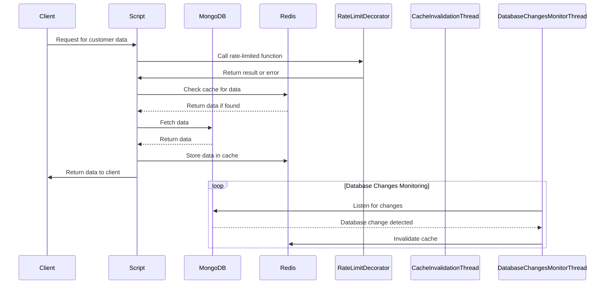
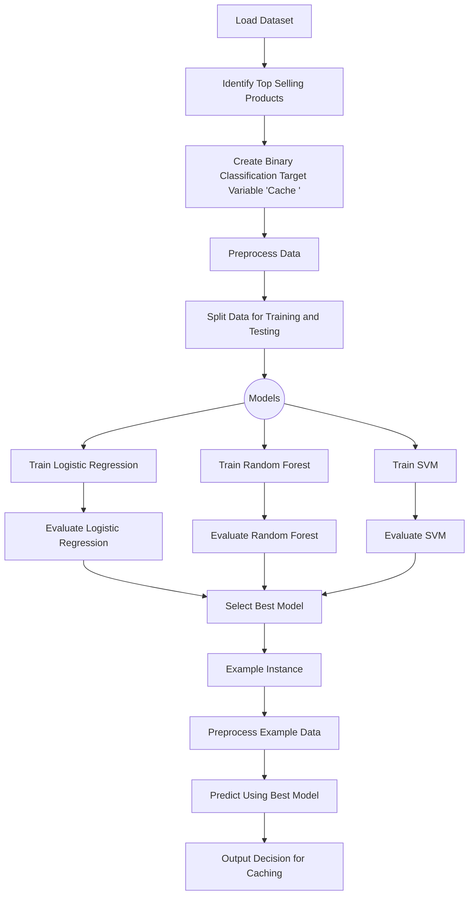

<!-- toc -->

- [Redis Cache Optimization](#redis-cache-optimization)
  * [1. How to run the Project](#1-how-to-run-the-project)
  * [2. Code file and Datasets](#2-code-file-and-datasets)
    + [Python Script](#python-script)
    + [product_data.csv](#product_datacsv)
  * [3. Project Diagrams](#3-project-diagrams)
    + [Redis Cache with MongoDB to fetch user data](#redis-cache-with-mongodb-to-fetch-user-data)
    + [Cache prediction for Redis optimization](#cache-prediction-for-redis-optimization)
    + [4. Conclusion](#4-conclusion)

<!-- tocstop -->

# Redis Cache Optimization

Author: Shaunak Dhande, GitHub account: Shaunak01, Email: sdhande@umd.edu

The first part of project is designed to optimize data retrieval performance
that interacts with a MongoDB database by implementing a caching mechanism using
Redis. The system involves inserting customer data into MongoDB, while
concurrently caching frequently accessed data in Redis to expedite subsequent
retrieval. The script integrates rate limiting to control access to the database
and ensure fair resource usage. Additionally, it monitors database changes in
real-time, invalidating the cache accordingly to maintain data consistency. This
part aims to enhance application responsiveness and scalability by efficiently
managing data retrieval through a combination of caching and rate limiting
strategies.

The next part implements a classification project aimed at optimizing Redis
caching by predicting whether certain product data should be stored in Redis
based on its features. Initially, it preprocesses a dataset containing
information about products, identifying the top-selling products and creating a
binary classification target variable ('Cache') based on sales volume and
ratings. It then splits the data for training and testing, utilizing various
machine learning models including Logistic Regression, Random Forest, and SVM,
to predict the likelihood of caching. The Random Forest model is chosen for its
predictive performance. Subsequently, an example product instance is constructed
and passed through the trained Random Forest model to predict whether it should
be cached in Redis or not, offering a practical application of the
classification model for caching optimization.

## 1. How to run the Project

To run the Dockerized version of the project, follow these steps:

- Ensure Docker is installed on your system.
- Clone or download the project repository containing the Dockerfile and
  necessary files.
- Navigate to the directory containing the Dockerfile and other project files in
  your terminal.
- Run the following command to build and launch the Docker container:
  ```
  docker-compose up
  ```
- Once the Docker container is running, it will launch a Jupyter Notebook
  server. In the terminal logs, you will find a link to access the Jupyter
  Notebook interface.
- Click on the provided link to access the Jupyter Notebook interface in your
  web browser. If the notebook does not display anything initially, open the
  link in a private browser/window to avoid cache issues.
- Once inside the Jupyter Notebook interface, you'll find the .ipynb files
  containing the code for the project.
- Open the desired .ipynb file to review the project code and functionalities.
- Run the cells in the notebooks to execute the code and observe the results.
- After reviewing the projects and functionalities, you can stop the Docker
  container by pressing `Ctrl + C ` in the terminal where it's running, and then
  typing
  ```
  docker-compose down
  ```

By following these steps, you can easily run and review the project within a
Docker container, ensuring isolation and portability of the environment.

## 2. Code file and Datasets

### Python Script

This Python script implements a caching mechanism using Redis for a MongoDB
database with e-commerce data. It includes functionalities for data insertion
into MongoDB, retrieval with rate limiting and caching, and cache invalidation
based on database changes. The script establishes connections to both MongoDB
and Redis, integrates rate limiting using a decorator, and defines functions for
data retrieval and cache management. Additionally, it monitors database changes
in real-time to maintain cache consistency. The script is part of a larger
project aimed at optimizing data retrieval performance and ensuring efficient
resource usage in the e-commerce platform.

This next part focuses on optimizing Redis caching through predictive
classification of product data. The code preprocesses a dataset containing
product information, identifying the top-selling products and creating a binary
classification target variable ('Cache') based on sales volume and ratings.
Machine learning models, including Logistic Regression, Random Forest, and SVM,
are trained to predict the likelihood of caching. The Random Forest model is
chosen for its predictive performance. Additionally, an example product instance
is constructed and passed through the trained Random Forest model to determine
whether it should be cached in Redis or not. This project encapsulates a
practical application of classification techniques for caching optimization in
memory systems.

### product_data.csv

The dataset consists of product information including titles, prices, retail
prices, currency, units sold, use of ad boosts, ratings, rating counts, badge
counts, shipping details, tags, product color, product variation size, shipping
options, shipping prices, shipping express status, countries shipped to,
inventory totals, urgency indicators, origin country, merchant details, merchant
ratings, merchant profile information, product URLs, product pictures, product
IDs, theme, and crawl month. The dataset encompasses various product categories
and attributes, providing a comprehensive view of the products available, their
popularity, and associated metadata for analysis and classification tasks.

## 3. Project Diagrams

### Redis Cache with MongoDB to fetch user data



### Cache prediction for Redis optimization



### 4. Conclusion

In conclusion, this project demonstrates the application of machine learning
techniques to optimize Redis caching by predicting whether certain product data
should be stored for efficient memory utilization. Through the analysis of
product features such as sales volume, ratings, and shipping details, a binary
classification model was trained to predict the likelihood of a product being
frequently accessed in the future. By leveraging this predictive model, the
system can dynamically adjust Redis caching strategies, prioritizing the storage
of high-demand products while conserving memory for less frequently accessed
data. This approach not only enhances cache hit rates and reduces cache misses
but also contributes to overall system performance and scalability in the
e-commerce application.

Furthermore, the project showcases the integration of real-time monitoring and
automated cache invalidation mechanisms to maintain cache consistency and ensure
up-to-date data retrieval. By continuously monitoring database changes and
invalidating outdated cache entries, the system effectively mitigates the risk
of stale data and maintains data integrity across the application. This
proactive approach to cache management enhances the reliability and
responsiveness of the e-commerce platform, providing users with accurate and
timely information while optimizing resource utilization. Overall, the
combination of machine learning-based caching optimization and automated cache
invalidation techniques represents a comprehensive solution for enhancing the
efficiency and performance of Redis caching in large-scale e-commerce
applications.
