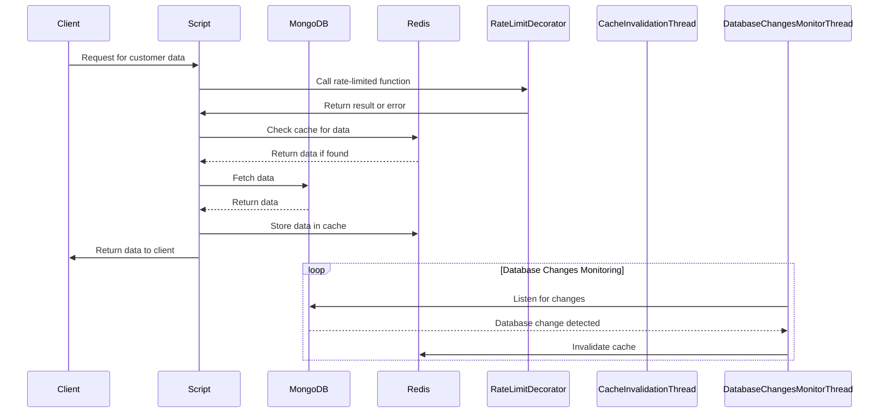
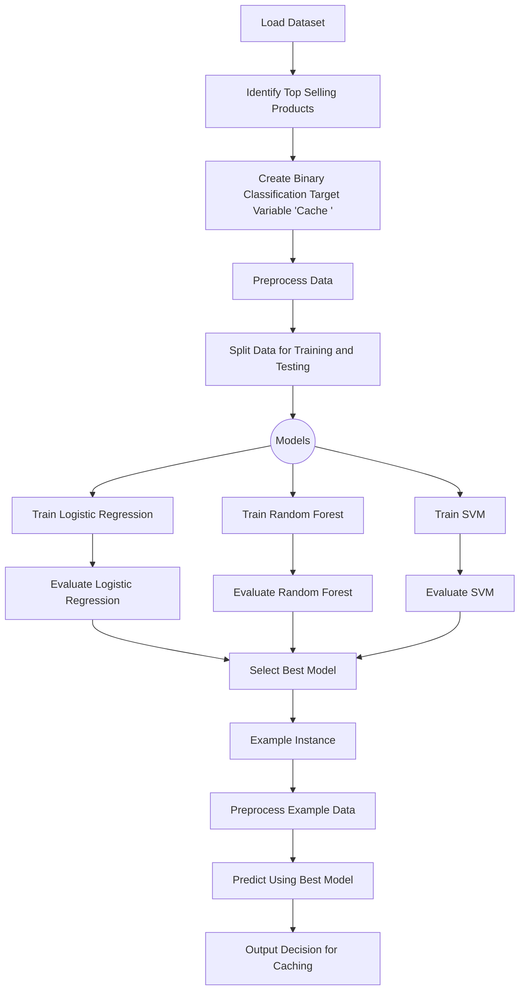

<!-- toc -->

- [Redis Cache to fetch user profiles](#redis-cache-optimization)
  * [1. How to run the Project](#1-how-to-run-the-project)
  * [2. Code files and Datasets](#2-code-files-and-datasets)
    + [`Python Script`](#python-script)
    + [`product_data.csv`](#product_datacsv)
    + [`Dockerfile`](#dockerfile)
    + [`docker-compose.yml`](#docker-composeyml)
  * [3. Project Diagrams](#3-project-diagrams)
    + [Redis Cache with MongoDB to fetch user data](#redis-cache-with-mongodb-to-fetch-user-data)
    + [Cache prediction for Redis optimization](#cache-prediction-for-redis-optimization)
  * [4. Conclusion](#4-conclusion)

<!-- tocstop -->

# Redis Cache to fetch user profiles

Author: Shaunak Dhande, GitHub account: Shaunak01, Email: sdhande@umd.edu

The first part of project is designed to optimize data retrieval performance
that interacts with a MongoDB database by implementing a caching mechanism using
Redis. The system involves inserting customer data into MongoDB, while
concurrently caching frequently accessed data in Redis to expedite subsequent
retrieval. The script integrates rate limiting to control access to the database
and ensure fair resource usage. Additionally, it monitors database changes in
real-time, invalidating the cache accordingly to maintain data consistency. This
part aims to enhance application responsiveness and scalability by efficiently
managing data retrieval through a combination of caching and rate limiting
strategies.

The next part implements a classification aimed at optimizing Redis caching by
predicting whether certain product data should be stored in Redis based on its
features. Initially, it preprocesses a dataset containing information about
products, identifying the top-selling products and creating a binary
classification target variable ('Cache') based on sales volume and ratings. It
then splits the data for training and testing, utilizing various machine
learning models including Logistic Regression, Random Forest, and SVM, to
predict the likelihood of caching. The Random Forest model is chosen for its
predictive performance. Subsequently, an example product instance is constructed
and passed through the trained Random Forest model to predict whether it should
be cached in Redis or not, offering a practical application of the
classification model for caching optimization.

## 1. How to run the Project

To run the project, follow these steps:

- Ensure Docker is installed on your system.
- Clone or download the project repository containing the Dockerfile and
  necessary files.
- Navigate to the directory containing the Dockerfile and other project files in
  your terminal.
- Run the following command to build and launch the Docker container:
  ```
  > docker-compose up
  ```
- When you run docker-compose up, it orchestrates the deployment of the project
  within Docker containers, ensuring portability and isolation of the
  environment. The command launches three containers
  - Cache Prediction Container: This container hosts the Jupyter Notebook
    interface, providing a web-based environment for running and interacting
    with project code.
  - MongoDB Container: Hosts the MongoDB database, responsible for storing
    customer data and interacting with the caching mechanism implemented in the
    project.
  - Redis Container: Hosts the Redis database, serving as the caching mechanism
    for frequently accessed data.
- Once the Docker container is running, it will launch a Jupyter Notebook
  server. In the terminal logs, you will find a link to access the Jupyter
  Notebook interface.
- Click on the provided link to access the Jupyter Notebook interface in your
  web browser. If the notebook does not display anything initially, open the
  link in a private browser/window to avoid cache issues.
- Once inside the Jupyter Notebook interface, you'll find the `.ipynb` file
  containing the code for the project.
- Open the `.ipynb` file to review the project code and functionalities.
- Run the cells in the notebooks to execute the code and observe the results.
- After reviewing the projects and functionalities, you can stop the Docker
  container by pressing `Ctrl + C ` in the terminal where it's running, and then
  typing
  ```
  > docker-compose down
  ```

By following these steps, you can easily run and review the project within a
Docker container, ensuring isolation and portability of the environment.

## 2. Code files and Datasets

### `Redis_cache_to_fetch_profile.ipynb`

This script implements a caching mechanism using Redis for a MongoDB
database with e-commerce data. It includes functionalities for data insertion
into MongoDB, retrieval with rate limiting and caching, and cache invalidation
based on database changes. The script establishes connections to both MongoDB
and Redis, integrates rate limiting using a decorator, and defines functions for
data retrieval and cache management. Additionally, it monitors database changes
in real-time to maintain cache consistency. The script is part of a larger
project aimed at optimizing data retrieval performance and ensuring efficient
resource usage in the e-commerce platform.

This next part focuses on optimizing Redis caching through predictive
classification of product data. The code preprocesses a dataset containing
product information, identifying the top-selling products and creating a binary
classification target variable ('Cache') based on sales volume and ratings.
Machine learning models, including Logistic Regression, Random Forest, and SVM,
are trained to predict the likelihood of caching. The Random Forest model is
chosen for its predictive performance. Additionally, an example product instance
is constructed and passed through the trained Random Forest model to determine
whether it should be cached in Redis or not. This project encapsulates a
practical application of classification techniques for caching optimization in
memory systems.

### `product_data.csv`

The dataset consists of product information including titles, prices, retail
prices, currency, units sold, use of ad boosts, ratings, rating counts, badge
counts, shipping details, tags, product color, product variation size, shipping
options, shipping prices, shipping express status, countries shipped to,
inventory totals, urgency indicators, origin country, merchant details, merchant
ratings, merchant profile information, product URLs, product pictures, product
IDs, theme, and crawl month. The dataset encompasses various product categories
and attributes, providing a comprehensive view of the products available, their
popularity, and associated metadata for analysis and classification tasks.

### `Dockerfile`

This `Dockerfile` defines a container environment for the Python-based project.
It starts by setting the working directory to `/app` and copying the project
files into the container. The file then installs necessary Python packages using
pip, including pymongo, redis, ratelimit, scikit-learn, pandas, matplotlib, and
jupyter. It exposes `port 8888` for the Jupyter Notebook server. Additionally,
it creates a directory for MongoDB data, changes its ownership, and finally,
specifies the command to run the Jupyter Notebook server upon container launch,
allowing external access to the notebook interface. This Dockerfile encapsulates
the setup and dependencies required to run the project within a containerized
environment, facilitating easy deployment and reproducibility.

### `docker-compose.yml`

This `docker-compose.yml` file defines a multi-service Docker environment for a
project. It specifies three services: `cache_prediction`, `mongodb`, and `redis`. The
`cache_prediction` service builds an image from the current directory, exposes port 8888
for the Jupyter Notebook server, mounts the current directory as a volume in the
container, sets an environment variable for Python buffering, and runs the
Jupyter Notebook server command upon container launch. The `mongodb` service
uses the official MongoDB image, exposes `port 27017` for MongoDB, mounts a
volume for MongoDB data storage, and connects to the custom Docker network named
`my_network`. Similarly, the `redis` service uses the official Redis image,
exposes `port 6379` for Redis, and connects to the `my_network` network. Custom
networks are defined for service communication, and a volume named
`mongodb_data` is created for persistent MongoDB data storage. Overall, this
`docker-compose.yml` file orchestrates the deployment of multiple services
required for the project, ensuring seamless interaction and communication within
the Docker environment.

## 3. Project Diagrams

### Redis Cache with MongoDB to fetch user data



### Cache prediction for Redis optimization



## 4. Conclusion

In conclusion, this project presents a comprehensive solution for optimizing
data retrieval performance and resource utilization in an application through
the integration of Redis caching and machine learning techniques. By leveraging
Redis as a caching mechanism for frequently accessed data and employing machine
learning models to predict caching suitability based on product features, the
system enhances application responsiveness and scalability. Real-time monitoring
and automated cache invalidation mechanisms further ensure data consistency and
reliability. Through proactive cache management and predictive caching
strategies, the project not only improves cache hit rates and reduces cache
misses but also contributes to overall system efficiency and performance in
large-scale e-commerce environments.
