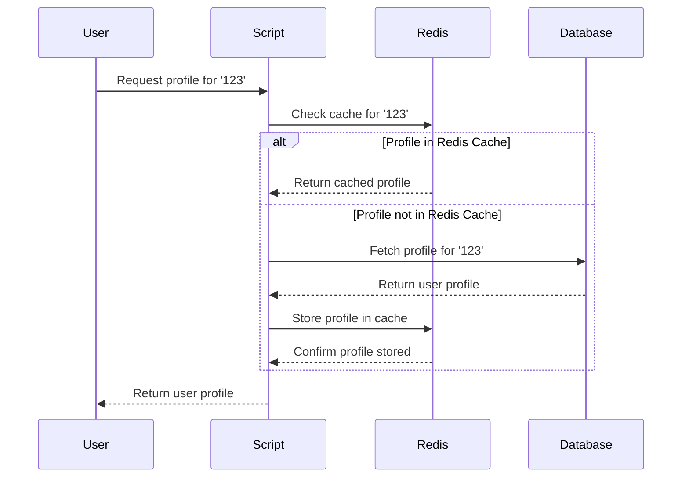

# Redis cache to fetch user profile

## Author info

- Author: Shaunak Dhande
- GitHub account: Shaunak01
- UMD email: sdhande@umd.edu
- Personal email: sdhande@umd.edu

## Description

This is a Python based project that exemplifies a straightforward implementation
of user profile caching using Redis. This efficient mechanism aims to enhance the
retrieval speed of user profiles by employing Redis, a high-performance in-memory
data structure store.

## Technologies

### Redis: In-Memory Data Structure Store

- Redis is an advanced key-value store known for its speed and versatility
- Functioning as an in-memory data structure store, Redis holds data in RAM,
  allowing for fast read and write operations
- It supports various data structures, including strings, hashes, lists, and
  sets, making it suitable for a wide range of use cases
- Redis is often used as a caching mechanism to boost the performance of
  applications by reducing the time it takes to retrieve frequently accessed
  data
- Additionally, its support for advanced features like pub/sub messaging and
  transactions makes it a valuable tool for building scalable and responsive
  systems.

- Redis serves as the backbone of this project, providing an in-memory data
  structure for key-value pair storage and retrieval. In the context of the
  project, Redis is employed as a caching mechanism
- The speed of data retrieval from Redis significantly outpaces traditional
  databases, making it an ideal choice for scenarios where rapid access to
  frequently used data, such as user profiles, is paramount.

- The function that retrieved user profiles showcases the power of Redis caching.
- It first checks if the user's profile is already present in the Redis cache
  - If found, the profile is retrieved directly from Redis
  - If not found, the script fetches the profile from the mock database, stores
    it in Redis for future use, and then returns the profile
- This use of Redis caching optimizes the overall performance of the application
  by reducing the load on the underlying data source

### Docker: Containerization for Portability

- Docker is a containerization platform that simplifies the process of
  developing, deploying, and running applications
- It allows developers to package an application and its dependencies into a
  lightweight, portable container
- These containers can run consistently across different environments, ensuring
  that the application behaves the same way in development, testing, and
  production
- Docker provides a standardized way to encapsulate and distribute applications,
  making it easier to manage dependencies, streamline deployment, and enhance
  collaboration among development teams.

- The Dockerfile specifies the use of an official Python runtime as the base
  image, installs the Redis server, and copies the Python script and mock
  database file into the container. The resulting Docker image encapsulates the
  entire project, making it easily deployable and scalable.

- By using Docker, the project achieves portability and encapsulation, allowing
  developers to run the application in any environment with minimal setup.

## Docker implementation

- The Docker system designed for this project follows a logical sequence to
  ensure a smooth and consistent environment for both development and deployment

- Let's delve into the intricacies of the Docker system logic:

- Project Setup:
  - Begin with organizing your project files within a directory structure. The
    main files include:
    - `Redis_cache_to_fetch_user_profile.ipynb`: Contains the Jupyter Notebook
      code for fetching user profiles with Redis caching.
    - `Dockerfile`: Includes instructions for building a Docker image for the
      project.
    - `Docker-compose.yaml`: Defines services, networks, and volumes for Docker
      containers.

- Dockerfile Configuration:
  - Start by setting up the Dockerfile with the following steps:
    - Utilize an official Python runtime as the base image `python:3.8-slim`
    - Set the working directory in the container to `/app`.
    - Copy the project files into the container.
    - Install necessary dependencies (redis and notebook) using pip.
    - `Expose port 8888` for the Jupyter Notebook server.
    - Specify the default command to run the Jupyter Notebook server.

- Docker-compose.yaml Configuration:
  - Configure the docker-compose.yaml file to define the services required for
    the project:
    - Define two services: redis and notebook.
    - Configure the redis service:
      - Use the official redis:latest image.
      - Map `port 6378` on the host to `port 6379` in the container.
      - Set the container name as redis-server.
    - Configure the notebook service:
      - Use the custom Docker image built from the Dockerfile.
      - Map `port 8888` on the host to `port 8888` in the container.
      - Set the `REDIS_HOST` environment variable to redis.
      - Make it dependent on the redis service.
      - Specify the container name as `notebook-server`.
      - Mount the project directory into the container at `/app`.

- Building the Docker Image:
  - Execute `docker build -t <your_image_name> .` to build the Docker image
    using the Dockerfile.
  - Replace `<your_image_name>` with a suitable name for the Docker image.

- Running the Docker Containers:
  - Start the Docker containers with `docker-compose up`.
  - Docker Compose will create and launch containers for the redis and notebook
    services.
  - Access the Jupyter Notebook server at `http://localhost:8888` in a web
    browser.

- Accessing the Jupyter Notebook Server:
  - Navigate to `http://localhost:8888` in a web browser to access the Jupyter
    Notebook interface.
  - Interact with your notebook file (Redis_cache_to_fetch_user_profile.ipynb)
    to execute code for fetching user profiles using Redis caching.

- Stopping the Docker Containers:
  - To stop containers, press `Ctrl + C` in the terminal running
    `docker-compose up`.
  - Alternatively, use `docker-compose down` to stop and remove containers.

## 3. Python Script Overview

The Redis Cache to Fetch User Profiles script demonstrates an efficient approach
to user profile caching using Redis. The script is structured to fetch user
profiles from a mock database, implement caching with Redis, and showcase the
seamless integration of Docker for containerization.

The script is primarily divided into three sections:

- Set up Redis Connection: The script begins by establishing a connection to a
  Redis server to enable caching of user profiles.The `REDIS_HOST` environment
  variable is utilized to dynamically specify the host address of the Redis
  server.

- Mock Database: The json data is saved in a variable in the script. User can
  also include an externl json file.

- Fetch User Profile Function:
  - Implements the `fetch_user_profile` function to read the mock database file
    and retrieve a user's profile based on their ID.
  - Implements the `get_user_profile` function to check if the user's profile is
    in the Redis cache, fetches it if present, or retrieves it from the mock
    database, stores it in the cache, and returns the profile.

- Example Usage: Provides an example usage at the end of the script,
  demonstrating how to fetch a user's profile using the caching mechanism.

- Example Output: Let's walk through the script's functionality with an example:
  ```
  user_id_to_fetch = '123'
  user_profile = get_user_profile(user_id_to_fetch)
  print(f"Fetched user profile: {user_profile}")
  ```

- Output Explanation:
  - If the user profile is in the Redis cache:
    ```
    User profile for 123 found in Redis cache.
    Fetched user profile: {'user_id': '123', 'name': 'Shaunak Dhande', 'email': 'shaunakdhande4000@gmail.com', 'age': 22}
    ```
  - If the user profile is not in the Redis cache:
    ```
    User profile for 123 not found in cache. Fetched from the database and stored in Redis.
    Fetched user profile: {'user_id': '123', 'name': 'Shaunak Dhande', 'email': 'shaunakdhande4000@gmail.com', 'age': 22}
    ```

## 4. Mock Database Schema

The mock database follows a simple JSON structure where each user profile is
represented as a dictionary. The schema includes the user's ID, name, email, and
age.
```
{
  "123": {
    "user_id": "123",
    "name": "Shaunak Dhande",
    "email": "shaunakdhande4000@gmail.com",
    "age": 22
  },
  "456": {
    "user_id": "456",
    "name": "Alice Johnson",
    "email": "alice.johnson@example.com",
    "age": 30
  },
  // Additional profiles...
}
```

## 5. Project Diagram



## 6. Conclusion

The Redis Cache to Fetch User Profiles project establishes an effective synergy
between Redis caching, Python scripting, and Docker containerization. By
prioritizing efficient user profile retrieval, the project showcases the power
of Redis in optimizing data access, minimizing database load, and enhancing
overall system responsiveness. The seamless integration of Docker ensures a
consistent and portable environment, simplifying deployment across various
platforms. With its clear logical structure, illustrated diagrams, and practical
example usage, the project serves as a valuable resource for developers looking
to implement robust caching mechanisms in their applications. While achieving
its primary goals, the project also opens avenues for future enhancements,
encouraging exploration of advanced Redis features and scalability
considerations.
