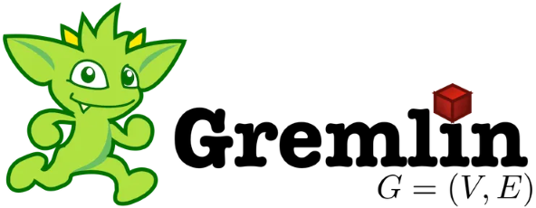

# Graph Traversal with Gremlin
Rick Powell - DATA 605

**Project Description:** Begin by installing Apache TinkerPop's Gremlin Python library (gremlinpython). Next, create a sample graph structure using Gremlin's graph traversal API. Define vertices and edges, and establish connections between them to form a graph. Then, use Gremlin queries to traverse the graph, retrieving vertices, edges, and their properties. Experiment with various traversal strategies and filtering techniques to explore different aspects of the graph.

**Files Contained:**
* [gremlin.py](./gremlin.py): Python file to connect to Gremlin server and run basic graph functions and traversals.
* [dockerfile](./dockerfile): Dockerfile to set up container and run python file
* [docker-compose.yml](./docker-compose.yml): Docker-compose to create Gremlin server and run Gremlin python code
* [requirements.txt](./requirements.txt): Required packages to run my dockerfile
* [wait-for-it.sh](./wait-for-it.sh): File to ensure gremlin python file runs after gremlin-server is created. From: https://github.com/vishnubob/wait-for-it

## Video Demo:
Here is a link to a video demonstration of this project: [Graph Traversal with Gremlin](https://www.youtube.com/watch?v=AAoiSMdADtA).

## Technology Used:
 

This project is a basic introduction to Apache Tinkerpop: Gremlin, a program used to create a sample graph structure, define vertices and edges, establish connections between them, and then query this graph. More information on Gremlin can be found [here](https://tinkerpop.apache.org/gremlin.html).

Major defining features of Gremlin are that it provides a powerful set of functions for traversing graphs, enabling users to perform operations like adding vertices, defining edges, and querying graph elements efficiently. It also supports multiple programming languages, including Python, Java, and Groovy, making it accessible to a wide range of developers. And it is designed to work with distributed graph databases, allowing users to scale their graph processing tasks across multiple machines or clusters.

What separates Gremlin from other graph programs is that Gremlin's expressive syntax allows for complex graph traversals and manipulations. Another reason to use Gremlin is that it supports various graph database implementations, such as Apache Cassandra, Neo4j, and Amazon Neptune. Being an Apache project, TinkerPop benefits from a vibrant community of developers contributing to its ecosystem. The biggest drawback to using Gremlin is the learning curve. It takes time to understand Gremlin's traversal language and it requires some initial investment in learning how to work with the Gremlin server. Also some complex queries or large datasets may introduce performance bottlenecks when needing to traverse the entire graph.

Unlike many of the other python programs we have used in this class, Gremlin works by connecting to a Gremlin server, and then using the connection to that server to run through our code. For each query, there are specific tags that need to be attached in order to tell Gremlin to query the server. An example of this is:

```python
v1 = g.addV('person').property('name', 'Alpha').property('age', 22).next()
```

This creates a vertex for a 'person' with the property 'name' equal to Alpha, and 'age' equal to 22. Finally, we use `.next()` to confirm with Gremlin that we are running the line of code.

## Docker System

The Docker system has a couple main pieces. The first is the dockerfile, which starts up our image.

``` bash
# Use an official Python runtime as a parent image
FROM python:3

# Set the working directory in the container
WORKDIR /usr/src/app

# Copy the current directory contents into the container at /usr/src/app
COPY . .

# Give execute permissions for wait-for-it.sh
RUN chmod +x wait-for-it.sh

# Install any needed dependencies specified in requirements.txt
RUN pip install --no-cache-dir -r requirements.txt

# Run gremlin_script.py when the container launches
CMD ["python", "./gremlin.py"]
```

This dockerfile sets up the python image for us to work in and sets the working directory in the container. Then it copies the current directory contents into the container. After that, in order to use our [wait-for-it.sh](./wait-for-it.sh) without running into issues regarding permissions, we run chmod to grant those permissions. Finally, we install our dependencies from ['requirements.txt](./requirements.txt), which tells our docker to install gremlinpython, along with its dependencies. Finally, it calls to launch our python script [gremlin.py](./gremlin.py) when the container launches.

Then we have the docker-compose.yml file, which creates the gremlin server container and then the gremlin-python container. 

``` bash
services:
# creates gremlin-server at port 8182
  gremlin-server:
    image: tinkerpop/gremlin-server
    ports:
      - "8182:8182"

# creates gremlin-python after the gremlin-server is created
  gremlin-python:
    build:
      context: .
    depends_on:
      - gremlin-server
    command: ["./wait-for-it.sh", "gremlin-server:8182", "--", "python", "gremlin.py"]
```

This docker-compose file creates the gremlin server at port 8182, and then creates the gremlin python container. Due to how quickly the gremlin python container takes to run compared to the how quickly the gremlin server is created, we need to use [wait-for-it.sh](./wait-for-it.sh), in order to ensure that the server is completed before it starts the gremlin python.

## Python File

At the top of our python file, we have all of the imports for using Gremlin in the rest of this project. All of these are taken care of from our requirements imports in our dockerfile:

```python
from gremlin_python import statics
from gremlin_python.structure.graph import Graph
from gremlin_python.driver.driver_remote_connection import DriverRemoteConnection
from gremlin_python.process.anonymous_traversal import traversal
from gremlin_python.process.traversal import T
from gremlin_python.process.graph_traversal import __
```

Using Gremlin, we need to connect to the gremlin-server we created in order to traverse through our graph. At the start of our python file, we use the following code to remove connect to our server and begin a graph, g.

```python
# set the graph traversal from the local machine:
connection = DriverRemoteConnection("ws://gremlin-server:8182/gremlin", "g")  # Connect it to your local server
g = traversal().withRemote(connection)
```

Next, we create vertices and edges for our graph. In the block below, I've only included 2 of each, but in the actual python file, we create numerous vertices and edges. As I pointed out earlier, we use `.next()` in order to tell python to run our code through our gremlin server. Without it, our code will not run.

```python
# Add vertices with properties
v1 = g.addV('person').property('name', 'Alpha').property('age', 22).next()
v2 = g.addV('person').property('name', 'Beta').property('age', 37).next()

# Add edges
e1 = g.V(v1).addE('knows').to(__.V(v2)).property('weight', 5).next()
e2 = g.V(v1).addE('knows').to(__.V(v3)).property('weight', 3).next()
```

The first traversals we'll do are just grabbing all of the vertices and edges from our graph. Similar to `.next()`, we use `.toList()` to put our vertices and edges into a list.

```python
# Traverse the graph to get all vertices
vertices = g.V().toList()
print("Vertices:", vertices)

# Traverse the graph to get all edges
edges = g.E().toList()
print("Edges:", edges)
```

Next, we'll go through and get the name and age properties for all of our vertices:

```python
# Traverse the graph to get the names of all vertices
vertex = g.V().valueMap().toList()
# Print out the name and age of each vertex
for name_age in vertex:
    print(name_age)
```

We want to find all of the people known by a particular vertex. Again, here, I will only list out two examples, one using `.out()` to show the edges going from a vertex, and `.in_()` to show the edges going into a vertex. In our python file, we will have multiple traversals to find who is known by each vertex.

```python
# Example traversal: Find all people known by Alpha
result = g.V().has('name', 'Alpha').out('knows').toList()
print("People known by Alpha:", result)

# Example traversal: Find all people who know Epsilon
result = g.V().has('name', 'Epsilon').in_('knows').toList()
print("People who know Epsilon:", result)
```

Find all the vertices marked `person` that have `age = 37`.

```python
# Traverse the graph to get all vertices with age = 37
age_37 = g.V().hasLabel('person').has('age', 37).valueMap().toList()
print("Who is 37 years old?", age_37)
```
Expanding on the previous traversal, we want to find all the vertices marked `person` who are above the age of `30`.

```python
# Traverse the graph to get the names and ages of all vertices
names_and_ages = g.V().hasLabel('person').valueMap('name', 'age').toList()

# Filter vertices based on age greater than a certain number
age_threshold = 30
filtered_names_and_ages = [(vertex_data['name'][0], vertex_data['age'][0]) for vertex_data in names_and_ages if int(vertex_data['age'][0]) > age_threshold]

# Print the filtered names and ages
print("Names and Ages above:", age_threshold, ':')
for name, age in filtered_names_and_ages:
    print(f"Name: {name}, Age: {age}")
```

We find and print the weights of all the edges.
```python
# Traverse the graph to get the weights of all edges
weights = g.E().valueMap('weight').toList()

# Print the weights of all edges
print("Weights of all edges:")
for weight in weights:
    print(f"Weight: {weight}")
```

Finally, after we complete all of our traversals, we close the connection to our gremlin-server. I've also included a print statement to let the user know that our code has complete and closed the connection.

```python
# Close the connection
connection.close()

print('**Code Complete** Close connection to Gremlin Server.')
```

## Running the Docker
In order to run the docker, you only need to enter the following code.
```bash
docker-compose up
```
This will start the docker process and it will run through the entire project.

## Execution and Output

When you run the code, docker will begin starting up the gremlin-server.


After that, you will see the gremlin-python image being built.


And finally, a notification that the gremlin-server and gremlin-python containers have been created.


When the gremlin server is finally started up, the gremlin python container runs and the [gremlin.py](./gremlin.py) file. This python file connects to our gremlin server and runs through the entire script that we went through above.

As the Gremlin server starts up, you'll see the Gremlin at in the terminal.
```
gremlin-server-1  | [INFO] o.a.t.g.s.GremlinServer - 3.7.2
gremlin-server-1  |          \,,,/
gremlin-server-1  |          (o o)
gremlin-server-1  | -----oOOo-(3)-oOOo-----
```

At the end of the gremlin-server code, you'll see that the channel has been started at port 8182, and then the [wait-for-it.sh](./wait-for-it.sh) code telling you that the gremlin-server is up and starting the gremlin-python container.

```
gremlin-server-1  | [INFO] o.a.t.g.s.GremlinServer$1 - Channel started at port 8182.
gremlin-python-1  | wait-for-it.sh: gremlin-server:8182 is available after 13 seconds
```

Finally, the gremlin-python code will run in the terminal and the expected output should look like this:

```
gremlin-python-1  | Vertices: [v[0], v[18], v[3], v[21], v[6], v[9], v[12], v[15]]
gremlin-python-1  | Edges: [e[32][12-knows->9], e[33][6-owns->15], e[34][6-owns->18], e[35][12-owns->21], e[24][0-knows->3], e[25][0-knows->6], e[26][0-knows->12], e[27][3-knows->6], e[28][9-knows->12], e[29][12-knows->0], e[30][12-knows->3], e[31][12-knows->6]]
gremlin-python-1  | {'name': ['Alpha'], 'age': [22]}
gremlin-python-1  | {'name': ['Eta'], 'age': [2]}
gremlin-python-1  | {'name': ['Beta'], 'age': [37]}
gremlin-python-1  | {'name': ['Theta'], 'age': [9]}
gremlin-python-1  | {'name': ['Gamma'], 'age': [28]}
gremlin-python-1  | {'name': ['Delta'], 'age': [66]}
gremlin-python-1  | {'name': ['Epsilon'], 'age': [45]}
gremlin-python-1  | {'name': ['Zeta'], 'age': [5]}
gremlin-python-1  | People known by Alpha: [v[3], v[6], v[12]]
gremlin-python-1  | People known by Beta: [v[6]]
gremlin-python-1  | People known by Gamma: []
gremlin-python-1  | Dogs owned by Gamma: [v[15], v[18]]
gremlin-python-1  | People known by Delta: [v[12]]
gremlin-python-1  | People known by Epsilon: [v[9], v[0], v[3], v[6]]
gremlin-python-1  | People who know Epsilon: [v[0], v[9]]
gremlin-python-1  | Dogs owned by Epsilon: [v[21]]
gremlin-python-1  | List of People: [v[0], v[3], v[6], v[9], v[12]]
gremlin-python-1  | List of Dogs: [v[18], v[21], v[15]]
gremlin-python-1  | Who is 37 years old? [{'name': ['Beta'], 'age': [37]}]
gremlin-python-1  | Names and Ages above: 30 :
gremlin-python-1  | Name: Beta, Age: 37
gremlin-python-1  | Name: Delta, Age: 66
gremlin-python-1  | Name: Epsilon, Age: 45
gremlin-python-1  | Weights of all edges:
gremlin-python-1  | Weight: {'weight': 3}
gremlin-python-1  | Weight: {'weight': 3}
gremlin-python-1  | Weight: {'weight': 4}
gremlin-python-1  | Weight: {'weight': 4}
gremlin-python-1  | Weight: {'weight': 1}
gremlin-python-1  | Weight: {'weight': 6}
gremlin-python-1  | Weight: {'weight': 6}
gremlin-python-1  | Weight: {'weight': 5}
gremlin-python-1  | Weight: {'weight': 2}
gremlin-python-1  | Weight: {'weight': 7}
gremlin-python-1  | Weight: {'weight': 9}
gremlin-python-1  | Weight: {'weight': 8}
gremlin-python-1  | **Code Complete** Close connection to Gremlin Server.
```

While the Gremlin server is still up, it will sometimes run through a couple of checks which will appear in the terminal, but has no impact on the code. Your results should still be in the terminal above until you close the docker container/images.