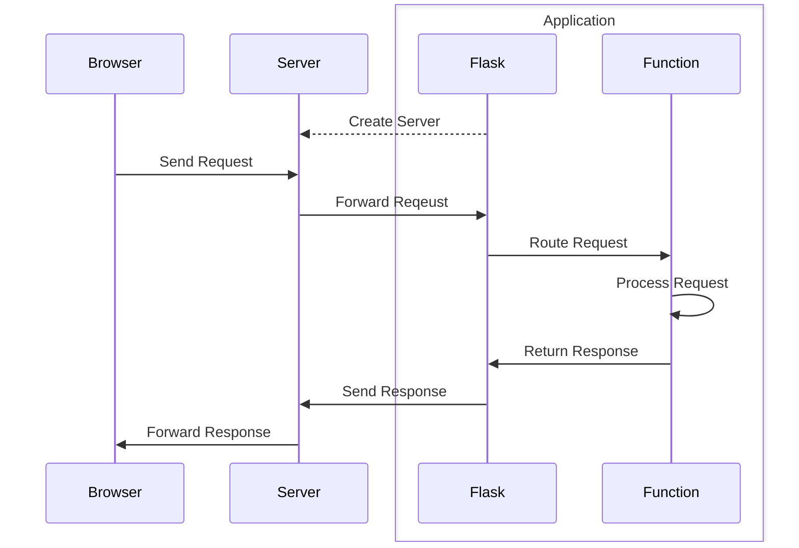

# Rate Limiting API with Redis

This project is a [Flask](https://flask.palletsprojects.com/en/3.0.x/) application. It uses [Flask-Limiter](https://flask-limiter.readthedocs.io/en/stable/) for rate limiting, and [Redis](https://redis.io/) for storage.

## Introduction

## Background

### Flask

Flask is a lightweight, modular web framework for Python. In general, Flask works like this: First, Flask (optionally) starts a server. Next, a browser sends a request to the server, which forwards the request to the application. Then, Flask routes the request to a function, which processes the request, and returns a reponse. Finally, Flask sends the response to the server, which forwards the response to the browser.

Other popular web frameworks for Python include Django (high-level and feature-rich) and FastAPI (modern and...fast).

### Redis

### Docker

## Overview

## Conclusion

## References
