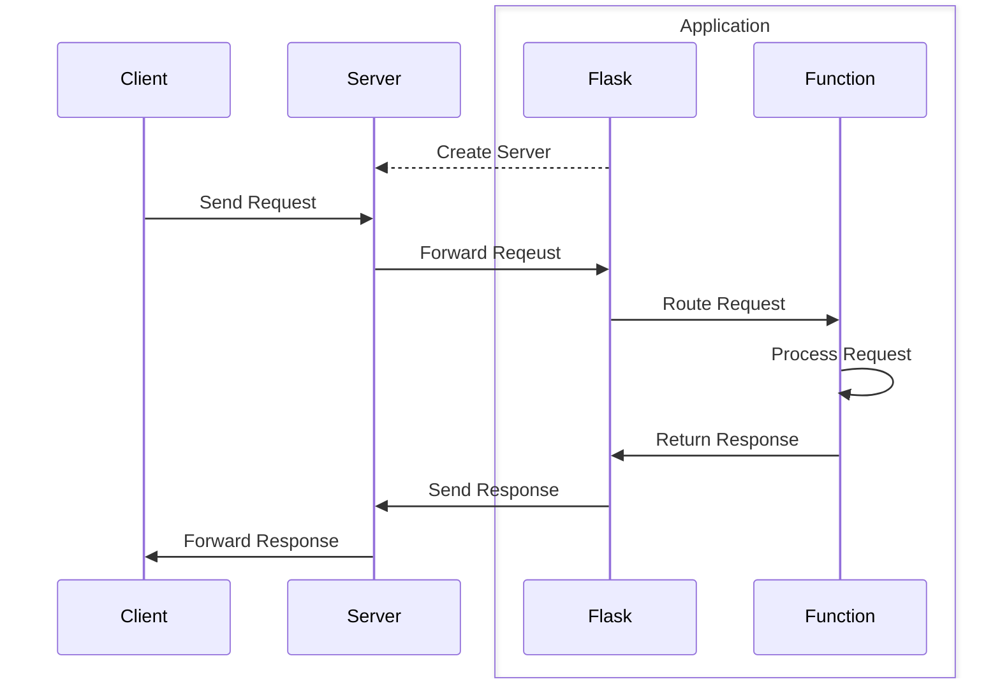
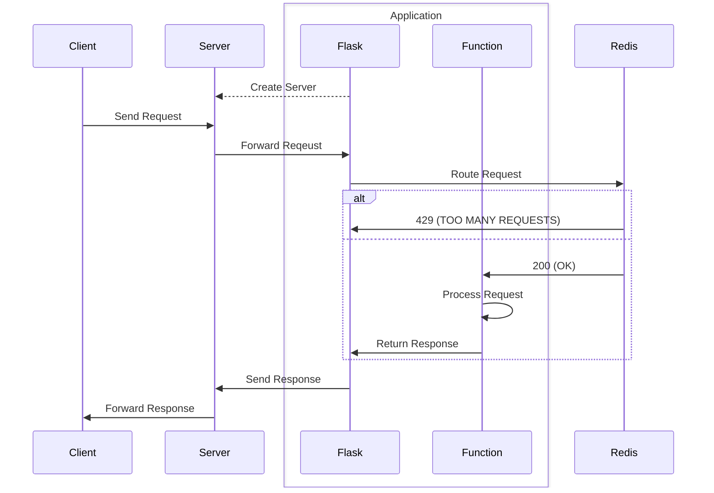

# Rate Limiting API with Redis

This project is a [Flask](https://flask.palletsprojects.com/en/3.0.x/) application. It uses [Flask-Limiter](https://flask-limiter.readthedocs.io/en/stable/) for rate limiting, and [Redis](https://redis.io/) for storage.

## Introduction

## Background

### Flask

Flask is a web framework for Python. In general, Flask works like this: First, Flask (optionally) starts a server. Next, a client sends a request to the server, which forwards the request to the application. Then, Flask routes the request to a function, which processes the request, and returns a reponse. Finally, Flask sends the response to the server, which forwards the response to the client.



- What are other options?
- Django (high-level) and FastAPI (based on type hints)

### Redis

Redis is an in-memory database that persists on disk.

- Why not just store in memory?
- This project uses Redis for rate limiting.
- Flask Limiter abstracts Redis.
- Here's a gross simplification:

```python
import redis
import time

r = redis.Redis(host='redis', port=6379, db=0)

def fixed_window(requests, seconds, ip='127.0.0.1'):
    def decorator(function):
        def wrapper(*args, **kwargs):
            key = f'{function.__name__}:{ip}:{int(time.time() // seconds)}'
            with r.pipeline() as pipe:
                pipe.incr(key)
                pipe.expire(key, seconds)
                count, _ = pipe.execute()
            if count > requests:
                return 'TOO MANY REQUESTS', 429
            return function(*args, **kwargs)
        return wrapper
    return decorator

@fixed_window(10, 60)
def api()
    return 'OK', 200
```

- Flask-Limiter supports Memcached, Redis, and MongoDB
- Flask also allows Fixed Window and Moving Window
- Have to implement Leaky Bucket or Token Bucket yourself

### Docker

## Overview



To run the application, run `docker compose up`.

```console
> docker compose up
[+] Running 2/0
 ✔ Container app-redis-1  Created                                                        0.0s 
 ✔ Container app-flask-1  Created                                                        0.0s 
Attaching to flask-1, redis-1
redis-1  | 1:C 26 Apr 2024 02:49:03.669 # WARNING Memory overcommit must be enabled! Without it, a background save or replication may fail under low memory condition. Being disabled, it can also cause failures without low memory condition, see https://github.com/jemalloc/jemalloc/issues/1328. To fix this issue add 'vm.overcommit_memory = 1' to /etc/sysctl.conf and then reboot or run the command 'sysctl vm.overcommit_memory=1' for this to take effect.
redis-1  | 1:C 26 Apr 2024 02:49:03.674 * oO0OoO0OoO0Oo Redis is starting oO0OoO0OoO0Oo
redis-1  | 1:C 26 Apr 2024 02:49:03.674 * Redis version=7.2.4, bits=64, commit=00000000, modified=0, pid=1, just started
redis-1  | 1:C 26 Apr 2024 02:49:03.674 # Warning: no config file specified, using the default config. In order to specify a config file use redis-server /path/to/redis.conf
redis-1  | 1:M 26 Apr 2024 02:49:03.676 * monotonic clock: POSIX clock_gettime
redis-1  | 1:M 26 Apr 2024 02:49:03.678 * Running mode=standalone, port=6379.
redis-1  | 1:M 26 Apr 2024 02:49:03.681 * Server initialized
redis-1  | 1:M 26 Apr 2024 02:49:03.681 * Loading RDB produced by version 7.2.4
redis-1  | 1:M 26 Apr 2024 02:49:03.681 * RDB age 27 seconds
redis-1  | 1:M 26 Apr 2024 02:49:03.681 * RDB memory usage when created 0.83 Mb
redis-1  | 1:M 26 Apr 2024 02:49:03.681 * Done loading RDB, keys loaded: 0, keys expired: 0.
redis-1  | 1:M 26 Apr 2024 02:49:03.681 * DB loaded from disk: 0.000 seconds
redis-1  | 1:M 26 Apr 2024 02:49:03.681 * Ready to accept connections tcp
flask-1  |  * Serving Flask app 'app'
flask-1  |  * Debug mode: off
flask-1  | WARNING: This is a development server. Do not use it in a production deployment. Use a production WSGI server instead.
flask-1  |  * Running on all addresses (0.0.0.0)
flask-1  |  * Running on http://127.0.0.1:5000
flask-1  |  * Running on http://172.18.0.3:5000
flask-1  | Press CTRL+C to quit
```

Docker will build the Redis and Flask containers. We see that Redis is running on port 6379, and Flask is running on `localhost:5000`.

When we request the page, we see the HTML, CSS, and JavaScript files load normally. Then, I make four rapid API requests. The first three return `200 (OK)`, however the fourth returns `429 (TOO MANY REQUESTS)`. This is intended, and the JavaScript correctly catches the error.


## Conclusion

## References

### Flask
https://en.wikipedia.org/wiki/Flask
https://github.com/pallets/flask
https://github.com/alisaifee/flask-limiter

### Redis
https://en.wikipedia.org/wiki/Redis

https://github.com/redis/redis

https://github.com/redis/redis-py

https://redis.io/docs/latest/commands/incr/

### Misc
https://en.wikipedia.org/wiki/Web_Server_Gateway_Interface

https://levelup.gitconnected.com/top-5-rate-limiting-tactics-for-optimal-traffic-5ea77fd4461c

^ This has a great infographic

https://github.com/DomainTools/rate-limit
