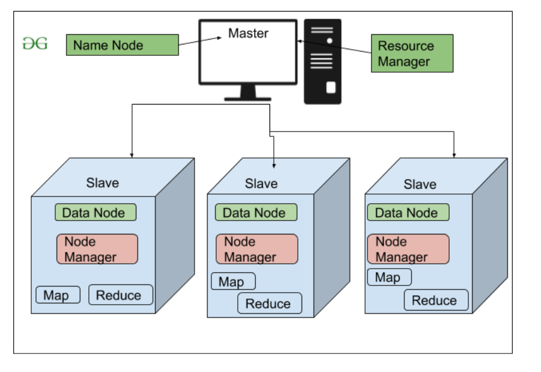
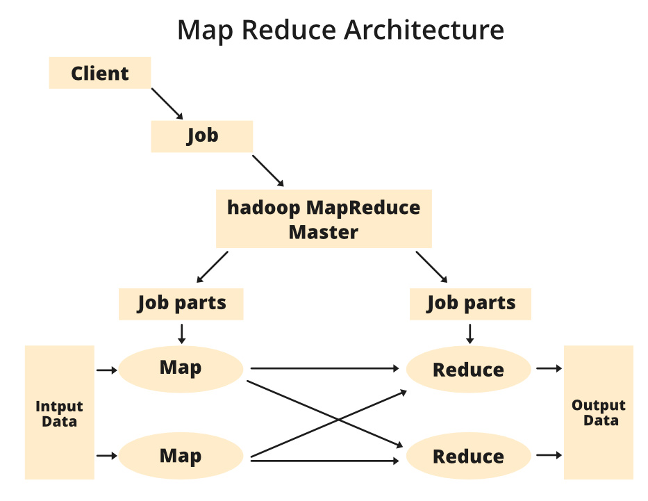

# DATA 605 Big Data Systems
Final Project Report: Word Count with Apache Hadoop
By: Katie Ripley 

# Introduction

In the realm of big data systems, the MapReduce framework has emerged as a cornerstone technology for processing vast amounts of data in a distributed manner. Rooted in Google's pioneering work, MapReduce has found widespread adoption through open-source implementations in Java like Apache Hadoop. This framework offers a scalable approach to data processing by dividing tasks into smaller units and executing them across a cluster of machines. Leveraging the power of Hadoop, this project demonstrates the implementation of the word count algorithm, a fundamental task in data analytics and natural language processing. By harnessing the distributed processing capabilities of Hadoop's MapReduce paradigm, the project aims to efficiently handle large volumes of text data and extract meaningful insights.

# Objective

The project utilizes the Hadoop Streaming API, which enables seamless integration of custom scripts or programs with Hadoop's MapReduce framework. This API facilitates the execution of MapReduce jobs on a Hadoop cluster, allowing for parallel processing of data across multiple nodes. The word count algorithm serves as a practical demonstration of MapReduce's capabilities, showcasing its ability to handle complex data processing tasks with ease. Through this implementation, we go into the intricacies of input data handling, partitioning, mapping, reducing, and output formatting within the context of Hadoop's distributed environment. 

# Technology Explained

## Big Data Processing Framework and Infrastructure

<div style="float: right; margin: 0 10px 0 0;">
    
</div>

Apache Hadoop is a foundational technology in big data processing frameworks as it provides a robust infrastructure for distributed processing. This methodology distributes tasks across multiple nodes within the cluster, enabling parallel processing that greatly expedites data handling, making it feasible to analyze massive datasets within manageable time frames. The Hadoop Cluster consists of two main types of nodes: **NameNode** and **DataNodes**. The NameNode acts as the central repository and manager of metadata, keeping track of file locations and permissions. The DataNodes are responsible for storing and processing the actual data, managing data blocks across the cluster, and performing read/write operations as directed by the NameNode. Additionally, it includes resource management components, **YARN** (Yet Another Resource Negotiator), which allocates cluster resources and schedules jobs effectively, ensuring optimized performance and resource utilization.

### Advantages & Disadvantages

- Advantages:
  - Highly scalable, cost-effective, and compatible with unstructured data.
  - Utilizes inexpensive commodity servers and open-source software.
  - Handles large volumes of data by scaling out horizontally.
- Disadvantages:
  - Primarily a batch processing system, not ideal for real-time or interactive processing.
  - Challenges with small files, security, and in-memory processing.


## Programming Model

<div style="float: right; margin: 0 10px 0 0;">
    
</div>

MapReduce is a programming model designed for parallel processing of large datasets across a cluster of computers. The model begins with the user's program specification, where we define the map and reduce operations. Next, the input data is partitioned across multiple machines within the cluster using the Hadoop Distributed File System (HDFS) for efficient data storage and retrieval. The master node then distributes copies of the user-defined MapReduce code to all computing nodes, ensuring that each node possesses the necessary instructions for processing. The data flow progresses to the map phase, undergoes a grouping and sorting step based on the reduced key, and lastly, the output is saved onto disk. Throughout this data flow, Hadoop's HDFS functions as the underlying storage system, managing the storage and retrieval of intermediate and final results.

### Advantages

An essential aspect of MapReduce's data flow is the reuse of cluster resources, which enhances **fault tolerance**. Machines within the cluster are dynamically allocated for various computations across different stages (map, group, reduce) at different times, maximizing resource utilization and computational efficiency. This fault-tolerant design ensures that even if some nodes fail or encounter issues during processing, the overall computation can continue seamlessly, leveraging the available resources effectively to complete the tasks. The MapReduce programming model, integrated with Apache Hadoop's robust infrastructure and fault-tolerant design, sets the stage for showcasing its capabilities through practical applications like the word count application.

## Data Processing and Analysis Techniques

In Natural Language Processing (NLP), various methodologies are employed for data processing and analysis. Tokenization stands out as a foundational step, segmenting text into tokens or words to facilitate word frequency calculations. Addressing case sensitivity ensures consistency in word casing, preventing counting discrepancies due to capitalization variations. Additionally, omitting stop words like "the," "and," or "is" eliminates low-semantic-value words, enhancing the accuracy and relevance of word count analyses. Stemming, another vital technique in data processing and analysis, involves reducing words to their root form, aiding in grouping similar variations and refining word count accuracy. 

In our project, we can easily implement these techniques using the `PorterStemmer` and `NLTK library` in Python programming scripts. Later in this report, we will delve into further detail to discuss the implementation in our `mapper.py` and `reducer.py` scripts

## Programming Languages and Scripts

The Hadoop Streaming API complements MapReduce by enabling developers to use non-Java programming languages, such as Python, for writing mapper and reducer scripts. This API enables seamless integration of custom scripts with Hadoop's MapReduce framework, enhancing flexibility and developer productivity in building distributed data processing solutions. Its simplicity, readability, and extensive libraries make it well-suited for data processing tasks. Python scripts can efficiently handle tokenization, case sensitivity handling, stop words exclusion, and stemming, enhancing the accuracy and efficiency of word count analysis within a distributed computing environment like Apache Hadoop.

# Python Scripts

## `mapper.py`

The `mapper.py` script is designed for word count analysis in a MapReduce job. It begins by importing necessary modules such as `sys`, `string`, and `NLTK` for text processing tasks. The script initializes a `PorterStemmer` for word stemming, loads NLTK's English stopwords, and defines a translation table to remove punctuation from input text. It then reads input from `stdin`, strips whitespace, converts text to lowercase, removes punctuation, and tokenizes the text into words using NLTK's `word_tokenize` function. Each word is checked against the stop words set and verified for alphabetic characters before being stemmed using the `PorterStemmer`. Finally, the script emits each stemmed word with a count of $1$, following the MapReduce paradigm for word count analysis.

<div style="margin: 0 auto; width: 70%; background-color: #ffffff; padding: 10px; text-align: center;">
    
</div>

## `reducer.py`

The `reducer.py` script is part of a MapReduce job for word count analysis. It begins by importing necessary modules such as `defaultdict` and `sys`. The script initializes a `defaultdict` to store word counts and variables for tracking the current word and its count. Input is read from `stdin`, and each line is stripped of leading and trailing whitespace. The input is then parsed into word and count using the tab delimiter. The count is converted to an integer, and a conditional block checks if the current word matches the previous word. If so, the counts are accumulated; otherwise, the previous word's count is outputted, and a new word count begins. The script continues this process until all input is processed, outputting the final word counts. Finally, the word counts are sorted in descending order, and the top 100 most common words and their counts are printed to `stdout`, with additional logging to `stderr` for visibility.

# Building a Docker Container

## Base Image
The Dockerfile uses a base image containing Java 8 and Python.

```Dockerfile
FROM openjdk:8-jdk-slim
```

## Environment Variables
These lines set up environment variables for Java and Hadoop directories.
```Dockerfile
ENV JAVA_HOME=/usr/local/openjdk-8
ENV HADOOP_HOME=/usr/local/hadoop
ENV PATH=${HADOOP_HOME}/bin:${PATH}
```

## Installing Software
This section installs Hadoop version 3.4.0, Python 3 along with pip, NLTK library, and Vim for development convenience.
```Dockerfile
# Install Hadoop
RUN apt-get update && \
    apt-get install -y wget && \
    wget -qO- https://archive.apache.org/dist/hadoop/common/hadoop-3.4.0/ \
        hadoop-3.4.0.tar.gz | tar xvz -C /usr/local/ && \
    mv /usr/local/hadoop-3.4.0 /usr/local/hadoop

# Install Python, pip, nltk and download punkt and stopwords
RUN apt-get install -y python3 && \
    apt-get install -y python3-pip && \
    pip3 install nltk && \
    python3 -m nltk.downloader punkt && \
    python3 -m nltk.downloader stopwords

# Install vim 
RUN apt-get install -y vim
```

## Copying Map Reduce Files
Custom Python scripts (mapper and reducer) are copied into the Docker image.
```Dockerfile
# Copy the Python mapper script into the Docker image
COPY scripts/mapper.py /usr/local/hadoop/
COPY scripts/reducer.py /usr/local/hadoop/
```
## Running Command
This section sets up the working directory, Hadoop environment variables, and specifies the command to run a Hadoop Streaming job when the container starts.
```Dockerfile
# Set the working directory
WORKDIR /usr/local/hadoop

# Set up Hadoop environment variables
ENV HADOOP_CONF_DIR=${HADOOP_HOME}/etc/hadoop

# Run the Hadoop Streaming job when the container starts
CMD ["hadoop", "jar", "/usr/local/hadoop/share/hadoop/tools/ \
        lib/hadoop-streaming-3.4.0.jar", \
     "-files", "/usr/local/hadoop/mapper.py,/usr/local/hadoop/reducer.py", \
     "-input", "/usr/local/hadoop/input.txt", \
     "-output", "/usr/local/hadoop/output", \
     "-mapper", "python3 mapper.py", \
     "-reducer", "python3 reducer.py"]
```

# Docker Compose
The Docker Compose .yml file orchestrates the deployment of a 'hadoop-streaming' service, defining how the Docker image is built using the specified Dockerfile and build context. It also handles data persistence by mapping the local input.txt file from the host to /usr/local/hadoop/input.txt inside the container, ensuring that the required input data is available for the MapReduce job execution. This configuration streamlines the setup for running MapReduce tasks within a Docker container, facilitating efficient data processing and analysis.
```Dockerfile
version: '3'

services:
  hadoop-streaming:
    build: 
      context: . 
      dockerfile: Dockerfile  

    volumes:
      - ./data/input.txt:/usr/local/hadoop/input.txt
```

# Running the Docker Container
This command will build the Docker image using the Dockerfile and start the container based on the specifications in the Docker Compose file.
*WARNING* - Depending on your internet connection, the build time can take as long as 4 mins to 11+ mins. Please be patient.
```Dockerfile
docker-compose up
```
# Expected Output 
Using the above command allows you to run the Hadoop streaming job in a Docker container. First, the Docker Compose command will build the Docker image and start the container. Second, the input.txt file will be copied to the container. Finally the mapper and reducer scripts will be executed on the input data. The output will be displayed on the terminal. Next, we will show the expected output for each step.  

## Building the container
First, the Docker Compose command will build the Docker image and start the container. Initially, building time will take about 2-3 mins to build the image. Once the image is built, the rest goes fast. A successfully built container will show the following output. 
```bash 
katieripley@wireless-10-104-224-44 hadoop-sample % docker-compose up
WARN[0000] /Users/katieripley/Desktop/DATA605/SorrTask777_word_count_with_apache_hadoop/hadoop-sample/docker-compose.yml: `version` is obsolete 
[+] Building 257.8s (15/15) FINISHED                                                       docker-container:hungry_clarke

  ...

[+] Running 1/2
 ✔ Network hadoop-sample_default               Created                                                           
 ⠹ Container hadoop-sample-hadoop-streaming-1  Created    
Attaching to hadoop-streaming-1
```

## Starting mapper.py 
Once the container is built, the Hadoop MapReduce Streaming Job will automatically run. We've set the command to run intentionally for an easy showcase of the MapReduce Streaming Job. For more details on the command, please refer to the Dockerfile - command line. 

In this output, the print statement shows what stage the job is at. If the mapper executes successfully, you should see the following output. 
```bash
hadoop-streaming-1  | 2024-05-07 23:56:00,467 INFO impl.MetricsConfig: Loaded properties from hadoop-metrics2.properties
hadoop-streaming-1  | 2024-05-07 23:56:00,512 INFO impl.MetricsSystemImpl: Scheduled Metric snapshot period at 10 second(s).
hadoop-streaming-1  | 2024-05-07 23:56:00,512 INFO impl.MetricsSystemImpl: JobTracker metrics system started
hadoop-streaming-1  | 2024-05-07 23:56:00,523 WARN impl.MetricsSystemImpl: JobTracker metrics system already initialized!
hadoop-streaming-1  | 2024-05-07 23:56:00,684 INFO mapred.FileInputFormat: Total input files to process : 1
hadoop-streaming-1  | 2024-05-07 23:56:00,701 INFO mapreduce.JobSubmitter: number of splits:1
  ... 
hadoop-streaming-1  | -------------------------------------------- STARTING MAPPER.PY -------------------------------------------
...
```

## Starting reducer.py
In this output, the print statement shows what stage the job is at. Once the mapper executes the reducer script will start. If the reducer executes successfully, you should see the following output directory wehre the file is stored. 
```bash
hadoop-streaming-1  | -------------------------------------------- STARTING REDUCER.PY -------------------------------------------
hadoop-streaming-1  | 2024-05-07 23:56:02,710 INFO streaming.PipeMapRed: R/W/S=1000/0/0 in:NA [rec/s] out:NA [rec/s]
hadoop-streaming-1  | 2024-05-07 23:56:02,718 INFO streaming.PipeMapRed: R/W/S=10000/0/0 in:NA [rec/s] out:NA [rec/s]
```

## Output Results - Preview 10 Most 
Finally, once the job has run, the terminal will display the top 10 most frequent words in addition to the output directory where the file is. 
```bash
hadoop-streaming-1  | ------------------------------------------- TOP 10 MOST COMMON WORDS --------------------------------------------
hadoop-streaming-1  | 1271      propnam
hadoop-streaming-1  | 819       go
hadoop-streaming-1  | 691       get
hadoop-streaming-1  | 652       day
hadoop-streaming-1  | 533       like
hadoop-streaming-1  | 526       im
hadoop-streaming-1  | 477       time
hadoop-streaming-1  | 477       work
hadoop-streaming-1  | 467       one
hadoop-streaming-1  | 448       love
  ...
hadoop-streaming-1  | 2024-05-07 23:56:03,108 INFO streaming.StreamJob: Output directory: /usr/local/hadoop/output
```
## Close Running Containers 
Finally, we can close down the program using the following command. 
```bash
katieripley@wireless-10-104-224-44 hadoop-sample % docker-compose down
WARN[0000] /Users/katieripley/Desktop/DATA605/SorrTask777_word_count_with_apache_hadoop/hadoop-sample/docker-compose.yml: `version` is obsolete 
[+] Running 2/2
 ✔ Container hadoop-sample-hadoop-streaming-1  Removed                                                                                                                     
 ✔ Network hadoop-sample_default               Removed  
```
** ATTENTION ** 
If the directory already exists (**typically occurs if you attempt to run docker-compose up twice in a row, WITHOUT using docker-compose down**), the job will FAIL, as Hadoop doesn't overwrite existing directories or files. To solve this problem, you can remove the output directory using Hadoop's `fs` command. 

## Step 1: Enter into the bash of the container
```bash
docker exec -it <container-id-or-name> bash
```
## Step 2: Inside the container run the followng. 
```bash
hadoop fs -rm -r /usr/local/hadoop/output
```
## Step 3: Retry the Hadoop Streaming
After this, you can run your Hadoop job without worrying about the output directory already existing. 
Here is the command that runs the Hadoop job.
```dockerfile
# Run the Hadoop Streaming job when the container starts
CMD ["hadoop", "jar", "/usr/local/hadoop/share/hadoop/tools/lib/hadoop-streaming-3.4.0.jar", \
     "-files", "/usr/local/hadoop/mapper.py,/usr/local/hadoop/reducer.py", \
     "-input", "/usr/local/hadoop/input.txt", \
     "-output", "/usr/local/hadoop/output", \
     "-mapper", "python3 mapper.py", \
     "-reducer", "python3 reducer.py"]
```

# Summary
Overall, the project delves into the realm of big data processing, focusing on leveraging Apache Hadoop's Map Reduce framework to tackle complex data analytics tasks efficiently. Beginning with an exploration of Hadoop's foundational role in distributed processing, the project highlights its scalability, cost-effectiveness, and compatibility with unstructured data—a stark departure from traditional database technologies.

A detailed examination of the Map Reduce programming model follows, elucidating its core operations like mapping, reducing, and data partitioning. The integration of Python via the Hadoop Streaming API is showcased, underscoring the flexibility and productivity gains it offers for building distributed data processing solutions.

The heart of the project lies in the implementation of the word count algorithm using Python scripts. The mapper script employs advanced text preprocessing techniques such as tokenization, case normalization, stop words removal, and stemming using NLTK, ensuring accurate word frequency calculations. The reducer script aggregates word counts, culminating in insightful analytics output.

For streamlined deployment and execution, Docker containers are employed. The Dockerfile orchestrates the setup, encompassing Java, Python, Hadoop, and requisite libraries, fostering a cohesive environment for running MapReduce jobs. Docker Compose further simplifies orchestration and data persistence, enhancing system manageability.

The project's significance transcends mere implementation, offering a comprehensive understanding of big data processing paradigms, system architecture, and practical integration of technologies. By showcasing real-world applications of Map Reduce and Docker in data analytics, the project equips stakeholders with valuable insights into modern data processing methodologies.


# References + Images 
- https://www.geeksforgeeks.org/hadoop-pros-and-cons/ 
- https://data-flair.training/blogs/advantages-and-disadvantages-of-hadoop/ 
- https://www.shiksha.com/online-courses/articles/hadoop-technology-advantages-and-disadvantages/ 


# Tutorial Video
https://drive.google.com/file/d/1yET2WHNf1tLSRq0_7u5wQq9LyhURTLjy/view


