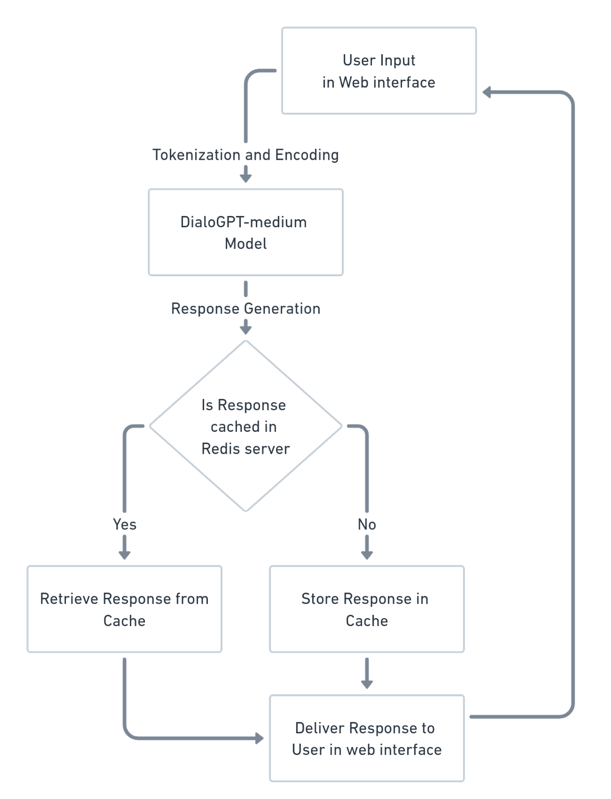
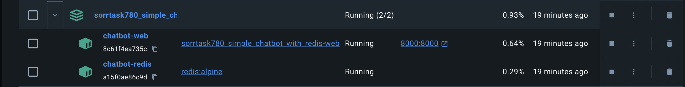
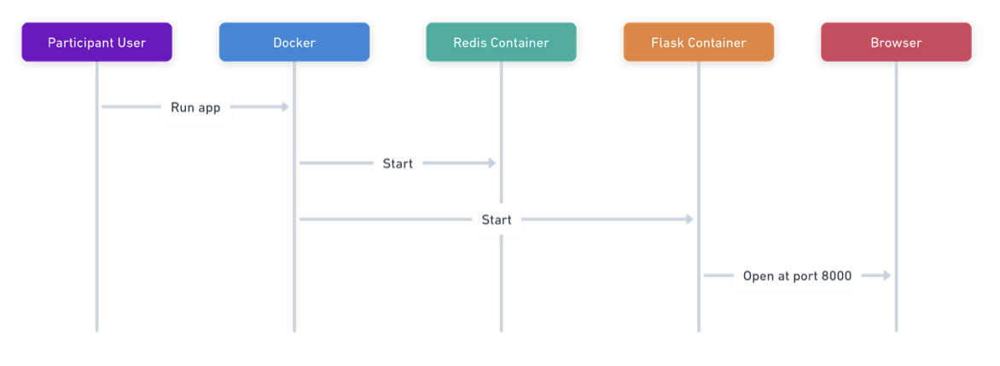
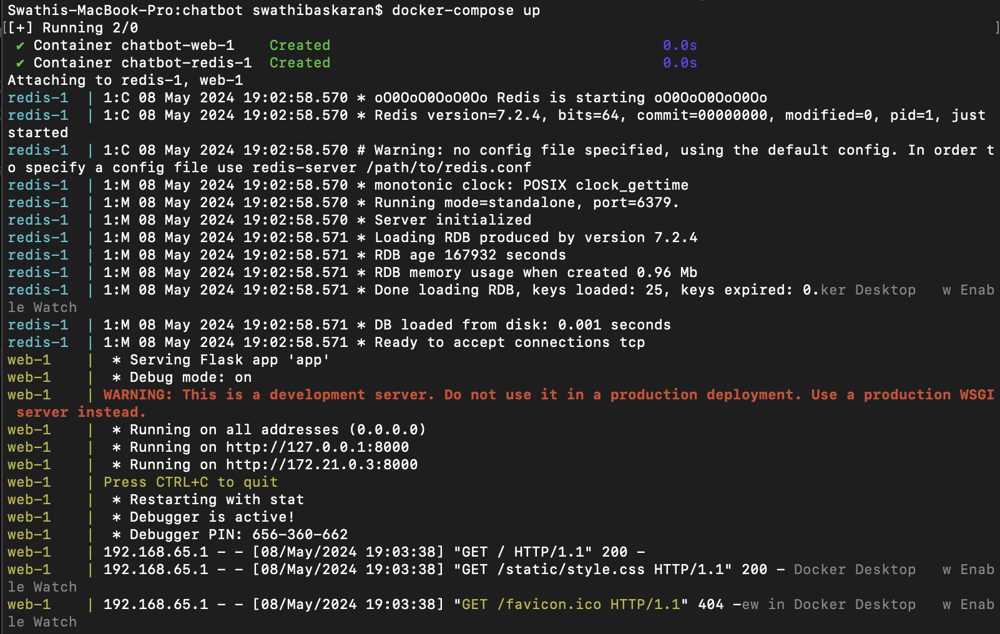
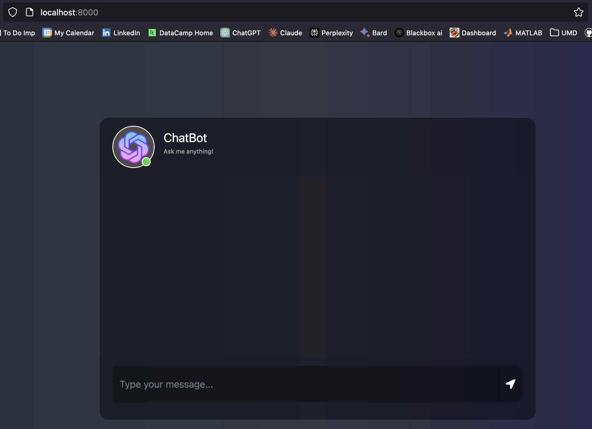
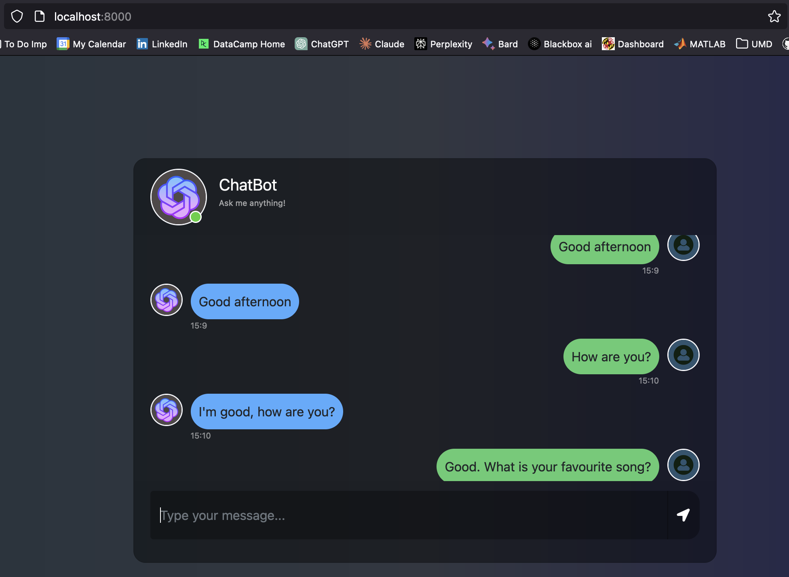
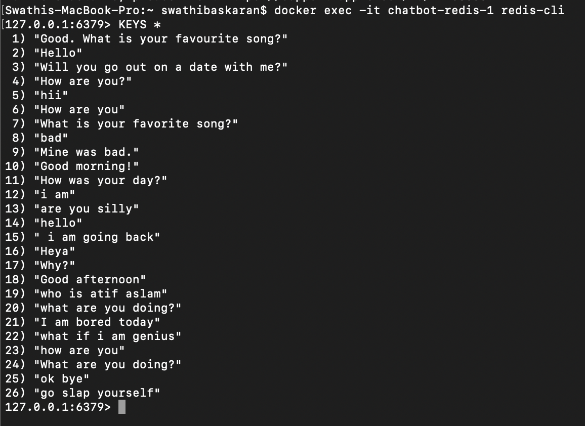
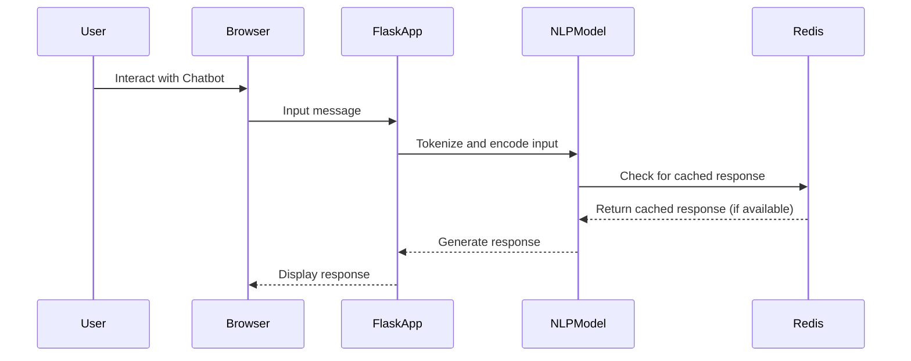

# Simple Chatbot with Redis

## Author

- Author: Swathi Baskaran
- GitHub Handle: 11swathi
- Email: swathib@umd.edu

## Table of Contents

<!-- toc -->

- [Link to the video explanation](#link-to-the-video-explanation)
- [Overview](#overview)
- [How the project works?](#how-the-project-works)
- [Technologies used](#technologies-used)
  * [Flask](#flask)
  * [Redis](#redis)
  * [Docker](#docker)
  * [Huggingface - DialoGPT-medium model](#huggingface)
- [Docker implementation](#docker-implementation)
  * [Dockerfile and compose.yaml code](#dockerfile-and-composeyaml-code)
  * [Docker file exaplanation](#docker-file-explanation)
    + [Containers involved](#containers-involved)
    + [How do the Containers communicate?](#how-do-the-containers-communicate)
- [How to run the project?](#how-to-run-the-project)
  * [Output Screenshots](#output-screenshots)
- [Dive deep into the code](#dive-deep-into-the-code)
  * [Exploring each file](#exploring-each-file)
  * [How Dialo-gpt works?](#how-dialo-gpt-works)
- [Mermaid Chart](#mermaid-chart)
- [Referrence](#referrence)

<!-- tocstop -->

## Link to the video explanation

Link: https://drive.google.com/file/d/1hGhIeJZ1arcEJYY0HQFQdoVAvQIxujQm/view?usp=sharing

## Overview

 - The project aims to develop a simple chatbot for conversational purposes, and finetune it to give a more humanized response 
 
 - This application uses Python, Flask framework for web development, Redis for caching responses, and Hugging Face's Transformers library for Natural Language Processing
 
 - Users can engage with the chatbot through a web interface created using Flask, where their queries are processed in real-time

 - This system incorporates NLP techniques to enhance user interactions and offers a seamless conversational experience
 
 - The chatbot utilizes Redis as a key-value store to map user queries to appropriate responses, enabling quick retrieval and facilitating a smooth conversation flow
 
 - By integrating these features, the chatbot system offers an immersive user experience by providing more dynamic and personalized responses and serves as a foundation for further exploration in conversational AI

## How the project works?

- Users interact with the chatbot by inputting messages through a web interface created using Flask. These messages typically represent queries, requests, or statements from the user

- The chatbot system receives the user input and processes it to understand the context of the message. This processing involves tokenization and encoding of the input text to prepare it for analysis and response generation

- The processed user input is then passed through a NLP model. In this project, the DialoGPT-medium model from Hugging Face Transformers is used for NLP tasks

- DialoGPT is a conversational language model trained on large-scale conversational datasets, allowing it to generate human-like responses based on the input text

- The generated response is designed to be contextually relevant and conversational, simulating a natural human conversation

- To improve response time and efficiency, the application leverages Redis caching. Whenever a response is generated by the chatbot, it is stored in the Redis cache along with the corresponding user query

- Subsequent queries with identical or similar input text can be quickly retrieved from the Redis cache, eliminating the need for reprocessing and regenerating responses

- This caching mechanism enhances the overall responsiveness of the chatbot system, especially for frequently asked questions or common user queries

- Finally, the generated response is delivered back to the user through the web interface, completing the interaction cycle. The user can then continue the conversation by providing additional input, and the process repeats



## Technologies used

### - Flask

- Python is the primary programming language used for developing the chatbot application and managing dependencies

- What is Flask?
    * It is a small and lightweight Python web framework that provides useful tools and features that make creating web applications in Python easier 
    * It provides tools and utilities for handling HTTP requests, routing, templating, and more, making it suitable for developing a wide range of web-based projects

- Why is Flask better?

    * Flask's simplicity and minimalistic approach make it easy to start web development, for small to medium-sized projects, flask is a better option to work faster as it is lightweight and has flexible framework
    * This lightweight design allows developers to have more control over their application structure and choose the components they need, resulting in greater flexibility and simplicity
    - I preferred Flask over FastAPI due to its simplicity, ease of use, and familiarity
        + More suitable for projects with straightforward requirements, such as small to medium-sized web applications 
        + Flask's extensive documentation and large community make it easier to find resources and support when developing the projects 

- Pros

    * Lightweight and minimalistic, better to use for small and medium-sized projects
    * Flexibility and extensibility, enabling developers to select components and libraries tailored to their needs
    * Well-documented and has a large community, providing ample resources and support for developers
    * Supports various extensions and integrations, enabling developers to add additional functionality as needed
    * Suitable for rapid prototyping and building simple web applications

- Cons

    * Due to its minimalistic nature, Flask may require more manual configuration and setup compared to more opinionated frameworks
    * Limited built-in features


### - Redis

- What is Redis?

    * Redis is an open-source, in-memory data structure store used as a database, cache, and message broker
    * It supports various data structures such as strings, hashes, lists, sets, and sorted sets, and provides powerful features like replication, persistence, and clustering

- Why is Redis better?

    * Redis's in-memory nature allows for incredibly fast read and write operations, making it ideal for caching frequently accessed data and improving application performance
    * Its support for data structures and atomic operations enables efficient storage and retrieval of chatbot responses, making it ideal for caching dynamic content and session management in this project
    * Redis's simplicity and ease of use made it the best choice for to the project. It was easy to implement caching, session management, real-time analytics, and pub/sub messaging in their applications

- Pros

    * Fast read and write operations, this speed makes it an ideal choice for caching frequently accessed data, reducing database load, and improving overall application performance
    * Efficient storage and retrieval of frequently accessed responses. Redis offers the option to persist data to disk, ensuring that cached data is not lost in case of system failures or restarts
    * Scalable and highly available, with support for replication and clustering, ensuring the reliability and availability of cached data.
    * Active community and extensive documentation provide ample resources and support for implementation and optimization
    
- Cons

    * Limited by memory capacity, requiring careful management of cached data to avoid exceeding memory limits
    * Data stored in memory is volatile and can be lost in case of server restart or failure
    * Not suitable for complex queries or transaction handling

### - Docker

- What is Docker?

    * Docker is a containerization platform that allows you to package and distribute applications and their dependencies in lightweight containers
    * These containers encapsulate everything needed to run the application, including code, runtime, system tools, libraries, and settings, across different environments
    * It gets easier to efficiently ship, build and run applications due to docker

- Why is Docker better?

    * With Docker, I can simplify deployment and reducing compatibility issues
    * Minimizes conflicts with other applications running on the same host
    * Containerization approach minimizes resource overhead, making it suitable for deploying and scaling 

- Pros

    * Enables easy deployment and scaling of applications through containerization
    * Docker containers offer a high level of isolation between applications and their dependencies
    * Docker provides process-level isolation, ensuring that the application runs independently of other applications on the host system 
    * Each container runs independently, which means that it will not interfere with other containers on the same machine or server
    * This isolation enhances security and stability in shared environments, by preventing conflicts and minimizing the impact of changes
    * Docker Desktop GUI is also easy to use

- Cons

    * It can be difficult to effectively manage multiple containers at once without orchestration capabilities
    * Docker’s extensive documentation doesn’t always keep pace with platform updates

### - Huggingface

- What is Huggingface?

    * Hugging Face is a machine learning (ML) and data science platform and community that helps users build, deploy and train machine learning models it has over 120k models, 20k datasets, and 50k demos in which people can easily collaborate
    * Hugging Face is known for its Transformers Python library, which simplifies the process of downloading and training ML models
    * The library gives developers an efficient way to include one of the ML models hosted on Hugging Face in their workflow and create ML pipelines

- Why Huggingface and DialoGPT-medium model?

    * OpenAI models, like GPT-3 could have been better, but they come with certain limitations, such as API rate limits and potential costs associated with usage
    * GPT-2 form Huggingface was another option - but it may struggle with maintaining context over longer conversations or in complex dialogue scenarios. GPT-2 has fewer parameters compared to larger models like GPT-3 or DialoGPT
    * DialoGPT-medium on the other hand is specifically designed and fine-tuned for conversational dialogue
    * Unlike GPT-2, which trains on general text data, DialoGPT draws on 147M multi-turn dialogues extracted from Reddit discussion threads
    * It has the ability to maintain context over longer conversations and understand the nuances of human dialogue

- Pros of Huggingface Transformers

    * Hugging Face Transformers library offers a wide range of pre-trained models for various NLP tasks, including text classification, text generation, question answering, and more
    * The Transformers library is open-source, which means it's free to use and modify
    * Hugging Face has a large and active community of developers and researchers

- Cons of Higgingface Transformers

    * While powerful, a LLM like DialoGPT-medium might be more complex than necessary, it has a slower response times and higher resource usage compared to other simpler NLP models
    * Like any machine learning model, transformer-based models can exhibit biases present in the training data and may produce outputs that reflect these biases

### - What we studied in class

- In our Big Data Systems class, we learned about the importance of selecting the right tools and technologies for developing scalable and efficient applications
- Flask, Redis, Docker, and Hugging Face Transformers are all examples of technologies that we have studied and utilized in our project
- Hugging Face Transformers aligns with our study of pre-trained machine learning models, particularly for NLP tasks
- Redis corresponds to our exploration of in-memory data stores for efficient caching and data retrieval
- Docker ties back to our discussions on containerization, a critical approach for scalable and portable deployments 

## Docker implementation

### Dockerfile and compose.yaml code

- This is the `Dockerfile` that I implemented for the project

 ```bash
ARG PYTHON_VERSION=3.12.2
FROM python:${PYTHON_VERSION}-slim as base
# Prevents Python from writing pyc files.
ENV PYTHONDONTWRITEBYTECODE=1
# Keeps Python from buffering stdout and stderr to avoid situations where
# the application crashes without emitting any logs due to buffering.
ENV PYTHONUNBUFFERED=1
# Set the working directory in the container.
WORKDIR /app
# Create a non-privileged user that the app will run under.
ARG UID=10001
RUN adduser \
    --disabled-password \
    --gecos "" \
    --home "/nonexistent" \
    --shell "/sbin/nologin" \
    --no-create-home \
    --uid "${UID}" \
    appuser
# Download dependencies as a separate step to take advantage of Docker's caching.
# Leverage a cache mount to /root/.cache/pip to speed up subsequent builds.
# Leverage a bind mount to requirements.txt to avoid having to copy them into
# into this layer.
RUN --mount=type=cache,target=/root/.cache/pip \
    --mount=type=bind,source=requirements.txt,target=requirements.txt \
    python -m pip install --no-cache-dir -r requirements.txt
# Set the environment variable for Hugging Face Home directory.
ENV HF_HOME /app/huggingface_home
# Set permissions for the huggingface_home directory.
RUN mkdir -p /app/huggingface_home \
    && chown -R appuser:appuser /app/huggingface_home \
    && chmod -R 755 /app/huggingface_home
# Switch to the non-privileged user to run the application.
USER appuser
COPY . .
# Expose the port that the application listens on.
EXPOSE 8000
CMD python app.py
```
- Given below is the `compose.yaml` file

```bash
services:
  web:
    build: .
    ports:
      - "8000:8000"
  redis:
    image: "redis:alpine"
```
### Docker file explanation

- The Dockerfile uses the Python slim image as the base image to minimize the size of the final Docker image, reducing resource usage and speeding up image builds and deployments

- A non-privileged user `appuser` is created within the Docker container to enhance security by running the application with reduced privileges, mitigating potential security risks associated with running applications as root

- Dependencies specified in `requirements.txt` are installed using `pip`. This approach ensures that the required Python packages are installed within the Docker container, providing a consistent environment for running the application

- The working directory is set to `/app`, and permissions are configured for the `huggingface_home` directory to ensure that the application has the necessary access rights to read and write files as needed

- Port 8000 is exposed to allow external users to the Flask application running inside the Docker container

- The flask application is written in the `app.py` file. The `CMD` instruction in the `Dockerfile` specifies the command `python app.py` to run the Flask application when the Docker container starts

- Additional installations include system-level dependencies required by the Python packages specified in `requirements.txt`, to ensure that the packages can be installed successfully within the Docker container 

- Extra configurations and/or setup steps required by the application is included for smooth running of the application

### Containers involved

- **Web Service Container**: This container runs the Flask application, serving as the frontend for the chatbot
- **Redis Container**: This container runs the Redis server, providing caching functionality for the chatbot responses



### How do the containers communicate?

- The containers communicate via Docker's internal networking
- The Flask application running in the web service container communicates with the Redis server container using the standard Redis client-server communication protocol over TCP/IP
- The Flask application sends requests to the Redis server to retrieve cached responses or store new responses, improving performance by reducing the need for repeated computation of responses



## How to run the project?

- This project utilizes Docker to run two containers: `chatbot-redis` for caching and `chatbot-web` for hosting the chatbot application

- Open the terminal and navigate to the project directory `sorrentum_sandbox/spring2024/SorrTask780_Simple_Chatbot_with_Redis`

- Run the following command to build the containers
    ```bash
    docker-compose up --build
    ```

- Next time when you run the code, you can run the containers with the below command, as it is already built
    ```bash
    docker-compose up
    ```

- Once the containers are built, open a web browser and enter `localhost:8000` or `https://127.0.0.1:8000` in the address bar.

    

- You can now interact with the chatbot by typing in the message box

- Navigate back to Docker Desktop to view the built containers `chatbot-redis` and `chatbot-web`. It should ideally look like this:

    

- Another option, open another terminal and enter the command to see the running containers

    ```bash
    docker ps
    ```

- To stop the containers, simply press `CLT+C` to stop the containers in terminal or use command 
    ```bash
    docker-compose down
    ```

- Open another terminal window and run the following command to access the Redis CLI within the `chatbot-redis` container 
    ```bash
    docker exec -it <redis container name e.g. chatbot-redis> redis-cli
    ```
- Once inside the Redis CLI, enter the following command to view the cached data
    ```bash
    KEYS *
    ```
- Type `exit` to come out of the Redis CLI

### Output screenshots

- Shown below is the output screenshot at `localhost:8000` or `https://127.0.0.1:8000`

    


- You can chat with the chatbot and get a dynamic and personalized response

    


- The image below shows the Redis CLI, where you can inspect the cache data

    

## Dive deep into the code

- The project consists of six files: 

    + `Dockerfile` - It is a text file that contains instructions for building a Docker image

    + `compose.yaml` - It is a file is used to define and run multi-container Docker applications

    + `app.py` - The file serves as the entry point for the Flask application

    + `static/style.css` - The static folder has a `style.css` file for styling purposes for the webpage
    
    + `templates/chat.html` - The templates folder has a `chat.html` file, which serves as the frontend interface for users to interact with the chatbot

    + `requirements.txt` - The file specifies the dependencies needed for the project

### Exploring each file

Exploring `app.py` file:

- The code constitutes a Flask application designed to function as a simple chatbot interface, it uses the DialoGPT-medium model from the Hugging Face Transformers library to generate responses. 

- The initial section of the code focuses on importing necessary modules and initializing essential components. 

    ``` bash
    from flask import Flask, render_template, request
    from transformers import AutoModelForCausalLM, AutoTokenizer
    import torch
    import redis
    ```

    * Importing `Flask` for creating the web application

    * Importing `AutoModelForCausalLM` and `AutoTokenizer` classes from the `transformers` library for loading the DialoGPT-medium model and tokenizer

    * Import `torch` is used to import the `PyTorch` library which is used for tensor operations and interactions with the DialoGPT-medium model

    * Importing `redis` for using `Redis-py` library which is used as a caching mechanism to store and retrieve previously generated responses

- The second section of the code establishes a connection to a Redis database

    ```bash
    # Initialize Redis client.
    redis_client = redis.Redis(host='redis', port=6379, db=0)
    ```

    * The `redis.Redis()` constructor is used to create a Redis client named `redis_client`

    * This client establishes a connection to the Redis server running on the 
        + `'redis'` host (hostname of the Redis service defined in the Docker Compose file) 
        + `6379` port (default port used by Redis)

    * The db parameter specifies the database index to connect to, with `0` representing the default database.

- The `AutoTokenizer` and `AutoModelForCausalLM` classes from the Hugging Face Transformers library are utilized to load the DialoGPT-medium model and tokenizer

    ```bash
    tokenizer = AutoTokenizer.from_pretrained("microsoft/DialoGPT-medium")
    model = AutoModelForCausalLM.from_pretrained("microsoft/DialoGPT-medium")
    ```

    * The `AutoTokenizer.from_pretrained()` method retrieves the pre-trained tokenizer associated with `("microsoft/DialoGPT-medium")` model from the Hugging Face model hub. This tokenizer is responsible for converting raw text inputs into tokenized format suitable for input to the model

    * The `AutoModelForCausalLM.from_pretrained()` method is employed to load the `DialoGPT-medium` model

- After establishing the connection to the Redis database, the Flask application is initialized to handle incoming HTTP requests. This is done using the Flask class from the flask module

    ```bash
    app = Flask(__name__)
    ```

- Flask then locates the templates and static files that has `chat.html` and`style.css` files associated with the application, to build the webpage

- Initializing the root route `@app.route("/")`

    ```bash
    @app.route("/")
    def index():
        return render_template('chat.html')
    ```

    *  When a user accesses the root URL of the application (e.g., `http://localhost:8000/` ), Flask invokes the function `index()` associated with this route

    * The `index()` function is responsible for rendering the `chat.html` template, which serves as the frontend interface for the chatbot

- The second route, `@app.route("/get", methods=["POST"])`

    ```bash
    @app.route("/get", methods=["POST"])
    def chat():
        msg = request.form["msg"]
        input_text = msg
        # Check if the user query exists in Redis cache.
        if redis_client.exists(input_text):
            # If yes, retrieve the response from Redis.
            return redis_client.get(input_text).decode('utf-8')
        else:
            # If not, generate a response and store it in Redis.
            response = get_chat_response(input_text)
            redis_client.set(input_text, response)
            return response
    ```

    * This method handles `POST` requests to the `"/get"` URL

    * When a user submits a message through the frontend interface, Flask invokes the `chat()` function. This function acts as the middleware between the user interface and the chatbot model
    
    * The function extracts the message from the request form data using `request.form["msg"]`, checks if the message exists in the Redis cache
        + If the message is cached, it retrieves the response 
        + If the message is not cached, the message is passed to the `get_chat_response()` function, where the DialoGPT-medium model generates a response, the response is then stored in the Redis cache, and returns the response to the user

- The `get_chat_response()` function is used for generating a response to the user input using the DialoGPT-medium model

    ```bash
    def get_chat_response(text):
        for step in range(5):
            # encode the new user input, add the eos_token and return a tensor in Pytorch.
            new_user_input_ids = tokenizer.encode(str(text) + tokenizer.eos_token, return_tensors='pt')
            # append the new user input tokens to the chat history.
            bot_input_ids = torch.cat([chat_history_ids, new_user_input_ids], dim=-1) if step > 0 else new_user_input_ids
            # generated a response while limiting the total chat history to 1000 tokens.
            chat_history_ids = model.generate(bot_input_ids, max_length=1000, pad_token_id=tokenizer.eos_token_id)
            response = tokenizer.decode(chat_history_ids[:, bot_input_ids.shape[-1]:][0], skip_special_tokens=True)        
        return response
    ```

    * The function iterates through a loop allowing the model to refine its response over multiple interactions

    * The user input text is encoded using the tokenizer, and an end-of-sequence token `eos_token`, is appended to indicate the end of the input sequence. The encoded input is returned as a PyTorch tensor

    * The encoded user input tokens are concatenated with the chat history tokens to form the input for the model. If it's not the first step, the new input tokens are appended to the existing chat history

    * The DailoGPT-medium model generates a response based on the input, with a maximum length of 1000 tokens. The response is represented as a tensor of token IDs

    * The generated response is decoded using the tokenizer to convert the token IDs back into human-readable text. Special tokens are skipped to ensure the response is clean and meaningful

    * The final decoded response is returned as the output of the function

- The `app.run()` method is called to start the Flask development server and run the web application

    ```bash
    if __name__ == '__main__':
        app.run(host='0.0.0.0', port=8000, debug=True)
    ```
 
    + Within the `app.run()` method, several parameters are specified:

        * The `host` parameter is set to `'0.0.0.0'`, allowing the server to listen for incoming connections from any IP address on the network
        * The `port` parameter is exposed to `8000`, specifying the port number on which the server will listen for requests

- This is how the `app.py` file works to allow the users to interact with the chatbot through a web interface

### How Dialo-gpt works?

- DialoGPT-medium is available through Hugging Face's Transformers library. It is a variant of the GPT (Generative Pre-trained Transformer) model architecture specifically designed for conversational tasks

- DialoGPT-medium is pre-trained on a large corpus of conversational data using unsupervised learning

- During pre-training, the model learns to predict the next word in a sequence of conversation based on the context provided by the preceding words

- This enables the model to capture conversational patterns, context, and semantics from the training data, enabling it to generate contextually relevant responses 

- When presented with a prompt or message, DialoGPT-medium generates a response by predicting the next sequence of words that are most likely to follow based on the context provided by the input

- It utilizes the learned patterns and associations from the pre-training and fine-tuning stages to generate coherent and contextually relevant responses

- Through a sampling strategy, it generates responses by predicting the next sequence of words based on the provided context

- DialoGPT-medium's performance can be further improved through evaluation and refinement processes, making it effective for a wide range of conversational applications

## Mermaid Chart



## Referrence

- Flask Documentation: https://flask.palletsprojects.com/
- Redis Documentation: https://redis.io/documentation
- Hugging Face Transformers Documentation: https://huggingface.co/transformers/
- Dialogpt Documentation: https://huggingface.co/docs/transformers/en/model_doc/dialogpt
- Tutorials: 

    * https://www.youtube.com/watch?v=70H_7C0kMbI&ab_channel=Binaryhood

    * https://github.com/RedisAI/ChatBotDemo/tree/master

    * https://www.youtube.com/watch?v=4vWAMMFjwd0&ab_channel=CodingwithRaphaelDeLio

- Git Documentation: https://git-scm.com/docs/git

- Docker Documentation: https://readthedocs.org/projects/docker-sean/downloads/pdf/latest/


