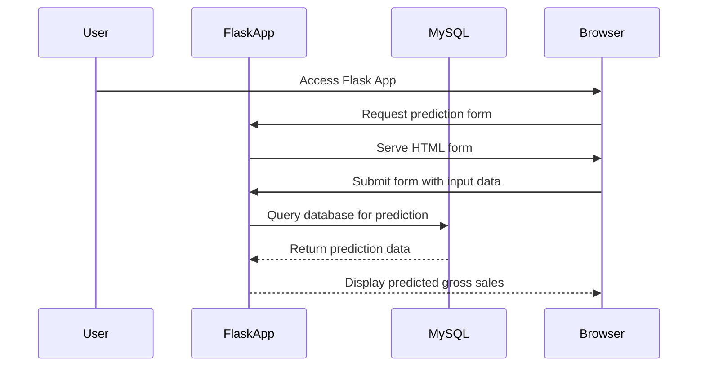
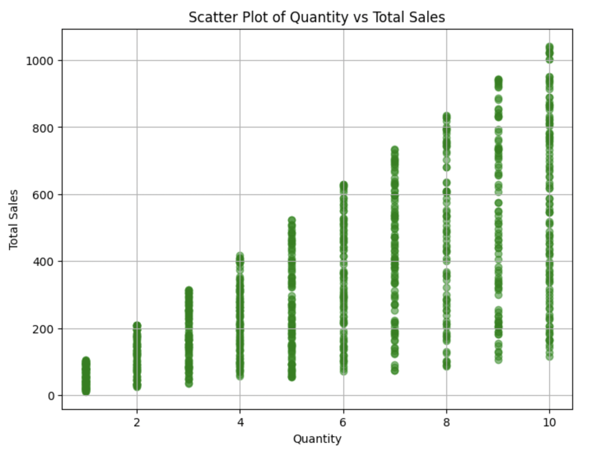
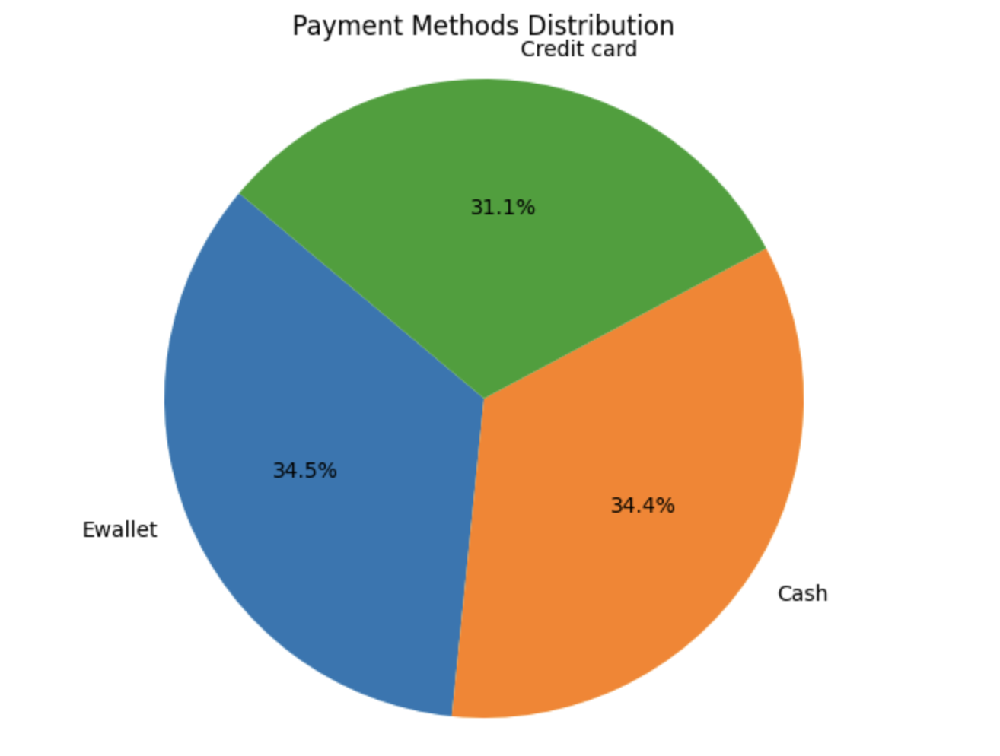
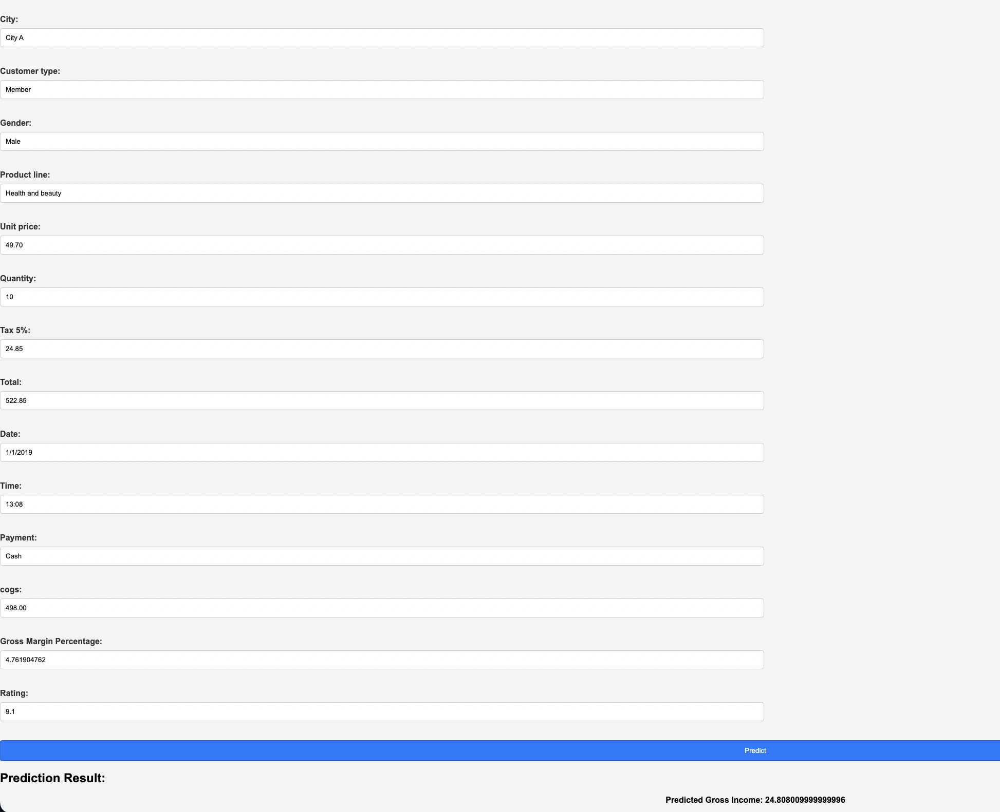

# Datavisualization of supermarket sales with SQLAlchemy and ORM

#### Here is a quick video describing the project: https://drive.google.com/file/d/1K513H7zP3QfabHoVOyQtf2KtOVgbVQ1m/view?usp=drive_link

## Author Info

- Author: Sumedha Vadlamani
- GitHub account: Sumedha-24
- UMD email: sumedha6@umd.edu

## 1. Overview

This project utilizes SQLAlchemy ORM to interact with a relational database containing supermarket sales data. The main objectives include exploratory data analysis through various visualizations using Matplotlib, developing a Flask application to provide an API for predicting sales, and containerizing the project using Docker for seamless deployment.

## 2. Technologies Used

### SQLAlchemy ORM
- What it does: SQLAlchemy is a Python SQL toolkit and Object-Relational Mapping (ORM) library that provides a high-level abstraction for interacting with relational databases.
- Why it's different: SQLAlchemy ORM simplifies database operations by allowing developers to interact with databases using Python objects rather than raw SQL queries, enhancing readability and maintainability.
- Pros:
    - Provides a unified interface for working with different database engines.
    - Offers powerful query generation capabilities.
    - Supports object-oriented programming paradigms, enabling developers to model database entities as Python classes.
- Cons:
    - May introduce a learning curve for developers new to ORM concepts.
    - Performance overhead compared to direct SQL queries for complex operations.

### Matplotlib

- What it does: Matplotlib is a comprehensive library for creating static, animated, and interactive visualizations in Python.
- Why it's different: Matplotlib provides a wide range of plotting functions and customization options, making it suitable for creating publication-quality visualizations for data analysis and presentation.
- Pros:
    - Flexible and customizable plotting functions.
    - Integrates well with other libraries like NumPy and pandas.
    - Supports a variety of plot types, including line plots, scatter plots, histograms, and more.
- Cons:
    - Syntax for customization can be verbose, leading to complex code for intricate visualizations.
    - Limited support for interactive plots compared to libraries like Plotly or Bokeh.

### Flask
- What it does: Flask is a lightweight web framework for building web applications and APIs in Python.
- Why it's different: Flask prioritizes simplicity and minimalism, making it easy to get started with web development projects while providing flexibility for scaling applications.
- Pros:
    - Minimalistic design and easy-to-understand syntax.
    - Extensible through Flask extensions for added functionality.
    - Well-documented with a large community and ecosystem of third-party extensions.
- Cons:
    - Not suitable for large-scale applications requiring complex routing and middleware support.
    - Lack of built-in features compared to more feature-rich frameworks like Django.

### Docker
- What it does: Docker is a platform for developing, shipping, and running applications in lightweight containers.
- Why it's different: Docker containers provide a consistent environment for running applications across different platforms, ensuring that dependencies and configurations are isolated and reproducible.
- Pros:
    - Enables easy deployment and scaling of applications through containerization.
    - Simplifies dependency management and environment setup, reducing compatibility issues.
    - Supports microservices architecture and continuous integration/continuous deployment (CI/CD) pipelines.
- Cons:
    - Learning curve for understanding Docker concepts like images, containers, and volumes.
    - Overhead in terms of resource utilization compared to bare-metal or virtualized deployments.

- Relation to Class Studies
The technologies utilized in this project align with the concepts covered in our class on software engineering and data science. SQLAlchemy ORM relates to our discussions on database management systems (DBMS) and object-relational mapping. Matplotlib extends our understanding of data visualization techniques, while Flask introduces us to web development frameworks. Docker ties into our discussions on containerization and deployment strategies for scalable and portable applications.

## 3. Docker implementation

- Project Setup:
    - `sales.ipynb`: Contains the Jupyter Notebook
      code which manipulates sales data using SQLAlchemy and ORM mapping.
    - `Dockerfile`: Includes instructions for building a Docker image for the
      project.
    - `Docker-compose.yaml`: Defines services, networks, and volumes for Docker
      containers.

- Dockerfile Configuration:
  - Start by setting up the Dockerfile with the following steps:
    - Utilize an official Python runtime as the base image `python:3.11.7`
    - Set the working directory in the container to `/app`.
    - Copy the project files into the container.
    - Install necessary dependencies (mysql-connector-python, pyodbc and sqlalchemy) using pip.
    - `Expose port 8888` for the Jupyter Notebook server.
    - Specify the default command to run the Jupyter Notebook server.
    - `Expose port 8082` for the Flask app server.

```
# Use an official Python runtime as a parent image
FROM python:3.11.7

# Set the working directory in the container
WORKDIR /app

# Copy the current directory contents into the container at /usr/src/app
COPY . .

# Install any needed packages specified in requirements.txt
RUN pip install --no-cache-dir -r requirements.txt

# Make port 8082 available to the world outside this container
EXPOSE 8082

# Define environment variable
ENV FLASK_APP=app.py
ENV FLASK_RUN_HOST=0.0.0.0

# Run app.py when the container launches
CMD ["python", "app.py"]

```

- Docker Compose.yaml configuration:
 ```
 version: '3.8'

services:
  mysql:
    build:
      context: .
      dockerfile: Dockerfile.mysql
    ports:
      - "3306:3306"  # Expose MySQL port

  jupyter:
    build:
      context: .
      dockerfile: Dockerfile.J
    ports:
      - "8888:8888"  # Expose Jupyter port
    volumes:
      - ./notebooks:/app/notebooks  # Mount notebooks directory to container

  flask:
    build:
      context: .
      dockerfile: Dockerfile
    ports:
      - "8082:8082"  # Expose Flask port
    depends_on:
      - mysql  # Wait for MySQL service to be ready before starting Flask


 ```

- Building the Docker Image:
  - Execute `docker build -t <your_image_name> .` to build the Docker image
    using the Dockerfile.

- Running the Docker Containers:
  - Start the Docker containers with `docker-compose up`.
  - Docker Compose will create and launch containers for the redis and notebook
    services.
  - Access the Jupyter Notebook server at `http://localhost:8888/tree` in a web
    browser.

- Accessing the Jupyter Notebook Server:
  - Navigate to `http://localhost:8888/treetoken=1281004cebdf6da075434cd1af11084a7e72025f36cc04c5` in a web browser to access the Jupyter Notebook interface.
  - Interact with your notebook file (sales.ipynb) to execute code for fetching user profiles using Redis caching.

Example of Docker file for accessing MYSQL:

```
# Use the official MySQL image from the Docker Hub
FROM mysql:latest

# Set environment variables
ENV MYSQL_ROOT_PASSWORD=root
ENV MYSQL_DATABASE=projectdb
ENV MYSQL_USER=sumedha1024
ENV MYSQL_PASSWORD=1024

# Copy the SQL script to initialize the database
#COPY init.sql /docker-entrypoint-initdb.d/

```
Note: While running the ipynb on the local host `8888` if the MYSQL connector cell doesn't run please change the host depending on the IP address the mysql shows on building the image and inspecting the ID. I have tried to fix it but I could not find a workaround.

## 4. Project Details

### Script and Notebook Overview
The project includes a Jupyter notebook (sales_analysis.ipynb) and a Flask application (app.py) for data analysis and prediction.

- Jupyter Notebook: 
    - Utilizes SQLAlchemy ORM to interact with the MYSQL connector database containing supermarket sales data.
    - Performs exploratory data analysis and creates visualizations using Matplotlib.
    - Includes sections for data preprocessing, feature engineering, and model training.
- Flask Application:
    - Implements a Flask API for predicting gross sales based on input features.
    - Utilizes a trained machine learning model to make predictions.
    - Provides an HTML interface for user interaction and input.

- Example of how Flask is used:

```
from flask import Flask, request, jsonify, render_template
from flask_cors import CORS
import pandas as pd
import pickle

app = Flask(__name__)
CORS(app)

@app.route('/', methods=['GET'])
def index():
    return render_template('index.html')

@app.route('/predict', methods=['POST'])
if __name__ == "__main__":
    # Change the host parameter to '0.0.0.0' to make the Flask server externally visible
    app.run(debug=True, host='0.0.0.0')
```
Example Output

- Jupyter Notebook Output:
Data visualization plots showcasing sales trends, distribution, and correlations.
Machine learning Model evaluation metrics and performance analysis.

- Flask Application Output:
Prediction of gross sales based on user input features.
HTML interface for inputting feature values and viewing predicted sales.

Navigate to `index.html` path in order to access the front-end part for the predicted gross income.

```
CREATE TABLE marketsales (
    `Invoice ID` VARCHAR(255),
    Branch VARCHAR(255),
    City VARCHAR(255),
    `Customer type` VARCHAR(255),
    Gender VARCHAR(255),
    `Product line` VARCHAR(255),
    `Unit price` DOUBLE,
    Quantity BIGINT,
    `Tax 5%` DOUBLE,
    Total DOUBLE,
    `Date` VARCHAR(255),
    Time VARCHAR(255),
    Payment VARCHAR(255),
    cogs DOUBLE,
    `gross margin percentage` DOUBLE,
    `gross income` DOUBLE,
    Rating DOUBLE
);
```

## 5. Project Diagram








## 6. Conclusion

The Supermarket Sales Analysis and Prediction Project uses advanced technologies like SQLAlchemy ORM, Matplotlib, Flask, and Docker to analyse sales data, create predictive models, and deploy scalable applications. By integrating these technologies, the project provides a comprehensive approach to data science and web development, solving issues with data analysis, visualisation, and deployment. With its clear logical framework and realistic examples, the project is an excellent resource for understanding modern software engineering processes and data-driven decision-making in real-world circumstances.


## 7. References:

- Dataset: https://www.kaggle.com/datasets/lovishbansal123/sales-of-a-supermarket
- SQLALchemy: https://tangelo.readthedocs.io/en/v0.10/tutorials/db-vis.html
- ORM: https://docs.sqlalchemy.org/en/20/tutorial/orm_data_manipulation.html
- Flask: https://docs.sqlalchemy.org/en/20/tutorial/orm_data_manipulation.html
