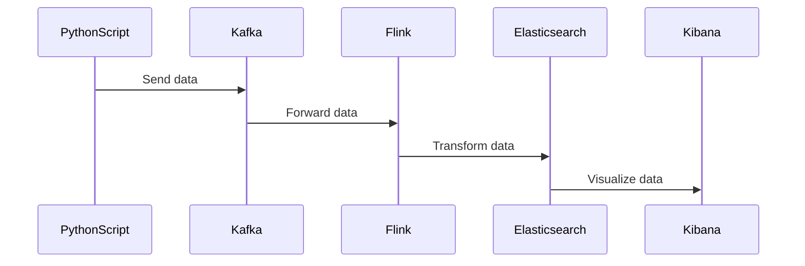
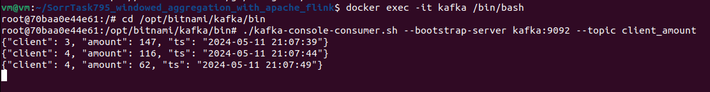
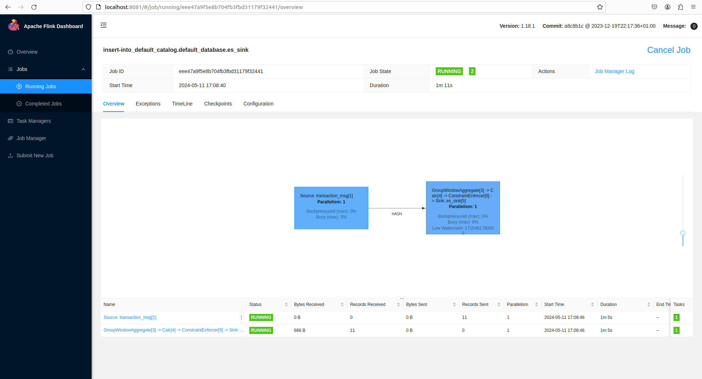
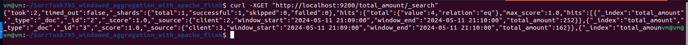
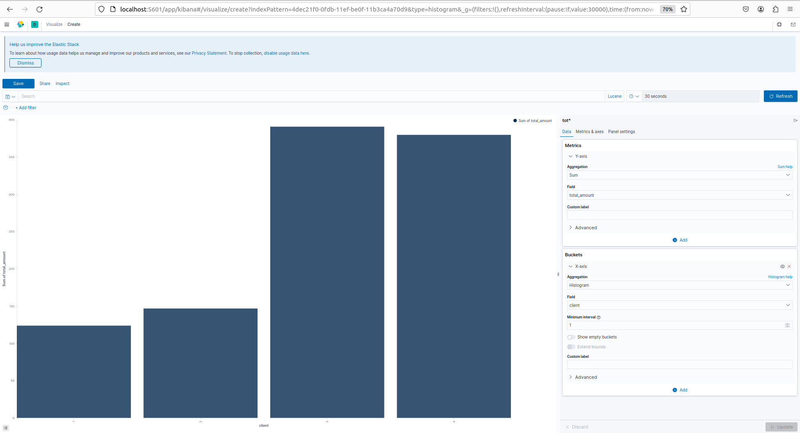

# Windowed aggregation with apache flink

## Author info

- Author: Rekha Srinivas Chimpiri
- GitHub account: RekhaSrinivas
- UMD email: rekhach@umd.edu
- Personal email: rekhach@umd.edu

# Table of Contents
- [Windowed aggregation with apache flink](#windowed-aggregation-with-apache-flink)
  - [Author info](#author-info)
- [Table of Contents](#table-of-contents)
  - [Description](#description)
  - [Project Video](#project-video)
  - [Technologies](#technologies)
    - [Apache Flink: Stream Processing Framework](#apache-flink-stream-processing-framework)
    - [Pros](#pros)
    - [Cons](#cons)
    - [Zookeeper: Distributed Coordination Service](#zookeeper-distributed-coordination-service)
    - [Apache Kafka: Distributed Streaming Platform](#apache-kafka-distributed-streaming-platform)
    - [Elasticsearch: Distributed Search and Analytics Engine](#elasticsearch-distributed-search-and-analytics-engine)
    - [Kibana: Data Visualization and Exploration Tool](#kibana-data-visualization-and-exploration-tool)
  - [Docker implementation](#docker-implementation)
  - [Python Script Overview](#python-script-overview)
  - [Project Diagram](#project-diagram)
  - [Output](#output)
  - [Conclusion](#conclusion)
  - [References](#references)

## Description

This Python-based project showcases a simplified method for streaming data analysis with Apache Flink. It highlights the use of tumbling windows and aggregation functions for streamlined data processing. The aggregated results are then stored in Elasticsearch for further analysis and visualized using Kibana.

## Project Video 

- https://drive.google.com/file/d/1_VZjHcYRWvwSLppjW18jDMOvOOLatCni/view?usp=sharing

## Technologies

### Apache Flink: Stream Processing Framework

Apache Flink is a powerful tool for handling continuous streams of data. It's designed to efficiently process large amounts of data, making it suitable for real-time analytics. Apache Flink offers a versatile suite of windowing techniques essential for precise and adaptable analysis of streaming data. These techniques include tumbling windows, which segment the stream into fixed-size, non-overlapping time intervals, enabling independent processing within each window. Sliding windows, on the other hand, provide overlapping intervals, facilitating continuous analysis as they move along the stream with specified time or event count increments. Session windows, another technique supported by Flink, are adept at grouping events occurring within defined periods of inactivity, making them valuable for detecting patterns in intermittent streams or analyzing bursts of activity. Flink's robust support for event time processing ensures accurate handling of out-of-order events and processing delays, enhancing result correctness.

By connecting to other systems like Kafka and Elasticsearch, Flink becomes even more versatile, allowing seamless integration into data pipelines. In this project, Apache Flink serves as the main tool for analyzing streaming data, using time-based windows and aggregation functions to process data efficiently. It collects data from Kafka and groups it into 1-minute windows based on client ID. The aggregated data is then sent to Elasticsearch for further analysis and visualization with Kibana

### Pros
- Fast processing of streams, allowing for quick analysis of data as it arrives
  
- Can handle large amounts of data and scale up as needed

- Built-in systems to handle errors and ensure data processing continues smoothly

- Can handle both batches of data and continuous streams, providing flexibility in processing data
### Cons
- Documentation may not cover all situations, and there may be fewer resources available compared to other frameworks like Apache Spark or Apache Hadoop

- Requires significant resources such as memory, CPU, and network bandwidth to operate efficiently

- Python and SQL features in Flink are not as developed as Java and Scala features, lacking support for certain data types, functions, or operators, and may not fully support standard SQL syntax.

### Zookeeper: Distributed Coordination Service

- Zookeeper helps manage complex systems, like those built with Apache Kafka

- It keeps track of information about the system's components and helps them communicate reliably

- Zookeeper stores important details about Kafka, such as which servers are part of the system and how they're configured

- It handles tasks like coordinating which server is in charge of each piece of data and keeping track of which clients are connected

- Zookeeper is essential for Kafka's reliability and scalability, ensuring that everything runs smoothly

### Apache Kafka: Distributed Streaming Platform

- Apache Kafka is a powerful tool for handling streams of data

- It's open-source and used for processing data in real-time

- Kafka is designed to handle large amounts of data and can scale up as needed 

- It's commonly used for tasks like building data pipelines and integrating different systems

- Kafka provides reliable communication between different parts of a system, ensuring that data is processed correctly and efficiently

### Elasticsearch: Distributed Search and Analytics Engine

- Elasticsearch is a powerful tool for searching and analyzing data

- It's built to handle large amounts of data quickly and efficiently

- Elasticsearch uses a document-oriented approach, which makes it easy to work with different types of data 

- It's commonly used for tasks like logging, monitoring, and analyzing data in real-time

- Elasticsearch provides a flexible and powerful way to search and analyze data, making it a popular choice for many different applications

### Kibana: Data Visualization and Exploration Tool

- Kibana is a user-friendly tool for visualizing and exploring data stored in Elasticsearch

- It provides a simple interface for creating dashboards, charts, and visualizations

- Kibana makes it easy to explore and understand data, allowing users to gain insights quickly

- It's commonly used for tasks like monitoring system performance, analyzing log data, and creating reports

- Kibana complements Elasticsearch, providing a powerful way to visualize and interact with data

## Docker implementation

- Project Setup:
  - Begin with organizing your project files within a directory structure. The
    main files include:
    - `kafka_flink_integration.py`: Contains the flinkjob script.
     
    - `Dockerfile`: Includes instructions for building a Flink Docker image.
    - `generator` : folder contains a Dockerfile and a Python script used to generate data for streaming to Kafka.
  
    - `Docker-compose.yml`: Defines services, networks, and volumes for Docker containers.

- Flink Dockerfile Configuration:
    - Utilize the official flink image `flink:1.18.1`.
    - Set the working directory in the container to `/opt/flink`.
    - Install necessary dependencies (apache-flink and kafka-python) using pip3.
    - Download the required JAR files (flink-sql-connector-kafka and flink-sql-connector-elasticsearch7) to enable connectivity with Kafka and Elasticsearch.

- Generator Dockerfile Configuration:
    - Use the Ubuntu 20.04 image as the base image `ubuntu:20.04`.
    - Install required Python dependencies to ensure the Python environment is available for the script to run.
    - Add the transactions_data_generator.py file from the host machine to the root directory `transactions_data_generator.py /` inside the container.
    - Set the default command to run when the container starts by specifying to execute the Python script `CMD ["python", "./transactions_data_generator.py"]`.
- Docker-compose.yaml Configuration:
  - Configure the docker-compose.yml file to define the services required for
    the project:
    - Networks: `docker_network` for communication with other containers.
    - Define services: jobmanager, taskmanager, zookeeper, kafka, generator, elaasticsearch and kibana.
    - Configure the Flink jobmanager and taskmanager services:
      - For the jobmanager:
          - Use the `pyflink:1.18.1` image.
          - Set the container name as jobmanager.
          - Map the current directory to the container directory `/opt/docker`.
          - Expose port `8081` on the host and container.
          - Use the `command: jobmanager` to specify this Flink container as the jobmanager.
          - Set the container's environment variable FLINK_PROPERTIES to `jobmanager.rpc.address: jobmanager`.
          - Connect to the `docker_network`.
      - For the taskmanager:
          - Use the `pyflink:1.18.1` image.
          - Set the container name as taskmanager.
          - Depend on the jobmanager service.
          - Map the current directory to the container directory `/opt/docker`.
          - Use the `command: taskmanager` to specify this Flink container as the taskmanager.
          - Set the container's environment variables FLINK_PROPERTIES to `jobmanager.rpc.address: jobmanager and taskmanager.numberOfTaskSlots: 4`.
          - Modify the task slots according to project requirements.
          - Connect to the `docker_network`.
    - Configure the zookeeper service:
      - Use the `bitnami/zookeeper:latest` image.
      - Set the container name as zookeeper.
      - Expose port `2181` on the host and container.
      - Allow anonymous login with the environment variable `ALLOW_ANONYMOUS_LOGIN=yes`.
      - Connect to the `docker_network`.
    - Configure the kafka service:
      - Use the `bitnami/kafka:latest` image.
      - Set the container name as kafka.
      - Set the user as root.
      - Expose port `9092` on the host and container.
      - Configure the KAFKA_CFG_ZOOKEEPER_CONNECT environment variable to connect to Zookeeper at `zookeeper:2181`.
      - Connect to the `docker_network`.
      - Depend on Zookeeper service.
    - Configure the generator service:
      - Use the Dockerfile in the generator folder to build the image.
      - Set the image name as `generator:1.0`.
      - Set the container name as `generator`.
      - Depend on the kafka service, ensuring that Kafka is running before starting the generator.
      - Connect to the `docker_network`.
    - Configure the Elasticsearch service:
      - Use the `elasticsearch:7.8.0 image`.
      - Set the container name as elasticsearch.
      - Set environment variables for cluster name, memory settings, and discovery type.
      - Expose port `9200` on the host and container for Elasticsearch HTTP API access.
      - Set ulimits for memory locking and maximum number of open files.
      - Connect to the `docker_network`.
    - Configure the kibana service:
      - Use the `kibana:7.8.0 image`.
      - Set the container name as kibana.
      - Expose port `5601` on the host and container for Kibana web interface access.
      - Depend on the Elasticsearch service, ensuring Elasticsearch is running before starting Kibana.
      - Connect to the `docker_network`.
  
- Running the Docker Containers:
  - Start the Docker containers by navigating to the project directory and running `docker-compose up`.
  - Docker Compose will create and launch containers for the services defined in the `docker-compose.yml` file.
  - The `transactions_data_generator.py` script located in the `generator` folder sends data to Kafka upon container startup. It creates a topic named `client_amount`.
- Submitting the Flink Job:
    - Access the jobmanager container by executing the command `docker exec -it jobmanager /bin/bash`.
    - Once inside the container, submit the Flink job using the command `/opt/flink/bin/flink run -py /opt/docker/kafka_flink_integration.py`. In this project, the script is mapped to `/opt/docker`.
  
- Accessing the Services:
  - Navigate to `http://localhost:8081` in a web browser to access the flink dashboard interface.
  - Navigate to `http://localhost:5601` in a web browser to access kibana interface.
- Stopping the Docker Containers:
  - To stop containers, press `Ctrl + C` in the terminal running.
  - Alternatively, use `docker-compose down` to stop and remove containers.

## Python Script Overview

The `transactions_data_generator.py` script in the generator folder continuously sends data to the Kafka topic `client_amount` upon container startup.
  ``` python
    message = {
    "client": random.randint(1, 4),  # Random client ID from 1 to 4
    "amount": random.randint(1, 200),  # Random transaction amount from 1 to 200
    "ts": time.strftime("%Y-%m-%d %H:%M:%S")
    }
```
- Example Output of the script:
  - 
    ```
    {"client": 3, "amount": 15, "ts": "2024-05-11 18:25:12"}
    ```
- Output Explanation:
  - 
    ```
    Client ID: 3
    Transaction Amount by Client 3: $15 
    Timestamp: 2024-05-11 18:25:12 (YYYY-MM-DD HH:MM:SS)
    ```
The `kafka_flink_integration.py` script performs the Flink job. 
  ``` python
    # Sending results to Elasticsearch sink with tumbling window of 1 minute
    results = transaction_data.window(Tumble.over(lit(1).minutes).on(col("ts")).alias("w")) \
        .group_by(col("w"), col("client")) \
        .select(col("client"), col("w").start.alias("window_start"), col("w").end.alias("window_end"), col("amount").sum.alias("total_amount")) \
        .execute_insert("es_sink")
```
To check the output, run this command `curl -XGET "http://localhost:9200/total_amount/_search"`. This command will send an HTTP GET request to the Elasticsearch server running on your localhost, querying the `total_amount` index. The response from Elasticsearch will be in JSON format, containing information about the search results, including metadata and matched documents.
- Example Output of the script:
  - 
    ```
    {"took":3,"timed_out":false,"_shards":{"total":1,"successful":1,"skipped":0,"failed":0},"hits":{"total":{"value":4,"relation":"eq"},"max_score":1.0,"hits":[{"_index":"total_amount","_type":"_doc","_id":"4","_score":1.0,"_source":{"client":4,"window_start":"2024-05-11 18:04:00","window_end":"2024-05-11 18:05:00","total_amount":414}},{"_index":"total_amount","_type":"_doc","_id":"1","_score":1.0,"_source":{"client":1,"window_start":"2024-05-11 18:05:00","window_end":"2024-05-11 18:06:00","total_amount":482}},{"_index":"total_amount","_type":"_doc","_id":"3","_score":1.0,"_source":{"client":3,"window_start":"2024-05-11 18:05:00","window_end":"2024-05-11 18:06:00","total_amount":623}},{"_index":"total_amount","_type":"_doc","_id":"2","_score":1.0,"_source":{"client":2,"window_start":"2024-05-11 18:05:00","window_end":"2024-05-11 18:06:00","total_amount":148}}]}}
    ```
- Output Explanation:
  - 
    ```
    Client ID: 4
    Transaction Amount by Client 4: $414 
    Window Start: 2024-05-11 18:04:00 
    Window End: 2024-05-11 18:05:00

    Client ID: 1
    Transaction Amount by Client 1: $482 
    Window Start: 2024-05-11 18:05:00 
    Window End: 2024-05-11 18:06:00

    Client ID: 3
    Transaction Amount by Client 3: $623 
    Window Start: 2024-05-11 18:05:00 
    Window End: 2024-05-11 18:06:00

    Client ID: 2
    Transaction Amount by Client 2: $148 
    Window Start: 2024-05-11 18:05:00 
    Window End: 2024-05-11 18:06:00
    ```
  In the above output, the windowed time interval was set for 1 minute. Therefore, each client's window started and ended after 1 minute.  

## Project Diagram


## Output



The data is generated to the client_amount topic in Kafka. Now, submit the Flink job and view it in the Flink dashboard.




Elasticsearch is receiving the tumbling window data with a 1-minute interval for further analysis.



Visualize the processed data in Kibana for insights and exploration. Go to the Kibana website, then click on "Visualize." Here, you'll need to create an index pattern. Check for the total_amount index pattern, which has been defined in the Flink job. Select it and create the index pattern. Next, navigate to the dashboard section to create a new dashboard and visualize the data.



## Conclusion

This project demonstrates a streamlined approach to real-time data analysis using Apache Flink, efficiently processing continuous data streams. Leveraging Flink's capabilities alongside Kafka, Elasticsearch, and Kibana, it integrates data ingestion, storage, querying, and visualization seamlessly. Through the use of tumbling windows and aggregation functions, data is analyzed with precision. The Docker implementation ensures easy deployment and scalability. With Kafka for ingestion and Elasticsearch for storage, the project establishes a robust infrastructure, while Kibana's visualization tools empower insightful analysis.

## References
- https://flink.apache.org/what-is-flink/flink-applications/

- https://medium.com/@olhrachov/apache-flink-pyflink-the-concept-of-windows-in-flink-example-of-an-application-for-1be04ecaa11f

- https://www.linkedin.com/advice/0/what-advantages-disadvantages-using-apache-flink-cshec


