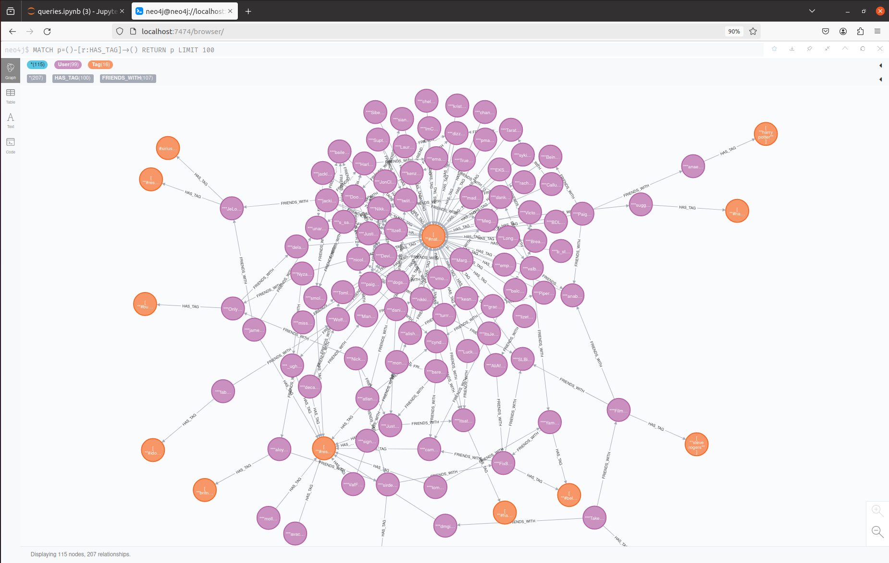

# Graphdatabase Exploration with Neo4j

## Author info
* Author: Sivani Dronamraju
* GitHub account: sivaniDronamraju
* UMD email: sdronamr@umd.edu
* Personal email: sivani.dronamraju1507@gmail.com

## Table of Contents
1. [Project Description](#project-description)
2. [Technologies Used](#technologies-used)
   * [Neo4j](#neo4j)
   * [Docker](#docker)
   * [Jupyter Notebook](#jupyter-notebook)
3. [Docker Implementation](#docker-implementation)
4. [Project Overview](#python-scripts)
5. [Output](#output)
6. [Workflow Diagram](#workflow)
7. [Conclusion](#conclusion)
8. [References](#references)

## Project Description
This project aims to design and implement a social network system using Neo4j graph database technology. The system models users and tags as nodes and friendships and has tags as relationships within a graph structure. Cypher queries are utilized to retrieve insights such as common connections, influential users, popular tags, and the co-occurrence of tags.

link for the presentation: https://drive.google.com/file/d/1-XsqvZ2l7ZUl2Bu4Key6M1a_lL_mHak7/view?usp=drive_link

## Technologies Used

### Neo4j
- **What it does:** Neo4j is a graph database management system that excels in modeling and querying highly connected data. It allows users to represent data as nodes, relationships, and properties, providing a flexible and intuitive way to store and retrieve complex relationships.
- **Why it's different:** Unlike traditional relational databases, Neo4j's graph-based approach is specifically designed for scenarios where relationships between data entities are as important as the entities themselves. This makes it ideal for applications like social networks, recommendation systems, and network analysis, where understanding the connections between data is critical.
- **Pros:**
  - Native graph processing ensures efficient traversal of relationships, making it ideal for complex queries involving interconnected data.
  - Cypher query language provides a powerful and expressive way to interact with the graph, allowing users to write queries that closely resemble natural language.
  - Scalable architecture enables users to handle large-scale networks and perform real-time analytics on their data.
- **Cons:**
  - May have a steeper learning curve compared to traditional relational databases, especially for users unfamiliar with graph concepts.
  - Performance can degrade with extremely large datasets or complex queries, requiring careful optimization and tuning.
  - Limited support for certain features common in relational databases, such as joins and complex transactions.

### Docker
- **What it does:** Docker is a containerization platform that simplifies the process of developing, deploying, and running applications by encapsulating them and their dependencies into lightweight, portable containers. It provides a consistent environment for running applications across different platforms and environments.
- **Why it's different:** Unlike traditional virtualization methods, Docker containers share the host system's kernel, resulting in lower overhead and faster startup times. This lightweight approach, combined with Docker's easy-to-use tools and extensive ecosystem, has made it a popular choice for building, shipping, and running applications in modern cloud-native environments.
- **Pros:**
  - Lightweight and portable containers ensure consistent behavior across different environments, from development to production.
  - Docker's layered filesystem and caching mechanism enable fast and efficient image builds, reducing development and deployment times.
  - Docker Hub provides a centralized repository for sharing and distributing Docker images, facilitating collaboration and reuse of pre-built containers.
- **Cons:**
  - Managing and orchestrating containers at scale can be complex, requiring additional tools and infrastructure for deployment, monitoring, and scaling.
  - Security concerns around container isolation and privilege escalation require careful configuration and hardening of container environments.
  - Docker's rapid pace of development and frequent updates may lead to compatibility issues and maintenance challenges in long-term projects.

### Jupyter Notebook
- **What it does:** Jupyter Notebooks are interactive computing environments that allow users to create and share documents containing live code, equations, visualizations, and narrative text. They support various programming languages, including Python, R, and Julia, making them versatile tools for data analysis, visualization, and prototyping.
- **Why it's different:** Jupyter Notebooks provide a seamless integration of code, visualizations, and explanatory text, enabling users to explore and communicate their ideas in a single document. This interactive and exploratory nature makes them particularly well-suited for tasks like data exploration and collaboration.
- **Pros:**
  - Interactive execution of code cells allows users to iterate quickly and experiment with different algorithms and techniques.
  - Rich support for data visualization libraries like Matplotlib, Seaborn, and Plotly enables users to create compelling visualizations directly within the notebook.
  - Built-in support for markdown cells allows users to provide context, explanations, and documentation alongside their code, enhancing readability and reproducibility.
- **Cons:**
  - Limited support for certain programming languages and dependencies may require additional setup and configuration for non-Python environments.
  - Lack of built-in version control and collaboration features can make it challenging to manage and track changes in collaborative projects.
  - Notebooks can become cluttered and difficult to maintain as they grow in size, requiring careful organization and refactoring.

## Docker Implementation

### Project Setup
Make sure the files are placed in the same manner as below.
```
├── Data
│   └── data.csv
│
├── notebooks
│   ├── load_data.ipynb
│   ├── data_exploration.ipynb
│   └── queries.ipynb
│
├── docker-compose.yml
├── Dockerfile
├── requirements.txt
└── README.md

```
* Main Pages

  - Data:
    - `data.csv`: Contains the dataset used for the project.

  - Notebooks:
    - `load_data.ipynb`: Jupyter notebook for loading data into the Neo4j database and creating nodes and relationships.
    - `data_exploration.ipynb`: Jupyter notebook for exploring the data.
    - `queries.ipynb`: Jupyter notebook for executing queries to retrieve insights from the Neo4j database.

  - `docker-compose.yml`: Configuration file defining services, ports, and volumes for Docker containers.
  - `Dockerfile`: Instructions for building the Docker image for the project.
  - `requirements.txt`: File listing the Python dependencies required for the project.
  - `README.md`: Markdown file containing documentation and information about the project.

* Dockerfile Configuration:

  - Utilize the official `Jupyter/datascience-notebook` image as the base image.
  - Set the working directory in the container to `/home/jovyan/work`.
  - Copy the `requirements.txt` file into the container and install necessary dependencies using pip.
  - Specify the default command to run the Jupyter Lab server.
  ```
  FROM jupyter/datascience-notebook

  COPY requirements.txt ./
  RUN pip install -U pip
  RUN pip install --no-cache-dir -r requirements.txt

  WORKDIR /home/jovyan/work

  CMD ["jupyter", "lab", "--ip=0.0.0.0", "--port=8888", "--no-browser", "--notebook-dir=/home/jovyan/work", "--allow-root", "--NotebookApp.token=''"]
  ```
* `docker-compose.yml` Configuration:
  - Define two services: jupyterlab and neo4j.
  - Build the jupyterlab service using the current directory (.) as the build context.
  - Map port `8888` on the host to port `8888` in the container for Jupyter Lab.
  - Mount the notebooks and data directories from the host into the container.
  - Set the user to `root` for the jupyterlab service.
  - Use the official Neo4j image (neo4j:4.2.3) for the neo4j service.
  - Expose ports `7474` and `7687` on the host for Neo4j.
  - Set the NEO4J_AUTH environment variable for Neo4j authentication.

  ```
  version: '3'

  services:
    jupyterlab:
      build:
        context: .
      ports:
        - "8888:8888"
        # Mount jupyter notebook and data directory.
      volumes:
        - ./notebooks:/home/jovyan/work/scripts
        - ./Data:/home/jovyan/work/data
      user: root

    neo4j:
      image: neo4j:4.2.3
      # Expose neo4j HTTP port and bolt port.
      ports:
        - "7474:7474"
        - "7687:7687"
      environment:
        - NEO4J_AUTH=neo4j/password
  ```

### Building and Running the Docker Containers:

- Build the Docker image using the command: `docker build -t <your_image_name> `.
- Replace `<your_image_name>` with a suitable name for the Docker image.
- Alternatively, you can use docker-compose to build and run the containers simultaneously with the command: `docker-compose up --build`
- Start the Docker containers with the command: `docker-compose up`
- Docker Compose will create and launch containers for the neo4j and jupyterlab services.
- Access the Jupyter Notebook server at [http://localhost:8888](http://localhost:8888) in a web browser.
- Interact with the Neo4j database by navigating to [http://localhost:7474](http://localhost:7474) in a web browser. 
- Here, you can execute Cypher queries and manage the graph database.

### Interacting with the Jupyter Notebook and Neo4j:

- Navigate to [http://localhost:8888](http://localhost:8888) in a web browser to access the Jupyter Notebook interface.
- Interact with your notebook files `load_data.ipynb`, `data_exploration.ipynb`, and `queries.ipynb` to execute code for interacting with Neo4j.
- Interact with the Neo4j Browser [http://localhost:7474](http://localhost:7474) to view and modify the graphs.

### Stopping the Docker Container:

- Press `Ctrl + C` in the terminal running `docker-compose up` to stop and remove containers.
- Alternately, use the command: `docker-compose down` to stop and remove containers.

## Project Overview

### Python Scripts
  - The project contains the following  .ipynb files which can be used to load the data and interact with neo4j.
#### 1. load_data.ipynb:

The `load_data.ipynb` script is used to load data from a CSV file into a Neo4j graph database. It utilizes the py2neo library to interact with the Neo4j database and pandas for data manipulation.

#### Functionality:
1. **Importing Libraries:** The script imports necessary libraries such as py2neo and pandas.
2. **Connecting to the Database:** It establishes a connection to the Neo4j database using the py2neo.Graph class.
3. **Loading CSV Data:** The data from the `data.csv` file is loaded into a pandas DataFrame.
4. **Creating Nodes and Relationships:** For each row in the DataFrame, user nodes, tag nodes, and friendships are created in the Neo4j graph database.
5. **Script:** The script below creates users, tags as nodes and `HAS_TAG`, `FRIENDS_WITH` as relationships between the nodes.

```
#Function to create user nodes, tags, and friendships.
def create_user_nodes_tags_and_friendships(data):
    for index, row in data.iterrows():
        # Create user node
        user_node = Node("User",
                         id=row['id'],
                         screenName=row['screenName'],
                         avatar=row['avatar'],
                         followersCount=row['followersCount'],
                         friendsCount=row['friendsCount'],
                         lang=row['lang'],
                         lastSeen=row['lastSeen'],
                         tweetId=row['tweetId'])
        graph.create(user_node)

        # Create tags as nodes
        tags_list = row['tags'].strip('[]').split(', ')
        for tag in tags_list:
            if tag:
                tag_node = Node("Tag", name=tag.strip().strip('"'))
                graph.merge(tag_node, "Tag", "name")
                relationship = Relationship(user_node, "HAS_TAG", tag_node)
                graph.create(relationship)

        # Convert the 'friends' column from string representation to a list of user IDs
        friends_list = ast.literal_eval(row['friends'])

        # Create relationships between the user and their friends
        for friend_id in friends_list:
            friend_node = graph.nodes.match("User", id=friend_id).first()  # Get the friend node from the database
            if friend_node:
                friendship = Relationship(user_node, "FRIENDS_WITH", friend_node)
                graph.create(friendship)
```

#### 2. data_exploration.ipynb:

The `data_exploration.ipynb` script is focused on exploring the data stored in the Neo4j graph database. It retrieves various statistics and insights about the graph data using Cypher queries.

#### Functionality:
1. **Connecting to the Database:** Similar to the previous script, it connects to the Neo4j database.
2. **Counting Nodes and Relationships:** Cypher queries are used to count the total number of users, tags, and friendships in the graph database.
3. **Calculating Average Friends Count:** Another Cypher query calculates the average number of friends each user has.
4. **Example Output:** The script prints out the total users, total tags, total friendships, and the average friends count.


#### 3. queries.ipynb:

The `queries.ipynb` script performs specific queries on the Neo4j graph database to extract meaningful insights and information.

#### Functionality:
1. **Connecting to the Database:** Similar to the other scripts, it establishes a connection to the Neo4j database.
2. **Query 1: Influential Users:** It identifies users with a high number of followers, indicating their influence on the platform.


3. **Query 2: Popular Tags:** This query retrieves the most popular tags and their usage count among users.


4. **Query 3: Tag Co-Occurrences:** It finds pairs of tags that frequently occur together in user profiles.


5. **Query 4: Common Connections:** The script identifies common connections between pairs of users, indicating potential shared interests or relationships.


### Interacting with Nodes and Relationships:
When loading the data into the Neo4j graph database and executing queries, you can interact with the graph data using the Neo4j Browser interface accessible at http://localhost:7474. The Neo4j Browser provides a user-friendly environment to visualize and explore the graph data.

- **User Nodes:** You can click on individual user nodes to view their properties, such as user ID, screen name, followers count, and friends count. This allows for a detailed examination of user profiles stored in the graph.
- **Tag Nodes:** Similarly, clicking on tag nodes enables you to inspect tag properties, including tag names and usage counts. This facilitates the exploration of tag-related information captured in the graph.
- **Relationships:** By clicking on relationship types such as `HAS_TAG` and `FRIENDS_WITH`, you can explore the connections between users and tags. This provides insights into how users are associated with tags and their friendships within the social network.

## Output
### Viewing Graphs:
- **Graph Visualization:** The Neo4j Browser visualizes the graph data in the form of nodes and relationships, allowing for a comprehensive understanding of the graph structure.
- **Adjusting Node Limit:** You can modify the limit value to control the number of nodes displayed in the graph visualization. This feature is particularly useful when dealing with large datasets, allowing you to focus on relevant portions of the graph.

Graph for visualizing user nodes.\


Graph to visualizing tags nodes.\


Graph for visualizing `FRIENDS_WITH` relationship.\


Graph for visualizing `HAS_TAGS` relationship.\



## Workflow
```
sequenceDiagram
    participant User
    participant JupyterNotebook
    participant Neo4jDatabase
    participant Neo4jBrowser
    
    User ->> Neo4jDatabase: Execute load_data.ipynb
    Neo4jDatabase -->> JupyterNotebook: Data loaded successfully
    JupyterNotebook ->> Neo4jBrowser: Visualize graphs in Neo4j Browser
    User ->> Neo4jDatabase: Execute data_exploration.ipynb
    Neo4jDatabase -->> JupyterNotebook: Data exploration completed
    User ->> Neo4jDatabase: Execute queries.ipynb
    Neo4jDatabase -->> JupyterNotebook: Queries executed successfully
    User ->> Neo4jBrowser: Interact with Neo4j Browser for insights
    Note right of Neo4jBrowser: User adjusts node limits,<br> explores graphs, etc.
```

## Conclusion:
Interacting with the Neo4j graph data in the Neo4j Browser enhances the exploratory analysis of the social network dataset. By clicking on nodes and relationships, adjusting node limits, and visualizing graphs, users can dive deeper into the dataset, uncovering valuable insights and patterns within the social network.

## References
  1. **Neo4j:** https://neo4j.com/docs/cypher-manual/current/introduction/
  2. **Py2neo:** https://pypi.org/project/py2neo/
  3. **Dataset:** https://www.kaggle.com/datasets/hwassner/TwitterFriends