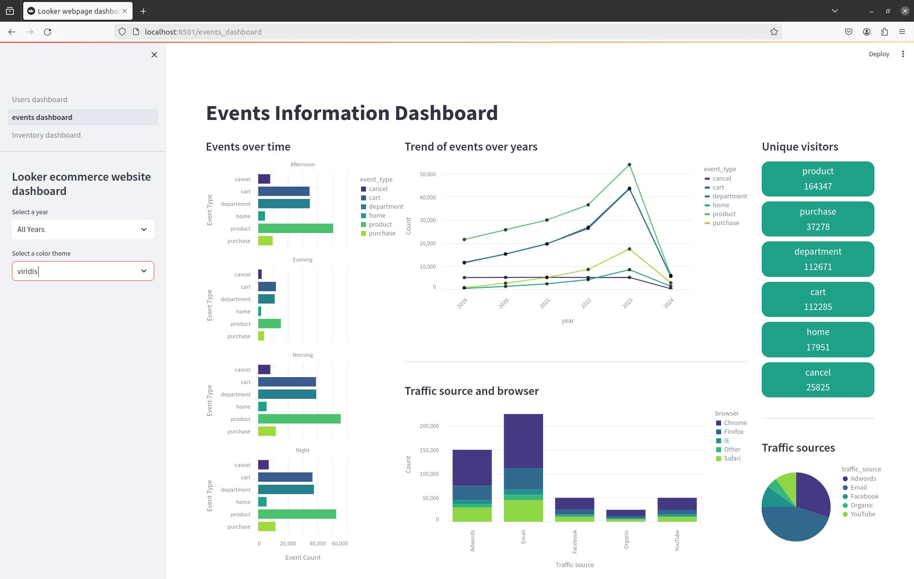

# Analytics Dashboard with Redis

## Author info
* Author: Sweta Dantu
* GitHub account: Dantu-Sweta
* UMD email: dsweta@umd.edu
* Personal email: swetadantums@gmail.com

## Table of contents
1. [Project Description](#project-description)
2. [Technologies](#technologies)
    * [Redis](#redis)
    * [Streamlit](#streamlit)
    * [Altair](#altair)
    * [Docker](#docker)
3. [Docker Implementation](#docker-implementation)
    * [Running the project](#running-the-project)
4. [Project overview](#project-overview)
5. [Workflow diagram](#workflow-diagram)
5. [Output](#output)
6. [Conclusion](#conclusion)
7. [References](#references)

## Project Description 
The project is an analytics dashboard designed using Streamlit to provide insightful visualizations and analysis of data of an [e-commerce website](https://www.kaggle.com/datasets/mustafakeser4/looker-ecommerce-bigquery-dataset/). This project uses Redis, a high-performance in-memory data structure to not only efficiently store but also to cache the data for effective retrieval.  

Here is a brief description and tutorial of the project.\
Video link: https://drive.google.com/file/d/1k4E3Nsww60D7xhM1iD41osw4uuYuamMY/view?usp=sharing

## Technologies
### Redis
* Redis is an open-source, in-memory data structure store that can be used as a database, cache, and message broker. 
* It provides a key-value store where keys can be strings, hashes, lists, sets, sorted sets etc. 
* It stores data primarily in memory, making it extremely fast for read and write operations compared to disk-based databases like traditional SQL databases. 
* It supports various data structures and provides built-in commands for operations on these structures making it versatile for different use cases compared to simple key-value stores. 
* Redis can be used for caching frequently accessed data, and as a database for storing application data. \
    <ins>Pros: </ins>
    * **Speed:** It is extremely fast due to its in-memory storage and optimized data structures.
    * **Versatile:** It doesn't only support the String data type, rather it supports more complex data structures such as lists, hashes, sets and sorted sets.
    * **Cache:** can be easily configured to act automatically as a cache.
    * **Scalable:** Redis has a built in replication that is used to scalability as well as for availability. It can be easily scaled horizontally by adding more nodes to a cluster.

    <ins>Cons: </ins>
    * **Memory limitation:** It is an in-memory database, which means that the whole dataset should reside in the memory (RAM) limiting the data storage capacity.
    * **Complexity:** Managing Redis clusters and ensuring high availability can be complex compared to simpler key-value stores.
    * **Security:** It acks built-in security features like authentication and encryption, requiring additional setup for secure deployments.


### Streamlit
* Streamlit is an open-source Python library that allows developers to create web applications quickly and easily using Python scripts. With just a few lines of code, one can create dynamic, visually appealing apps that allow users to input data and view the results in real-time. 
* Developers can write Python code to create data visualizations, interactive widgets, and entire web applications without needing to write HTML, CSS, or JavaScript.

<ins>Pros:</ins>
* **Python Integration:** It is completely written in python making it really easy adn comfortable for python developers to work with.
* **Ease of use:** It s designed to be beginner-friendly and requires minimal code to create interactive web apps.
* **Data visualization:** It provides built-in support for data visualization libraries like Matplotlib, Plotly, and Altair, making it suitable for creating data dashboards and interactive visualizations.
* **Prototyping and rapid development:** It is ideal for rapid prototyping and iterative development, enabling developers to quickly build and iterate on web applications without needing to write boilerplate code.

<ins>Cons:</ins>
* **Limited customization:** It offers limited customization options for the appearance and behavior of your app.
* **Scalability:** may not be suitable for building large-scale web applications with complex requirements.
* **Dependency on Python:** Since it is Python-centric, developers must be proficient in Python to use it effectively, which may limit its adoption in teams with diverse skill sets.

### Altair
* Altair is a statistical visualization library in Python. 
* It is a declarative in nature and is based on Vega and Vega-Lite visualization grammars. 
* It allows users to create interactive visualizations quickly and easily using a concise and expressive syntax. 
* Altair generates Vega-Lite specifications behind the scenes, which are then rendered as interactive visualizations in web browsers.

<ins>Pros:</ins>
* **Interactive Visualizations:** It generates interactive visualizations by default, allowing users to explore data dynamically by panning, zooming, and interacting with elements.
* **Integration with python:** It seamlessly integrates with other python libraries like Pandas, allowing users to create visualizations directly from DataFrame objects. 

<ins>Cons:</ins>
* **Limited Customization:** Although ut provides a high level of customization, it may lack the flexibility and customization options of lower-level visualization libraries like Matplotlib.
* **Performance:** It's performance may be slower compared to lower-level visualization libraries like Matplotlib for extremely large datasets or complex visualizations.
* **Dependency on Web Technologies:** Altair relies on web technologies like JavaScript for rendering visualizations in web browsers, which may introduce dependencies and compatibility issues.

### Docker
* Docker is a platform that enables developers to build, ship, and run applications in lightweight, portable containers. 
* It packages applications and their dependencies into isolated, self-sufficient containers. 
* The containers are lightweight and portable, making it easy to deploy applications consistently across different environments, from development to production.

<ins>Pros:</ins>
* **Portable:** Docker containers can run on any platform that supports Docker, making it easy to deploy applications across different environments, from development laptops to cloud servers.
* **Isolation:** The containers provide isolation for applications, ensuring that they run independently of each other and do not interfere with other processes on the host system.
* **Scalable:** The containers are are ligthweight and can be easily scaled up or down to meet the changing  demands. 

<ins>Cons:</ins>
* **Learning curve:** It has a learning curve , especially for users who are new to containerization.
* **Complexity:** Maintaining large-scale Docker deployments and orchestrating multiple hosts can be complex. 

## Docker Implementation
The docker implementation of this project follows a logical sequence for a smooth implementation of the code.\
Project setup:
* Start by organising the files in the below manner 
```
|--pages 
|   |--events_dashboard.py 
|   |--inventory_dashboard.py 
|--Users_dashboard.py
|--users.csv
|--events.csv
|--inventory.csv
|--requirements.txt
|--Dockerfile
|--docker-compose.yml
```
* Main-pages
    * The main page is `Users_dashboard.py` which has to be run in order to run the webpage. 
    * `Dockerfile`: contains the instructions for building the image.
    * `docker-compose.yml`: Defines the services, ports for the Docker containers. 

* `Dockerfile` configuration:
    * The setup of dockerfile is as follows
        * Utilizing an official python runtime as the base image `python:3.9`.
        * Set up the working directory `/app`.
        * Install the necessary dependencies for both redis and python.
        * Copy the project files into the container.
        * Expose the port `8501` for the streamlit server.
        * Specify the code to run the redis server as well the streamlit app.

    ```
    FROM python:3.9

    # Install Redis server.
    RUN apt-get update && apt-get install -y redis-server

    # Set up working directory.
    WORKDIR /app

    # Copy requirements file.
    COPY requirements.txt /app

    # Install Python dependencies.
    RUN pip install --no-cache-dir -r requirements.txt

    # Copy app files.
    COPY . /app

    # Expose the port where Streamlit app will run.
    EXPOSE 8501

    # Run Redis server and Streamlit app.
    CMD redis-server --daemonize yes && streamlit run Users_dashboard.py
    ```
* `docker-compose.yml` file configuration
    * Configure docker-compose.yml file to define the services required for this service.
        * Define the two services redis and streamlit.
        * Use redis image `redis`.
        * Map port `8501` for the streamlit server to run on.

    ```
    version: '3'
    services:
        streamlit:
            build: .
            ports:
                - "8501:8501"
            depends_on:
                - redis
        redis:
            image: redis

    ```
### Running the project
* Building the docker image:
    * Execute `docker build -t <image_name> .` to build the docker image. Use any name of your choice for `<image_name>`
* Running the docker container:
    * Execute `docker-compose up` to start the docker container.
    * You can see the streamlit app at `http://localhost:8501/` in a browser.
* After the plots load you will be able to interact with the plots by selecting certain years for the plots in the left side panel to change accordingly and also selecting different color palettes for the plots.
* You will be able to navigate to different dashboards using the left side panel of the web page. 
* Stopping the docker container:
    * Press `ctrl + c` in you terminal (where the project is running) to get out of the container. Alternatively you can execute `docker-compose down` to stop the container.
* Check if the container has stopped or not:
    * To check if your container stopped or not execute `docker ps -a` to get a list of all the docker containers.
    * The container has stopped if the status of the containre says `Exited`. 
    * You can remove the image of any container by executing `docker rm <container_id>`. You will be able to find the container id when you execute `docker ps -a`.

## Project overview
The project contains three different dashboards that show insights into different data related to the e-commerce website. You can select an year from the drop down on the left side panel of the webpage to filter the data to shows plots related to that particular year. You can also change the color palette of the plots using the drop down in the same side panel. Additionally, you can also make the plots appear in full screen as well as download png, svg images of them.
### Python script
The project includes three python files `Users_dashboard.py`, `events_dashboard.py` and `Inventory_dashboard.py` for the three dashboards. All the python files are divided into 3 sections.
#### Section 1
* Connecting to redis: 
    * We begin by connecting to the redis client to store data for the visuailzations. We are creating a connection to a Redis server running locally on the default port `6379`.
    ```
    # Connect to Redis.
    redis_client = redis.Redis(host='localhost', port=6379, db=0)
    ```
* Read and store the data:
    * After establishing the connection we are reading the data from a `.csv` file and storiing it in redis using the functions `load_cache_data()` and `store_data()` respectively. 
    * To optimize performance we are storing data in batches. We are using `redis_client.pipeline()` to execute multiple commands in a single round trip to the server improving efficiency.
    * We are iterating over each record in the batch and are converting it into a Redis Hash using `hmset()`.
    ```
    # Function to store data in Redis.
    def store_data(data, batch_size=10000):
        # Convert DataFrame to dictionary.
        data_dict = data.to_dict(orient='records')
        # Split data into batches.
        for i in range(0, len(data_dict), batch_size):
            batch = data_dict[i:i + batch_size]
            with redis_client.pipeline() as pipe:
                for record in batch:
                    # Store each record in Redis hash.
                    pipe.hmset(f"user:{record['id']}", record)
                pipe.execute()
    ```
* Get the data:
    * We are retrieving data from Redis and are constructing a DataFrame from it.
    ```
    # Function to retrieve data from Redis.
    def get_data():
        data = []
        # Retrieve all keys matching 'user:*'.
        keys = redis_client.keys("user:*")
        for key in keys:
            # Retrieve data for each user and append to list.
            data.append(redis_client.hgetall(key))
        return pd.DataFrame(data)
    ```

#### Section 2
* The second part of the python file contains different functions that are used to make visualizations using the retreived data. 
* `Altair` was used to make interactive visualizations. 
* An example of a visualization:
```
def make_pie_chart(input_df, input_column, selected_color_theme):
    # Create a DataFrame with counts of each country.
    country_counts = input_df[input_column].value_counts().reset_index()
    country_counts.columns = ['Country', 'Count']

    # Create a custom color scheme based on the selected theme.
    if selected_color_theme == 'blues':
        color_scheme = alt.Scale(scheme='blues')
    elif selected_color_theme == 'cividis':
        color_scheme = alt.Scale(scheme='cividis')
    elif selected_color_theme == 'greens':
        color_scheme = alt.Scale(scheme='greens')
    elif selected_color_theme == 'inferno':
        color_scheme = alt.Scale(scheme='inferno')
    elif selected_color_theme == 'magma':
        color_scheme = alt.Scale(scheme='magma')
    elif selected_color_theme == 'plasma':
        color_scheme = alt.Scale(scheme='plasma')
    elif selected_color_theme == 'reds':
        color_scheme = alt.Scale(scheme='reds')
    elif selected_color_theme == 'rainbow':
        color_scheme = alt.Scale(scheme='rainbow')
    elif selected_color_theme == 'turbo':
        color_scheme = alt.Scale(scheme='turbo')
    elif selected_color_theme == 'viridis':
        color_scheme = alt.Scale(scheme='viridis')

    # Create an interactive pie chart using Altair with custom color scheme.
    chart = alt.Chart(country_counts).mark_arc().encode(
        color=alt.Color('Country', scale=color_scheme),
        tooltip=['Country', 'Count'],
        theta='Count:Q',
        radius=alt.value(130)
    ).properties(
        width=450,
        height=400
    ).interactive()

    return chart
```

#### Section 3
* In the last part of the code we split the webpage into three different columns for building the dashboard.
* Functions were called in the respective columns to display the visualizations as a dashboard.
* An example of function calls.
```
# APP LAYOUT.
# Creating columns (3 columns).
col = st.columns((1.4, 4.2, 2.4), gap='medium')

with col[0]:
     st.markdown('#### Maximum count')

     # Calculate gender counts.
     gender_counts = calculate_gender_counts(data_year_selected)

     # Display highest female and male populations.
     display_highest_population_cards(gender_counts, selected_color_theme)

     st.divider()

     st.markdown('#### Distribution in countries')
     st.write(gender_counts)
```

## Workflow diagram


## Output
Here are the screenshots of the dashboards you will be able to see on the webpage. 




 <br /><br />

The complete dashboard without the left side panel.


## Conclusion
To conclude, this project builds an analytics dashboard using Streamlit and Redis, offering comprehensive insights into website traffic data of Looker an e-commerce website. Leveraging Redis for efficient data storage and aggregation, the dashboard provides detailed metrics, customizable date ranges and colors. With its user-friendly interface and efficient caching mechanisms, the dashboard stands as a valuable tool for understanding the nuances of data.

## References
* Dataset: https://www.kaggle.com/datasets/mustafakeser4/looker-ecommerce-bigquery-dataset/
* Redis: https://alronz.github.io/Factors-Influencing-NoSQL-Adoption/site/Redis/Results/Strengths%20and%20Weaknesses/
* Streamlit: https://softwaremill.com/pros-and-cons-of-using-streamlit-for-simple-demo-apps/\
https://www.linkedin.com/pulse/streamlit-pro-vs-cons-wendel-lopes/
* Altair: https://www.geeksforgeeks.org/introduction-to-altair-in-python/