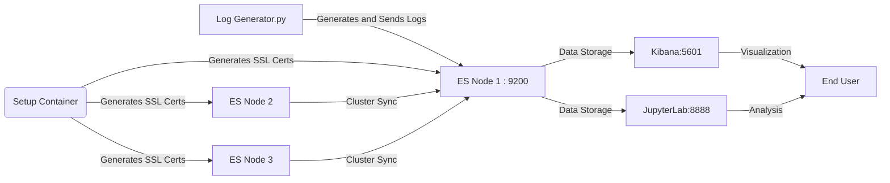

# ElasticSearch to analyze Web traffic

## Author info

    - Author: Berk Somer
    - GitHub Account: Berks97
    - UMD Email: bsomer@umd.edu
    - Personal Email: berks97@gmail.com

## Project Description

## Technologies

### Elasticsearch

### Kibana

### Docker

### Jupyter Notebook

## Docker System
-	The docker system designed for this project follows a systematic path to create a continuously flowing environment for both development and deployment phases.
-	This part explains the logic and detail behind the system:

### Project Directory Setup: 
The main files in the project directory include:
-	‘docker-compose.yml’ : This docker-compose file defines every single services needed for the project and their configurations and volumes inside the single main network: “elasticnet”. 
-	‘Dockerfile’: This first Dockerfile contains the necessary instructions for a python image building which will be used for log generating process.
-	‘.env’: ElasticSearch and Kibana passwords needed to be generated in order to establish authentication to the elasticsearch engine. In the main guide of ElasticSearch, it was required to manually create and store these passwords in an ‘.env’ file and use them for connection (‘https://www.elastic.co/guide/en/elasticsearch/reference/current/docker.html’). The file is usually hidden for a normal ‘ls’ command but its visible on ‘ls -a’ command.
-	‘requirements.txt’ : This first requirements text file contains the necessary python packages to be installed for the log-generate.py. It contains elasticsearch and faker packages.
-	‘log-generate.py’: This is a python file which first establishes connection with the ElasticSearch API using the authentication credentials and sends a defined amount of logs between a time frame to the port 9200.
-	jupyterlab directory: A sub-directory which contains the necessary files for the generated log analysis in the jupyter container.
    -   jupyterlab/Dockerfile: This second Dockerfile contains the necessary instructions to build an image for jupyter environment and install required packages.
    -   jupyterlab/requirements.txt: This second txt file contains the necessary python packages to be installed for log-analyze.ipynb in the jupyterlab environment. Different that the first txt, this file contains packages for visualization and data analysis such as matplotlib and pandas.
    -	jupyterlab/log-analyze.ipynb: This jupyter notebook file is in the jupyterlab environment at port 8888. It contains python scripts for data extraction using elasticsearch querries and for data visualization. 

### Docker System Logic
#### “docker-compose.yml” Configuration:
- There are 7 services under network “elasticnet” used for the project: 
    - setup:
        - Temporary service handles the initial setup, including generating the SSL certificates needed to secure communications within the cluster. 
        - Uses the elasticsearch-certutil tool to generate a CA and node certificates based on defined instances (es01, es02, es03)
        - Adjusts file permissions accordingly and sets the kibana_system user password using the Elasticsearch API.
    -	3 ElasticSearch Nodes = (es01, es02, es03) : 
        - The original Elasticsearch manual suggested using a 3-node cluster system as a way of increasing reliability and performance while creating a robust, scalable, and efficient data storage and search solution (https://www.elastic.co/guide/en/elasticsearch/reference/current/docker.html). 
        - The ElasticSearch API was configured on es01 node at port:9200. To achieve a smooth data flow, other containers will start running after the node es01 gives a successful service_healthy confirmation.
        - Each 3 node uses the official elasticsearch: 8.13.3 image described in the .env file.
    -	Kibana: 
        - Designed to securely connect to the Elasticsearch cluster using HTTPS.
        - Configured at port: 5601 and has a dependency on all 3 nodes of ES having healthy service. 
        - Uses the Kibana:8.13.3 image described in the .env file.
    -	log-generator: 
        - Uses the first Dockerfile to create a Python:3.8-slim image.
        - Installs elasticsearch and faker packages in requirements.txt to its environment.
        - Mounts a volume to access the necessary SSL certificates stored on the host.
        - Starts after es01 gives service_healthy clearance.
        - Connects to port 9200 with password credentials in “.env”, generates and sends the logs to the port and exits. 
    -	jupyter: 
        - Uses the Dockerfile at the jupyterlab directory to create a python 3.9 image.
        - Installs the packages in the jupyterlab/requirements.txt
        - Depends on es01 on healthy_service condition. 
        - Installs a jupyterlab environment on port 8888 with the log-analyze.ipynb jupyternotebook waiting to be opened.
        - The notebook: “log-analyze.ipynb” contains the necessary scripts for analysis and visualization.
#### 2 Different Dockerfiles for log generation and analysis
- First Dockerfile is for log-generate.py
    - 
- Second Dockerfile is for log-analyze.ipynb
    - 

#### .env file
- Key element for variable selection for ElasticSearch and Kibana connection. 
- Variables used for ES and Kibana connection such as port numbers (9200,5601), ES & Kibana image versions(8.13.3) and ES & Kibana authentication passwords ('ilove605')

#### Running the Docker Container:
- Start the container process with 'docker-compose up -d'
- Docker Compose will first start the setup along with 3 es nodes. ES API will be configurated at 'http://localhost:9200' on es01 but the site will return a "ERR_EMPTY_RESPONSE" error. This is expected since the server is only used for API connections.
- After about a minute (system health checking) Kibana container will start on 'http://localhost:5601'
The server may return 'Kibana server is not ready yet.' response but after waiting some time the server will respond with username and password screen. The username will be 'elastic' and the password is the kibana password on .env file ('ilove605'). 
- Along with Kibana, log-generator container will run for couple seconds and automatically exits.
- Lastly, jupyter container will start running on 'http://localhost:8888'. The notebook: 'log-analyze.ipynb' contains the analysis and will generate the visualization if the codes in the scripts are simultaneously executed.

#### Stopping the Container:
- Pressing 'Ctrl + C' in the terminal running will stop all containers
- Also using 'docker-compose down' will stop containers.

## Python Log Generation Overview

Log-generator & Elasticsearch Communication:
- The log-generator script utilizes the Elasticsearch Python client to establish a direct link to the Elasticsearch service running on port 9200. The script is designed to authenticate securely using credentials and SSL/TLS certificates to ensure encrypted data transmission.
- Elasticsearch Client: After thorough research through the Elasticsearch official documentation, the Elasticsearch client was integrated into the Python script. This client requires several parameters to initialize a connection, including the host URL, authentication credentials, and paths to SSL certificates.
- SSL Certificates: To secure the connection, SSL/TLS certificates are specified. These certificates are generated during the setup phase in the Docker environment and are necessary to establish a trusted connection between the log generator and Elasticsearch. The path to these certificates (ca.crt) is retrieved using the os library, which allows the script to dynamically access environment-specific paths without hardcoding.

## Jupyterlab Log Analysis

### Output

## Project Diagram

## Conclusion

