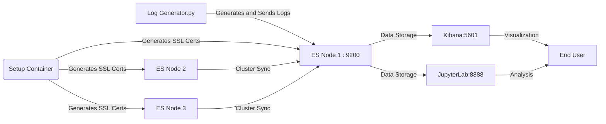

# ElasticSearch to analyze Web traffic

## Author info

    - Author: Berk Somer
    - GitHub Account: Berks97
    - UMD Email: bsomer@umd.edu
    - Personal Email: berks97@gmail.com

## Project Description

- This project focused on establishing a robust data pipeline using Elasticsearch and Kibana to analyze web traffic logs. The core of the project involved setting up a Dockerized environment where Elasticsearch clusters manage and index large volumes of generated log data. A Python script within another Docker container simulates web traffic by generating synthetic log data that mimics real-world web interactions. These logs are then ingested into Elasticsearch for analysis. Kibana acts as the visualization layer, offering the ability to observe and analyze trends, patterns, and anomalies in web traffic through various graphical representations. Additionally, a Jupyter Notebook integrated within the environment allows for more detailed and scripted data analysis and visualization.

## Technologies

### Elasticsearch

- Elasticsearch is a powerful NoSQL open-source search and analytics engine that allows us to store, search, and analyze big volumes of data quickly and in near real-time. It is used for log and event data analysis, real-time application monitoring, and clickstream analytics. Its ability to scale outwards across multiple nodes and handle petabytes of data while maintaining speedy search responses makes it distinct from traditional databases that aren't built with search-first scenarios in mind.

- Unlike traditional databases that are not inherently optimized for search operations, Elasticsearch uses an inverted index that allows for fast full-text searching. Its design as a distributed system enables it to handle large volumes of data that can be grown simply by adding more nodes to the cluster.

- Pros:

    - Real-time search and analytics capabilities.
    - Highly scalable and can handle petabytes of structured and unstructured data.
    - Robust RESTful API that allows easy interaction from various client libraries.

- Cons:

    - Complexity in setup such as authentication passwords and SSL certificates.
    - Higher resource consumption compared to less powerful search engines.

Reference: 'https://www.elastic.co/guide/en/elasticsearch/reference/current/elasticsearch-intro.html'

### Kibana

- Kibana is a visual interface tool that works in together with Elasticsearch to provide a means for visual data exploration. It complements Elasticsearch's search capabilities by providing a rich toolset for visualizing data stored in Elasticsearch indices and creating custom dashboards for specific use-cases. 

- Kibana is particularly unique because it integrates seamlessly with Elasticsearch, offering out-of-the-box capabilities for analytics and visualization without the need for additional plugins or software. 

- Pros:

    - Seamless integration with Elasticsearch.
    - Interactive and real-time visualizations.
    - User-friendly interface that supports advanced data analysis workflows.

- Cons:

    - Dependency on Elasticsearch; it is not a standalone tool and cannot be used with other types of databases or data sources.
    - Can become resource-intensive with complex dashboards or large datasets.
    - User can experience sudden exits as docker container for no reason.

Reference: 'https://www.elastic.co/guide/en/kibana/current/introduction.html'

### Docker

- Docker is a platform and tool for building, distributing, and running Docker containers. It offers a standardized unit of software, packaging up applications and their dependencies in a virtual container that can run on any Linux server.

- Docker containers provide a lightweight alternative to traditional virtual machines, offering similar resource isolation but with a much lower overhead. Docker ensures consistency across multiple development, testing, and production environments, thereby simplifying configurations.

- Pros:

    - Simplifies configuration management and deployment.
    - Very useful for multi-team working environments.
    - Reduces resource costs compared to traditional VMs.

- Cons:

    - Requires a long learning process
    - Security needs to be tightly managed, especially when running containers with network access.
    - Can get very complicated very soon if not systematically planned.

### Jupyter Notebook

- Jupyter Notebook is an open-source web application that allows us to create and share documents containing live code, equations, visualizations, and narrative text. 

- It provides an interactive environment that makes it easy to experiment with code and data. Its different from traditional scripts by allowing step-by-step code execution, visualization, and immediate access to results.

- Pros:

    - Supports interactive data science and scientific computing for multiple programming languages.
    - Easy readability and usability of code with rich text and visualization capabilities.
    - Facilitates educational and collaborative projects with its shareable and reproducible notebook format.

- Cons:

    - Web interface might not be ideal for all development tasks, especially those requiring intensive debugging.
    - Managing dependencies and version control in Jupyter notebooks can be challenging without proper tools.
    - Necessary package installation may take some time.

## Docker System
-	The docker system designed for this project follows a systematic path to create a continuously flowing environment for both development and deployment phases.
-	This part explains the logic and detail behind the system:

### Project Directory Setup: 
The main files in the project directory include:
-	‘docker-compose.yml’ : This docker-compose file defines every single services needed for the project and their configurations and volumes inside the single main network: “elasticnet”. 
-	‘Dockerfile’: This first Dockerfile contains the necessary instructions for a python image building which will be used for log generating process.
-	‘.env’: ElasticSearch and Kibana passwords needed to be generated in order to establish authentication to the elasticsearch engine. In the main guide of ElasticSearch, it was required to manually create and store these passwords in an ‘.env’ file and use them for connection (‘https://www.elastic.co/guide/en/elasticsearch/reference/current/docker.html’). The file is usually hidden for a normal ‘ls’ command but its visible on ‘ls -a’ command.
-	‘requirements.txt’ : This first requirements text file contains the necessary python packages to be installed for the log-generate.py. It contains elasticsearch and faker packages.
-	‘log-generate.py’: This is a python file which first establishes connection with the ElasticSearch API using the authentication credentials and sends a defined amount of logs between a time frame to the port 9200.
-	jupyterlab directory: A sub-directory which contains the necessary files for the generated log analysis in the jupyter container.
    -   jupyterlab/Dockerfile: This second Dockerfile contains the necessary instructions to build an image for jupyter environment and install required packages.
    -   jupyterlab/requirements.txt: This second txt file contains the necessary python packages to be installed for log-analyze.ipynb in the jupyterlab environment. Different that the first txt, this file contains packages for visualization and data analysis such as matplotlib and pandas.
    -	jupyterlab/log-analyze.ipynb: This jupyter notebook file is in the jupyterlab environment at port 8888. It contains python scripts for data extraction using elasticsearch querries and for data visualization. 

### Docker System Logic
#### “docker-compose.yml” Configuration:
- There are 7 services under network “elasticnet” used for the project: 
    - setup:
        - Temporary service handles the initial setup, including generating the SSL certificates needed to secure communications within the cluster. 
        - Uses the elasticsearch-certutil tool to generate a CA and node certificates based on defined instances (es01, es02, es03)
        - Adjusts file permissions accordingly and sets the kibana_system user password using the Elasticsearch API.
    -	3 ElasticSearch Nodes = (es01, es02, es03) : 
        - The original Elasticsearch manual suggested using a 3-node cluster system as a way of increasing reliability and performance while creating a robust, scalable, and efficient data storage and search solution (https://www.elastic.co/guide/en/elasticsearch/reference/current/docker.html). 
        - The ElasticSearch API was configured on es01 node at port:9200. To achieve a smooth data flow, other containers will start running after the node es01 gives a successful service_healthy confirmation.
        - Each 3 node uses the official elasticsearch: 8.13.3 image described in the .env file.
    -	Kibana: 
        - Designed to securely connect to the Elasticsearch cluster using HTTPS.
        - Configured at port: 5601 and has a dependency on all 3 nodes of ES having healthy service. 
        - Uses the Kibana:8.13.3 image described in the .env file.
    -	log-generator: 
        - Uses the first Dockerfile to create a Python:3.8-slim image.
        - Installs elasticsearch and faker packages in requirements.txt to its environment.
        - Mounts a volume to access the necessary SSL certificates stored on the host.
        - Starts after es01 gives service_healthy clearance.
        - Connects to port 9200 with password credentials in “.env”, generates and sends the logs to the port and exits. 
    -	jupyter: 
        - Uses the Dockerfile at the jupyterlab directory to create a python 3.9 image.
        - Installs the packages in the jupyterlab/requirements.txt
        - Depends on es01 on healthy_service condition. 
        - Installs a jupyterlab environment on port 8888 with the log-analyze.ipynb jupyternotebook waiting to be opened.
        - The notebook: “log-analyze.ipynb” contains the necessary scripts for analysis and visualization.
#### 2 Different Dockerfiles for log generation and analysis
- First Dockerfile is for log-generate.py:
    - Set Base Image: FROM python:3.8-slim
    - Define Working Directory: WORKDIR /usr/src/app so all commands will be executed inside the container.
    - Install Dependencies: RUN pip install --no-cache-dir -r requirements.txt on the container (elasticsearch, faker, numpy)
    - Configure the container to run the generate-logs.py script when it starts, generating and sending log data to Elasticsearch.
- Second Dockerfile is for log-analyze.ipynb:
    - Set Base Image: FROM python:3.9
    - Upgrades pip and installs Python packages defined in requirements.txt on the container (jupyterlab, numpy, pandas, matplotlib, elasticsearch, seaborn).
    - Marks port 8888 on the container to signal that JupyterLab will use it.
    - Configures the container to start JupyterLab when it runs, making it accessible from the host.

#### .env file
- Key element for variable selection for ElasticSearch and Kibana connection. 
- Variables used for ES and Kibana connection such as port numbers (9200,5601), ES & Kibana image versions(8.13.3) and ES & Kibana authentication passwords ('ilove605')

#### Running the Docker Container:
- Start the container process with 'docker-compose up -d'
- Docker Compose will first start the setup along with 3 es nodes. ES API will be configurated at 'http://localhost:9200' on es01 but the site will return a "ERR_EMPTY_RESPONSE" error. This is expected since the server is only used for API connections.
- After about a minute (system health checking) Kibana container will start on 'http://localhost:5601'
The server may return 'Kibana server is not ready yet.' response but after waiting some time the server will respond with username and password screen. The username will be 'elastic' and the password is the kibana password on .env file ('ilove605'). 
- Along with Kibana, log-generator container will run for couple seconds and automatically exits.
- Lastly, jupyter container will start running on 'http://localhost:8888'. The notebook: 'log-analyze.ipynb' contains the analysis and will generate the visualization if the codes in the scripts are simultaneously executed.

#### Stopping the Container:
- Pressing 'Ctrl + C' in the terminal running will stop all containers
- Also using 'docker-compose down' will stop containers.

## Python Log Generation Overview
The Python log generation script is central to simulating web server logs for analysis in this project. Its primary purpose is to generate a synthetic dataset that mimics real-world web traffic, which can be analyzed using Elasticsearch and visualized in Kibana or JupyterLab. Here’s a detailed view of the script's functionality and its components:
- Script Dependencies: 
    - Elasticsearch, faker, os, random, numpy, datetime, random.
- Log Entry Construction (Key Information)
    - Timestamps: Calculated to realistically represent the time logs were generated. Using the current time as a reference, it follows a normal distribution since log entries vary on a time of a day.
    - HTTP methods: Input coming from the user to server is different (GET, POST PUT, DELETE). Usually end users tends to send GET methods
    - Response codes: Output coming from server to the user can also vary such as successful responses like 200 201 or unsuccessful such as 404, 500
    - Endpoint: Endpoint generation uses Faker to create plausible URI patterns.
    - Response times: Response times are randomly assigned, simulating the variable handling time of real web servers.

- Example of a Generated Log Entry:
{
  "timestamp": "2024-05-10T12:34:56",
  "ip": "192.168.1.1",
  "method": "GET",
  "endpoint": "/api/data",
  "response_code": 200,
  "response_time": 123
}

- Temporal Distribution of Logs
    - As mentioned before the script utilizes a normal distribution to determine the time offset for each log, centering around peak activity hours to mimic common user behavior. This method ensures that log entries are not uniformly distributed throughout the day but instead cluster around typical high-traffic periods.

- Automated Log Ingestion
    - Once generated, logs are automatically pushed to Elasticsearch. This process involves indexing each log entry in real-time, which allows for immediate querying and analysis.

Log-generator & Elasticsearch Communication:
- The log-generator script utilizes the Elasticsearch Python client to establish a direct link to the Elasticsearch service running on port 9200. The script is designed to authenticate securely using credentials and SSL/TLS certificates to ensure encrypted data transmission.
- Elasticsearch Client: After thorough research through the Elasticsearch official documentation, the Elasticsearch client was integrated into the Python script. This client requires several parameters to initialize a connection, including the host URL, authentication credentials, and paths to SSL certificates.
- SSL Certificates: To secure the connection, SSL/TLS certificates are specified. These certificates are generated during the setup phase in the Docker environment and are necessary to establish a trusted connection between the log generator and Elasticsearch. The path to these certificates (ca.crt) is retrieved using the os library, which allows the script to dynamically access environment-specific paths without hardcoding.

## Jupyterlab Log Analysis
- The Jupyter Notebook is integral to our project, serving as the platform for analyzing and visualizing the web log data stored in Elasticsearch. Here's how each part of the script contributes to the project's goals:
    - Environment Setup: The script begins by importing necessary libraries and configuring the environment to connect to Elasticsearch. 
    - Date Handling: It calculates the current and previous day's dates to set the timeframe for the analysis, allowing us to focus on the most recent data.
    - Connection Test: Establishes a connection to the Elasticsearch server and retrieves basic server information to ensure that the setup is correct and operational.
    - Data Retrieval Functions: Several functions are defined to query Elasticsearch for different types of data:
        - fetch_latest_logs: Retrieves the most recent logs up to a limit of 10,000 entries.
        - fetch_traffic_data: Aggregates log data into hourly intervals to analyze web traffic over time.
        - fetch_response_codes and fetch_methods: These functions aggregate the data to show the distribution of HTTP response codes and methods, respectively.
        - fetch_endpoints: Gathers statistics on the most frequently accessed endpoints.
        - Outlier Detection: Implements statistical techniques to identify unusual response times that deviate significantly from the norm, which can indicate potential performance issues or anomalous behavior in the network.
    - Visualization: The notebook uses matplotlib for plotting the data:
        - A time series plot visualizes web traffic trends over the specified date range.
        - Pie charts display the proportions of different HTTP response codes and methods, providing insights into the typical use and potential issues like errors.
        - The histogram of response times helps in identifying performance characteristics and anomalies such as unusually long response times.

    - Interactive Analysis: By displaying the DataFrame outputs directly within the notebook, it offers an interactive environment to explore and refine analyses based on real-time data.
    - Mock Data Generation: Shows an example of how synthetic log data is generated, emphasizing the project's capability to simulate realistic network traffic for testing and development purposes.

### Output

- Example Output:
    - To illustrate the utility of the analysis, an example of generated insights includes:
    - Traffic peaks during specific hours, indicating high user activity.
    - A predominance of GET requests over other methods, typical for data retrieval-heavy applications.
    - The response code distribution highlights the system's health, with a focus on error rates like 404 or 500 which might require attention.
- Reflection of Generated Logs:
    - The analysis in JupyterLab effectively mirrors the patterns and anomalies expected in the generated logs, showcasing the system's robustness in simulating real-world scenarios. This alignment confirms that the log generation algorithm functions as intended, providing a reliable foundation for further development and testing.
    - System Validation: The output from the JupyterLab analysis confirms that the system behaves as expected, reflecting accurately on the synthetic data generated. This validation is essential for trusting the analysis framework in a real-world deployment scenario.

## Project Implementation Steps:
- Understanding Elasticsearch and Kibana:
    - Initially familiarized myself with how Elasticsearch (ES) and Kibana function.
    - Containerized Elasticsearch and Kibana with password authentication following the official documentation.
    - Verified the system's functionality by accessing Kibana.
- Establishing Data Flow and Visualization:
    - Created a Python script (log-generate.py) to generate logs.
    - Utilized the Elasticsearch client in Python to establish a connection to ES at port 9200.
    - Verified the data flow by executing Elasticsearch queries on port 5601 and checking results in Kibana.
    - Developed Kibana dashboards to explore and understand different visualization techniques applicable to the project.
- Setting Up Jupyter Notebook Environment:
    - Constructed a separate Dockerfile for the Jupyter Notebook environment within a new directory.
    - Connected the Jupyter Notebook to the Elasticsearch engine on port 9200 to ensure seamless data interaction.
    - Tested the connection to confirm data flow from Elasticsearch to the notebook.
- Data Analysis and Visualization:
    - Transferred log data into a pandas DataFrame for manipulation and analysis.
    - Applied Matplotlib for visualizing the data, creating various charts to illustrate the insights extracted from the logs.

## Project Diagram

## Conclusion

- The successful implementation of this Docker-based analytical environment showcases the power of integrating Elasticsearch and Kibana for real-time data analysis. Through this setup, the project demonstrates not only the ability to handle vast amounts of data but also the flexibility to analyze and visualize that data in meaningful ways. Challenges such as data ingestion, timestamp alignment, and visualization were systematically addressed, resulting in a comprehensive tool for web log analysis. This project highlights the scalability of Elasticsearch alongside the detailed analytical capabilities of Kibana and Jupyter Notebooks, making it a valuable model for similar analytics-driven projects.
