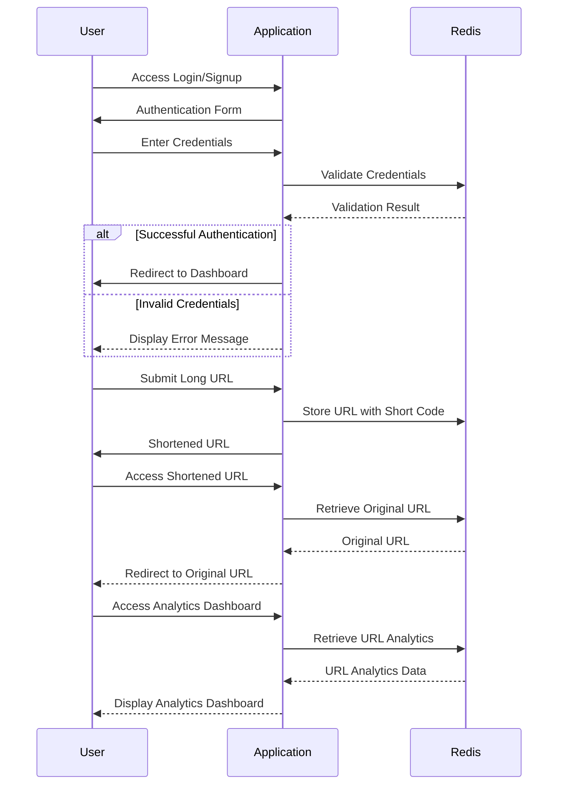

# URL Shortener Service with Redis

## Author info
* Author: Yashwanth Reddy Pinnapu Reddy
* GitHub account: yashwanthpinnapu
* UMD email: ypinnapu@umd.edu
* Personal email: yashwanthpinnapu@gmail.com

## Table of contents
1. [Project Description](#project-description)
2. [Technologies](#technologies)
    * [Redis](#redis)
    * [Flask](#flask)
    * [Docker](#docker)
3. [Docker Implementation](#docker-implementation)
    * [Initialization](#initialization)
    * [Running the project](#running-the-project)
5. [Project overview](#project-overview)
6. [Workflow diagram](#workflow-diagram)
5. [Output](#output)
6. [Conclusion](#conclusion)
7. [References](#references)

## Project Description 
The URL Shortener project is a web application designed to simplify the process of sharing and managing long URLs. It provides users with the ability to shorten lengthy URLs into concise and easily shareable links. This project utilizes modern web development technologies, including Flask for the backend framework, Redis for data storage, bcrypt for password hashing, and Docker for containerization. Key features of the application include URL shortening with custom aliases and expiration dates, user authentication for secure access, and an analytics dashboard for monitoring URL access counts.

Video Link : https://drive.google.com/file/d/18zD7XL48EXmUyop6Joz6w2j0dvjUnHru/view?usp=sharing

## Technologies

### Redis:

Redis is an open-source, in-memory data store that is commonly used as a caching layer, message broker, and database. In the context of the URL Shortener project, Redis is utilized as the primary data store for storing shortened URLs and analytics data. Here's a more detailed description of its features and usage:

- **In-Memory Storage:** Redis stores data primarily in RAM, which allows for fast read and write operations, making it suitable for real-time applications like URL shortening.
- **Key-Value Store:** Redis is a key-value store, meaning that data is stored and accessed using unique keys. In this project, shortened URLs are stored as keys, with their corresponding long URLs and additional metadata stored as values.
- **Data Structures:** Redis supports various data structures such as strings, hashes, lists, sets, and sorted sets, providing flexibility in storing and manipulating data. For example, hashes are used to store URL metadata like access counts and expiration dates.
- **Persistence Options:** Redis offers different persistence options, including snapshotting and append-only file (AOF) persistence, to ensure data durability and recoverability in case of system failures.

### Flask:

Flask is a lightweight and versatile web framework for Python, commonly used for developing web applications and APIs. It provides a simple yet powerful structure for building web-based projects. Here's an overview of Flask's features and usage in the URL Shortener project:

- **Routing:** Flask allows developers to define URL routes and map them to corresponding view functions. In the URL Shortener project, routes are defined for handling URL shortening, user authentication, analytics, etc.
- **Template Rendering:** Flask includes a built-in template engine, Jinja2, for rendering HTML templates. Templates are used to generate dynamic content for web pages, such as displaying shortened URLs and analytics data.
- **Request Handling:** Flask provides convenient methods for handling HTTP requests, such as accessing form data, processing user input, and redirecting requests to different URLs.
- **Extensions:** Flask has a rich ecosystem of extensions that extend its functionality. For example, Flask-Session is used for managing user sessions, Flask-WTF for handling web forms, and Flask-Bcrypt for password hashing.

### Docker:

Docker is a containerization platform that allows developers to package applications and their dependencies into lightweight, portable containers. Containers provide a consistent environment for running applications across different environments, making deployment and scaling easier. Here's how Docker is used in the URL Shortener project:

- **Containerization:** The URL Shortener application is packaged into a Docker container, along with its dependencies such as Flask, Redis, and any other required libraries. This ensures that the application runs consistently across different environments, regardless of the underlying system configuration.
- **Isolation:** Docker containers provide process isolation, meaning that each container runs as an isolated instance with its own filesystem, network, and resources. This isolation prevents conflicts between different applications running on the same host.
- **Portability:** Docker containers are portable and can be easily deployed to any platform that supports Docker, whether it's a local development environment, a cloud server, or a container orchestration platform like Kubernetes.
- **Scalability:** Docker containers are lightweight and can be quickly spun up or down, making it easy to scale the URL Shortener application based on demand. Containers can be orchestrated and managed using Docker Swarm or Kubernetes for efficient resource utilization.

Overall, Redis, Flask, and Docker are essential technologies in the URL Shortener project, providing efficient data storage, web application development, and containerization capabilities, respectively. Their integration enables the creation of a robust and scalable URL shortening solution.

## Docker Implementation:

### Initialization

The URL Shortener project utilizes Docker for containerization, allowing for easy deployment and scalability across different environments. Here's how Docker is implemented in the project:

1. **Dockerfile:**
   - The project includes a `Dockerfile` that defines the Docker image configuration. This file specifies the base image, dependencies, and commands needed to build and run the application within a Docker container.

2. **Base Image:**
   - The `python:3.9-slim` image is used as the base image in the Dockerfile. This image provides a lightweight Python runtime environment, minimizing the container size and resource footprint.

3. **Dependency Installation:**
   - The Dockerfile includes commands to install project dependencies listed in the `requirements.txt` file. This ensures that all necessary libraries, including Flask, Redis, and bcrypt, are installed within the Docker container.

4. **Redis Installation:**
   - In addition to Python dependencies, the Dockerfile installs the Redis server using the `apt-get` package manager. This allows the URL Shortener application to communicate with Redis for storing shortened URLs and analytics data.

5. **Container Configuration:**
   - The Dockerfile sets the working directory within the container (`/app`) and copies the project source code into this directory. It also exposes port 8080 to allow external access to the Flask web server running inside the container.

6. **Command Execution:**
   - Finally, the Dockerfile specifies the command to run the Redis server in daemon mode (`redis-server --daemonize yes`) and start the Flask application (`flask run --host=0.0.0.0 --port=8080`) within the Docker container.
     
  ```dockerfile
  # Dockerfile
  
  # Use an official Python runtime as a parent image
  FROM python:3.9-slim
  
  # Install Redis server
  RUN apt-get update && apt-get install -y redis-server
  
  # Set the working directory in the container
  WORKDIR /app
  
  # Copy the current directory contents into the container at /app
  COPY . /app
  
  # Install any needed dependencies specified in requirements.txt
  RUN pip install --no-cache-dir -r requirements.txt
  
  # Expose port 8080 to the outside world
  EXPOSE 8080
  
  # Run Redis server and Flask app
  CMD redis-server --daemonize yes && flask run --host=0.0.0.0 --port=8080
  ```
### Running the project

1. **Building the Docker Image:**
   - To build the Docker image, developers can execute the `docker build` command in the project directory, specifying the path to the Dockerfile. This command compiles the Dockerfile instructions and creates a Docker image with the configured environment and dependencies.

2. **Running the Docker Container:**
   - Once the Docker image is built, developers can run the Docker container using the `docker run` command. This command starts the containerized URL Shortener application, making it accessible via port 8080 on the host machine.

3. **Deployment Considerations:**
   - Docker enables easy deployment of the URL Shortener application to various environments, including local development machines, cloud servers, and container orchestration platforms like Kubernetes. The containerized application remains consistent across different environments, simplifying deployment and scaling operations.

  ```bash
  # Building the Docker image
  docker build -t url-shortener .
  
  # Running the Docker container
  docker run -p 8080:8080 url-shortener
  ```
### Project Overview:

The `app.py` file serves as the heart of the URL Shortener project, orchestrating various functionalities essential for shortening, managing, and tracking URLs. Let's delve deeper into each aspect of its implementation:

1. **Flask Application Initialization:**
   - The `app.py` file initializes a Flask application, a lightweight web framework for Python, enabling the creation of web routes, request handling, and rendering of HTML templates.

2. **Redis Integration for Data Storage:**
   - Redis, an in-memory data structure store, is seamlessly integrated into the application to serve as the primary data storage solution. It efficiently stores shortened URLs, user session data, and URL analytics information.

3. **URL Shortening Logic:**
   - The core functionality of the URL Shortener revolves around the `/shorten` route. When a user submits a long URL through a form, this route processes the request, generates a unique short code (or utilizes a custom alias if provided), and stores the association between the short code and the original URL in Redis.

```python
@app.route('/shorten', methods=['POST'])
def shorten_url():
    long_url = request.form['long_url']
    custom_alias = request.form.get('custom_alias')
    expiration_days = int(request.form['expiration_days']) if request.form['expiration_days'] else False

    short_code = custom_alias if custom_alias else generate_short_code()

    if custom_alias and redis_client.exists(custom_alias):
        return 'Custom alias already in use. Please choose another.'

    if expiration_days:
        expiration_date = datetime.datetime.utcnow() + datetime.timedelta(days=expiration_days)
        expiration_timestamp = int(expiration_date.timestamp())
        redis_client.hmset(short_code, {'long_url': long_url, 'user': session['user'], 'expiration_timestamp': expiration_timestamp})
    else:
        redis_client.hmset(short_code, {'long_url': long_url, 'user': session['user']})
```

4. **URL Redirection Mechanism:**
   - Upon accessing a shortened URL (e.g., `example.com/abc123`), the application redirects the user to the corresponding original URL. This redirection process is handled by the `/<short_code>` route, which retrieves the original URL from Redis based on the provided short code and performs the redirection.

```python
@app.route('/<short_code>')
def redirect_to_original_url(short_code):
    url_info = redis_client.hgetall(short_code)
    if url_info:
        long_url = url_info[b'long_url'].decode('utf-8')
        creator = url_info[b'user'].decode('utf-8')
        if creator == session.get('user'):
            track_url_access(short_code)
            return redirect(long_url)
        else:
            return 'You do not have permission to access this URL.'
    else:
        return 'URL not found'
```
5. **User Authentication and Session Management:**
   - User authentication functionality is implemented to ensure secure access to certain features such as URL analytics. The application manages user sessions using Flask's built-in session management capabilities, allowing users to remain authenticated across multiple requests.
   
```python
@app.route('/login', methods=['GET', 'POST'])
def login():
    if 'user' in session:
        return redirect(url_for('index'))
    if request.method == 'POST':
        username = request.form['username']
        password = request.form['password']
        if redis_client.exists(username):
            hashed_password = redis_client.get(username)
            if bcrypt.checkpw(password.encode('utf-8'), hashed_password):
                session['user'] = username
                return redirect(url_for('index'))
        return 'Invalid username/password'
    return render_template('login.html')
```

6. **Analytics Dashboard for URL Tracking:**
   - The `/analytics` route provides users with an analytics dashboard to track various metrics related to their shortened URLs. This includes access counts, expiration dates, and other relevant statistics. The analytics data is retrieved from Redis and presented to the user in a user-friendly format.

```python
@app.route('/analytics')
def analytics():
    if 'user' not in session:
        return redirect(url_for('login'))
    user = session['user']
    url_access_counts = {}
    url_long_codes = {}
    url_expiration_days = {}
    # Retrieve URL keys for the current user
    user_keys = redis_client.keys('*')
```
## Workflow diagram

## Output


## Conclusion

In conclusion, the URL Shortener project presents an efficient solution for shortening URLs and tracking analytics. Leveraging Flask, Redis, and Docker, it provides a user-friendly interface and secure functionality. With its open-source nature and extensible architecture, the project stands as a valuable tool for URL management.

## References:
* Flask Documentation. (n.d.). Retrieved from https://flask.palletsprojects.com/
* Redis Documentation. (n.d.). Retrieved from https://redis.io/documentation
* Docker Documentation. (n.d.). Retrieved from https://docs.docker.com/
* bcrypt Documentation. (n.d.). Retrieved from https://pypi.org/project/bcrypt/
* Python Documentation. (n.d.). Retrieved from https://docs.python.org/
