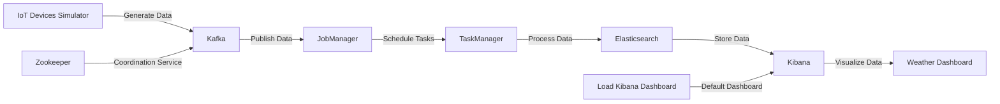

# Distributed Data Processing using Apache Flink

## Author info

- Author: Prahar Modi
- GitHub account: Prahar08modi
- UMD email: pmodi08@umd.edu
- Personal email: pmodi08@umd.edu

Link to the demonstrated video: https://drive.google.com/drive/folders/1RJTknUP88tpSPa_-_OY2TwIjh5kiCeUP?usp=sharing

## Description

This project constructs a complex distributed data processing ecosystem using Apache Flink in a Dockerized Python environment. It excels in ingesting and processing streaming weather data from IoT devices. The system focuses on implementing transformations, optimizing state management, and precise event time processing. 

The project simulates weather data ingestion from three IoT devices into a Kafka topic. A Flink streaming job, configured with Kafka as the source, processes this data. The job applies a tumbled window of one minute and calculates the average sensor readings using Flink SQL APIs. The averaged data is then stored in an Elasticsearch index. Visualization of this data is achieved through a Kibana dashboard, providing insightful analytics. The entire system, including the IoT data generator, Kafka, Zookeeper, JobManager, TaskManager, Elasticsearch, and Kibana, is containerized using Docker for ease of deployment and scalability. A meticulously crafted Docker Compose file ensures seamless operation of all components.

## Technologies

### **Apache Flink**
- Apache Flink is a distributed processing engine for stateful computations over unbounded and bounded data streams. It's designed to run in all common cluster environments, perform computations at in-memory speed, and scale to any size.
- Unlike other stream processing technologies, Flink excels in processing both batch and real-time data, making it ideal for use cases that require handling large volumes of data in a scalable and fault-tolerant manner.
- Flink provides exactly-once state consistency, sophisticated handling of late data, and flexible deployment options.
- Apache Flink is at the core of this project since it creates a Distributed Data Procecssing Pipeline for processing incoming stream of weather data from IoT devices, processes it in distributed manner and stores the result into a datastore.

### **Apache Kafka**
- Apache Kafka is an event streaming platform used to collect, process, store, and integrate data at scale. It's designed for real-time data pipelines and streaming applications.
- Kafka combines messaging, storage, and stream processing, while most other similar technologies only offer one or two of these capabilities.
- Kafka provides high throughput, built-in partitioning, replication, and inherent fault-tolerance, making it suitable for large-scale message processing applications.
- Kafka acts as the source of the Flink's Data Pipeline where the data is ingested into the pipeline from Kafka topic.

### **ElasticSearch**
- Elasticsearch is a distributed, RESTful search and analytics engine capable of addressing a growing number of use cases. It centrally stores your data for lightning fast search, fine-tuned relevancy, and powerful analytics that scale with ease.
- Unlike traditional databases, Elasticsearch is designed around search. It not only stores data but also indexes it to support complex search operations.
- Elasticsearch is highly scalable, supports full-text search, and is able to analyze and visualize data in real time.
- Elasticsearch acts as the sink for Flink's Data Pipeline where it stores the processed data into an index.

### **Kibana**
- Kibana is a user interface that lets visualize Elasticsearch data and navigate the Elastic Stack. It allows you to create visualizations and dashboards to better understand the data.
- Kibana is tightly integrated with Elasticsearch and provides out-of-the-box visualization capabilities that many other platforms do not offer.
- Kibana supports a wide variety of charts, graphs, and dashboards, and it's easy to use even for non-technical users.
- Kibana reads data from the Elasticsearch Index and displays the Dashboard for easy visualization of the processed data in real-time.

## Docker

- Docker is a platform that uses containerization technology to package and run applications with their dependencies in isolated environments called containers.

- In the context of your distributed data processing application, Docker’s benefits are particularly relevant. The portability Docker provides is crucial for deploying your application across multiple nodes in a distributed system. 

- The isolation ensures that the various components of your application (Apache Flink, Kafka, Elasticsearch, Kibana) can work independently without interfering with each other. 

- The efficiency of Docker containers allows you to maximize the utilization of your nodes in the distributed system. 

- Lastly, the consistency ensures that your application behaves the same way in every environment, which is crucial for debugging and reliability.

- The Dockerfile specifies the use of an official Python runtime as the base image and installs the necessary components such as Apache Flink, Generator and Kibana. It also copies the necessary scripts and configuration files into the container. The resulting Docker image encapsulates the entire project, making it easily deployable and scalable.

- By using Docker, the project achieves portability and encapsulation. This is particularly beneficial for a distributed data processing application like this, which involves multiple components that need to work together seamlessly.

## Docker Implementation

- The use of Docker helps in simplifying dependency management, collaboration among development teams, and deployment into production environment.

- Let's delve into the intricacies of the Docker system logic:

- Project Setup:
  - Begin with organizing your project files within a directory structure. The
    main files include:
    - `flink_job.py`: Contains the logic for building and processing Flink Data pipeline.
    - `Dockerfile`: Installs python, pyflink, kafka-python and downloads the dependency of connectors used for Kafka and Elasticsearch.
    - `docker-compose.yml`: Defines services, networks, and volumes for Docker
      containers.
    - `generator`:
    	- `Dockerfile`: Installs python, confluent-kafka package, copies the code and specifies the command to run the code 
    	- `iot_data_generator.py`: Contains the logic for publishing weather data to Kafka topic
	- `kibana`:
		- `Dockerfile`: Creates a directory to store the dashboard configuration and specifies the command to run the code.
		- `export.ndjson`: Contains the configuration file that creates the default dashboard in Kibana
		- `load_ndjson.sh`: Script for loading the dashboard in Kibana once the kibana container is up.
	- `Images`: Contains the images used in the README.md file.		 

- Docker-compose.yaml Configuration:
  - Configure the docker-compose.yml file to define the services required for
    the project:
    - Define eight services: jobmanager, taskmanager, zookeeper, kafka, generator, elasticsearch, kibana, and load-kibana-dashboard.
    - Configure the jobmanager service:
      - Use the custom built `pyflink:1.18.1`.
      - Map `port 8081` on the host to `port 8081` in the container.
      - Set the container name as jobmanager.
      - Exposes `port 6123`, specifies environment variables, volume, and `docker_network`.
    - Configure the taskmanager service:
      - Use the custom built `pyflink:1.18.1`.
      - Exposes `port 6121, 6122`, specifies environment variables, volume, and `docker_network`.
      - Depends on `jobmanager` container.
      - Specify the container name as `taskmanager`.
    - Configure the zookeeper service:
      - Uses `bitnami/zookeeper:latest` image.
      - Specify the container name as `zookeeper`.
      - Map `port 2181` on the host to `port 2181` in the container.
      - Set environment variables and specify network `docker_network`.
    - Configure the kafka service:
      - Uses `bitnami/kafka:latest` image.
      - Specify the container name as `kafka`.
      - Map `port 9092` on the host to `port 9092` in the container.
      - Set environment variables and specify network `docker_network`.
      - Depends on `zookeeper` container.
    - Configure the generator service:
      - Uses custom built `generator:2.0` image.
      - Specify the container name as `generator`.
      - Map `port 9092` on the host to `port 9092` in the container.
      - Set environment variables and specify network `docker_network`.
      - Depends on `kafka` container.
    - Configure the elasticsearch service:
   	  - Uses `elasticsearch:7.8.0` image.
      - Specify the container name as `elasticsearch`.
      - Map `port 9092, 9093` on the host to `port 9092, 9093` in the container.
      - Set environment variables and specify network `docker_network`.
    - Configure the kibana service:
      - Uses `kibana:7.8.0` image.
      - Specify the container name as `kibana`.
      - Map `port 5601` on the host to `port 5601` in the container.
      - Specify network `docker_network`.
      - Depends on `elasticsearch` container.
    - Configure the load-kibana-dashboard service:
      - Uses custom built kibana image.
      - Specify command to load the default dashboard in kibana.
      - Specify network `docker_network`.
      - Depends on `kibana` container.


- Running the Docker Containers:
  - Docker Compose will create and launch containers for all the services. 
  - Start the Docker containers with the command
  
  ```
  sudo docker-compose up -d
  ```
  - A proper execution should show the following result:
    


- Checking if the Apache Flink server is hosted:
  - Search for `localhost:8081` in the browser.
  - You should see the hosted Apache Flink as shown in the image below.
  

- Running the flink job inside the container:
  - (IMP) Run the command once the Apache Flink is hosted on `localhost:8081`.
  - Run the following command
  ```
  sudo docker-compose exec jobmanager ./bin/flink run -py /opt/docker/flink_job.py -d
  ```
  - It takes 5-10 seconds to submit the job. You should see something like the below image. 
  

- Visualizing the result in Kibana Dashboard
  - Type `localhost:5601` in the browser to access Kibana Service.
  - It will show the landing page of the service.
  - Now, you need to navigate to pre-loaded weather dashboard by clicking the `Hamburger Menu (Top Left) > Dashboard > Weather Dashboard`.
  - From the Calendar dropdown (Right side of KQL), select the time frame of stored data as `Last 1 day` and hit `Apply`.
  - There will be `Refresh every` field at the bottom, you can set the refresh interval for the dashboard, anything above 1 minute to see new data coming in and hit `Start`.
  - Once properly selected, you should see similar to the following configuration image
  

  - The final dashboard will show the Gauge meter for each device that shows the Average over the last 1 day of temperature data reported on these devices. You should see a similar looking dashboard as shown below.


- Stopping the Docker Containers:
  - To stop containers, use `sudo docker-compose down` to stop and remove containers.

## 3. Python Script Overview

There are in total 2 python scripts that demonstrates the distributed data processing using the above mentioned services. One for simulating the behavior of IoT devices streaming weather data and another that contains the logic for processing the data. 

### iot_data_generator.py

`iot_data_generator.py` Python script is designed to simulate data generation from multiple IoT devices and publish the data to a Kafka topic. Here's a summary of what it does:

1. **Data Generation**: The script simulates three IoT devices (`device1`, `device2`, `device3`) that generate weather data. Each device generates a JSON message containing the device ID (`client_id`), a timestamp (`ts`), and two sensor readings: temperature and humidity. The sensor readings are randomly generated within a specified range.

2. **Data Publishing**: The generated data is published to a Kafka topic named `weather_data`. The publishing frequency is different for each device: `device1` publishes every 2 seconds, `device2` every 5 seconds, and `device3` every 10 seconds.

3. **Threading**: To simulate the concurrent operation of multiple devices, the script uses Python's threading module. A separate thread is created for each device, allowing the devices to generate and publish data independently and concurrently.

4. **Kafka Producer**: The script uses the Confluent Kafka Python client to create a Kafka producer. The producer is configured with the address of the Kafka broker and is responsible for publishing the messages to the Kafka topic.

5. **Main Function**: The main function of the script sets up the Kafka producer, defines the publishing frequencies for the devices, starts the threads for each device, and waits for all threads to finish.

This script is a multi-threaded Kafka producer that simulates data generation from multiple IoT devices and publishes the data to a Kafka topic at different frequencies.

- Example Output: Let's walk through the script's functionality with an example:
  ```
	{"client": "device1", "ts": "2024-05-12 02:11:37", "temperature": 19.38, "humidity": 57.09}
	{"client": "device1", "ts": "2024-05-12 02:11:39", "temperature": 29.13, "humidity": 70.74}
	{"client": "device1", "ts": "2024-05-12 02:11:41", "temperature": 17.38, "humidity": 62.45}
	{"client": "device2", "ts": "2024-05-12 02:11:42", "temperature": 4.52, "humidity": 60.77}
	{"client": "device1", "ts": "2024-05-12 02:11:43", "temperature": 32.76, "humidity": 77.35}
	{"client": "device1", "ts": "2024-05-12 02:11:45", "temperature": 27.96, "humidity": 65.49}
	{"client": "device3", "ts": "2024-05-12 02:11:47", "temperature": 2.82, "humidity": 63.32}
	{"client": "device2", "ts": "2024-05-12 02:11:47", "temperature": 23.7, "humidity": 48.97}
	{"client": "device1", "ts": "2024-05-12 02:11:47", "temperature": 4.24, "humidity": 83.42}
	{"client": "device1", "ts": "2024-05-12 02:11:49", "temperature": 29.66, "humidity": 87.8}
	{"client": "device1", "ts": "2024-05-12 02:11:51", "temperature": 2.93, "humidity": 65.37}
	{"client": "device2", "ts": "2024-05-12 02:11:52", "temperature": 27.34, "humidity": 53.26}
	{"client": "device1", "ts": "2024-05-12 02:11:53", "temperature": 6.77, "humidity": 82.48}
	{"client": "device1", "ts": "2024-05-12 02:11:55", "temperature": 18.32, "humidity": 78.7}
	{"client": "device3", "ts": "2024-05-12 02:11:57", "temperature": 31.02, "humidity": 67.27}
  ```
- Output Explanation:
  - From the above output, one can check that `device1`, `device2`, and `device3` publishes readings every 2, 5, and 10 seconds respectively. This is achieved using threading in the code.
  - The temperature and humidity values are generated with random number generator between (0, 35)Celcius and (40, 90)% respectively.

### flink_job.py

`flink_job.py` Python script is designed to process JSON data from IoT devices using Apache Flink and PyFlink. Here's a summary of what it does:

1. **Data Ingestion**: The script reads data from a Kafka topic named `weather_data` using a Kafka source defined in the `create_kafka_source_ddl` string. The data is expected to be in JSON format and contains fields for `client`, `ts` (timestamp), `temperature`, and `humidity`.

2. **Data Processing**: The script processes the ingested data using a tumbling window operation. It groups the data by `client` and a one-minute window based on the `ts` field. For each group, it calculates the average `temperature` and `humidity`.

3. **Data Output**: The processed data is written to an Elasticsearch index named `weather_data_1` using an Elasticsearch sink defined in the `create_es_sink_ddl` string. The output data includes the `client`, the date and time of the window (`row_date` and `row_time`), and the average `temperature` and `humidity` (`avg_temp` and `avg_hum`).

4. **Execution**: The script sets up the Flink environment, executes the DDL statements to create the Kafka source and Elasticsearch sink, performs the data processing, and starts the data ingestion and output operations.

This script is a Flink job that reads JSON data from a Kafka topic, processes the data using a tumbling window operation, and writes the processed data to an Elasticsearch index. It's designed to handle real-time data processing tasks for IoT data.

- Example Output: Let's walk through the script's functionality with an example:


- Output Explanation:
  - This script is run after the containers are up and it prints the JobID that is published to the Flink's jobmanager for Stream Processing. 

## Database Schema

The schema represents the structure of the data as it is ingested from the IoT devices (`iot_msg` table) and after it has been processed by the Flink job (`es_sink` table)

### Table: iot_msg

| Column Name | Data Type | Description |
|-------------|-----------|-------------|
| client      | VARCHAR   | The ID of the IoT device sending the data. |
| ts          | TIMESTAMP | The timestamp of when the data was sent. |
| temperature | DOUBLE    | The temperature reading from the device. |
| humidity    | DOUBLE    | The humidity reading from the device. |

### Table: es_sink

| Column Name | Data Type | Description |
|-------------|-----------|-------------|
| client      | VARCHAR   | The ID of the IoT device. |
| row_date    | DATE      | The date of the data after processing. |
| row_time    | TIME      | The time of the data after processing. |
| avg_temp    | DOUBLE    | The average temperature reading for the given window. |
| avg_hum     | DOUBLE    | The average humidity reading for the given window. |


## 5. Project Diagram



## 6. Conclusion

This project showcases the power of distributed data processing using Apache Flink, Kafka, Elasticsearch, and Kibana, all encapsulated within Docker containers for ease of deployment and scalability. It demonstrates how to build a robust, real-time data pipeline that can ingest, process, and visualize data from multiple IoT devices. The project also explores advanced concepts such as state management using Watermarking. Whether you’re a data engineer looking to build scalable data pipelines, a data scientist interested in real-time data processing, or a developer seeking to understand distributed systems, this project serves as a practical guide and a valuable resource. Happy coding!
