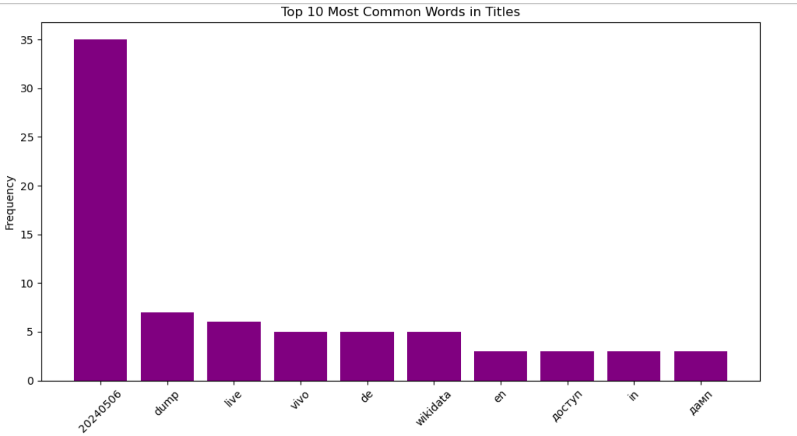
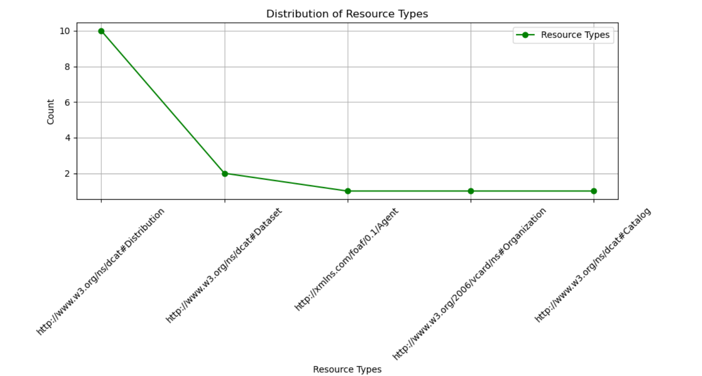

# RDF Metadata Analysis with RDFLib and SPARQL

### Author Information: 
- Author: Irfath Zahan Akter
- GitHub: iakterza
- UMD email: iakter@umd.edu

### Description

This project demonstrates how to perform data analysis on an RDF metadata file database using RDFLib and Matplotlib in a Jupyter Notebook environment. The RDF metadata file (dcatap.rdf) is used to extract and analyze various pieces of information using SPARQL queries. The results are visualized using Matplotlib.

### Project Structure

    dcatap.rdf: The RDF metadata file used for analysis.
    SPARQL.ipynb: The Jupyter Notebook containing the code for loading the RDF file, performing SPARQL queries, and plotting the results.
    README.md: This document.

### Requirements

    Python 3.6+
    Jupyter Notebook
    rdflib library
    matplotlib library
    docker

## Description
This project uses Python within a notebook environment to use SPARQL queries with a fixed, non changing RDF dataset. 

## Technologies
### SPARQL:
 (SPARQL Protocol and RDF Query Language) is the standard query language and protocol used for querying and manipulating RDF (Resource Description Framework) data. It is an essential tool for working with linked data and the semantic web.
Key Features of SPARQL:

-  **Querying RDF Data:** SPARQL allows users to write queries that can extract and manipulate data stored in RDF format. RDF is a standard model for data interchange on the web.
-  **Pattern Matching:** SPARQL queries use triple patterns, which are similar to RDF triples, to match and retrieve data. A triple pattern consists of a subject, predicate, and object.

-  **Flexible Query Forms:**
        
    - SELECT: Extracts raw data from the RDF graph.
    - CONSTRUCT: Extracts information and structures it into RDF triples.
     - ASK: Returns a boolean value indicating whether a query pattern matches.
    -  DESCRIBE: Returns an RDF graph that describes the resources found.

- **Filters:** SPARQL supports filtering results based on conditions, allowing more precise queries.

- **Aggregation:** SPARQL includes aggregation functions (e.g., COUNT, SUM, AVG) for summarizing data.

 - **Optional Patterns:** SPARQL can handle optional patterns, providing flexibility in matching data.

 - **Subqueries:** SPARQL supports nested queries, allowing complex queries to be composed.

 - **Federated Queries:** SPARQL can query multiple datasets distributed across different endpoints.

### Docker:
* Docker is a platform designed to streamlline the process of building, testing, and deploying applications efficiently.
* It achieves this by encapsulating software into standardized units known as containers. Containers contain all the necessary components for the software to function seamlessly, including libraries, system tools, code, and runtime environments.
* With Docker, it's possible to simplify the deployment and scaling of applications across various environments while ensuring the reliability of code execution.
* Docker allows the project to be run from anyone's machine without needing to install all the software and systems used.

### Jupyter:
* Jupyter is an open-source web application that allows users to create and share documents called "notebooks" containing code, visualizations, and text. It supports numerous programming languages, including Python, R, and Scala.
* Jupyter provides an interactive computing environment that allows code to be written and executed in a cell-based format. This functionality supports iterative development and experimentation.
* Jupyter notebooks also can display various types of output such as interactive visualizations and tables, making it an excellent choice for compiling and sharing research insights.
* Jupyter is commonly used in data science and machine learning workflows because of its seamless integration with widely used libraries such as NumPy, pandas, Matplotlib, and scikit-learn. These libraries facilitate data manipulation, analysis, and modeling within Jupyter.
* A jupyter notebook is used as the IDE for this project as it provides functionality to write code, use Markdown, and output visualizations all in the same place.

## Docker Implementation
* Using Docker for this project significantly simplies the development and deployment process.

* Working Directory:
  * The folder titled dev_environment within my repository contains all the files needed for the project. It includes:
    * SPARQL.ipynb: Jupyter notebook where the code for the application is contained
    * Dockerfile: text document which contains all the steps needed to create a Docker image
    * docker-compose.yml: file used to define and run multi-container Docker applications
    * dcatap.rdf: file containing the data

* Dockerfile Structure:
    - Base Image, using FROM:
        Uses python:3.9-slim as the base image, which is a minimal version of Python 3.9 to keep the container size small.

    - Working Directory, using WORKDIR/app:
        Sets the working directory inside the container to /app using WORKDIR /app. 

    - System Dependencies, using RUN:
        Updates package lists (apt-get update) and installs necessary libraries (libxml2-dev, libxslt-dev, lib32z1-dev) using apt-get install -y to handle XML and data processing tasks.
        Cleans up after installation (apt-get clean) to reduce image size.

    - Jupyter Installation:
        Installs Jupyter Notebook via pip install --no-cache-dir jupyter, ensuring no cache files are stored to minimize image size.

    - RDFLib Installation:
        Installs RDFLib with pip install --no-cache-dir rdflib for working with RDF data, including parsing, querying, and manipulation.

    - Environment Variable:
        Sets an environment variable SPARQL_ENDPOINT_URL to http://example.com/sparql, which can be customized to match the actual SPARQL endpoint URL.

    - Copying Application Code:
        Copies all files and directories (COPY . .) from the host machine's current directory into the container's /app directory, including application code and resources.

    - Exposing Ports:
        Exposes port 8888 (EXPOSE 8888) to allow external access to Jupyter Notebook running inside the container.

    - Running Jupyter Notebook:
        Sets the command (CMD) to start Jupyter Notebook with specific options (["jupyter", "notebook", "--ip=0.0.0.0", "--port=8888", "--no-browser", "--allow-root"])

* docker-compose.yml Structure:
  * Specifies version 3 as the Docker Compose syntax version
  * Specifies spark-app as the service to be run
  * Specifies that the service should be built using the Dockerfile located in the current directory through the use of '.'
  * Maps port 8888 on the host machine to port 8888 in the container
  * Mounts the current directory as a volume inside the container at /app
    * Enables sharing of files between the host and the container
    * Ensures any changes made to files in the current directory are reflected inside the container
* To build the Docker Image:
  * Run command: docker build -t temp-sparql .
  * The image is tagged with name 'temp-sparql' and is built from a Dockerfile in the current directory
* To run the Docker Containers
  * Run command: docker-compose up
  * Creates a container that will run Jupyter Notebook and Spark
* To launch the Jupyter Notebook
  * Paste in the url provided by the command line interface
  * It will look similar to http://127.0.0.1:8888/tree?token=<string_of_num_and_letters>
* To stop and remove the Docker Container
  * Run command: docker-compose down

# Discussion

The RDF dataset I'm using is a metadata RDF file related to the index of /wikidatawiki/entities/. Specifically, the file named dcatap.rdf adheres to the DCAT-AP standard, which stands for Data Catalog Vocabulary - Application Profile for data portals in Europe. DCAT-AP is a specification designed to describe datasets in data catalogs, ensuring interoperability across different platforms.

The dcatap.rdf file typically contains metadata about the datasets available in this directory. This metadata includes information such as dataset titles, descriptions, publishers, distribution formats, and other relevant attributes. By standardizing how datasets are described and cataloged, this file facilitates the discovery and sharing of datasets across various platforms.

In the image above, you can see the distribution plot of the languages used, with the language tags on the bottom. The language tag used the most is de (deutsch), followed by en (english), and then it (italian)

The above graph shows us the frequency of the most used words in metadata titles. 

This graph shows us the distribution of resource types. 

# Conclusion

This project provides a framework for analyzing RDF metadata using RDFLib and visualizing the results with Matplotlib. It can be adapted and extended to suit various types of RDF datasets and analysis requirements.
