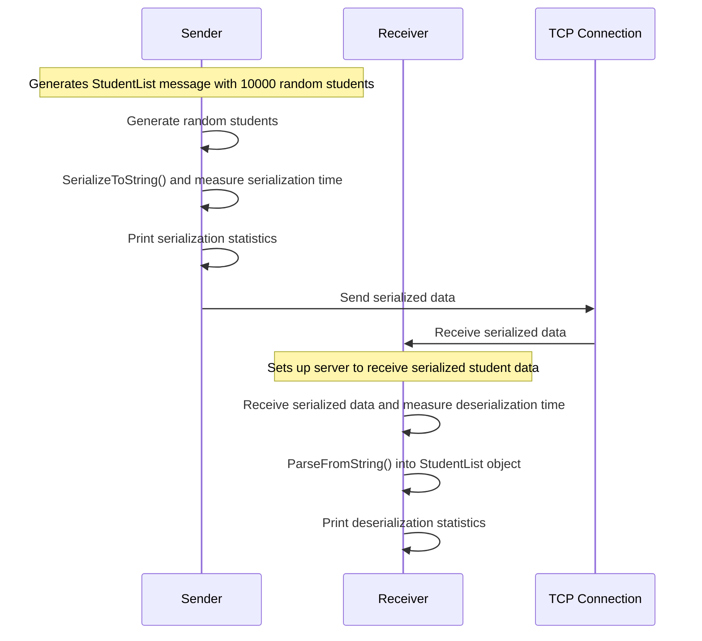

# Data Serialization with Protocol Buffers

## Author info

- Author: Jihai Luo
- GitHub account: JihaiLuo
- UMD email: jhluo123@umd.edu
- Personal email: jhluo123@umd.edu

## Introduction

In this project, message exchange using three different formats - Protocol Buffers, JSON, and XML - are implemented with Python. 
Advanced features such as nested structures, enumerations, and custom options are all implemented for Protocol Buffers.
Serialization size, serialization speed and deserialization speed are measured and compared across the three data formats. 

## Technologies

### Protocol Buffers

[Protocol Buffers](https://protobuf.dev/) is a compact binary serialization format developed by Google. It provides a strongly-typed schema, backward and forward compatibility, and support for multiple programming languages. Protobuf's binary encoding results in smaller serialized data sizes and faster serialization/deserialization speeds compared to textual formats like JSON or XML, making it well-suited for high-performance and resource-constrained applications.

### JSON 

[JSON (JavaScript Object Notation)](https://www.json.org/json-en.html) is a lightweight, human-readable data interchange format widely used for transmitting data between servers and web applications. Its simplistic syntax, which closely resembles JavaScript objects, makes it familiar to many developers. JSON is natively supported in most programming languages and enables seamless data exchange between systems, regardless of the underlying implementation.

### XML

[XML (Extensible Markup Language)](https://www.w3.org/XML/) is a hierarchical, self-describing markup language often used for data exchange and storage. XML's structured format and ability to define custom tags and schemas make it suitable for representing complex data relationships. While XML is widely adopted and supported by numerous tools and libraries, it is generally more verbose and slower to parse compared to formats like JSON.

### Docker

[Docker](https://www.docker.com/) is a containerization platform that allows developers to package applications and their dependencies into isolated, portable containers. Docker's containerization capabilities enable consistent and reliable application deployment across different environments, simplifying the development, testing, and production lifecycle.


## Docker Implementation

### Project Setup

- `Dockerfile` contains instructions needed to build a Docker image for this project.

- `student.proto` defines the student data message structure for Protocol Buffers format.

- `requirements.txt` contains the Python package names to be installed.

- `student_sender_pb.py` and `student_receiver_pb.py` are the code files for sending and receiving student data with Protocol Buffers format.

- `student_sender_json.py` and `student_receiver_json.py` are the code files for sending and receiving student data with JSON  format.

- `student_sender_xml.py` and `student_receiver_xml.py` are the code files for sending and receiving student data with XML format.

### Dockerfile Configuration

The Dockerfile in this project sets up a Python 3.8 environment with the necessary dependencies to run the Python applications that use Protocol Buffers. It starts by using the `python:3.8-slim-buster` base image, sets the working directory to `/app` and copies the `requirements.txt` file into it. It then installs the Protocol Buffers compiler and the Python Protocol Buffers library. Finally, it copies the entire application code, and then compiles the `student.proto` file into the `student_pb2.py` file, which is required for the application to work with Protocol Buffers. 


## System Running With Docker


### Create Docker Image and Container

First, with `docker` as the working directory, build a docker image named `pb_image` using following command : 

```
docker build -t pb_image .
```

Then, in one terminal, use the following command to run a container with the name `pb_container` based on the `pb_image` just created and launche a Bash shell inside this container. 

```
docker run --name pb_container -it pb_image /bin/bash
```

In another terminal, use the following command to execute a Bash shell inside the Docker container named `pb_container`.

```
docker exec -it pb_container bash
```

### Run Protocol Buffer Message Application

In one docker terminal, first run:

```
python3 student_receiver_pb.py
```

In another docker terminal, then run:

```
python3 student_sender_pb.py
```

### Run JSON Message Application

In one docker terminal, first run:

```
python3 student_receiver_json.py
```

In another docker terminal, then run:

```
python3 student_sender_json.py
```

### Run XML Message Application


In one docker terminal, first run:

```
python3 student_receiver_xml.py
```

In another docker terminal, then run:

```
python3 student_sender_xml.py
```


## Protocol Buffers Schema

`student.proto` defines a protocol buffer schema for storing student data, including personal details, academic information, and a list of students. It uses nested messages to represent the student's name and enums for gender and degree type, and extends the `EnumValueOptions` to add custom metadata to the enum values. 

The detailed implementations are as follows:

**Custom Enum Value Option Extension**: The code extends the `google.protobuf.EnumValueOptions` with a custom option called `custom_enum_value_option`. This allows adding custom metadata to enum values.

**Student Message**: The `Student` message defines the structure of a student record, including the following fields:
   - `user_id`: A unique identifier for the student (integer).
   - `username`: The username of the student (string).
   - `emails`: A list of email addresses for the student (repeated string).
   - `graduated`: A flag indicating if the student has graduated (boolean).
   - `gender`: The gender of the student, defined as an enum with values `MALE` and `FEMALE`.
   - `name`: The name of the student.
   - `degree_type`: The type of degree the student is pursuing, defined as an enum with values `BACHELOR`, `MASTER`, and `DOCTOR`.

**Name Message**: It is defined as a nested message with `first_name`, `last_name`, and `middle_name` fields (all strings).

**Gender Enum**: The `Gender` enum defines the possible gender values for a student, with `MALE` and `FEMALE` as the options. The custom `custom_enum_value_option` is used to assign a string value to each enum value.

**DegreeType Enum**: The `DegreeType` enum defines the possible degree types a student can pursue, with `BACHELOR`, `MASTER`, and `DOCTOR` as the options. The custom `custom_enum_value_option` is used to assign a string value to each enum value.

**StudentList Message**: The `StudentList` message defines a container for a list of `Student` messages, with the `students` field being a repeated field of `Student` messages.


## Python Scripts

### Data Communication With Protocol Buffers Format

`student_sender_pb.py` generates a `StudentList` message containing 10000 random students, serializes the message to bytes using the SerializeToString() method, and sends the serialized data to the server over a TCP socket connection. It measures the time taken to serialize the student data and prints various statistics, such as the total serialization time, average serialization time per student, total serialization size, and average bytes per student.

Sample output of `student_sender_pb.py`:

```
Serialize 10000 students in 16263.48 microseconds
Average serialization time per student: 1.63 microseconds
Total Serialization Size: 838454 bytes
Average bytes per student: 83.85 bytes
```

`student_receiver_pb.py` sets up a server to receive serialized student data sent over a TCP connection. It measures the time it takes to deserialize the received data into a StudentList object using the `ParseFromString` method. This script prints out various statistics, including the number of students received, the deserialization time per student, the total bytes received, and the average bytes per student.


Sample output of `student_receiver_pb.py`:

```
Deserialize 10000 students in 7474.42 microseconds
Average deserialization time per student: 0.75 microseconds
Total bytes received: 838454 bytes
Average bytes per student: 83.85 bytes
```

### Data Communication With JSON Format

`student_sender_json.py` has the same logic as `student_sender_pb.py` but with JSON serialization.


Sample output of `student_sender_json.py`:

```
Serialize 10000 students in 107888.70 microseconds
Average serialization time per student: 10.79 microseconds
Total Serialization Size: 2466504 bytes
Average bytes per student: 246.65 bytes
```

`student_receiver_json.py` has the same logic as `student_receiver_pb.py` but with JSON deserialization.

Sample output of `student_receiver_json.py`:

```
Deserialize 10000 students in 27635.10 microseconds
Average deserialization time per student: 2.76 microseconds
Total bytes received: 2466504 bytes
Average bytes per student: 246.65 bytes
```

### Data Communication With XML Format

`student_sender_xml.py` has the same logic as `student_sender_pb.py` but with XML serialization.

Sample output of `student_sender_xml.py`:

```
Serialize 10000 students in 237915.75 microseconds
Average serialization time per student: 23.79 microseconds
Total Serialization Size: 3309659 bytes
Average bytes per student: 330.97 bytes
```

`student_receiver_xml.py` has the same logic as `student_receiver_pb.py` but with XML deserialization.

Sample output of `student_receiver_xml.py`:

```
Deserialize 10000 students in 94413.28 microseconds
Average deserialization time per student: 9.44 microseconds
Total bytes received: 3309659 bytes
Average bytes per student: 330.97 bytes
```

## Project Diagram




## Results And Analysis

The following table compares the average serialization time per student, average deserialization time per student,
and average serialization size per student among Protocol Buffers (PB), JSON, and XML.

| Metric | Protocol Buffers (PB) | JSON | XML |
| --- | --- | --- | --- |
|  serialization time (microseconds) | 1.63  | 10.79  | 23.79  |
|  deserialization time (microseconds) | 0.75  | 2.76  | 9.44  |
| serialization size (bytes) | 83.85  | 246.65  | 330.97  |

The results show that Protocol Buffers (PB) outperforms both JSON and XML in terms of serialization time, deserialization time, and serialized data size. 

The serialization size per student is smallest for PB at 83.85 bytes, compared to 246.65 bytes for JSON and 330.97 bytes for XML. The compact binary format of PB allows it to serialize the data in a much smaller size than the more verbose textual formats of JSON and XML.

PB has the fastest average serialization speed at 1.63 microseconds per student, compared to 10.79 microseconds for JSON and 23.79 microseconds for XML. This indicates that PB is the most efficient in terms of serializing data, likely due to its binary format and optimized serialization process.

Similarly, PB has the fastest deserialization speed at 0.75 microseconds per student, while JSON takes 2.76 microseconds and XML takes 9.44 microseconds. The faster deserialization time of PB is also a result of its binary format, which can be parsed more efficiently than the textual formats of JSON and XML.

## Conclusion

In this project, we implemented a data communication system using 3 different formats - Protocol Buffers (PB), JSON, and XML - and compared their performance in terms of serialized data size, serialization time, and deserialization time. We observed that Protocol Buffers outperformed JSON and XML in all aspects, demonstrating its efficiency and suitability for transmitting structured data over the network.

Protocol Buffers offer several advantages over JSON and XML. Firstly, PB provides a compact binary format, resulting in smaller serialized data sizes compared to the more verbose textual formats of JSON and XML. This makes PB ideal for scenarios where minimizing bandwidth usage is crucial, such as in distributed systems or microservices architectures.

Secondly, Protocol Buffers exhibit faster serialization and deserialization speeds compared to JSON and XML. The optimized binary encoding and efficient parsing mechanisms contribute to quicker data processing, making PB well-suited for applications requiring high throughput and low latency.

Overall, our results highlight the importance of choosing the appropriate data serialization format based on the specific requirements of the application. While JSON and XML offer human-readable formats and widespread support across different platforms, Protocol Buffers provide superior performance and efficiency, particularly in resource-constrained environments or applications where speed is paramount.
