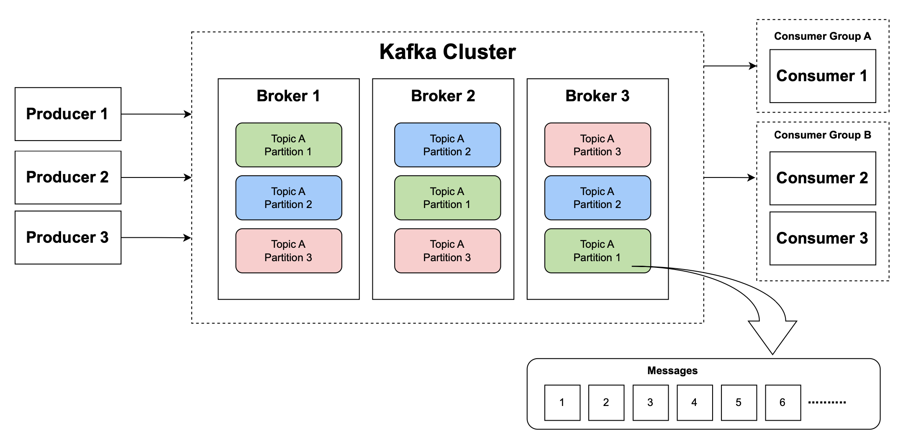

<!-- TOC -->

- [Data Streaming Platform with Apache Kafka](#data-streaming-platform-with-apache-kafka)
	- [Overview](#overview)
	- [Technologies Used](#technologies-used)
	- [Understanding Apache Kafka](#understanding-apache-kafka)
	- [Project Structure](#project-structure)
	- [Docker Implementation](#docker-implementation)
	- [How to Run](#how-to-run)
	- [Kafka Tutorial](#kafka-tutorial)
	- [Implementing Data Streaming Platform](#implementing-data-streaming-platform)
	- [Cleaning Up](#cleaning-up)
	- [Conclusion](#conclusion)
	- [References](#references)

<!-- /TOC -->
<!-- /TOC -->
<!-- /TOC -->

# Data Streaming Platform with Apache Kafka

- Author: Heanh Sok
- GitHub Account: heanhsok
- Email: heanhsok@umd.edu
- Video Walkthrough: [DATA605 - Data Streaming Platform with Apache Kafka](https://youtu.be/5PhI5CO9oPo)

## Overview

The project involves setting up Apache Kafka and a PostgreSQL database, encapsulated in multiple Docker containers using docker-compose, to establish a streamlined data streaming platform.

First, we will learn the fundamentals of Kafka and understand its essential building blocks. We will also go through an interactive coding example as a tutorial in a Jupyter notebook, where we can apply the concepts we have learned in practice.

Then, we will build a simple data streaming platform. Python is utilized to simulate the production of a continuous data stream, format it for Kafka ingestion (topics), and configure producers for efficient data transfer into Kafka topics. Python-based Kafka consumers will read data from our Kafka stream, process and validate it before storing it into PostgreSQL using a predefined schema.

The goal is to learn how a data streaming platform is built using Kafka and to create a reliable system that seamlessly produces, processes, and securely stores external data in real-time using Kafka as an intermediary, Python for logic handling, and Docker for deployment flexibility.

## Technologies Used
- **Apache Kafka:** A distributed streaming platform that enables building real-time data pipelines and streaming applications. Kafka is used in this project to handle the publishing, storage, and processing of streams of records.
- **ZooKeeper:** A centralized service for maintaining configuration information and providing distributed synchronization. In project, ZooKeeper ensures that all Kafka nodes within the cluster are consistently managed and kept in sync, which is essential for the proper functioning of our distributed streaming platform.
- **Apache Avro:** : A data serialization format. In this project, Apache Avro is used to define schemas for our data, which are stored in Schema Registry. This setup ensures compatibility between the producers and consumers, and provides a robust mechanism for enforcing data contracts, managing schema evolution, and making Kafka data flows more efficient and reliable.
- **Postgres:** An relational database system that is used in this project to store and manage the structured data generated from Kafka streams, supporting complex queries and data analysis.
- **Docker:** A tool for developing, shipping, and running applications inside lightweight and portable containers. In this project, Docker is utilized to containerize all of our running services.
- **Docker Compose:** A tool for defining and managing multi-container Docker applications. In this project, Docker Compose is used to configure and connect the Kafka, ZooKeeper, Jupyter Notebook and Postgres containers, simplifying the process of deploying the interconnected services.

## Understanding Apache Kafka

Before we dive into the code examples, this section will focus on learning the fundamentals of Kafka and understanding its essential building blocks.

<div  style="width:80%; margin: auto;">
  
</div>

- **Kafka:** is an open source distributed streaming platform that enables building real-time data pipelines and streaming applications. It is designed to handle vast amounts of data efficiently which makes it an essential tool for dealing with high-volume data processing. Kafka operates on a publish-subscribe model whick makes it highly scalable and fault-tolerant.
- **Kafka Cluster:** consists of one or more servers (nodes), each of which is called a broker. Clusters are used to manage the storage and processing of stream's data. The distributed nature of the cluster enhances both the scalability and fault tolerance of system.
- **Producer:** is any application or service that publishes records to Kafka topics.
- **Consumer:** is any application or service that reads records from Kafka topics. It subscribes to one or more topics and reads the records in the order in which they were stored.
- **Message:** are the basic unit of data. Each message is a key-value pair stored in topics. Messages are appended to a Kafka topic and are read by consumers.
- **Topic:** allows us to organize our messages. It is a category where producers publish messages to. Multiple producers can publish to a topic and a topic can be subscibed to by multiple consumers.
- **Partition:** Topics are split into partitions which allows the data to be spreaded across the cluster. Each partition is an ordered, immutable sequence of messages that is continually appended to. Partitions allow topics to be parallelized by splitting the data across multiple brokers.
- **Replication Factor:** defines the number of copies of partitions over multiple Kafka brokers. Higher replication factors ensure greater availability and durability of data.
- **Consumer Group:** consist of multiple consumers who work together to consume data. Each consumer in a group reads from exclusive partitions of a topic. No two consumers in the same group read the same data. This allows the consumer group to scale horizontally, processing data in parallel.
- **Offset:** a sequential ID number assigned to each record in a partition that uniquely identifies it. Consumers track offsets to know where they are in a stream and to ensure messages are processed in order. This approach allows consumers to resume from where they left off in case of failure or restart.

## Project Structure
- `docker-compose.yml`: defines the multi-container Docker applications for this project. It specifies services, networks, and volumes based on the Docker images and configurations.
- `Dockerfile`: used to build a Docker container specifically configured for running a Jupyter Notebook server, our producer, and our consumer.
- `requirements.txt`: lists all the Python libraries required for the Jupyter Notebook server and other Python scripts in the project, such as producer and consumer.
- `.gitignore`: specifies the files and directories that Git should ignore in the project
- `kafka_tutorial.ipynb`: A Jupyter notebook that provides a tutorial on how to use Kafka with Python. It includes example code and explanations on creating topics, producing. and consuming messages.
- `producer.py`: acts as a Kafka producer. It defines the Kafka producer's configuration and the logic for creating and publishing messages to our Kafka cluster.
- `consumer.py`: acts as a Kafka consumer. It defines the Kafka consumer's configuration and the logic to subscribe to topics and process incoming messages.

## Docker Implementation


The above diagram illustrates the network setup and inter-component communication within our Kafka data streaming project using Docker containers, all running inside `kafka_network` to ensure isolated and secured communication pathways.

- **`zookeeper`**: manages and coordinates the Kafka `broker`. It connects to the `broker` on port `2181`, facilitating the management of broker states and cluster membership.
- **`broker`**: acts as the central Kafka `broker` managing the flow of messages. It communicates with the `schema-registry` on port `8081` to handle schema validation and versioning for the messages being processed.
- **`schema-registry`**: provides a serving layer for our metadata. It interfaces with the Kafka `broker` and `jupyter` notebook service on port `8081` to ensure that message schemas are correctly applied and enforced during data streaming.
- **`jupyter`**: A Jupyter notebook environment configured to interact with the Kafka `broker`, `schema-registry`, and Postgres `pgdatabase`. It connects to the broker on port `9092` for message streaming, to the schema registry on port `8081` for schema interactions, and to the Postgres database on port `5432` for data storage and querying.
- **`pgdatabase`**: A Postgres database used for storing and managing structured data that are streamed from our Kafka cluster.
- Access to the `jupyter` notebook container from the host machine is facilitated through port `8888`.

This setup not only ensures each service is isolated but also remains interconnected within the defined network for seamless data flow and processing.

## How to Run
- Run the following command to build, start, and run all of our Docker containers defined in our `docker-compose.yml` file in detached mode (running in background)
```sh
❯ docker compose up -d
[+] Running 5/6
 ⠙ Network kafka_network      Created                                                                                       1.1s
 ✔ Container zookeeper        Started                                                                                       0.6s
 ✔ Container jupyter          Started                                                                                       0.6s
 ✔ Container pgdatabase       Started                                                                                       0.7s
 ✔ Container broker           Started                                                                                       0.7s
 ✔ Container schema-registry  Started                                                                                       1.0s
 ```
-  Run the following command to list the containers defined in our `docker-compose.yml` file, showing their current state, ports, and other details.
```sh
❯ docker compose ps
NAME              IMAGE                                                          COMMAND                  SERVICE           CREATED         STATUS         PORTS
broker            confluentinc/cp-kafka:7.2.0                                    "/etc/confluent/dock…"   broker            3 minutes ago   Up 7 seconds   0.0.0.0:9092->9092/tcp
jupyter           spring2024_data_streaming_platform_with_apache_kafka-jupyter   "jupyter notebook --…"   jupyter           3 minutes ago   Up 7 seconds   0.0.0.0:8888->8888/tcp
pgdatabase        postgres:14.0                                                  "docker-entrypoint.s…"   pgdatabase        3 minutes ago   Up 7 seconds   0.0.0.0:5432->5432/tcp
schema-registry   confluentinc/cp-schema-registry:7.2.0                          "/etc/confluent/dock…"   schema-registry   3 minutes ago   Up 7 seconds   0.0.0.0:8081->8081/tcp
zookeeper         confluentinc/cp-zookeeper:7.2.0                                "/etc/confluent/dock…"   zookeeper         3 minutes ago   Up 7 seconds   2888/tcp, 0.0.0.0:2181->2181/tcp, 3888/tcp
```

## Kafka Tutorial

In this section, we will go through interactive code examples in Jupyter Notebook where we:
1. Create topics and define partitions and replication factors.
2. Create producers and send messages to the topic.
3. Create consumers that read and process messages from the topic.
4. Create schema validation for producer and consumer using Apache Avro as data serialization.
5. Set up a PostgreSQL database and create a table for storing messages.
6. Create consumers that read and process messages from the topic, and insert them into our database.
7. Explore data in our PostgreSQL database.

To get started, make sure all the containers are up and running, then
1. Open your web browser and go to [http://localhost:8888](http://localhost:8888) to access the Jupyter Notebook.
2. Locate and open the `kafka_tutorial.ipynb` notebook.
3. Follow along by reading and executing each cell in the notebook.

## Implementing Data Streaming Platform

In the section, we will build a simple data streaming platform where a producer continuously generates messages and sends them to a topic in our Apache Kafka cluster. A consumer subscribes to this topic, read and process the messages in real time, and then insert the processed data into our PostgreSQL database.

Our data streaming platform consists of the the following components:
- **Producer:** includes functionality for topic management, data generation, and message sending. It simulates trade data similar to those from the Binance trading platform. While currently it generates random trade data for demonstration, in a production environment, it could be adapted to listen to Binance's WebSocket API to stream real-time trade data directly into a Kafka topic.
- **Kafka Cluster:** contains a single broker and manages a Kafka topic with three partitions to ensure distributed data processing and fault tolerance
- **Consumer:** includes functionality for managing database connection, consuming messages, validating and inserting data into PosgresSQL database. It also create the necessary database and table structures if they don't exist.
- **PostgreSQL:** a relational database for storing trade data, enabling persistent storage and further analysis.


- To start a producer, open another terminal window and run the following commands:
```sh
❯ docker exec -it jupyter bash
root@8453789a0344:/app# python producer.py
2024-04-25 19:29:26,603 - INFO - Creating topic trades
2024-04-25 19:29:26,641 - INFO - Topic trades created
2024-04-25 19:29:26,641 - INFO - Sending trade data to Kafka: {'e': 'trade', 'E': 1714073366641, 's': 'BTCUSDT', 't': 19863, 'p': '0.008072', 'q': '5362', 'b': 66, 'a': 604, 'T': 1714073366641, 'm': True, 'M': True}
2024-04-25 19:29:27,606 - INFO - Message delivered to trades [2]
2024-04-25 19:29:27,606 - INFO - Sending trade data to Kafka: {'e': 'trade', 'E': 1714073367606, 's': 'BNBUSDT', 't': 47487, 'p': '0.005291', 'q': '3767', 'b': 69, 'a': 979, 'T': 1714073367606, 'm': True, 'M': True}
2024-04-25 19:29:27,609 - INFO - Message delivered to trades [2]
...
```

-  To start a consumer, open another terminal window and run the following commands:
```sh
❯ docker exec -it jupyter bash
root@8453789a0344:/app# python consumer.py
Database 'trades' created successfully.
Table 'binance' created successfully
Starting the consumer loop.
Received message: {'e': 'trade', 'E': 1714073366641, 's': 'BTCUSDT', 't': 19863, 'p': '0.008072', 'q': '5362', 'b': 66, 'a': 604, 'T': 1714073366641, 'm': True, 'M': True} from partition 2
Record inserted
Received message: {'e': 'trade', 'E': 1714073367606, 's': 'BNBUSDT', 't': 47487, 'p': '0.005291', 'q': '3767', 'b': 69, 'a': 979, 'T': 1714073367606, 'm': True, 'M': True} from partition 2
Record inserted
....
```

- To check records that have been inserted into our table, open another terminal window and run the following command:
```sh
❯ docker exec -it jupyter bash
root@8453789a0344:/app# export PGPASSWORD='postgres';
root@8453789a0344:/app# psql -U postgres -h pgdatabase -d trades -c "SELECT COUNT(1) FROM binance;"
 count
-------
   126
(1 row)

root@8453789a0344:/app# psql -U postgres -h pgdatabase -d trades -c "SELECT COUNT(1) FROM binance;"
 count
-------
   142
(1 row)
```

## Cleaning Up
- Run the following command to stop and removes all containers, networks, and volumes as well as any containers connected to the network defined in our `docker-compose.yml` file
```sh
docker compose down -v --remove-orphans
```

## Conclusion

In conclusion, this project has demonstrated how to set up a robust data streaming platform using Apache Kafka and PostgreSQL, encapsulated within Docker containers. Through interactive tutorial and practical implementation of the system, we have gained a solid understanding of Kafka's fundamental and its essential elements for building real-time data streaming system. As we move forward, the knowledge and skills acquired from this project can laid a good foundation for tackling more complex data streaming challenges and exploring further innovations in the field of real-time data processing.

## References
- https://kafka.apache.org/documentation.html
- https://www.conduktor.io/kafka/kafka-fundamentals/
- https://redpanda.com/guides/kafka-tutorial
- https://github.com/confluentinc/confluent-kafka-python/