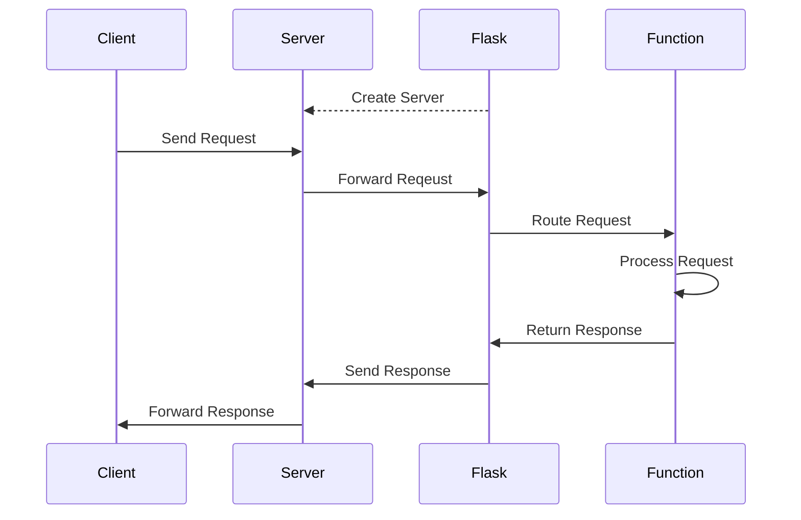
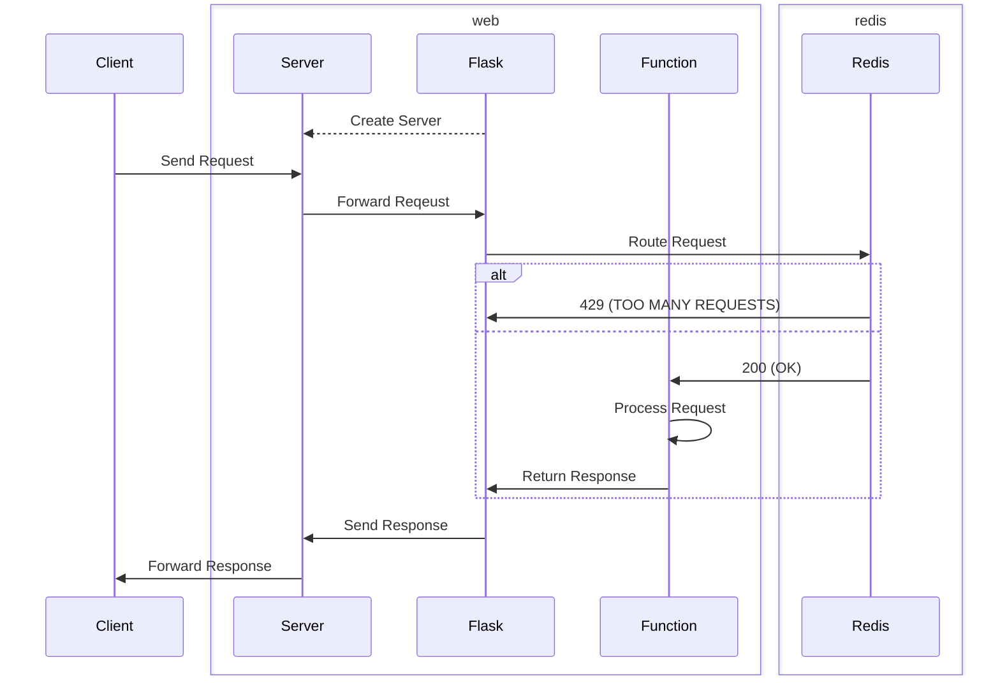

# Rate Limiting API with Redis

This project is a Flask application that uses Redis and Flask-Limiter for rate limiting.

For a quick overview, watch this [YouTube](https://youtu.be/NlB2aVGZTSA) video!

## Background

### Redis

Redis is an in-memory key-value store. Compared to memory, Redis has several advantages:

- **Persistence**: Redis stores data on disk.
- **Durability**: Redis uses asynchronous replication.
- **Flexibility**: Redis supports various data structures.
- **Atomicity**: Redis guarantees atomic operations.

Here's an example of how to use Redis in Python:

```python
import redis

# Connect to Redis server
r = redis.Redis(host='redis', port=6379, db=0, decode_responses=True)

# Set key-value pair
r.set('foo', 'bar')

# Get value by key
r.get('foo')  # bar
```

This project uses Redis to track API requests.

Alternatives to Redis include:

- **Memcached**: Another in-memory key-value store.
- **MongoDB**: A document-oriented NoSQL database.
- **etcd**: A distributed key-value store.

### Flask

Flask is a web framework for Python. In general, Flask works like this:



First, Flask (optionally) starts a server. Next, a client sends a request to the server, which forwards the request to the application. Then, Flask routes the request to a function, which processes the request, and returns a response. Finally, Flask sends the response to the server, which forwards the response to the client.

Here's an example of how to use Flask in Python:

```python
from flask import Flask

# Create Flask instance
app = Flask(__name__)

# Define route for URL
@app.route('/')
def api():
    return 'OK', 200
```

Alternatives to Flask include:

- **Django**: A high-level web framework for Python.
- **FastAPI**: A web framework for Python based on type hints.

### Flask-Limiter

Flask-Limiter is a Flask extension. Flask-Limiter supports several rate limiting strategies and storage backends.

Here's an example of how to use Flask-Limiter in Python:

```python
from flask import Flask
from flask_limiter import Limiter
from flask_limiter.util import get_remote_address

# Create Flask instance
app = Flask(__name__)

# Create Limiter instance
limiter = Limiter(get_remote_address, app=app)

# Define route for URL
@app.route('/')
@limiter.limit('3/second')  # Limit to 3 requests per second
def api():
    return 'OK', 200
```

By default, Flask-Limiter uses a fixed window strategy.

Here's a simplification of how it works:

```python
import redis
import time

# Define Limiter class
class Limiter:
    def __init__(self, host='redis', port=6379, db=0):
        # Connect to Redis server
        self.r = redis.Redis(host=host, port=port, db=db)

    # Define decorator factory
    def limit(self, requests, seconds, ip='127.0.0.1'):  # IP supplied by Flask
        def decorator(function):
            def wrapper(*args, **kwargs):
                # Generate unique key
                key = f'{ip}:{function.__name__}:{int(time.time() // seconds)}'

                # Increment and timeout key
                with self.r.pipeline() as pipe:
                    pipe.incr(key)
                    pipe.expire(key, seconds)
                    count, _ = pipe.execute()

                # Check if limit exceeded
                if count > requests:
                    return 'TOO MANY REQUESTS', 429
                return function(*args, **kwargs)
            return wrapper
        return decorator

# Create Limiter instance
limiter = Limiter()

@limiter.limit(3, 1)  # Limit to 3 requests per second
def api():
    return 'OK', 200
```

The `Limiter` class has one property, `r`, which connects to a Redis server. It also has one method, `limit`, which returns a decorator, which returns a wrapper. First, it generates a unique key. Then, it atomically increments and timeouts the key. Finally, it checks whether the value of the key is greater than the limit. If so, it returns `'TOO MANY REQUESTS', 429`. Otherwise, it calls the function.

### Docker

Docker is a platform for building, sharing, and running applications in isolated environments called containers, which are built from templates called images, which are built from instructions in Dockerfiles.

Here's an example Dockerfile:

```dockerfile
# Specify base image 
FROM python:3.8-slim-buster

# Set working directory to /app
WORKDIR /app

# Copy current directory to /app
COPY . /app

# Install Python dependencies
RUN pip install --no-cache-dir -r requirements.txt

# Listen on port 5000
EXPOSE 5000

# Run app.py
CMD ["python", "app.py"]
```

First, it specifies the base image as Python Slim Buster: a minimal version of Debian Buster with Python 3.8 installed. Next, it sets the working directory to `/app`, and copies the current directory to `/app`. Then, it installs the Python dependencies. Caching is unnecessary because each `RUN` command creates a new, immutable layer in the image. So, the cache won't be used in subsequent runs, and it just takes up space. After that, it exposes port 5000. Finally, it runs `app.py`.

## Overview

This project uses Docker Compose: a tool for defining and building multi-container applications.

The `docker-compose.yml` looks like this:

```yml
services:
  redis:
    image: redis:latest
    ports:
      - "6379:6379"
  web:
    build: .
    ports:
      - "5000:5000"
    depends_on:
      - redis
```

When we use `docker compose up`, several things happen. First, it creates a network named `app_default`. Then, builds the `redis` container from the latest Redis image on Docker Hub, and attaches it to `app_default`. Finally, it builds the `web` container from our Dockerfile, and attaches it to `app_default`. Now, the application is running on `localhost:5000`.

Here's how everything works together:



First, a client sends a request to the server, which forwards the request to the application. Next, Flask routes the request to a function. Then, the rate-limiter checks whether the client has exceeded the limit. If so, it returns `'TOO MANY REQUESTS', 429`. Otherwise, the function processes the request, and returns a response. Finally, Flask sends the response to the server, which forwards the response to the client.

## Running the Application

To run the application, use `docker compose up`

```console
$ docker compose up
[+] Running 9/9
 ✔ redis 8 layers [⣿⣿⣿⣿⣿⣿⣿⣿]      0B/0B      Pulled                     8.9s
 ...
   ✔ c16c264be546 Pull complete                                            1.7s
[+] Building 29.4s (9/9) FINISHED                                docker:default
 => [web internal] load build definition from Dockerfile                   0.1s
 ...
[+] Running 3/2
 ✔ Network app_default    Created                                          0.5s
 ✔ Container app-redis-1  Created                                          0.4s
 ✔ Container app-web-1    Created                                          0.1s
```

To see the containers, use `docker ps`

```console
$ docker ps
CONTAINER ID   IMAGE          COMMAND                  CREATED         STATUS         PORTS                                       NAMES
3961a5b0082f   app-web        "python app.py"          2 minutes ago   Up 2 minutes   0.0.0.0:5000->5000/tcp, :::5000->5000/tcp   app-web-1
59e8aa89a0c1   redis:latest   "docker-entrypoint.s…"   2 minutes ago   Up 2 minutes   0.0.0.0:6379->6379/tcp, :::6379->6379/tcp   app-redis-1
```

To use the application, navigate to `localhost:5000` and click `Call API`.

Using DevTools (Ctrl + Shift + I), we can monitor the API requests.


Here, we make four rapid API requests. As expected, the first three requests succeed, and the fourth request fails.

To close the application, use `docker compose down` (Ctrl + C).

```console
$ docker compose down
[+] Running 3/3
 ✔ Container app-web-1    Removed                                         12.4s 
 ✔ Container app-redis-1  Removed                                          0.9s 
 ✔ Network app_default    Removed                                          0.4s 
```

## Conclusion

This project is a small example of how to create a Flask application that uses Redis and Flask-Limiter for rate limiting. I recommend that you use this example as a foundation to build more complex APIs.

Here's an example of how to add a new API route:

```python
from flask import Flask, render_template, jsonify
from flask_limiter import Limiter
from flask_limiter.util import get_remote_address

# Create Flask instance
app = Flask(__name__)

# Create Limiter instance
limiter = Limiter(get_remote_address, app=app)

# Define route for root URL
@app.route('/')
def index():
    return render_template('index.html')

# Define route for API
@app.route('/api')
@limiter.limit('3/second')  # Limit to 3 requests per second
def api():
    return jsonify({'foo': 'bar', 'baz': 'qux'})

# Define route for new API
@app.route('/new_api/<int:i>')  # Add variable rules
@limiter.limit('1/minute;10/day')  # Add multiple rate limits
def new_api(i):
    return ['foo', 'bar', 'baz', 'qux'][i]
```

Thank you for reading, and please watch the [YouTube](https://youtu.be/NlB2aVGZTSA) video if you haven't already.

## References

https://en.wikipedia.org/wiki/Flask

https://en.wikipedia.org/wiki/Rate_limiting

https://en.wikipedia.org/wiki/Redis

https://en.wikipedia.org/wiki/Web_Server_Gateway_Interface

https://github.com/alisaifee/flask-limiter

https://github.com/DomainTools/rate-limit

https://github.com/pallets/flask

https://github.com/redis/redis

https://github.com/redis/redis-py

https://redis.io/docs/latest/commands/incr/