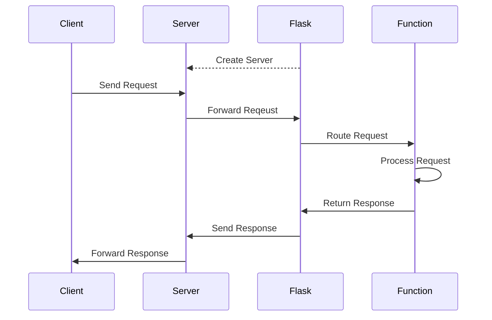
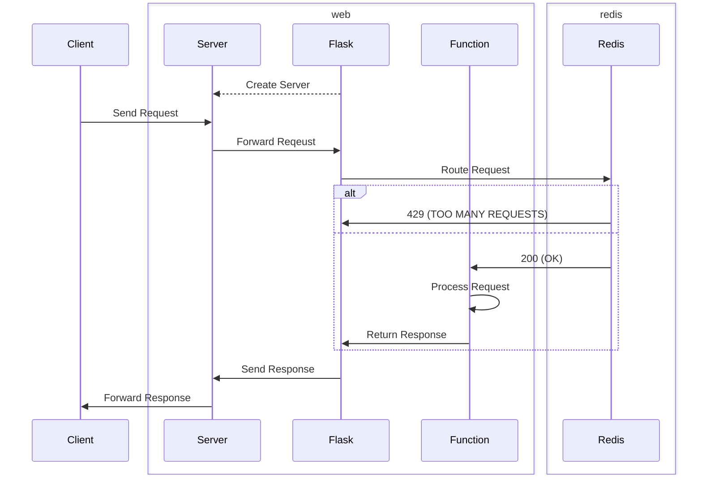

# Rate Limiting API with Redis

This project is a Flask application that uses Flask-Limiter for rate limiting and Redis for storage.

## Background

### Redis

Redis is an in-memory key-value store. Compared to memory, Redis has several advantages:

- **Persistence**: Redis stores data on disk.
- **Durability**: Redis uses asynchronous replication.
- **Flexibility**: Redis supports various data structures.
- **Atomicity**: Redis guarantees atomic operations.

Here's an example of how to use Redis in Python:

```python
import redis

# Connect to Redis server
r = redis.Redis(host='redis', port=6379, db=0)

# Set key-value pair
r.set('key', 'value')

# Get value by key
value = r.get('key')
print(value.decode())  # Output: value
```

This project uses Redis to track API requests.

Alternatives to Redis include:

- **Memcached**: Another in-memory key-value store.
- **MongoDB**: A document-oriented NoSQL database.
- **etcd**: A distributed key-value store.

### Flask

Flask is a web framework for Python. In general: Flask works like this:

<!-- First, Flask (optionally) starts a server. Next, a client sends a request to the server, which forwards the request to the application. Then, Flask routes the request to a function, which processes the request, and returns a reponse. Finally, Flask sends the response to the server, which forwards the response to the client. -->



Here's an example of how to use Flask in Python:

```python
from flask import Flask

# Create Flask instance
app = Flask(__name__)

# Define route for URL
@app.route('/')
def api():
    return 'OK', 200
```

Alternatives to Flask include:

- **Django**: A high-level web framework for Python.
- **FastAPI**: A web framework for Python based on type hints.

### Flask-Limiter

Flask-Limiter is a Flask extension. Flask-Limiter supports several rate limiting strategies and storage backends.

Here's an example of how to use Flask-Limiter in Python:

```python
from flask import Flask
from flask_limiter import Limiter
from flask_limiter.util import get_remote_address

# Create Flask instance
app = Flask(__name__)

# Create Limiter instance
limiter = Limiter(get_remote_address, app=app)

# Define route for URL
@app.route('/')
@limiter.limit('3/second')  # Limit to 3 requests per second
def api():
    return 'OK', 200
```

By default, Flask-Limiter uses a fixed window strategy. Here's a simplification of how Flask-Limiter works:

```python
import redis
import time

# Connect to Redis server
r = redis.Redis(host='redis', port=6379, db=0)

# Define decorator factory
def limit(requests, seconds, ip='127.0.0.1'):  # IP supplied by Flask
    def decorator(function):
        def wrapper(*args, **kwargs):
            # Generate unique key
            key = f'{ip}:{function.__name__}:{int(time.time() // seconds)}'

            # Increment and timeout key
            with r.pipeline() as pipe:
                pipe.incr(key)
                pipe.expire(key, seconds)
                count, _ = pipe.execute()

            # Check if limit exceeded
            if count > requests:
                return 'TOO MANY REQUESTS', 429
            return function(*args, **kwargs)
        return wrapper
    return decorator

@limit(3, 1)  # Limit to 3 requests per second
def api():
    return 'OK', 200
```

Here, `limit` takes three arguments (`requests`, `seconds`, and `ip`) and returns a decorator, which returns a wrapper. First, it generates a unique key. Next, it increments and timeouts the key. Finally, it checks if the value of the key is greater than the limit. If so, it returns `'TOO MANY REQUESTS', 429`. Otherwise, it calls the function.

### Docker

Docker is a platform that helps developers build, share, and run applications in isolated environments called containers. This project uses two containers named `web` and `redis`.



## Running the Application

To run the application, use `docker compose up`

```console
$ docker compose up
[+] Running 9/9
 ✔ redis 8 layers [⣿⣿⣿⣿⣿⣿⣿⣿]      0B/0B      Pulled                     8.9s
 ...
   ✔ c16c264be546 Pull complete                                            1.7s
[+] Building 29.4s (9/9) FINISHED                                docker:default
 => [web internal] load build definition from Dockerfile                   0.1s
 ...
[+] Running 3/2
 ✔ Network app_default    Created                                          0.5s
 ✔ Container app-redis-1  Created                                          0.4s
 ✔ Container app-web-1    Created                                          0.1s
```

To see the containers, use `docker ps`

```console
$ docker ps
CONTAINER ID   IMAGE          COMMAND                  CREATED         STATUS         PORTS                                       NAMES
3961a5b0082f   app-web        "python app.py"          2 minutes ago   Up 2 minutes   0.0.0.0:5000->5000/tcp, :::5000->5000/tcp   app-web-1
59e8aa89a0c1   redis:latest   "docker-entrypoint.s…"   2 minutes ago   Up 2 minutes   0.0.0.0:6379->6379/tcp, :::6379->6379/tcp   app-redis-1
```

To use the application, navigate to `localhost:5000` and click `Call API`.

Using DevTools, we can monitor the API requests.


Here, we make four rapid API requests. As expected, the first three requests succeed, and the fourth request fails.

To close the application, use `docker compose down`

```console
$ docker compose down
[+] Running 3/3
 ✔ Container app-web-1    Removed                                         12.4s 
 ✔ Container app-redis-1  Removed                                          0.9s 
 ✔ Network app_default    Removed                                          0.4s 
```

## Conclusion

## References

### Redis
https://en.wikipedia.org/wiki/Redis

https://github.com/redis/redis

https://github.com/redis/redis-py

https://redis.io/docs/latest/commands/incr/

### Flask
https://en.wikipedia.org/wiki/Flask

https://github.com/pallets/flask

https://github.com/alisaifee/flask-limiter

https://github.com/DomainTools/rate-limit

### Misc
https://en.wikipedia.org/wiki/Rate_limiting

https://en.wikipedia.org/wiki/Web_Server_Gateway_Interface

https://levelup.gitconnected.com/top-5-rate-limiting-tactics-for-optimal-traffic-5ea77fd4461c
