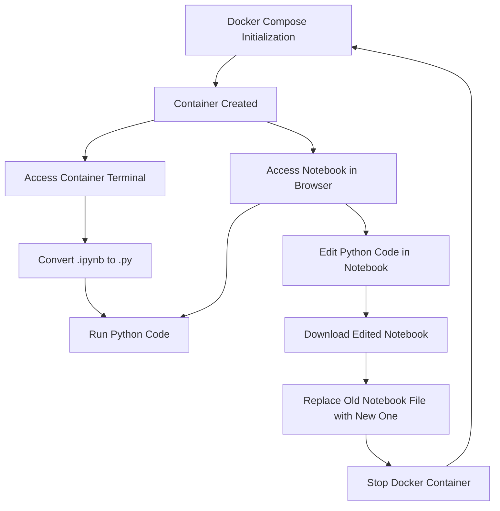
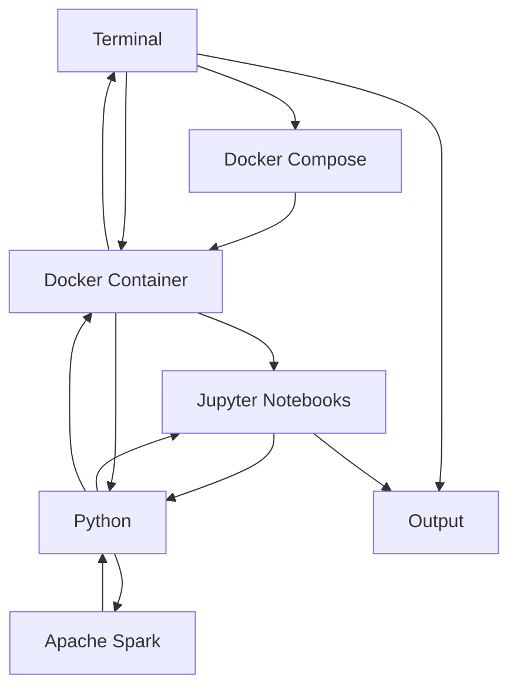

**Technology Used**

The goal of this project was to simulate the processing of real-time data from 
the social media platform "X" (formerly Twitter).  As trending topics and news 
stories vary, we can reasonably expect the lengths of Tweets (or X Posts) to do 
the same.  Unfortunately, X's API is not free, and therefore random data can be 
used to simulate this experiment.  Aside from purchasing access to said API, an
individual seeking to perform this experiment with real data would only need to 
apply minor modifications to the existing code.

The primary technology used in this project, aside from Python and Jupyter 
notebooks, was PySpark, the Python API for accessing Apache Spark.  Apache 
Spark is a framework designed for quickly processing large datasets, and can be
used in conjunction with a wide array of languages (such as Java, Python, and 
R) for a multitude of applications, such as SQL, machine learning, and real-
time data processing (RTDP).  PySpark allows the user to access this powerful
framework.  

Apache Spark is centered around Resilient Distributed Datasets (RDD's 
hereafter), which allow users to split a large (and immutable) dataset between 
multiple machines, thereby working around storage limitations (Pointer, 2024).  
Among the many advantages of Apache Spark are its capability to quickly perform 
advanced analytics, support for multiple programming languages (as stated 
previously), flexibility, and "detailed documentation...[which] provides 
detailed tutorials and examples that explain complex concepts clearly and 
concisely" ("The Good", 2023).  However, with these high performance specs come 
higher computational costs.  Additionally, Apache Spark is known to have 
trouble with larger collections of small files and relies on external storage 
("The Good", 2023).

*Similar Technologies*

Other Apache technologies such as Hadoop, Flink, and Hadoop MapReduce offer 
similar data processing capabilities.  Hadoop handles large datasets more 
effectively than Spark, but at the cost of time ("The Good", 2023).  Flink, 
like Spark, supports multiple programming languages, but Spark is superior in 
terms of ease of use (Mohan & Thyagarajan, 2023).  

Hadoop MapReduce is among the most popular alternatives, but still has some key
differences.  While Hadoop MapReduce performs better with batch processing, 
"Apache Spark is more suited for real-time data processing and iterative 
analytics" (Tobin, 2023).  Additionally, as is the case in the comparison to 
Flink, Spark is easier to use than MapReduce, with a "more user-friendly 
programming interface" (Tobin, 2023).  

MapReduce also lacks flexibility in terms of language, as it is only compatible 
with Java.  This would have presented a major hurdle in terms of using 
MapReduce for this project, which is centered around the use of Python and 
Jupyter notebooks.  The previously-described RDD's employed by Spark also 
feature superior fault tolerance when compared with MapReduce's counterpart, 
Hadoop Distributed File Systems (HDFS's) (Tobin, 2023).

Spark is known as "the Swiss army knife of big data processing" (Tobin, 2023), 
underscoring its flexibility and ease of use.  With that in mind, despite
MapReduce's superior performance with batch data, Spark is clearly the ideal 
choice for this particular project.

*Course Material*

Apache Spark was the central focus of one of the class lectures.  The 
aforementioned shortcomings of Hadoop and Hadoop MapReduce were covered, as 
were the diverse and widespread uses and applications of Spark.  Furthermore, 
Spark is a key element of the Berkeley AMPLab Data Analytics Stack (BDAS), 
"an open source software stack that integrates software components being built 
by the AMPLab to make sense of Big Data" (BDAS Info).

*References for this Section*

BDAS Info: https://amplab.cs.berkeley.edu/software/

"The Good and the Bad of Apache Spark Big Data Processing", 2023: 
https://tinyurl.com/556rmvck

Mohan, Thyagarajan, 2023: https://tinyurl.com/d39as3cn

Pointer, 2024: https://tinyurl.com/3y9j3fse

Tobin, 2023: https://tinyurl.com/wvp5vkpp

**Docker System**

This project employed Docker Compose with a single container.  The Dockerfile
is as follows:

```plaintext
# Access the latest version of jupyter/pyspark
FROM jupyter/pyspark-notebook:latest

# Allowing browser access to notebook via localhost:8888
EXPOSE 8888

# Environment variables
ENV SPARK_HOME=/usr/local/spark

ENV PYSPARK_PYTHON=python3
ENV PYTHONPATH=$SPARK_HOME/python:$PYTHONPATH
ENV PATH=$SPARK_HOME/bin:$PATH

# Install py4j Python package
RUN pip install py4j

# Copy the notebook file into the container directory
COPY main_app.ipynb /home/jovyan/

# Start Jupyter server
CMD ["start-notebook.sh", "--NotebookApp.token=''"]
```

With the Dockerfile constructed as detailed above, the user is able to employ
multiple methods by which to run the code.  The user can directly access the
code output in real time by navigating directly to the container terminal and
converting the notebook file to a single script.  Alternatively, the user can
also view and run the code directly from the notebook in his/her browser, by
navigating to localhost:8888.  I chose this approach for the purpose of
flexibility--the user can access and run the full code if he/she would like,
but has the option to simply see the output, saving time and decreasing 
procedural complexity.

Additionally, this approach gives the user the option to edit the notebook.
After navigating to localhost:8888 and modifying the notebook, the user can
download the edited notebook under the same file name, and replace the old 
notebook with the new, updated one within the project directory.

The process is further streamlined by incorporating Docker Compose, using the
following .yml file:

```yml
version: '3'

services:
  jupyter:
    container_name: my_jupyter_container 
    build:
      context: .
      dockerfile: Dockerfile
    ports:
      - "8888:8888"
    volumes:
      - ./main_app.ipynb:/home/jovyan/main_app.ipynb
    environment:
      - "NOTEBOOK_TOKEN="
```

With this setup, only one container needs to be run--"my_jupyter_container",
defined in the .yml file above.  

**Instructions**

*Activating the Container*

Ensure that Docker is properly installed on your system.  Navigate to 
"Spring2024_Real-time_Data_Processing_with_Apache_Spark_Streaming" folder in 
terminal, then enter:

```plaintext
docker-compose up -d
```

*To access just the output*

First, access the container terminal:

```plaintext
docker exec -it my_jupyter_container /bin/bash
```

Once inside the container terminal, run this command to access the script:

```plaintext
jupyter nbconvert --to script main_app.ipynb
```

This should produce the following output:

```plaintext
[NbConvertApp] Converting notebook main_app.ipynb to script
[NbConvertApp] Writing 1487 bytes to main_app.txt
```

In some cases, this command converts the notebook to a .txt file.  If this is 
the case, subsequently run this command:

```plaintext
mv main_app.txt main_app.py
```

Now, we can run the script:

```plaintext
python main_app.py
```

Expected output:

```plaintext
Setting default log level to "WARN".
To adjust logging level use sc.setLogLevel(newLevel). For SparkR, use setLogLevel(newLevel).
24/05/05 19:20:40 WARN NativeCodeLoader: Unable to load native-hadoop library for your platform... using builtin-java classes where applicable
/usr/local/spark/python/pyspark/streaming/context.py:72: FutureWarning: DStream is deprecated as of Spark 3.4.0. Migrate to Structured Streaming.
  warnings.warn(
Starting Spark Streaming context...
Awaiting termination...
New Batch Arrived!
Average characters per Tweet in this batch: 141.41
Shortest Tweet in this batch: 41 characters
Longest Tweet in this batch: 253 characters

New Batch Arrived!
Average characters per Tweet in this batch: 148.9
Shortest Tweet in this batch: 22 characters
Longest Tweet in this batch: 224 characters

New Batch Arrived!
Average characters per Tweet in this batch: 138.21
Shortest Tweet in this batch: 42 characters
Longest Tweet in this batch: 231 characters

New Batch Arrived!
Average characters per Tweet in this batch: 142.54
Shortest Tweet in this batch: 55 characters
Longest Tweet in this batch: 241 characters

New Batch Arrived!
Average characters per Tweet in this batch: 140.7
Shortest Tweet in this batch: 32 characters
Longest Tweet in this batch: 239 characters

New Batch Arrived!
Average characters per Tweet in this batch: 136.86
Shortest Tweet in this batch: 45 characters
Longest Tweet in this batch: 214 characters

New Batch Arrived!
Average characters per Tweet in this batch: 143.44
Shortest Tweet in this batch: 33 characters
Longest Tweet in this batch: 261 characters

New Batch Arrived!
Average characters per Tweet in this batch: 134.29
Shortest Tweet in this batch: 23 characters
Longest Tweet in this batch: 264 characters

New Batch Arrived!
Average characters per Tweet in this batch: 142.26
Shortest Tweet in this batch: 45 characters
Longest Tweet in this batch: 231 characters

New Batch Arrived!
Average characters per Tweet in this batch: 135.03
Shortest Tweet in this batch: 11 characters
Longest Tweet in this batch: 270 characters

All Batches Processed! Run Again for More Data
```
The warnings are to be expected and do not affect the code output.  To
terminate and run again, simply press Ctrl+C (Command + C on Mac) and re-enter
the "python main_app.py" command.  You will see an error message after pressing
Ctrl+C, but this is expected, and related to the stoppage of the stream
(similar to a keyboardInterrupt).

*To view the notebook*

Open your browser, and navigate to

```plaintext
http://localhost:8888/
```

The output should look like this:

```plaintext
Starting Spark Streaming context...
Awaiting termination...
New Batch Arrived!
Average characters per Tweet in this batch: 141.5
Shortest Tweet in this batch: 47 characters
Longest Tweet in this batch: 247 characters

New Batch Arrived!
Average characters per Tweet in this batch: 140.15
Shortest Tweet in this batch: 56 characters
Longest Tweet in this batch: 251 characters

New Batch Arrived!
Average characters per Tweet in this batch: 135.09
Shortest Tweet in this batch: 46 characters
Longest Tweet in this batch: 231 characters

New Batch Arrived!
Average characters per Tweet in this batch: 144.17
Shortest Tweet in this batch: 48 characters
Longest Tweet in this batch: 248 characters

New Batch Arrived!
Average characters per Tweet in this batch: 139.5
Shortest Tweet in this batch: 35 characters
Longest Tweet in this batch: 225 characters

New Batch Arrived!
Average characters per Tweet in this batch: 135.64
Shortest Tweet in this batch: 36 characters
Longest Tweet in this batch: 261 characters

New Batch Arrived!
Average characters per Tweet in this batch: 135.78
Shortest Tweet in this batch: 26 characters
Longest Tweet in this batch: 232 characters

New Batch Arrived!
Average characters per Tweet in this batch: 143.8
Shortest Tweet in this batch: 75 characters
Longest Tweet in this batch: 265 characters

New Batch Arrived!
Average characters per Tweet in this batch: 142.67
Shortest Tweet in this batch: 62 characters
Longest Tweet in this batch: 222 characters

New Batch Arrived!
Average characters per Tweet in this batch: 141.69
Shortest Tweet in this batch: 46 characters
Longest Tweet in this batch: 273 characters

All Batches Processed! Run Again for More Data
```

**The Code**

First, we need to initialize the SparkContext (to create RDD's) and the 
Streaming Context (to establish a connection with the SparkContext).

```python
from pyspark import SparkContext
from pyspark.streaming import StreamingContext
import time
import random
import numpy as np

# Initialize SparkContext and StreamingContext
sc = SparkContext("local[2]", "RandomDataStream")
ssc = StreamingContext(sc, 1)  # Batch interval of 1 second
```

Next, we define our functions.

```python
def generate_data():
    return [int(np.random.normal(140, 40)) for _ in range(100)]

def process_data(data):
    if data.isEmpty():
        print("All Batches Processed! Run Again for More Data")
        ssc.stop(stopSparkContext=True, stopGraceFully=True)
    else:

        # Calculate mean
        count = data.count()
        sum_of_data = data.reduce(lambda x, y: x + y)
        mean = sum_of_data / count
        print("New Batch Arrived!")
        print("Average characters per Tweet in this batch:", mean)

        # Calculate min and max
        min_val = data.min()
        max_val = data.max()
        print(f"Shortest Tweet in this batch: {min_val} characters")
        print(f"Longest Tweet in this batch: {max_val} characters\n")
```

Here, 'generate_data' constructs a list of 100 simulated Tweet lengths 
expressed as integer values.  Each length is drawn randomly from a normal 
distribution with mean equal to 140 and standard deviation equal to 40, and
rounded to an integer value using Python's built-in 'int' function.  These 
parameters are estimations based upon pure speculation, but can easily be 
adjusted as desired.

Our second function, 'process_data', is used to perform the necessary 
calculations on each batch of data.  Here, the 'reduce' function is used to
apply summation to the entire dataset from left to right, with the result
divided by the length of the list (which, in this experiment, will always be 
100) to calculate the mean/average Tweet length in the batch. Next, we use
Python's built-in 'min' and 'max' functions to find the minimum and maximum 
Tweet lengths in the batch.  Finally, the print statements give us the output 
seen in the prior sections, with each output block of the format:

```plaintext
New Batch Arrived!
Average characters per Tweet in this batch: {mean}
Shortest Tweet in this batch: {min} characters
Longest Tweet in this batch: {max} characters
```

We proceed to use these commands to generate a stream and, subsequently, output
the processed data.

```python
# Create a DStream from generate_data
stream = ssc.queueStream([sc.parallelize(generate_data()) for _ in range(10)])

# Process the stream
stream.foreachRDD(process_data)
```

Here, 'parallelize' converts the generated data into an RDD, and list 
comprehension is used to generate 10 unique batches.  The 'queueStream'
function creates a Discretized Stream, or DStream from the 10 RDD's.  The
'stream' object, containing the DStream of the 10 RDD's, is then processed
using the final command.

Since the data is randomly generated and in the form of a simple list, there is
no predefined schema to which the data adheres.  However, this may not remain
the case if the randomly generated data is replaced with real data obtained
from X's API.  The API has been somewhat of an enigma since owner Elon Musk
put it behind a paywall in early 2023 (Stokel-Walker, 2023), but the schema of
the data likely includes fields such as text, user ID, username, date/time,
like count, retweet count, etc.  In this scenario, Tweet length could easily be
parsed using built-in string functions, as the following pseudocode illustrates:

```python
tweet['length'] = len(tweet['text'])
```

However, this is entirely hypothetical--obtaining an understanding of the true
schema of the data would require direct access to the API, which costs $42,000 
per month for the smallest package (Stokel-Walker, 2023).  With an 
understanding of said schema, a more granular method is entirely possible.

*Visualization*

Below, the different ways in which the user can interact with this project
are visualized:



The technologies involved are visualized below:



*Notes on Environment*

To ensure the project worked universally, I tested it in multiple environments,
including a friend's MacBook Pro and virtual Linux on my Windows computer.
Surprisingly, I was also able to get it to work natively in Windows with Docker
Desktop running--I used this environment for my video demonstration, since 
VMWare does not allow copy/paste from the local environment, and the video
would have significantly exceeded timing guidelines if I were to type out each
command manually.

The video can be accessed via the following link:

https://tinyurl.com/4pbxjrv7

*References for this Section*

Stokel-Walker, 2023: https://tinyurl.com/4p5r22fs
