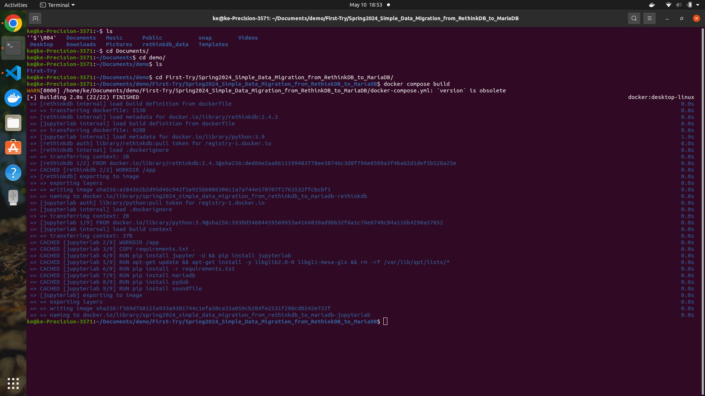
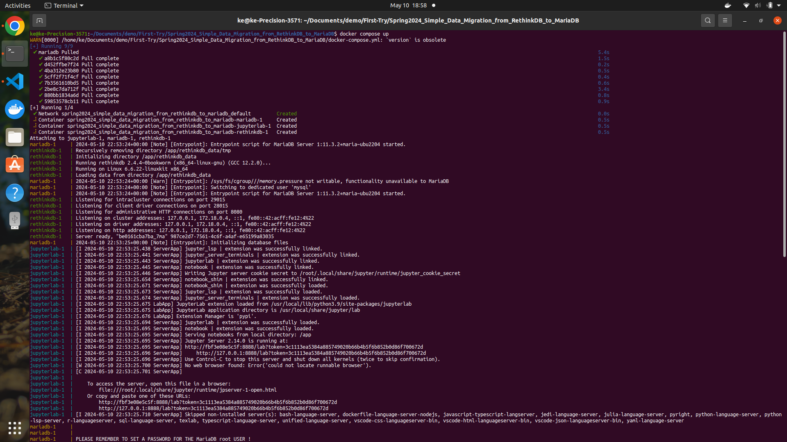
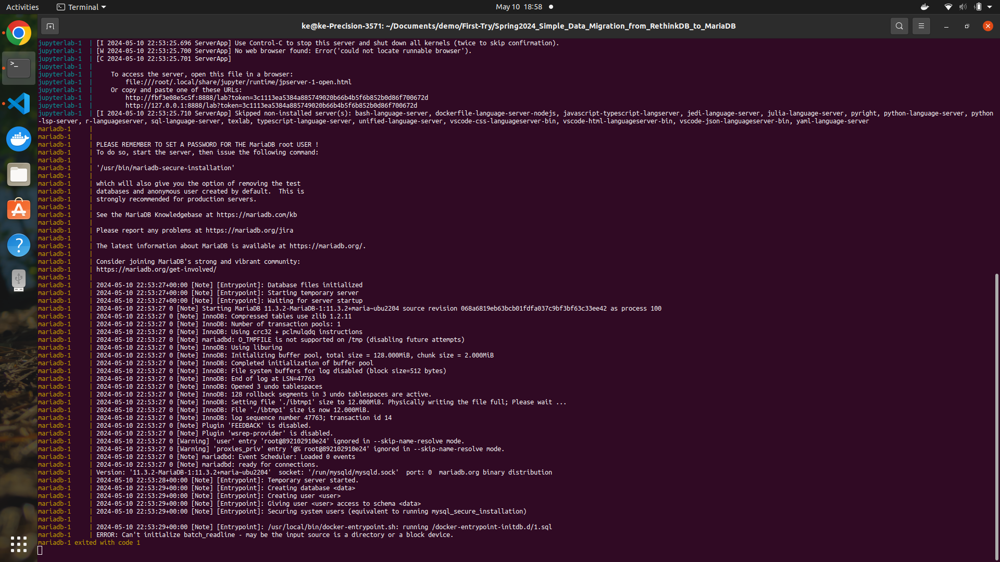
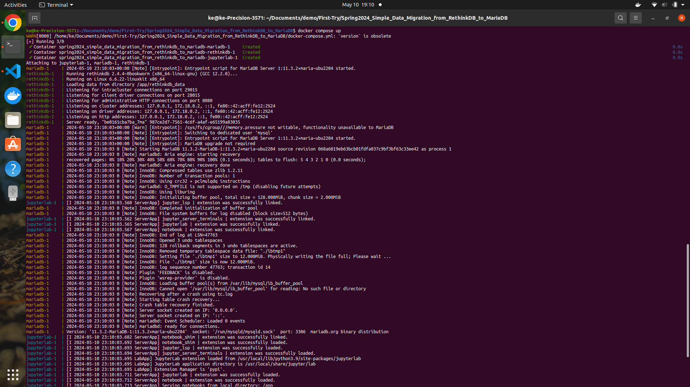
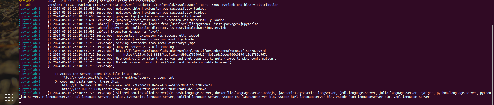
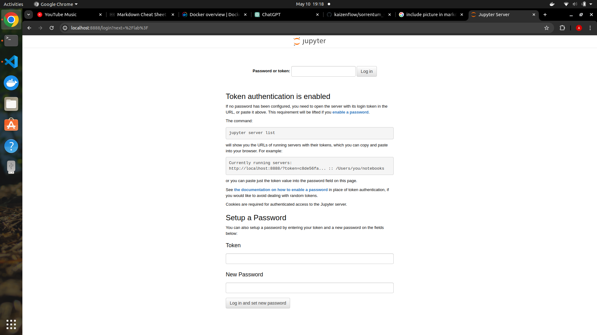
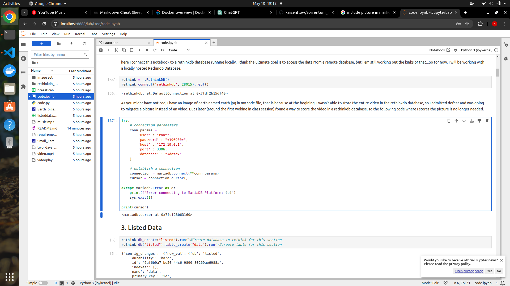

# Simple Data Migration from RethinkDB to MariaDB

## Author Info:
* ***Name***: Ke Xu
* ***Github Account***: Taitah190
* ***UMD Email*** xuke0303@umd.edu
* ***Personal Email***: 19990303x@gmail.com

## Project Description:
Description: Migrate data from RethinkDB to MariaDB using Python scripts where data stored in a RethinkDB database is transferred to a MariaDB database. Develop Python scripts to retrieve data from RethinkDB and insert it into MariaDB, ensuring data integrity and consistency. Utilize the rethinkdb and mysql-connector-python libraries for database interaction, showcasing basic data migration techniques between different database systems. Add different functionalities to enhance complexity of project.

Link: https://docs.google.com/document/d/1GEOmfpBUXiCua18wR1Hx1OMUVlku-1of/edit#heading=h.4ph7eurcozb1

## Technologies:
### Python  and its Libraries:
* One of the most popular programming knowledge
* known for its simplisity to learn and readibility
* a lot of libraries that are easily accessable

#### openCV Python
* Comprehensive suite of algorithms for image and video analysis, including object detection, tracking, segmentation, and recognition.
* Efficient data structures and functions for manipulating images and videos, such as filtering, transformation, and morphological operations.
* Support for camera calibration, stereo vision, and 3D reconstruction.
* Integration with machine learning frameworks like TensorFlow and PyTorch for deep learning-based tasks.
*  Widely used in various fields such as robotics, augmented reality, medical imaging
* Offers a user-friendly API and extensive documentation, suitable for both beginners and experienced developers.

Source: 
* https://docs.opencv.org/4.x/d1/dfb/intro.html
* chatgpt

#### numpy
*  NumPy is a fundamental Python library for numerical computing, providing support for large, multi-dimensional arrays and matrices, along with a collection of mathematical functions to operate efficiently on these arrays.
* NumPy provides powerful data structures, particularly the ndarray (n-dimensional array), which allows for efficient storage and manipulation of large datasets.
* ndarray has been the primary form of data transportation in this project
* AAllows for easy array operation along with transfering different form of data into ndarrays
* Works very well with other libraries and most of the time, my data are rade

Source:
* https://numpy.org/doc/stable/user/absolute_beginners.html
* chatgpt

#### pandas
* Pandas is a powerful Python library built on top of NumPy, designed for data manipulation and analysis. It provides high-level data structures, such as DataFrame and Series, along with a plethora of functions for handling structured data efficiently.
* Features like dataframe for me to efficently store the data before they were being migrated into the databases
* functions like filtering, sorting, grouping, merging, reshaping. Allowing us to work easity with all sort of data
* easy and efficent operation with different file types, like csv, json, txt....
* Pandas are optimized for tasks like data analysis and manipulation when it comes memory usage and speed of calculation.

Source:
* https://pandas.pydata.org
* https://www.learndatasci.com/tutorials/python-pandas-tutorial-complete-introduction-for-beginners/
* chatgpt

#### soundfile
* The soundfile module can read and write sound files. 
* File reading/writing is supported through libsndfile, which is a free, cross-platform, open-source (LGPL) library for reading and writing many different sampled sound file formats that runs on many platforms including Windows, OS X, and Unix.
* allows us to access the raw data of a datafile
* allows us to easily manipulate the sound wave data and then be able to put them back together

Source: 
* https://python-soundfile.readthedocs.io/en/0.11.0/#:~:text=The%20soundfile%20module%20can%20read,%2C%20OS%20X%2C%20and%20Unix.
* chatgpt
#### rethinkdb
* allows us to access a linked rethinkdb database through python
* allows for data storage and data retrieve into and from the linked rethinkdb database from python
#### mariadb
* allows us to connect to a lined mariadb instance and create/delete not only databases, but tables as well
* more data type to choose from, some of the datatype allows you to store a very large amount of data as long as you know how
* Easy and very fast storeage and retrieval time compared to rethinkdb
### Jupyter notebook(lab)
* JupyterLab is an interactive development environment (IDE) that allows users to work with code, data, and visualization in a flexible and collaborative manner.
* It's rather popular and I am throughly formiliar with it, it is also ran locally compared to google colab
* I it allows for easy access to python libraries
### Rethinkdb
* RethinkDB is the first open-source scalable database built for realtime applications.
* allows developers to build scalable realtime apps in a fraction of the time with less effort.
* comparatively light and easily installed both locally and as a docker container. 
* query is simple and easy to use compare to other database

Source:
* https://github.com/rethinkdb/rethinkdb-python
### Mariadb
* Mariadb is a forked open source relational database very similar to mysql
* Being so similar to mysql, some of the command are the same for mariadb and mysql
* * columns are named ahead of time, much easier to keep track to compared to rethinkdb (as you can see, rethinkdb is easy to setup but I am not a big fan of it when it comes to usage)

Source: 
* https://mariadb.com/kb/en/introduction-to-relational-databases/
* chatgpt
### Docker and Docker compose
* Docker is an open platform for developing, shipping, and running applications
* docker allows us to run application without worrying about the envirement, perfect for collabreating between individuals using different machines with different setups. 
* When using docker, we can write a dockerfile to create a image. With which we can create a virtual envirement called a container where our application rans in. 
* sometimes one docker container might not be enough, which is when we use docker compose to linkd multiple contaiers for some project that uses multiple application at once. 
* it's important to remember that even though docker container runs virtually, it uses the hardware of the local machine, and somethimes the local machine will have a difficult time handling the workload. 
* docker allows us to run different version of the same application on the same machine and what we installed in one version won't influence others. 
* It also secures the data, if our local machine breaks down, the progress is not lost. 
## Docker compose
* When constructing this project, I decided to use rethinkdb official image from docker hub since it's functional and relatively easy to set up
* As for mariadb, I used the official image from dockerhub just like wheat I did for rethinkdb
* I didn't use any official docker image for jupyterlab setup, even though a lot of them are available on dockerhub. None of them consists of what I need, meaning even if I decided to use an image, I will have to install libraries myself. 
* I used 3 container in my project: Jupyterlab; Rethinkdb and Mariadb
### Jupyterlab Dockerfile
* in Jupyterlab, I imported a python image and created an jupyterlab instance. 
* Defineing working directory is my next move, I defined /app as my WORKDIR
* I then installed all the libraries and the python connector to rethinkdb and mariadb which I have stored in a requirements.txt in the same directory
* after running the docker container, I realized that more dependencies is needed for openCV Python library. Those dependencies are usually included in a jupyter setup, but since I am defiing my own jupyterlab, I need to make sure those are installed correctly. 
* After installation, I copied all the necessary files into my container so that I can access them once the composed containers starts running. 
* I then Exposed port 8888 of the container so that I can establish a connection later 
* I ended my jupyterlab dockerfile with a command call to run the jupyterlab upon container construction
### Rethinkdb Dockerfile
* After I am done with my dockerfile for jupyterlab, I defined a dockerfile for my rethinkdb database instance
* I imported the rethinkdb 2.4.3 docker image from dockerhub to start my dockerfile
* Then set /app as my working directory
* I then set the dockerfile so that upon exercution, after all the setup, the dockerfile will run "rethinkdb -- bind all" inside the container. 
### docker-compose.yml
* in my docker compose file, I defined 3 services:Jupyterlab; rethinkdb and mariadb
* in Jupyterlab, I built my jupyterlab dockerfile 
* then mapping port 8888 on my local machine to port 8888 of my container so that I will be able to access the notebook once I compose the containers. 
* I then setup my volumn for my jupyterlab container so that I can access my code 
* I then built my rethinkdb dockerfile with port 8080l port 28015 and 29015 of my machine mapped to port 8080, port 28015 and port 29015 on my container. 
* Next is my mariadb container, I imported the official mariadb image. 
* then setiimg some of the envirement variable like MYSQL_ROOT_PASSWORD; MYSQL_USER; MYSQL_PASSWORD and MYSQL_DATABASE
* One thing before finishing setup is map port 3306 of my container to port 3306 on my local machine. 
* Last thing I did was set up volumn so that my container can access the data it needs. 
## Running the code
***I have a video for this, here it is*** https://drive.google.com/file/d/1uZlviPgMmrklhZh5REusme6ny0uf88Mb/view?usp=drive_link
* let's say the link to clone my work is LINK and you would like to store it at /project
* you can run git clone LINK in /project
* this will copy the directory to /project
* you can then run ```cd kaizenflow/sorrentum_sandbox/spring2024/Spring2024_Simple_Data_Migration_from_RethinkDB_to_MariaDB```
* then run ```docker compose build```

* next, run ```docker compose up```
output will be something like:


* ***NEXT, RUN ```ctl+C``` to exit.***
* next run ```docker compose up``` again giving you a output like this:


* there are two things we need to take note:
* at the end of rethinkdb call, there are three lines looking like this:
* ```rethinkdb-1   | Listening on cluster addresses: 127.0.0.1, 172.18.0.2, ::1, fe80::42:acff:fe12:2%24```
* ```rethinkdb-1   | Listening on driver addresses: 127.0.0.1, 172.18.0.2, ::1, fe80::42:acff:fe12:2%24```
* ```rethinkdb-1   | Listening on http addresses: 127.0.0.1, 172.18.0.2, ::1, fe80::42:acff:fe12:2%24```
* ***we need to note ```172.18.02```, or just the 18 is okay. This number is critical for running the code later***
* the second thing we need to note is the token, which is outline at the bottom of the result. As it will be needed to access the jupyterlab later
* after openning ```localhost:8888```, you will see

* paste the token into the password or token, you will then see my code and when we want to connect to mariadb, we need to make sure the 18 we remembered before matches with the second number in my mariadb connection code:

* if it saids 18 before, the host section should be changed to '172.18.0.1', otherwise it won't coneect correctly. 
* after this, everything should run correctly
## Project Report
***here is a visual walkthrough of my project***:https://drive.google.com/file/d/1Sr8_lQkYcng6d4h5ZW6ixshkwhD9G-9W/view?usp=sharing&t=311
* Since I find data migreation to be quite broad as a topic, I did an example for migreating four different kind of data: 
### listed data
* I first read the data in as a dataframe, 
* then turn dataframe into a list of dictionaries where the key is the column name and value being the content of the column
* I then inserted the row number into the dictionary so that I can recreate the list later. 
* I then inserted the list of dictionaries into a rethinkdb
* I wrote functions so that you can access the dictionary containing row x's data by inputing x
* Next is getting data from rethinkdb and insert it into a mariadb table with each row containing 3 int and 1 text. 
* I then puull the data out of mariadb and reorder the dataset so that I can recreate the dataframe
* last thing to do is to compare our origional data to the newly recreated data to compare if I have done it right, in my case: they are exactly the same
#### Rethinkdb data structire
* My listed data are stored in rethinkdb as a dictionary, an example is provided here:
* SUppose oue dataframe has 2 columns called a and b, with a1 being the data stored in first row of column a and b1 being the first row data stored in b, then the data were stored in rethinkdb like:
* ```[{a:ai, b:b1, order:1},{a:a2, b:b2, order:2}]```
#### Mariadb Data Structure
* my listed data are stored in mariadb as four columns:
* ```[a, b, id, order]```
* ```[a1, b1, id, 1]```
* ```[a2, b2, id, 2]```
* where id can be used for cross reference between two databases
### audio data
* I first read in the audio data 
* then I divide the mdarray into a list of ndarrays so that each list contains the audio data of 1 second. 
* After seprating the data, I flatten the data into the form of 1 by .
* I then create a dictionary in the form of ```data:second_audio_data, order:i```, where i is the order again
* I inser the newly created list of dictionaries into rethinkdb
* designed two function so that I will be retrieve audio data based on its order along with retrieveing a 10 second teaser based on the second x to begin that teaser
* due to the form of data contained, we don't need to do anything else to the data. We can directly push our data into mariadb
* The last step for this one is just recreate the audio array according to the order. 
* my migreation is considered accurate since they origional array and recreated array is exactly the same
#### Rethinkdb Data Structure
* suppose our data has a dimension of 1000 by 2
* it willl be converted into a list with 10 100 by 2 arrays
* it will then be flattened and further seprated into lists so that rethinkdb will not reject it
* it will then be stored in rethinkdb with each row looking like:
* ```[flattened data in 2 lists, order]```
#### Mariadb Data Structure
* my audio data were combined and turned to a comma seprated string
* it is then imported into mariadb with each row looking like this:
* ```[long string, order]```
### image audio
* read in the data as a 3darray, where each dimension represent a color. 
* This one we actually need to do a bit more. After seprating the dimensions, I flatten each color arrau and seprate the data into list of liss. 
* this is needed because rethinkdb will not allow any data injection with a list containing more than 10,000 data. 
* to be clear: [[9999 data],[9999 data],[9999 data]] is perfectly fine, but [[10001 data],[10001 data]] is not okay. This is the beauty of rehtinkdb
* I didn't design any extra function for this one, since it's just an image
* After getting the data from rethinkdb, I combine the two list and turn the newly combined list into a comma seprated string. 
* I then inserted the newly created string into mariadb in the same row in the form of:

* I then retrieve the data and through data manipulation, I recreated the image ndarray 
* the migreation is a success since my origional data is exactly the same as recreated data. 
#### Rethinkdb Data Structure
* the image data were seprate into 3 array each representing a color, let's call them R, G and B
* they were then flattened and seprated into lists small enough for rethinkdb to handl
* next is importation into rethinkdb, after which they will be stored like this:
* ```[[[R first half],[Rsecond half]],[[G first half],[G second half]],[[B first half],[B second half]] ]```
#### Mariadb Data Structure
* once again, image data were combined, flattened and turned into a comma seprated string for storage
* after importing, they will look like tis:
* ```[R string, G string, B string]```
### video data
* Video migreation is basically a loop of the above video migreation
* turn the frame into list of lists but this time needs to add an index to record order when inputting into rethinkdb
* I wrote the same function where a single frame data and a 10 frame teaser's data can be retrieved
* I then retrieved the data and input the data into mariadb in the form:
* All there is left to do is to retrieve the data and recreate to check for accuracy
* I did my best but my newly created dataset is different from the origional dataser. To be specific, some of the frames are the same but some of them are different. I am not sure which step did I make that mistake
#### Video Data Structure
* There are no real difference between how data are stored for video and image, except there is an extra column in both database for order so that I can recreate our origional dataset. 
## Conclusion:
this has been a busy and stressful but fulfilling project, I learned to work with databases in a dockerized envionment along with setting up docker container and compose file. This will be veru valueable for my future considering how useful docker is. 